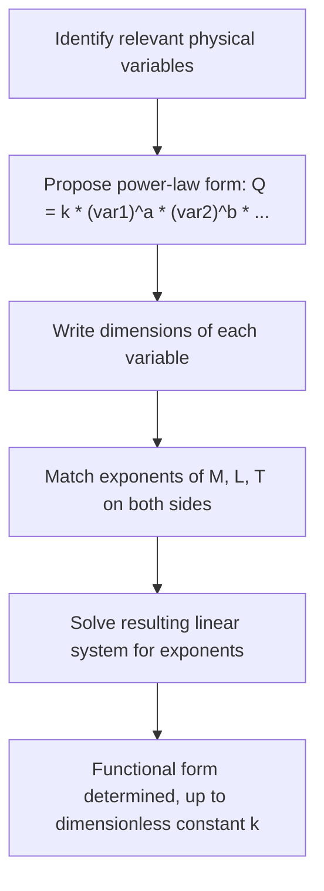

## Dimensional Analysis and Units

### Purpose and Role in Physics

**Dimensional analysis** is the study of the physical dimensions (mass, length, time, etc.) that quantities carry, independent of the specific unit system used to express them. It serves three principal purposes: checking the internal consistency of equations, deriving the functional form of physical relationships without full derivation, and converting between unit systems. Dimensional analysis is typically the first mathematical tool applied when assessing whether a derived or proposed equation could possibly be correct.

### Fundamental (Base) Dimensions

Physics recognizes a small set of independent base dimensions from which all other quantities are derived. In the SI system, the seven base dimensions are:

| Base Quantity | Dimension Symbol | SI Unit |
| --- | --- | --- |
| Length | $[L]$ | meter (m) |
| Mass | $[M]$ | kilogram (kg) |
| Time | $[T]$ | second (s) |
| Electric current | $[I]$ | ampere (A) |
| Temperature | $[\Theta]$ | kelvin (K) |
| Amount of substance | $[N]$ | mole (mol) |
| Luminous intensity | $[J]$ | candela (cd) |

Mechanics problems typically require only $[M]$, $[L]$, $[T]$; electromagnetism adds $[I]$; thermodynamics adds $[\Theta]$.

### Derived Dimensions

Every other physical quantity's dimension is built from the base dimensions via its defining relationship. Examples:

$$[\text{velocity}] = \frac{[L]}{[T]}, \qquad [\text{acceleration}] = \frac{[L]}{[T]^2}, \qquad [\text{force}] = [M][L][T]^{-2}$$

$$[\text{energy}] = [M][L]^2[T]^{-2}, \qquad [\text{power}] = [M][L]^2[T]^{-3}, \qquad [\text{pressure}] = [M][L]^{-1}[T]^{-2}$$

These follow directly from definitions: force from $F=ma$, energy from $W=Fd$, power from $P=W/t$, pressure from $P=F/A$.

### Dimensional Homogeneity

A physically valid equation must be **dimensionally homogeneous** — every additive term must carry identical dimensions. This is the single most useful practical check for verifying a derived or textbook equation.

**Example** — checking the kinematic equation $x = x_0 + v_0t + \frac{1}{2}at^2$:

$$[L] \stackrel{?}{=} [L] + \frac{[L]}{[T]}\cdot[T] + \frac{[L]}{[T]^2}\cdot[T]^2$$

$$[L] = [L] + [L] + [L] \checkmark$$

All three terms reduce to $[L]$, confirming dimensional consistency (though this check cannot confirm the numerical coefficients, such as the $\frac{1}{2}$, are correct).

**Key Points**

- Dimensional homogeneity is a necessary but not sufficient condition for an equation's correctness — a dimensionally consistent equation can still contain an incorrect numerical prefactor or a missing/extra dimensionless term (e.g., a factor of $\pi$ or 2), since dimensional analysis is blind to pure numbers.

### Dimensionless Quantities

Certain combinations of physical quantities have no net dimension (all base dimensions cancel), forming a **dimensionless number** or **dimensionless group**. Angles (radians), the trigonometric and exponential function arguments, and ratios of like quantities are always dimensionless — the argument of $\sin$, $\cos$, $e^x$, or $\ln x$ must be dimensionless, providing another consistency check.

**Physically significant dimensionless numbers**, common across physics and engineering:

- **Reynolds number** $Re = \rho v L/\mu$ — ratio of inertial to viscous forces in fluid flow, determining laminar vs. turbulent regimes
- **Mach number** $M = v/c_s$ — ratio of an object's speed to the local speed of sound
- **Fine-structure constant** $\alpha \approx 1/137$ — a fundamental dimensionless coupling constant in quantum electrodynamics

### Using Dimensional Analysis to Derive Functional Forms

Dimensional analysis can determine the functional dependence of a physical quantity on the relevant variables, up to an undetermined dimensionless constant — a technique especially useful when the full derivation is complex or unknown.

**Example** — deriving the period $T$ of a simple pendulum, assuming it depends only on length $L$, mass $m$, and gravitational acceleration $g$:

Propose $T = k\, L^a m^b g^c$ for dimensionless constant $k$ and unknown exponents $a,b,c$. Dimensionally:

$$[T] = [L]^a[M]^b\left(\frac{[L]}{[T]^2}\right)^c = [L]^{a+c}[M]^b[T]^{-2c}$$

Matching exponents on both sides: for $[T]^1$, $-2c=1 \Rightarrow c=-\frac{1}{2}$; for $[M]^0$, $b=0$; for $[L]^0$, $a+c=0 \Rightarrow a=\frac{1}{2}$. This gives:

$$T = k\sqrt{\frac{L}{g}}$$

correctly predicting that period is independent of mass and scales as $\sqrt{L/g}$ — matching the full derivation's result (where $k=2\pi$ for small oscillations), obtained here without solving any differential equation.

**Common Errors and Misconceptions**

- Assuming dimensional analysis alone can determine the value of the dimensionless prefactor $k$ (it cannot — this requires the full dynamical derivation or experimental calibration)
- Adding quantities of different dimensions (a dimensional-homogeneity violation) — a common symptom of an algebra error in a derivation
- Taking the sine, cosine, or exponential of a dimensional quantity, which is mathematically meaningless
- Assuming a variable must appear in the functional form just because it seems physically relevant; the pendulum example above shows mass drops out entirely despite intuitively "feeling" relevant

### Unit Systems and Conversion

**SI (Système International)** units are the standard for physics: meter, kilogram, second, ampere, kelvin, mole, candela, with prefixes (milli-, kilo-, mega-, etc.) for scale. **CGS (centimeter-gram-second)** units remain common in some areas of theoretical and astrophysics literature, with different electromagnetic unit conventions (Gaussian units) that change the form of Maxwell's equations by factors of $4\pi$ and $c$ compared to SI. [Unverified: whether CGS/Gaussian units are covered depends on the course's scope and the subfields emphasized.]

**Unit conversion via dimensional/factor-label method**: multiply by conversion factors expressed as ratios equal to 1, canceling unwanted units:

$$60\ \frac{\text{km}}{\text{h}} \times \frac{1000\ \text{m}}{1\ \text{km}} \times \frac{1\ \text{h}}{3600\ \text{s}} = 16.67\ \frac{\text{m}}{\text{s}}$$

**Key Points**

- Physical constants such as $c$ (speed of light), $G$ (gravitational constant), and $\hbar$ (reduced Planck constant) carry dimensions themselves, and dimensional analysis involving them (e.g., constructing the Planck length $\ell_P = \sqrt{\hbar G/c^3}$) is a standard technique for estimating natural scales in a physical theory.

**Common Errors and Misconceptions**

- Forgetting to convert all quantities to a consistent unit system before combining them numerically in a calculation
- Confusing units (arbitrary human-chosen scale, e.g., meters vs. feet) with dimensions (the fundamental physical character, e.g., length) — dimensional analysis operates on dimensions, not specific units
- Treating angle (radians) as dimensionless in a way that causes errors when converting to degrees in formulas that implicitly assume radians (e.g., $s=r\theta$ requires $\theta$ in radians)

**Related Topics**

- Vectors and Vector Algebra
- Differentiation and Integration for Physics
- Probability and Statistics for Physics (measurement uncertainty)
- Simple Harmonic Motion and Oscillations (pendulum period derivation)
- Fluid Dynamics (Reynolds number, dimensionless groups)
- Fundamental Constants and Natural Units
- Experimental Methods and Error Analysis