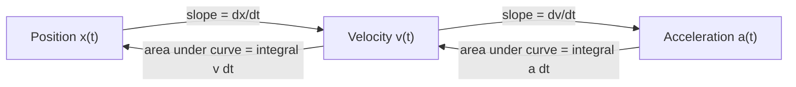

## Motion in One Dimension

### Overview

**Kinematics** describes motion without reference to its causes (forces). Motion in one dimension restricts the description to a single spatial axis, making position, velocity, and acceleration scalar quantities with sign indicating direction along that axis. This is the foundational framework extended later to two and three dimensions and, separately, connected to force via Newton's laws.

### Position, Displacement, and Distance

**Position** $x(t)$ specifies location along an axis relative to a chosen origin at time $t$. **Displacement** is the change in position:

$$\Delta x = x_f - x_i$$

Displacement is a vector quantity (in 1D, a signed scalar) depending only on initial and final positions, not the path taken. **Distance**, by contrast, is the total path length traveled — always non-negative and generally $\geq |\Delta x|$ (equal only when motion is unidirectional).

**Key Points**

- Distance and displacement magnitude are numerically equal only for motion in a single, unreversed direction; any back-and-forth motion makes total distance exceed the net displacement magnitude.

### Average and Instantaneous Velocity

**Average velocity** over an interval:

$$\bar v = \frac{\Delta x}{\Delta t} = \frac{x_f - x_i}{t_f - t_i}$$

**Instantaneous velocity** is the limit of average velocity as the time interval shrinks to zero — the derivative of position with respect to time:

$$v(t) = \lim_{\Delta t \to 0}\frac{\Delta x}{\Delta t} = \frac{dx}{dt}$$

Geometrically, instantaneous velocity is the slope of the tangent line to the position-time graph at a given instant, while average velocity is the slope of the secant line connecting two points on that graph.

**Average speed** is total distance divided by total time (always non-negative), distinct from average velocity when the motion reverses direction.

### Average and Instantaneous Acceleration

**Average acceleration**:

$$\bar a = \frac{\Delta v}{\Delta t}$$

**Instantaneous acceleration**, the derivative of velocity (and second derivative of position):

$$a(t) = \frac{dv}{dt} = \frac{d^2x}{dt^2}$$

A positive acceleration does not necessarily mean "speeding up" — it means velocity is increasing algebraically. An object moving in the negative direction with positive acceleration is actually decelerating (slowing down while still moving negatively).

### Position, Velocity, and Acceleration Graphs

The three kinematic quantities are related through successive differentiation/integration, giving each graph a direct geometric relationship to the next:

- The **slope** of an $x$–$t$ graph at any instant gives $v$ at that instant
- The **slope** of a $v$–$t$ graph at any instant gives $a$ at that instant
- The **area under** a $v$–$t$ graph between two times gives the displacement over that interval
- The **area under** an $a$–$t$ graph between two times gives the change in velocity over that interval

**Key Points**

- A concave-up region of an $x$–$t$ graph corresponds to positive acceleration; an inflection point (concavity change) corresponds to $a=0$ at that instant, and a horizontal tangent on the $x$–$t$ graph corresponds to $v=0$ (a momentary turning point in position, not necessarily a stop in a physical sense if acceleration is nonzero there).

### Constant Acceleration: The Kinematic Equations

When acceleration is constant, the equations of motion can be derived by direct integration of $a(t)=a$ (constant), yielding four standard kinematic equations relating $x$, $v$, $a$, $t$, and initial conditions $x_0, v_0$:

$$v = v_0 + at$$

$$x = x_0 + v_0t + \frac{1}{2}at^2$$

$$v^2 = v_0^2 + 2a(x-x_0)$$

$$x = x_0 + \frac{1}{2}(v_0+v)t$$

Each equation omits exactly one of the five variables ($x, v, a, t$, and one of $x_0/v_0$), making the choice of equation for a given problem determined by which quantities are known and which is sought.

**Example**

A car starts from rest ($v_0=0$) and accelerates uniformly at $a=3\ \text{m/s}^2$ for $t=5\ \text{s}$.

$$v = 0 + (3)(5) = 15\ \text{m/s}$$

$$x = 0 + 0 + \frac{1}{2}(3)(5)^2 = 37.5\ \text{m}$$

### Free Fall

**Free fall** is the special case of constant acceleration due to gravity alone (neglecting air resistance), with $a = -g$ (taking upward as positive), where $g \approx 9.8\ \text{m/s}^2$ near Earth's surface. All four kinematic equations apply directly with $a=-g$.

**Example**

A ball is thrown upward with initial speed $v_0 = 20\ \text{m/s}$. Time to reach maximum height (where $v=0$):

$$0 = 20 - (9.8)t \;\Rightarrow\; t = 2.04\ \text{s}$$

Maximum height reached:

$$x_{max} = v_0t - \frac{1}{2}gt^2 = (20)(2.04) - \frac{1}{2}(9.8)(2.04)^2 \approx 20.4\ \text{m}$$

**Key Points**

- In free fall (neglecting air resistance), the time to rise to maximum height equals the time to fall back to the launch height, and the speed at any given height on the way up equals the speed at that same height on the way down — a direct consequence of the symmetry of constant-acceleration motion.

### Non-Constant Acceleration: Calculus-Based Treatment

When acceleration is not constant, the kinematic equations above do not apply, and velocity and position must instead be found by direct integration of $a(t)$:

$$v(t) = v_0 + \int_0^t a(t')\,dt', \qquad x(t) = x_0 + \int_0^t v(t')\,dt'$$

**Example**

For $a(t) = ct$ (acceleration increasing linearly with time, constant $c$):

$$v(t) = v_0 + \int_0^t ct'\,dt' = v_0 + \frac{1}{2}ct^2$$

$$x(t) = x_0 + \int_0^t \left(v_0+\frac{1}{2}ct'^2\right)dt' = x_0 + v_0t + \frac{1}{6}ct^3$$

This calculus-based approach is the general method, with the constant-acceleration kinematic equations recoverable as the special case $a(t)=a=\text{constant}$.

### Graphical and Numerical Analysis of Motion

When $x(t)$, $v(t)$, or $a(t)$ is given only as data or a graph rather than a closed-form function, displacement and velocity changes are found by numerically estimating the area under the relevant curve (e.g., counting grid squares, trapezoidal approximation), and instantaneous rates by estimating the local slope — the graphical/numerical analog of the calculus relationships above.

**Common Errors and Misconceptions**

- Confusing distance traveled with displacement magnitude when motion reverses direction
- Assuming negative acceleration always means "slowing down" — it depends on the sign of velocity relative to the sign of acceleration
- Applying constant-acceleration kinematic equations to a problem where acceleration actually varies with time
- Forgetting that at the peak of vertical motion under gravity, velocity is zero but acceleration remains $-g$ (not zero) — a common misconception that the object is "at rest" in an unaccelerated sense at the top of its trajectory
- Sign errors from inconsistent choice of positive direction between different parts of a single problem

**Related Topics**

- Differentiation and Integration for Physics
- Motion in Two and Three Dimensions (Projectile Motion)
- Newton's Laws of Motion
- Relative Motion and Reference Frames
- Vectors and Vector Algebra
- Free Fall and Air Resistance