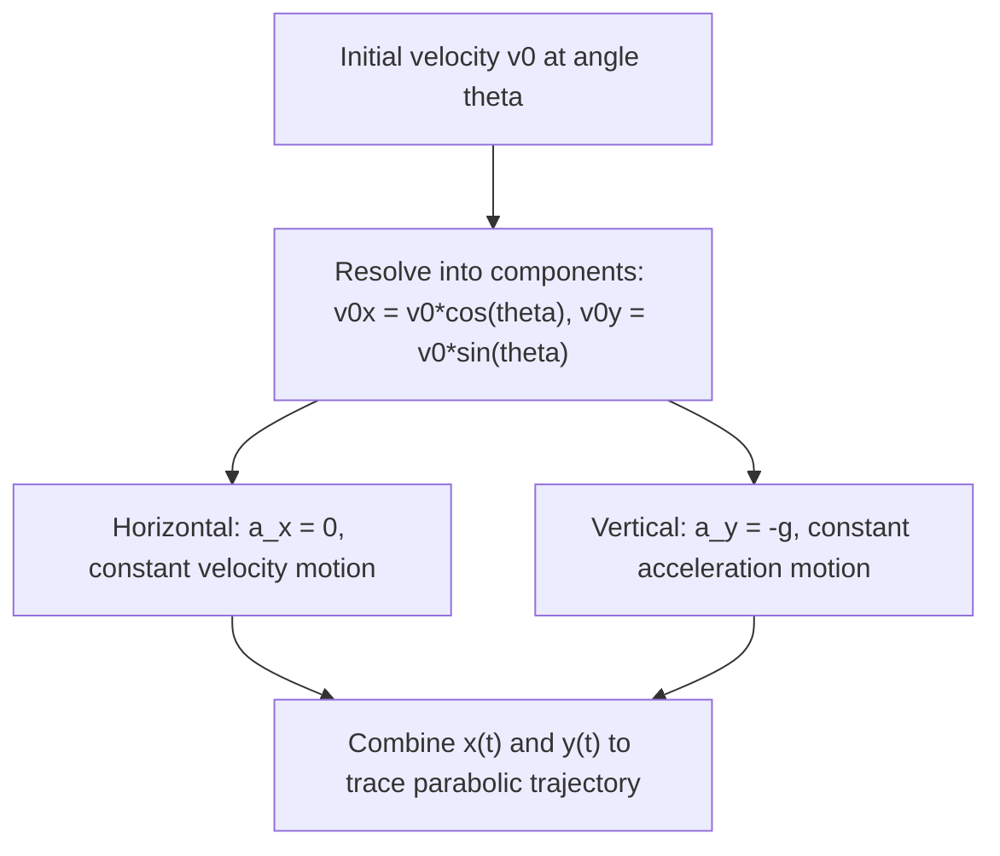

## Motion in Two and Three Dimensions

### Overview

Extending kinematics beyond a single axis requires treating position, velocity, and acceleration as full vector quantities, each with components along multiple perpendicular axes. The essential simplification, valid in Cartesian coordinates, is that motion along each axis can be analyzed **independently** — a principle most powerfully demonstrated in projectile motion, where horizontal and vertical motion decouple completely.

### Position, Velocity, and Acceleration as Vectors

The position vector in 2D/3D:

$$\mathbf{r}(t) = x(t)\hat{i} + y(t)\hat{j} + z(t)\hat{k}$$

**Velocity** and **acceleration** are obtained by differentiating each component independently:

$$\mathbf{v}(t) = \frac{d\mathbf{r}}{dt} = \frac{dx}{dt}\hat i + \frac{dy}{dt}\hat j + \frac{dz}{dt}\hat k$$

$$\mathbf{a}(t) = \frac{d\mathbf{v}}{dt} = \frac{d^2x}{dt^2}\hat i + \frac{d^2y}{dt^2}\hat j + \frac{d^2z}{dt^2}\hat k$$

The magnitude of velocity (speed) and direction are recovered from the components as with any vector: $|\mathbf{v}| = \sqrt{v_x^2+v_y^2+v_z^2}$, direction via $\tan\theta = v_y/v_x$ (2D case, quadrant-checked).

**Key Points**

- Because differentiation and integration act independently on each Cartesian component, all four constant-acceleration kinematic equations from one-dimensional motion apply separately, component by component, whenever acceleration is constant in 2D/3D — this is the mathematical basis for decoupling projectile motion into independent horizontal and vertical problems.

### Projectile Motion

**Projectile motion** describes an object moving under gravity alone (neglecting air resistance), launched with some initial velocity at an angle $\theta$ above the horizontal. Gravity acts only in the vertical direction, so:

$$a_x = 0, \qquad a_y = -g$$

**Initial velocity components:**

$$v_{0x} = v_0\cos\theta, \qquad v_{0y} = v_0\sin\theta$$

**Horizontal motion** (zero acceleration, constant velocity):

$$x(t) = x_0 + v_0\cos\theta \cdot t$$

**Vertical motion** (constant acceleration $-g$):

$$y(t) = y_0 + v_0\sin\theta \cdot t - \frac{1}{2}gt^2, \qquad v_y(t) = v_0\sin\theta - gt$$

### Key Projectile Motion Results

Assuming launch and landing at the same height ($y_0=0$):

**Time of flight:**

$$t_{flight} = \frac{2v_0\sin\theta}{g}$$

**Maximum height** (reached at $t_{flight}/2$, where $v_y=0$):

$$H = \frac{v_0^2\sin^2\theta}{2g}$$

**Range** (horizontal distance at landing):

$$R = \frac{v_0^2\sin(2\theta)}{g}$$

**Key Points**

- The range formula $R = v_0^2\sin(2\theta)/g$ shows that range is maximized at launch angle $\theta = 45°$ (since $\sin(2\theta)$ peaks at $2\theta=90°$), and that complementary angles ($\theta$ and $90°-\theta$) produce identical ranges (though different flight times and maximum heights) — valid only for equal launch/landing heights and negligible air resistance.

**Example**

A projectile launched at $v_0 = 30\ \text{m/s}$, $\theta=53°$:

$$t_{flight} = \frac{2(30)\sin 53°}{9.8} \approx 4.89\ \text{s}, \qquad R = \frac{(30)^2\sin(106°)}{9.8} \approx 88.2\ \text{m}$$

### The Trajectory as a Parabola

Eliminating time between $x(t)$ and $y(t)$ (with $x_0=y_0=0$) yields the trajectory shape directly:

$$y = x\tan\theta - \frac{g}{2v_0^2\cos^2\theta}x^2$$

This is a quadratic in $x$, confirming that the projectile's path traces a **parabola** — a direct geometric consequence of horizontal motion being linear in $t$ while vertical motion is quadratic in $t$.

### Uniform Circular Motion

For an object moving at constant speed $v$ along a circular path of radius $r$, velocity is always tangent to the circle and continuously changes direction (though not magnitude), which requires a nonzero acceleration directed toward the center — the **centripetal acceleration**:

$$a_c = \frac{v^2}{r}$$

directed radially inward (toward the circle's center) at every instant. In terms of angular velocity $\omega = v/r$:

$$a_c = \omega^2 r$$

**Key Points**

- Centripetal acceleration changes only the *direction* of velocity, never its magnitude, since it is always perpendicular to velocity — this perpendicularity is the geometric reason uniform circular motion maintains constant speed despite continuous acceleration.

### Non-Uniform Circular Motion: Tangential and Radial Components

When speed also changes along a circular (or any curved) path, total acceleration has two perpendicular components:

$$\mathbf{a} = a_t\hat{t} + a_r\hat{n}$$

where the **tangential component** $a_t = dv/dt$ changes speed, and the **radial (centripetal) component** $a_r = v^2/r$ changes direction, with $\hat t$ and $\hat n$ the unit tangent and inward normal vectors to the path at that instant. This decomposition generalizes the purely radial description of uniform circular motion to arbitrary curved-path motion with changing speed.

### Relative Motion in Two Dimensions

For an object's velocity as measured in two different reference frames $A$ and $B$ (with $B$ moving at constant velocity $\mathbf{v}_{BA}$ relative to $A$), velocities add vectorially (in the non-relativistic, low-speed limit):

$$\mathbf{v}_{PA} = \mathbf{v}_{PB} + \mathbf{v}_{BA}$$

**Example**

A boat with velocity $4\ \text{m/s}$ north relative to the water crosses a river flowing $3\ \text{m/s}$ east relative to the ground. The boat's velocity relative to the ground:

$$\mathbf{v}_{boat,ground} = 4\hat j + 3\hat i \; \text{m/s}, \qquad |\mathbf{v}| = \sqrt{4^2+3^2} = 5\ \text{m/s}$$

directed at $\tan^{-1}(4/3) \approx 53°$ from the east bank direction.

**Common Errors and Misconceptions**

- Treating projectile motion's horizontal and vertical components as coupled, when they are independent except for sharing a common time variable
- Applying the equal-height range formula ($R=v_0^2\sin2\theta/g$) to a problem where launch and landing heights differ
- Assuming centripetal acceleration implies changing speed, when by definition it changes only direction in uniform circular motion
- Forgetting the tangential acceleration component entirely when a circular-motion problem explicitly states the speed is changing
- Adding relative velocities as scalars rather than vectors when the two motions are not collinear

**Related Topics**

- Motion in One Dimension
- Vectors and Vector Algebra
- Newton's Laws of Motion
- Uniform Circular Motion and Centripetal Force
- Rotational Kinematics
- Relative Motion and Reference Frames
- Air Resistance and Non-Ideal Projectile Motion