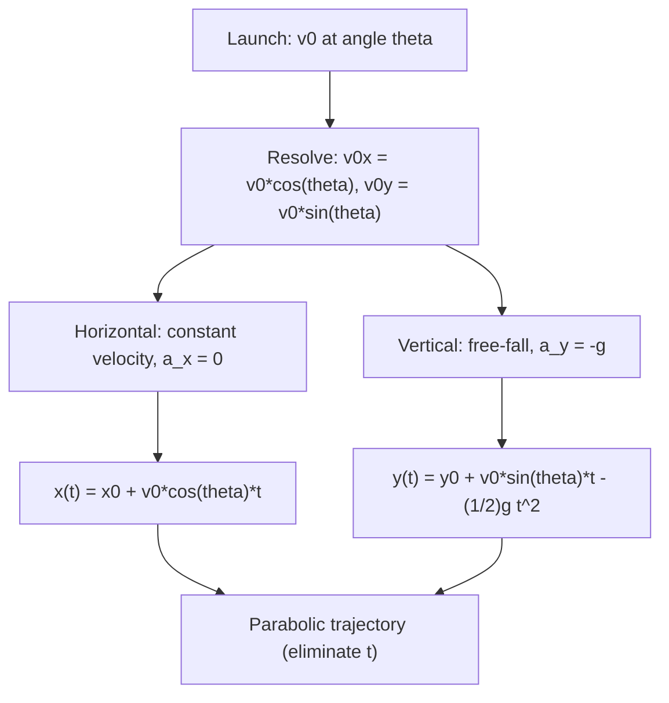

## Projectile Motion

### Definition and Governing Assumptions

**Projectile motion** describes the two-dimensional motion of an object launched into the air and subject only to the constant, uniform downward acceleration of gravity, with air resistance neglected. Under these idealized (but broadly useful) assumptions, the motion decomposes exactly into two independent one-dimensional motions: uniform velocity horizontally, and constant-acceleration motion vertically.

### Setting Up the Problem: Initial Velocity Components

For a projectile launched with initial speed $v_0$ at angle $\theta$ above the horizontal, the initial velocity resolves into components:

$$v_{0x} = v_0\cos\theta, \qquad v_{0y} = v_0\sin\theta$$

Throughout the flight, taking upward as positive and neglecting air resistance:

$$a_x = 0, \qquad a_y = -g \quad (g \approx 9.8\ \text{m/s}^2)$$

### Horizontal Motion

With zero horizontal acceleration, horizontal velocity is constant throughout the flight:

$$v_x(t) = v_{0x} = v_0\cos\theta \quad (\text{constant})$$

$$x(t) = x_0 + v_0\cos\theta \cdot t$$

### Vertical Motion

Vertical motion is standard constant-acceleration (free-fall) motion:

$$v_y(t) = v_0\sin\theta - gt$$

$$y(t) = y_0 + v_0\sin\theta \cdot t - \frac{1}{2}gt^2$$

$$v_y^2 = (v_0\sin\theta)^2 - 2g(y-y_0)$$

### Time of Flight, Maximum Height, and Range (Equal Launch/Landing Height)

For the common special case where the projectile lands at the same height it was launched ($y_0=0$, land at $y=0$):

**Time of flight** — found by setting $y(t)=0$ and solving for nonzero $t$:

$$t_{flight} = \frac{2v_0\sin\theta}{g}$$

**Maximum height** — reached at half the flight time, where $v_y=0$:

$$H = \frac{v_0^2\sin^2\theta}{2g}$$

**Range** — the horizontal distance traveled during the full flight:

$$R = v_0\cos\theta \cdot t_{flight} = \frac{v_0^2\sin(2\theta)}{g}$$

**Key Points**

- The double-angle identity $2\sin\theta\cos\theta = \sin(2\theta)$ is what produces the compact range formula; deriving $R$ without recognizing this identity is a common source of unnecessarily complicated intermediate expressions.
- The range is maximized at launch angle $\theta=45°$, since $\sin(2\theta)$ reaches its maximum value of 1 when $2\theta=90°$.
- Complementary launch angles ($\theta$ and $90°-\theta$) yield identical ranges, since $\sin(2\theta) = \sin(2(90°-\theta)) = \sin(180°-2\theta)$ — though flight time and maximum height differ between the two.

**Example**

A ball is kicked with $v_0=25\ \text{m/s}$ at $\theta=40°$ above horizontal, landing at the same height.

$$t_{flight} = \frac{2(25)\sin 40°}{9.8} \approx 3.28\ \text{s}$$

$$H = \frac{(25)^2\sin^2 40°}{2(9.8)} \approx 6.75\ \text{m}$$

$$R = \frac{(25)^2\sin(80°)}{9.8} \approx 62.9\ \text{m}$$

### The Trajectory Equation (Parabolic Path)

Eliminating $t$ between $x(t)$ and $y(t)$ (with $x_0=y_0=0$) by solving the horizontal equation for $t=x/(v_0\cos\theta)$ and substituting into the vertical equation:

$$y = x\tan\theta - \frac{g}{2v_0^2\cos^2\theta}\,x^2$$

This is quadratic in $x$, confirming the trajectory shape is a **parabola** opening downward — the geometric signature of linear-in-$t$ horizontal motion combined with quadratic-in-$t$ vertical motion.

### Projectile Launched from an Elevated Point

When launch height $y_0 \neq 0$ and the object lands at $y=0$ (e.g., a ball thrown from a cliff or building), the simplified equal-height formulas above no longer apply directly. Instead, solve the full quadratic for $y(t)=0$:

$$0 = y_0 + v_0\sin\theta\, t - \frac{1}{2}gt^2$$

using the quadratic formula for $t$, then substitute into $x(t)$ for range. This general approach — solving the vertical position equation directly for the landing time — is the robust method that works regardless of whether launch and landing heights match.

**Example**

A stone is thrown horizontally ($\theta=0$, so $v_{0y}=0$) from a cliff of height $y_0=45\ \text{m}$ with $v_0=15\ \text{m/s}$.

$$0 = 45 - \frac{1}{2}(9.8)t^2 \;\Rightarrow\; t = \sqrt{\frac{2(45)}{9.8}} \approx 3.03\ \text{s}$$

$$x = (15)(3.03) \approx 45.4\ \text{m}$$

### Velocity and Speed at Any Point in the Trajectory

At any time $t$, the speed and direction of motion are recovered from the instantaneous velocity components:

$$v(t) = \sqrt{v_x^2+v_y^2}, \qquad \phi(t) = \tan^{-1}\left(\frac{v_y}{v_x}\right)$$

where $\phi$ is measured from the horizontal (sign of $v_y$ indicates whether the projectile is still rising or already falling at that instant).

**Key Points**

- At the peak of the trajectory, $v_y=0$ but $v_x=v_0\cos\theta$ remains unchanged throughout the flight — the projectile is never truly "at rest" at the top (unless launched straight up, $\theta=90°$), since horizontal motion continues unaffected.

### Effect of Air Resistance (Qualitative)

Real projectiles experience air resistance, which breaks the clean horizontal/vertical independence assumed above: drag depends on speed (and often its square), coupling the two directions of motion together and requiring numerical solution of the resulting coupled differential equations in general. Air resistance reduces range and maximum height compared to the idealized parabolic trajectory, and shifts the optimal launch angle for maximum range below 45°. [Inference: exact optimal angle with drag depends on the specific drag model, projectile shape, and launch speed, and has no simple closed-form analog to the vacuum case.]

**Common Errors and Misconceptions**

- Applying the equal-height range/height/time formulas to a projectile launched from or landing at a different height than assumed
- Treating horizontal velocity as changing during flight, when it remains constant throughout (absent air resistance)
- Assuming maximum range always occurs at $45°$ regardless of whether launch and landing heights are equal — this specific result requires equal heights
- Forgetting that "maximum height" occurs precisely when $v_y=0$, not when $v_x=0$ (which never happens in the absence of drag)

**Related Topics**

- Motion in Two and Three Dimensions
- Motion in One Dimension
- Vectors and Vector Algebra
- Newton's Laws of Motion
- Uniform Circular Motion
- Air Resistance and Drag Forces