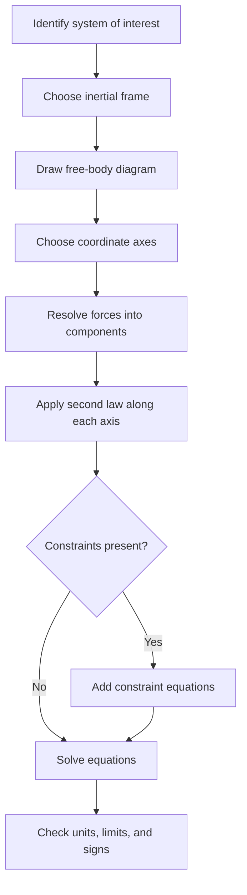

## Newton's Laws of Motion


Newton's three laws of motion, published in the *Philosophiæ Naturalis Principia Mathematica* (1687), form the foundation of classical mechanics. Together they define what a force is, how forces relate to motion, and how interacting bodies exchange momentum. They apply accurately to macroscopic objects moving at speeds much smaller than the speed of light $c$ and at scales much larger than atomic dimensions. Outside this regime, special relativity and quantum mechanics take over.

### Foundational Concepts

#### Force

A force is an interaction that can change the state of motion of a body. It is a vector quantity, characterized by a magnitude, a direction, and a point of application. The SI unit is the newton:

$$1\ \text{N} = 1\ \text{kg}\cdot\text{m}/\text{s}^2$$

Forces are classified as:

- **Contact forces**: normal force, friction, tension, spring force, drag
- **Long-range (field) forces**: gravitation, electrostatic and magnetic forces

#### Mass

Mass has two operationally distinct roles in Newtonian mechanics:

- **Inertial mass** $m_i$: the measure of a body's resistance to acceleration, appearing in $\vec{F} = m_i \vec{a}$
- **Gravitational mass** $m_g$: the quantity that determines the strength of gravitational coupling, appearing in $F = G m_g M_g / r^2$

Experiments (Eötvös-type torsion balance experiments and later refinements) show $m_i = m_g$ to extremely high precision, which is why all bodies fall with the same acceleration in a uniform gravitational field, absent air resistance.

#### Net Force and the Principle of Superposition

When several forces act on a body, their vector sum determines the acceleration:

$$\vec{F}_{\text{net}} = \sum_i \vec{F}_i$$

#### Inertial Reference Frames

Newton's laws hold in **inertial frames**: reference frames that are not accelerating. Any frame moving at constant velocity relative to an inertial frame is also inertial. Frames that accelerate or rotate (non-inertial frames) require additional **fictitious forces** (for example, centrifugal and Coriolis forces) for the laws to remain valid in their usual form.

The Earth's surface is only approximately inertial, since Earth rotates and orbits the Sun. For most laboratory-scale problems, this approximation is excellent.

### Newton's First Law (Law of Inertia)

#### Statement

A body remains at rest, or continues to move in a straight line at constant speed, unless acted upon by a net external force.

$$\vec{F}_{\text{net}} = 0 \iff \vec{a} = 0 \iff \vec{v} = \text{constant}$$

#### Interpretation

- The first law defines the concept of an inertial frame: it asserts that such frames exist, namely frames in which a force-free body moves with constant velocity.
- It overturned the Aristotelian view that a sustained force is required to maintain motion. Uniform motion and rest are equivalent states, distinguished only by the choice of inertial frame.
- **Equilibrium** is the condition $\vec{F}_{\text{net}} = 0$. It includes both **static equilibrium** ($\vec{v} = 0$) and **dynamic equilibrium** ($\vec{v}$ constant and nonzero).

#### Inertia

Inertia is the tendency of a body to resist changes to its velocity. Quantitatively it is measured by mass. A larger mass requires a larger net force to produce the same acceleration.

#### Common Illustrations

- A passenger lurches forward when a bus brakes suddenly, because the body tends to continue at its prior velocity.
- A hockey puck on smooth ice glides with nearly constant velocity because friction is small.
- A tablecloth can be pulled from under dishes quickly, because the brief, small friction impulse barely changes the dishes' velocity.

### Newton's Second Law (Law of Acceleration)

#### Statement

The net force on a body equals the time rate of change of its linear momentum.

$$\vec{F}_{\text{net}} = \frac{d\vec{p}}{dt}, \qquad \vec{p} = m\vec{v}$$

For a body of constant mass, this reduces to the familiar form:

$$\vec{F}_{\text{net}} = m\vec{a}$$

#### Component Form

In Cartesian coordinates the vector equation splits into three independent scalar equations:

$$\sum F_x = m a_x, \qquad \sum F_y = m a_y, \qquad \sum F_z = m a_z$$

This independence of components is what makes projectile motion and inclined-plane problems tractable.

#### Variable Mass Systems

The form $\vec{F} = m\vec{a}$ is **not** valid when mass changes (for example, a rocket expelling fuel). The correct general starting point is $\vec{F} = d\vec{p}/dt$, applied carefully to a well-defined system. Expanding the derivative naively as $m\,d\vec{v}/dt + \vec{v}\,dm/dt$ can give wrong results unless the velocity of the added or ejected mass relative to the chosen frame is handled correctly.

For a rocket with exhaust velocity $v_e$ relative to the rocket, the Tsiolkovsky rocket equation follows (in the absence of external forces):

$$\Delta v = v_e \ln\frac{m_0}{m_f}$$

where $m_0$ is the initial mass and $m_f$ is the final mass.

#### Impulse-Momentum Theorem

Integrating the second law over time gives:

$$\vec{J} = \int_{t_1}^{t_2} \vec{F}_{\text{net}}\,dt = \Delta\vec{p}$$

Impulse is especially useful for collisions, where forces are large and short-lived and are best characterized by their time integral, or their average value $\vec{F}_{\text{avg}} = \Delta\vec{p}/\Delta t$.

#### Free-Body Diagrams

A systematic procedure for applying the second law:

1. Isolate the body (or subsystem) of interest.
2. Draw all external forces acting on it as vectors from its center.
3. Choose a coordinate system, typically aligned with the direction of expected acceleration.
4. Resolve each force into components.
5. Write $\sum F = ma$ along each axis.
6. Solve the resulting equations, adding constraint relations (for example, connected bodies sharing the same acceleration magnitude) as needed.

#### Common Forces in Second-Law Problems

| Force | Expression | Notes |
| --- | --- | --- |
| Weight | $\vec{W} = m\vec{g}$ | Near Earth's surface, $g \approx 9.81\ \text{m/s}^2$, directed downward |
| Normal force | $N$ | Perpendicular to the contact surface; determined by the equations of motion, not fixed in advance |
| Kinetic friction | $f_k = \mu_k N$ | Opposes sliding; magnitude approximately independent of speed and contact area |
| Static friction | $f_s \le \mu_s N$ | Adjusts to prevent sliding, up to a maximum |
| Tension | $T$ | Along the rope; equal at both ends for a massless, frictionless-pulley rope |
| Spring (Hooke's law) | $F = -kx$ | Restoring force for small displacements $x$ from equilibrium |
| Linear drag | $\vec{F}_d = -b\vec{v}$ | Low speeds, viscous regime |
| Quadratic drag | $F_d = \tfrac{1}{2}\rho C_d A v^2$ | High-Reynolds-number regime |
| Gravitation | $F = G\dfrac{m_1 m_2}{r^2}$ | Attractive, along the line joining the centers |

### Newton's Third Law (Action-Reaction)

#### Statement

When body A exerts a force on body B, body B simultaneously exerts a force on body A that is equal in magnitude and opposite in direction.

$$\vec{F}_{A\to B} = -\vec{F}_{B\to A}$$

#### Key Characteristics

- The two forces act on **different bodies**, so they never cancel in a free-body diagram of a single body. This is the most common source of confusion.
- The two forces are of the **same type** (both gravitational, both contact, both electromagnetic, and so on).
- The forces are **simultaneous** in the ordinary Newtonian treatment. For interactions that propagate at finite speed (such as electromagnetic interactions between moving charges), the simple form of the third law can fail, and momentum conservation must include the field's momentum.
- In its strong form, the third law also requires the forces to act along the line joining the two bodies (central forces).

#### Consequence: Conservation of Momentum

For an isolated system of two bodies, the third law together with the second law implies:

$$\frac{d}{dt}(\vec{p}_A + \vec{p}_B) = \vec{F}_{B\to A} + \vec{F}_{A\to B} = 0$$

so the total momentum is constant. This generalizes to any isolated system of $N$ bodies with internal forces obeying the third law.

#### Distinguishing Third-Law Pairs from Equilibrium Pairs

Consider a book resting on a table.

| Force pair | Acting on | Same type? | Third-law pair? |
| --- | --- | --- | --- |
| Gravity on book (by Earth) and normal force on book (by table) | Both on the book | No | No, these balance because the book is in equilibrium (first law) |
| Gravity on book (by Earth) and gravity on Earth (by book) | Book and Earth | Yes | Yes |
| Normal force on book (by table) and normal force on table (by book) | Book and table | Yes | Yes |

#### Common Illustrations

- Walking: the foot pushes backward on the ground, and static friction from the ground pushes the foot forward.
- Rocket propulsion: the engine pushes exhaust gas backward, and the gas pushes the rocket forward.
- Swimming: the swimmer pushes water backward, and the water pushes the swimmer forward.

### Summary of the Three Laws

| Law | Content | Role |
| --- | --- | --- |
| First | $\vec{F}_{\text{net}} = 0 \Rightarrow \vec{v} = \text{const}$ | Defines inertial frames and the concept of inertia |
| Second | $\vec{F}_{\text{net}} = d\vec{p}/dt$ | Quantitative link between force and motion |
| Third | $\vec{F}_{A\to B} = -\vec{F}_{B\to A}$ | Force interactions come in pairs; underlies momentum conservation |

### Worked Examples

#### Example 1: Block on a Frictionless Incline

A block of mass $m$ slides down a frictionless incline of angle $\theta$.

Choose the $x$-axis along the incline (downhill positive) and the $y$-axis perpendicular to it.

Forces: weight $mg$ (downward) and normal force $N$ (perpendicular to the surface).

Along $y$ there is no acceleration:

$$N - mg\cos\theta = 0 \Rightarrow N = mg\cos\theta$$

Along $x$:

$$mg\sin\theta = ma \Rightarrow a = g\sin\theta$$

**Output**: The acceleration $a = g\sin\theta$ is independent of the mass. For $\theta = 30^\circ$, $a \approx 4.9\ \text{m/s}^2$.

#### Example 2: Atwood Machine

Two masses $m_1 > m_2$ hang over an ideal (massless, frictionless) pulley, connected by an inextensible massless string.

Let the acceleration magnitude be $a$, with $m_1$ moving downward. The tension $T$ is the same on both sides.

For $m_1$ (downward positive):

$$m_1 g - T = m_1 a$$

For $m_2$ (upward positive):

$$T - m_2 g = m_2 a$$

Adding the equations:

$$a = \frac{m_1 - m_2}{m_1 + m_2}\,g$$

Substituting back:

$$T = \frac{2 m_1 m_2}{m_1 + m_2}\,g$$

**Output**: For $m_1 = 3\ \text{kg}$ and $m_2 = 1\ \text{kg}$, $a = g/2 \approx 4.9\ \text{m/s}^2$ and $T = 1.5\,g \approx 14.7\ \text{N}$.

#### Example 3: Block on a Rough Incline with Friction

A block of mass $m$ on an incline of angle $\theta$ with kinetic friction coefficient $\mu_k$ slides downward.

Perpendicular to the incline: $N = mg\cos\theta$.

Along the incline (downhill positive), with friction opposing motion:

$$mg\sin\theta - \mu_k mg\cos\theta = ma$$


$$a = g(\sin\theta - \mu_k\cos\theta)$$

The block accelerates downhill only if $\tan\theta > \mu_k$. Sliding begins from rest when $\tan\theta > \mu_s$.

**Output**: For $\theta = 37^\circ$ and $\mu_k = 0.3$, $a \approx 9.81\,(0.602 - 0.3 \times 0.799) \approx 3.6\ \text{m/s}^2$.

#### Example 4: Elevator and Apparent Weight

A person of mass $m$ stands on a scale in an elevator accelerating upward with acceleration $a$.

$$N - mg = ma \Rightarrow N = m(g + a)$$

The scale reads the **apparent weight** $N$.

| Elevator motion | Apparent weight |
| --- | --- |
| Accelerating upward (or decelerating while descending) | $m(g + a) > mg$ |
| Constant velocity | $mg$ |
| Accelerating downward (or decelerating while ascending) | $m(g - a) < mg$ |
| Free fall ($a = g$ downward) | $0$ |

#### Example 5: Uniform Circular Motion

An object of mass $m$ moves in a circle of radius $r$ at constant speed $v$. Its acceleration is centripetal, directed toward the center:

$$a_c = \frac{v^2}{r}$$

By the second law, the net inward force is:

$$F_c = \frac{m v^2}{r}$$

This is not a new force but the net force supplied by tension, gravity, friction, or another real interaction. For a car on a flat circular curve, static friction supplies it, so the maximum safe speed satisfies:

$$\mu_s m g = \frac{m v_{\max}^2}{r} \Rightarrow v_{\max} = \sqrt{\mu_s g r}$$

**Output**: For $\mu_s = 0.7$ and $r = 50\ \text{m}$, $v_{\max} \approx 18.5\ \text{m/s}$ (about $67\ \text{km/h}$).

#### Example 6: Linear Drag and Terminal Velocity

An object of mass $m$ falls under gravity with linear drag $F_d = bv$.

Taking downward as positive:

$$m\frac{dv}{dt} = mg - bv$$

With $v(0) = 0$, the solution is:

$$v(t) = \frac{mg}{b}\left(1 - e^{-bt/m}\right)$$

As $t \to \infty$, $v \to v_t = mg/b$, the terminal velocity, where drag balances weight and the net force vanishes (first-law equilibrium).

### Numerical Simulation Example

The second law is a differential equation, and it can be integrated numerically. The code below simulates a falling object with quadratic drag using the semi-implicit Euler method.

```python
import numpy as np

def simulate_fall(m=1.0, rho=1.2, Cd=0.47, A=0.01, g=9.81,
                  dt=0.001, t_max=10.0):
    """
    Simulate vertical fall with quadratic drag (downward positive).
    Newton's 2nd law: m dv/dt = m g - 0.5 rho Cd A v^2
    """
    k = 0.5 * rho * Cd * A
    n = int(t_max / dt)
    t = np.linspace(0, t_max, n)
    v = np.zeros(n)
    y = np.zeros(n)

    for i in range(1, n):
        a = g - (k / m) * v[i-1] * abs(v[i-1])   # net force / mass
        v[i] = v[i-1] + a * dt                    # update velocity first
        y[i] = y[i-1] + v[i] * dt                 # then position (semi-implicit)
    return t, v, y

t, v, y = simulate_fall()
v_terminal_analytic = np.sqrt(2 * 1.0 * 9.81 / (1.2 * 0.47 * 0.01))
print(f"Simulated v at t = 10 s:   {v[-1]:.2f} m/s")
print(f"Analytic terminal velocity: {v_terminal_analytic:.2f} m/s")
```

**Output** (approximate; exact values depend on step size and parameters):



```
Simulated v at t = 10 s:   59.6 m/s
Analytic terminal velocity: 59.5 m/s
```

The simulated speed approaches the analytic terminal velocity $v_t = \sqrt{2mg/(\rho C_d A)}$, where drag exactly balances weight.

### Diagram: Force Interaction Pairs (svg_diagram)

<svg xmlns="http://www.w3.org/2000/svg" viewBox="0 0 640 300" width="640" height="300" font-family="sans-serif" font-size="13">
<text x="320" y="24" text-anchor="middle" font-size="15" font-weight="bold">Book on Table: Forces (svg_diagram)</text>
<rect x="220" y="150" width="200" height="50" fill="#f4e3c1" stroke="#333" />
<text x="320" y="180" text-anchor="middle">Book (mass m)</text>
<rect x="120" y="200" width="400" height="40" fill="#bbb" stroke="#333" />
<text x="320" y="225" text-anchor="middle">Table</text>
<line x1="320" y1="150" x2="320" y2="80" stroke="#1a7f37" stroke-width="3" />
<polygon points="320,72 314,86 326,86" fill="#1a7f37" />
<text x="332" y="95" fill="#1a7f37">N (table on book)</text>
<line x1="320" y1="200" x2="320" y2="270" stroke="#c0392b" stroke-width="3" />
<polygon points="320,278 314,264 326,264" fill="#c0392b" />
<text x="332" y="268" fill="#c0392b">mg (Earth on book)</text>
<text x="80" y="110" fill="#333">Equilibrium pair:</text>
<text x="80" y="128" fill="#333">N and mg (same body)</text>
<text x="470" y="110" fill="#333">Third-law pairs:</text>
<text x="470" y="128" fill="#333">N with N' (book on table)</text>
<text x="470" y="146" fill="#333">mg with mg' (book on Earth)</text>
</svg>

### Diagram: Problem-Solving Workflow



### Limitations and Domain of Validity

- **Relativistic regime**: as $v \to c$, the second law takes the form $\vec{F} = d(\gamma m\vec{v})/dt$ with $\gamma = 1/\sqrt{1 - v^2/c^2}$, and $\vec{F} = m\vec{a}$ no longer holds even for constant rest mass.
- **Quantum regime**: at atomic and subatomic scales, particles do not follow definite trajectories, and quantum mechanics replaces Newtonian dynamics. Newtonian results emerge as the classical limit (Ehrenfest's theorem describes how expectation values approximately obey classical equations).
- **Non-inertial frames**: fictitious forces must be included, for example $\vec{F}_{\text{fict}} = -m\vec{a}_{\text{frame}}$ for a linearly accelerating frame.
- **Strong gravity**: general relativity supersedes Newtonian gravitation near massive compact objects. The precession of Mercury's perihelion is a classic example where corrections are needed.
- **Third law with fields**: for moving charges or other cases with retardation effects, the simple pairwise form of the third law can fail, while total momentum (including field momentum) remains conserved.

### Common Misconceptions

- "A force is needed to keep an object moving": false; a force is needed only to change velocity.
- "Action and reaction cancel each other": they act on different bodies and never cancel in a single body's force balance.
- "Heavier objects fall faster": in vacuum all bodies have the same acceleration $g$, because the gravitational force is proportional to $m$ and cancels with inertia in $a = F/m$.
- "Centripetal force is an extra force": it is the name for the net inward force supplied by real interactions.
- "Zero velocity means zero net force": at the top of a vertical throw, $v = 0$ but the net force is still $mg$ downward.

### Key Points

- The first law defines inertial frames and equilibrium; the second law quantifies the effect of net force as $\vec{F}_{\text{net}} = d\vec{p}/dt$; the third law states that forces arise in equal and opposite interaction pairs acting on different bodies.
- Free-body diagrams and component-wise application of $\sum\vec{F} = m\vec{a}$ are the core problem-solving tools.
- Momentum conservation for isolated systems follows from the second and third laws.
- The laws hold in inertial frames at non-relativistic speeds and classical scales; relativistic and quantum mechanics generalize them beyond that.

### Conclusion

Newton's laws give a compact and predictive framework for the motion of macroscopic bodies. The first law identifies the frames in which the laws hold, the second connects forces to changes in momentum, and the third ensures that interactions conserve momentum. Mastery of the laws comes from combining conceptual clarity (what counts as a system, a force, and a third-law pair) with systematic technique (free-body diagrams, component equations, and constraint relations). Because the second law is a differential equation, it also connects directly to numerical methods for problems without closed-form solutions.

### Next Steps

**Related Topics**

- Inertial and non-inertial reference frames; fictitious forces (centrifugal, Coriolis, Euler)
- Friction models: static, kinetic, and rolling resistance
- Work, kinetic energy, and the work-energy theorem
- Conservative forces and potential energy
- Conservation of linear momentum and collision analysis (elastic and inelastic)
- Systems of particles and center-of-mass motion
- Rotational dynamics: torque, moment of inertia, and angular momentum
- Rocket propulsion and variable-mass systems
- Lagrangian and Hamiltonian formulations of mechanics
- Special relativity and relativistic dynamics
- Numerical integration methods (Euler, Runge-Kutta, Verlet) for equations of motion