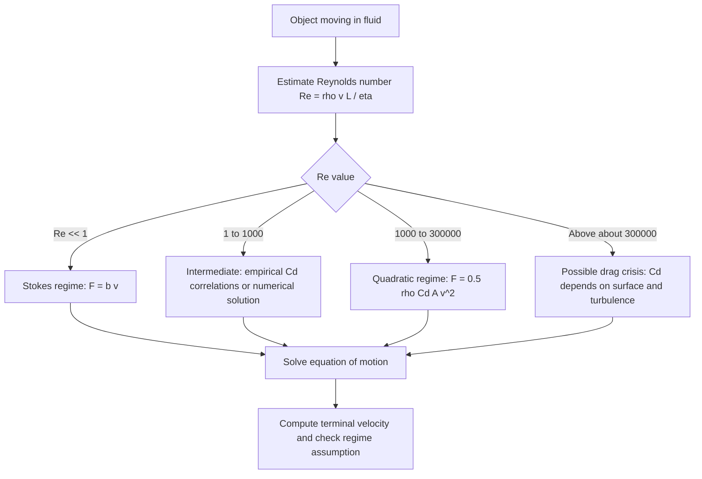

## Friction and Drag Forces


Friction and drag are **dissipative, non-conservative forces** that oppose relative motion between bodies or between a body and a fluid. Friction arises between contacting solid surfaces, while drag arises when a body moves through a fluid (liquid or gas). Both convert organized mechanical energy into thermal energy, and both are usually described by **empirical models** rather than derived from first principles. The formulas below are approximations, and real behavior varies with materials, surface conditions, temperature, and geometry.

### Foundational Concepts

#### Why These Forces Are Empirical

- Contact friction originates from microscopic interactions (adhesion, asperity deformation, plowing) at the small fraction of the apparent surface area that is in true contact. No single closed-form law predicts it from first principles for arbitrary materials.
- Fluid drag originates from pressure differences and viscous shear over the body's surface. Except for a few simple geometries at low speeds, it is measured experimentally or computed numerically, and then summarized by dimensionless coefficients.

#### Energy and Non-Conservative Nature

Because friction and drag depend on the path or velocity and not only on position, they cannot be derived from a potential energy function. The work done by a kinetic friction force $f_k$ over a path length $s$ is:

$$W_f = -f_k\, s$$

This work is dissipated (mostly as heat) and modifies the work-energy theorem:

$$W_{\text{conservative}} + W_{\text{non-conservative}} = \Delta K$$

#### Reference Frames and Direction

Friction and drag always oppose **relative** motion (or its tendency) between the interacting surfaces or between the body and the fluid. Their direction is set by that relative velocity, not by the direction of the applied force.

### Types of Friction

| Type | Description | Governing relation |
| --- | --- | --- |
| Static friction | Prevents sliding between surfaces at rest relative to each other | $f_s \le \mu_s N$ |
| Kinetic (sliding) friction | Acts between surfaces in relative sliding | $f_k = \mu_k N$ |
| Rolling resistance | Resists rolling due to deformation of the wheel and surface | $F_{rr} = \mu_{rr} N$ |
| Fluid friction | Viscous shear within and at the boundary of fluids | See drag sections |

### Static Friction

#### Model

Static friction is a **self-adjusting** force. It takes whatever value is needed to prevent sliding, up to a maximum:

$$0 \le f_s \le f_{s,\max} = \mu_s N$$

The direction of $f_s$ opposes the direction in which the surface would slide if friction were absent. Only at the threshold of slipping does $f_s = \mu_s N$.

#### Key Features

- $f_s$ is not always equal to $\mu_s N$. Writing $f_s = \mu_s N$ for an object that is not about to slip is a common error.
- $N$ is the normal force, determined by the equilibrium or motion equations perpendicular to the surface. It is not always equal to $mg$.
- Static friction does no net work when it holds a contact point stationary relative to the surface. This is why it can accelerate a car (the tire contact patch does not slip) without dissipating energy at the contact.

#### Angle of Repose and Slip Condition

For a block on an incline of angle $\theta$, the block stays at rest while:

$$mg\sin\theta \le \mu_s\, mg\cos\theta \;\Rightarrow\; \tan\theta \le \mu_s$$

The critical angle $\theta_c = \arctan\mu_s$ is the angle of repose. It provides a practical way to measure $\mu_s$.

### Kinetic Friction

#### Model

$$f_k = \mu_k N$$

directed opposite to the relative sliding velocity.

#### Key Features

- Typically $\mu_k < \mu_s$ for the same pair of surfaces, so less force is needed to keep an object sliding than to start it sliding.
- To a good approximation (for many dry solid pairs), $f_k$ is independent of the sliding speed and of the apparent contact area. Deviations occur at very high speeds, with lubrication, or with soft materials.
- Stick-slip motion occurs when the difference between $\mu_s$ and $\mu_k$ (together with system compliance) produces oscillation. Examples include squeaking doors, violin strings, and earthquake fault dynamics.

#### Typical Coefficient Ranges

These are approximate, order-of-magnitude values that vary strongly with surface conditions [Unverified for any specific material pair].

| Surface pair | $\mu_s$ (approx.) | $\mu_k$ (approx.) |
| --- | --- | --- |
| Steel on steel (dry) | 0.5 to 0.8 | 0.4 to 0.6 |
| Wood on wood | 0.25 to 0.5 | 0.2 to 0.4 |
| Rubber on dry concrete | 0.8 to 1.0 | 0.6 to 0.8 |
| Rubber on wet concrete | 0.4 to 0.6 | 0.3 to 0.5 |
| Ice on ice | 0.05 to 0.1 | 0.02 to 0.03 |
| Teflon on steel | 0.04 | 0.04 |

### Rolling Resistance

For a wheel rolling without slipping on a deformable surface, the contact force is not exactly through the vertical line under the axle, which produces a resisting torque. It is modeled as:

$$F_{rr} = \mu_{rr} N = \frac{c_{rr}}{R}\,N$$

where $c_{rr}$ is a rolling-resistance length (or the dimensionless coefficient $\mu_{rr}$ absorbs $1/R$) and $R$ is the wheel radius. Typical $\mu_{rr}$ values are about $0.001$ to $0.002$ for steel wheels on steel rails and about $0.01$ to $0.015$ for car tires on pavement [Unverified for specific tires].

Rolling resistance is far smaller than sliding friction, which is the reason wheels are effective.

### Drag Forces

#### General Description

The drag force $\vec{F}_d$ on a body moving through a fluid is directed opposite to the body's velocity **relative to the fluid**. Its magnitude depends on speed, fluid properties (density $\rho$, dynamic viscosity $\eta$), and body geometry.

#### The Reynolds Number

The regime is characterized by the dimensionless Reynolds number:

$$\text{Re} = \frac{\rho v L}{\eta}$$

where $L$ is a characteristic length (for example, diameter). It measures the ratio of inertial to viscous effects.

| Regime | Approximate Re (for a sphere) | Dominant drag behavior |
| --- | --- | --- |
| Creeping (Stokes) flow | $\text{Re} \lesssim 1$ | Viscous; $F_d \propto v$ |
| Intermediate | $1 \lesssim \text{Re} \lesssim 10^3$ | Transition; neither model is accurate |
| Inertial (Newtonian) | $10^3 \lesssim \text{Re} \lesssim 10^5$ | Pressure drag; $F_d \propto v^2$ |
| Drag crisis | $\text{Re} \sim 3\times10^5$ | Boundary layer turns turbulent, and $C_d$ drops sharply |

The ranges are approximate and geometry dependent.

#### Linear Drag (Stokes Drag)

At low Reynolds number, drag is proportional to speed:

$$\vec{F}_d = -b\,\vec{v}$$

For a small sphere of radius $r$ in a fluid of viscosity $\eta$, Stokes' law gives the exact low-Re result:

$$b = 6\pi\eta r \;\Rightarrow\; F_d = 6\pi\eta r v$$

Applications include small particles in liquids, sedimentation, oil-drop experiments (Millikan), and microorganisms.

#### Quadratic Drag

At high Reynolds number, drag is dominated by pressure forces and scales with $v^2$:

$$F_d = \tfrac{1}{2}\,\rho\, C_d\, A\, v^2$$

where:

- $\rho$ is the fluid density
- $C_d$ is the dimensionless drag coefficient (depends on shape and, weakly, on Re)
- $A$ is the reference area (usually the frontal cross-section)

In vector form, $\vec{F}_d = -\tfrac{1}{2}\rho C_d A\,|\vec{v}|\,\vec{v}$, which correctly points opposite to the velocity.

#### Typical Drag Coefficients

Approximate values in the inertial regime [Unverified for specific geometries and Reynolds numbers].

| Shape | $C_d$ (approx.) |
| --- | --- |
| Sphere | 0.47 |
| Flat plate (face-on) | 1.1 to 1.3 |
| Cylinder (cross-flow) | 1.0 to 1.2 |
| Streamlined body (teardrop) | 0.04 to 0.1 |
| Typical passenger car | 0.25 to 0.35 |
| Cyclist (upright) | 0.7 to 1.0 |

#### Combined Model

A general low-to-moderate speed approximation adds both contributions:

$$F_d = b\,v + c\,v^2$$

with $b$ and $c$ fitted to data. Neither term alone is universally valid.

### Equations of Motion with Drag

#### Vertical Fall with Linear Drag

Taking downward as positive:

$$m\frac{dv}{dt} = mg - bv$$

The solution with $v(0) = 0$ is:

$$v(t) = v_t\left(1 - e^{-t/\tau}\right), \qquad v_t = \frac{mg}{b}, \quad \tau = \frac{m}{b}$$

The time constant $\tau$ sets how quickly the object approaches its terminal velocity. The position, with $y(0) = 0$, is:

$$y(t) = v_t\,t - v_t\tau\left(1 - e^{-t/\tau}\right)$$

#### Vertical Fall with Quadratic Drag

$$m\frac{dv}{dt} = mg - k v^2, \qquad k = \tfrac{1}{2}\rho C_d A$$

The terminal velocity is set by $mg = kv_t^2$:

$$v_t = \sqrt{\frac{mg}{k}} = \sqrt{\frac{2mg}{\rho C_d A}}$$

The exact solution with $v(0) = 0$ is:

$$v(t) = v_t\tanh\!\left(\frac{g\,t}{v_t}\right)$$

and the distance fallen is:

$$y(t) = \frac{v_t^2}{g}\ln\cosh\!\left(\frac{g\,t}{v_t}\right)$$

#### Horizontal Motion with Linear Drag

For an object launched horizontally with initial speed $v_0$ and no other horizontal force:

$$m\frac{dv}{dt} = -bv \;\Rightarrow\; v(t) = v_0\,e^{-bt/m}$$

The total stopping distance is finite:

$$x_{\text{stop}} = \frac{m v_0}{b}$$

#### Horizontal Motion with Quadratic Drag

$$m\frac{dv}{dt} = -kv^2 \;\Rightarrow\; v(t) = \frac{v_0}{1 + k v_0 t/m}$$

Here the speed decays as $1/t$, and the position grows logarithmically without bound:

$$x(t) = \frac{m}{k}\ln\!\left(1 + \frac{k v_0 t}{m}\right)$$

Unlike linear drag, quadratic drag never brings the object to a finite stopping distance in this model.

#### Projectile Motion with Drag

With drag, the horizontal and vertical components are coupled (for quadratic drag, through $|\vec{v}|$), and there is generally no closed-form trajectory. Equations of motion:

$$m\ddot{x} = -k\,|\vec{v}|\,\dot{x}, \qquad m\ddot{y} = -mg - k\,|\vec{v}|\,\dot{y}$$

The trajectory is then found numerically. Compared to the vacuum parabola, the range is shorter, the maximum height is lower, and the descent is steeper than the ascent.

### Worked Examples

#### Example 1: Pulling a Crate at Constant Velocity

A crate of mass $m = 40\ \text{kg}$ is pulled across a floor by a rope at angle $\theta = 30^\circ$ above the horizontal with $\mu_k = 0.3$. Find the tension for constant velocity.

Vertical equilibrium:

$$N + T\sin\theta - mg = 0 \;\Rightarrow\; N = mg - T\sin\theta$$

Horizontal equilibrium (zero acceleration):

$$T\cos\theta - \mu_k N = 0$$

Substituting:

$$T\cos\theta = \mu_k(mg - T\sin\theta) \;\Rightarrow\; T = \frac{\mu_k mg}{\cos\theta + \mu_k\sin\theta}$$

**Output**: With $mg = 392.4\ \text{N}$:

$$T = \frac{0.3 \times 392.4}{0.866 + 0.3 \times 0.5} = \frac{117.7}{1.016} \approx 116\ \text{N}$$

Here $N = 392.4 - 116 \times 0.5 \approx 334\ \text{N}$, which is less than $mg$, showing that $N \ne mg$ when the pull has a vertical component.

#### Example 2: Two Blocks with Friction

Block $m_1 = 5\ \text{kg}$ rests on a table with $\mu_k = 0.2$ and is connected by a string over an ideal pulley to a hanging block $m_2 = 3\ \text{kg}$. Find the acceleration and tension.

For $m_1$ (horizontal, toward the pulley positive):

$$T - \mu_k m_1 g = m_1 a$$

For $m_2$ (downward positive):

$$m_2 g - T = m_2 a$$

Adding:

$$a = \frac{m_2 g - \mu_k m_1 g}{m_1 + m_2} = \frac{(3 - 0.2\times5)(9.81)}{8}$$

**Output**: $a = \dfrac{2 \times 9.81}{8} \approx 2.45\ \text{m/s}^2$ and $T = m_2(g - a) \approx 3(9.81 - 2.45) \approx 22.1\ \text{N}$.

#### Example 3: Maximum Speed on a Flat Curve

A car rounds a flat circular curve of radius $r$ using static friction as the centripetal force.

$$f_s = \frac{mv^2}{r} \le \mu_s mg \;\Rightarrow\; v_{\max} = \sqrt{\mu_s g r}$$

**Output**: For $\mu_s = 0.8$ and $r = 60\ \text{m}$, $v_{\max} = \sqrt{0.8 \times 9.81 \times 60} \approx 21.7\ \text{m/s}$ (about $78\ \text{km/h}$). On wet pavement with $\mu_s = 0.4$, $v_{\max} \approx 15.3\ \text{m/s}$.

#### Example 4: Banked Curve with Friction

A curve banked at angle $\theta$ allows a higher maximum speed. At the maximum speed, friction acts down the slope and is at its limit $\mu_s N$.

Vertical: $N\cos\theta - \mu_s N\sin\theta = mg$

Horizontal (radial): $N\sin\theta + \mu_s N\cos\theta = \dfrac{mv^2}{r}$

Dividing the two equations:

$$v_{\max}^2 = r g\,\frac{\sin\theta + \mu_s\cos\theta}{\cos\theta - \mu_s\sin\theta} = r g\,\frac{\tan\theta + \mu_s}{1 - \mu_s\tan\theta}$$

With $\mu_s = 0$ this reduces to $v^2 = rg\tan\theta$, the frictionless design speed.

**Output**: For $r = 100\ \text{m}$, $\theta = 10^\circ$, and $\mu_s = 0.5$: $\tan\theta \approx 0.176$, so $v_{\max}^2 = 100(9.81)\dfrac{0.176 + 0.5}{1 - 0.088} \approx 727\ \text{m}^2/\text{s}^2$, giving $v_{\max} \approx 27\ \text{m/s}$.

#### Example 5: Terminal Velocity of a Skydiver

A skydiver of mass $m = 80\ \text{kg}$ with $C_d = 1.0$ and $A = 0.7\ \text{m}^2$ falls in air of density $\rho = 1.2\ \text{kg/m}^3$.

$$v_t = \sqrt{\frac{2mg}{\rho C_d A}} = \sqrt{\frac{2(80)(9.81)}{1.2 \times 1.0 \times 0.7}}$$

**Output**: $v_t = \sqrt{1868.6} \approx 43\ \text{m/s}$ (about $156\ \text{km/h}$). A skydiver in a head-down position has a smaller $A$ and $C_d$, giving a higher terminal speed, and opening a parachute increases $A$ and $C_d$ dramatically, lowering $v_t$.

#### Example 6: Stokes Sedimentation of a Sphere

A small sphere of radius $r$ and density $\rho_s$ settles in a fluid of density $\rho_f$ and viscosity $\eta$. At terminal velocity, weight balances buoyancy plus Stokes drag:

$$\tfrac{4}{3}\pi r^3\rho_s g = \tfrac{4}{3}\pi r^3\rho_f g + 6\pi\eta r v_t$$


$$v_t = \frac{2 r^2 (\rho_s - \rho_f)\,g}{9\eta}$$

**Output**: For a glass bead ($r = 0.5\ \text{mm}$, $\rho_s = 2500\ \text{kg/m}^3$) in glycerin ($\rho_f = 1260\ \text{kg/m}^3$, $\eta \approx 1.4\ \text{Pa}\cdot\text{s}$ near room temperature): $v_t \approx \dfrac{2(2.5\times10^{-7})(1240)(9.81)}{9(1.4)} \approx 4.8\times10^{-4}\ \text{m/s}$. A check of $\text{Re} = \rho v d/\eta \approx 4\times10^{-4}$ confirms the Stokes regime is valid.

### Numerical Simulation Example

The code below integrates a projectile with quadratic drag using a fourth-order Runge-Kutta scheme and compares its range to the vacuum result.

```python
import numpy as np

def deriv(state, m, k, g):
    x, y, vx, vy = state
    v = np.hypot(vx, vy)
    ax = -(k / m) * v * vx
    ay = -g - (k / m) * v * vy
    return np.array([vx, vy, ax, ay])

def rk4_step(state, dt, m, k, g):
    k1 = deriv(state, m, k, g)
    k2 = deriv(state + 0.5 * dt * k1, m, k, g)
    k3 = deriv(state + 0.5 * dt * k2, m, k, g)
    k4 = deriv(state + dt * k3, m, k, g)
    return state + dt * (k1 + 2*k2 + 2*k3 + k4) / 6

def projectile_range(v0=40.0, angle_deg=45.0, m=0.145, rho=1.2,
                     Cd=0.47, A=0.0043, g=9.81, dt=0.001):
    k = 0.5 * rho * Cd * A
    th = np.radians(angle_deg)
    state = np.array([0.0, 0.0, v0*np.cos(th), v0*np.sin(th)])
    while state[1] >= 0.0:
        prev = state.copy()
        state = rk4_step(state, dt, m, k, g)
    # linear interpolation to the ground crossing
    frac = prev[1] / (prev[1] - state[1])
    return prev[0] + frac * (state[0] - prev[0])

R_drag = projectile_range()
R_vac = 40.0**2 * np.sin(np.radians(90.0)) / 9.81
print(f"Range with drag:   {R_drag:.1f} m")
print(f"Range in vacuum:   {R_vac:.1f} m")
```

**Output** (approximate; depends on parameters and step size, and behavior may vary with the integration scheme):



```
Range with drag:   ~99 m
Range in vacuum:   163.1 m
```

For a baseball-sized projectile at $40\ \text{m/s}$, drag reduces the range substantially compared with the vacuum parabola.

### Diagram: Friction Force vs. Applied Force (svg_diagram)

<svg xmlns="http://www.w3.org/2000/svg" viewBox="0 0 640 340" width="640" height="340" font-family="sans-serif" font-size="13">
<text x="320" y="24" text-anchor="middle" font-size="15" font-weight="bold">Friction vs. Applied Force (svg_diagram)</text>
<line x1="70" y1="290" x2="590" y2="290" stroke="#333" stroke-width="2" />
<line x1="70" y1="290" x2="70" y2="50" stroke="#333" stroke-width="2" />
<text x="330" y="325" text-anchor="middle">Applied force F</text>
<text x="22" y="170" transform="rotate(-90 22 170)" text-anchor="middle">Friction force f</text>
<line x1="70" y1="290" x2="290" y2="90" stroke="#1a7f37" stroke-width="3" />
<line x1="290" y1="90" x2="290" y2="140" stroke="#888" stroke-width="2" stroke-dasharray="5,4" />
<line x1="290" y1="140" x2="570" y2="140" stroke="#c0392b" stroke-width="3" />
<circle cx="290" cy="90" r="4" fill="#1a7f37" />
<circle cx="290" cy="140" r="4" fill="#c0392b" />
<text x="140" y="180" fill="#1a7f37">Static: f = F</text>
<text x="140" y="198" fill="#1a7f37">(no sliding)</text>
<text x="300" y="82" fill="#1a7f37">f max = mu_s N</text>
<text x="380" y="130" fill="#c0392b">Kinetic: f = mu_k N (roughly constant)</text>
<text x="100" y="70" fill="#333">Sliding begins at F = mu_s N</text>
</svg>

### Diagram: Drag Regime Selection



### Energy Dissipation and Power

#### Power Lost to Drag

$$P_d = \vec{F}_d\cdot\vec{v} = -\tfrac{1}{2}\rho C_d A\,v^3$$

The power needed to overcome quadratic drag grows as $v^3$. Doubling the speed of a vehicle increases the aerodynamic power requirement by a factor of eight.

#### Power Lost to Friction

$$P_f = -\mu_k N v$$

Rolling resistance power grows linearly with speed, so at low speeds it dominates, while at highway speeds aerodynamic drag dominates for typical cars. The crossover speed occurs when $\mu_{rr} m g \approx \tfrac{1}{2}\rho C_d A v^2$.

**Output**: For a car with $m = 1500\ \text{kg}$, $\mu_{rr} = 0.012$, $C_d A = 0.7\ \text{m}^2$: rolling force $\approx 176.6\ \text{N}$. The crossover satisfies $0.5(1.2)(0.7)v^2 = 176.6$, so $v \approx 20.5\ \text{m/s}$ (about $74\ \text{km/h}$).

### Common Misconceptions

- "Friction is always $\mu N$": only kinetic friction (and limiting static friction) satisfies this. Static friction is bounded by $\mu_s N$ and is generally smaller.
- "Friction always opposes motion": it opposes **relative** motion between surfaces. Static friction on a car's tires points forward in the direction of acceleration, and friction on a crate on an accelerating truck bed points in the truck's direction of acceleration.
- "Normal force equals $mg$": this holds only in special cases (horizontal surface, no vertical applied forces or acceleration).
- "Friction depends strongly on contact area": for many dry solid pairs the macroscopic friction force is approximately area independent, though this fails for very soft, sticky, or lubricated contacts.
- "Heavier objects fall faster in air": with quadratic drag, terminal velocity scales as $\sqrt{m/(C_d A)}$, so at equal shape a denser or heavier object reaches a higher terminal speed, which is a drag effect and not a violation of equal acceleration in vacuum.
- "Drag is always proportional to $v^2$": the linear versus quadratic form depends on the Reynolds number.

### Limitations of the Models

- The Coulomb friction model ($f = \mu N$ with constant $\mu$) is a first approximation and can fail with lubrication, very high pressures, very high speeds, temperature changes, or wear.
- Drag coefficients $C_d$ vary with Reynolds number, surface roughness, and orientation, so a single tabulated value is a rough guide only.
- The simple drag laws assume steady flow relative to a still fluid. Unsteady effects (added mass, Basset history force), wind, buoyancy, and lift are ignored in the basic treatment.
- Near the speed of sound, compressibility effects raise $C_d$ sharply (wave drag), and the incompressible models break down.

### Key Points

- Friction and drag are dissipative, non-conservative forces modeled empirically.
- Static friction obeys $f_s \le \mu_s N$ and adjusts to prevent sliding, while kinetic friction is $f_k = \mu_k N$ with typically $\mu_k < \mu_s$.
- Drag is linear ($F = bv$, Stokes) at low Reynolds number and quadratic ($F = \tfrac{1}{2}\rho C_d A v^2$) at high Reynolds number.
- Terminal velocity occurs when drag balances the driving force: $v_t = mg/b$ for linear drag and $v_t = \sqrt{2mg/(\rho C_d A)}$ for quadratic drag.
- The direction of friction and drag is set by relative velocity, and $N$ must be found from the perpendicular force balance.
- Aerodynamic power scales as $v^3$, which strongly limits vehicle speed and efficiency.

### Conclusion

Friction and drag turn organized mechanical energy into heat and bound the motion of real systems: they let cars accelerate and turn, cap the speed of falling objects, and set the energy cost of moving through air or water. Correct analysis requires choosing the appropriate model (static versus kinetic friction, linear versus quadratic drag), determining the normal force and Reynolds regime from the specific situation, and remembering that the coefficients are empirical and context dependent. When closed-form solutions are unavailable, as in projectile motion with quadratic drag, numerical integration of Newton's second law is the standard approach.

### Next Steps

**Related Topics**

- Work-energy theorem with non-conservative forces
- Lubrication, hydrodynamic and boundary friction regimes
- Microscopic origins of friction (adhesion, asperity contact, Bowden and Tabor model)
- Stick-slip dynamics and rate-and-state friction in geophysics
- Boundary layers, flow separation, and the drag crisis
- Lift, Magnus effect, and aerodynamic forces on spinning bodies
- Added mass and history forces in unsteady fluid motion
- Buoyancy and Archimedes' principle in dynamics
- Damped harmonic oscillators (drag as the damping mechanism)
- Numerical methods for projectile and trajectory problems (Runge-Kutta, adaptive step size)
- Wave drag and compressible flow near the speed of sound