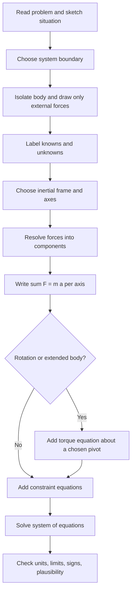

## Free Body Diagrams and Force Analysis


A **free body diagram (FBD)** is a simplified sketch that isolates a body (or subsystem) from its surroundings and shows every **external force** acting on it as a vector. It is the central bookkeeping device of Newtonian mechanics: it converts a physical situation into a set of vector equations, $\sum\vec{F} = m\vec{a}$ for translation and $\sum\vec{\tau} = I\vec{\alpha}$ for rotation, that can be solved algebraically or numerically. Force analysis is the complete procedure surrounding the diagram: choosing the system, identifying forces, selecting axes, writing equations, adding constraints, solving, and checking the result.

### Foundational Concepts

#### What "Free" Means

The body is drawn **free of its surroundings**: supports, ropes, surfaces, and other bodies are removed and replaced by the forces they exert. The diagram contains:

- The isolated body (as a dot, box, or outline)
- Only forces acting **on** the body, never forces the body exerts on others
- Only **external** forces with respect to the chosen system

#### Forces vs. Quantities That Are Not Forces

| Belongs on an FBD | Does not belong on an FBD |
| --- | --- |
| Weight $m\vec{g}$ | $m\vec{a}$ (it is the result of the net force, not a force) |
| Normal force $\vec{N}$ | Velocity $\vec{v}$ |
| Friction $\vec{f}$ | Acceleration $\vec{a}$ (may be drawn separately, off to the side) |
| Tension $\vec{T}$ | "Centripetal force" as an extra force alongside real ones |
| Spring force $-k\vec{x}$ | Forces exerted **by** the body on other objects |
| Drag $\vec{F}_d$, buoyancy $\vec{F}_b$ | Internal forces within the chosen system |
| Applied forces $\vec{F}_{\text{app}}$ | Momentum $\vec{p}$ |

#### Choice of System

The system boundary determines which forces are external.

- **Single-body system**: forces from all other bodies are external.
- **Multi-body system**: forces between the parts (such as tension in a rope connecting two blocks that are both inside the system) are internal, appear in equal and opposite pairs by Newton's third law, and cancel in the total. Only forces from outside the boundary appear.

Choosing the system cleverly can eliminate unknown internal forces. For blocks joined by a taut string, treating them as one system gives the shared acceleration directly, and a subsequent single-block FBD gives the tension.

#### Reference Frame

Apply $\sum\vec{F} = m\vec{a}$ in an **inertial frame**. In a non-inertial frame, fictitious forces (for example, $-m\vec{a}_{\text{frame}}$) must be added to the FBD, and they should be labeled clearly as fictitious.

### Catalog of Forces and How They Appear on an FBD

| Force | Direction on the FBD | Magnitude / model | Notes |
| --- | --- | --- | --- |
| Weight | Toward Earth's center (down) | $mg$ | Acts at the center of gravity |
| Normal | Perpendicular to the contact surface, pushing on the body | Unknown; found from equations | Zero when contact is lost |
| Kinetic friction | Tangent to the surface, opposite the relative sliding | $\mu_k N$ | Direction from relative motion |
| Static friction | Tangent to the surface, opposite the tendency to slide | $f_s \le \mu_s N$ | Magnitude is generally unknown |
| Tension | Along the rope, pulling on the body away from the body | $T$ (unknown) | Uniform along a massless rope over an ideal pulley |
| Spring | Along the spring axis, restoring | $k\,\Delta\ell$ | Pulls if stretched, pushes if compressed |
| Drag | Opposite the velocity relative to the fluid | $bv$ or $\tfrac{1}{2}\rho C_d A v^2$ | See friction and drag models |
| Buoyancy | Upward | $\rho_{\text{fluid}}\,V_{\text{disp}}\,g$ | Acts at the centroid of displaced volume |
| Applied force | As given | As given | Pushes or pulls by an external agent |
| Pin/hinge reaction | Unknown direction | Two components in 2D | Represented by $R_x$, $R_y$ |
| Fixed support reaction | Unknown | Two force components plus a moment in 2D | A wall support can transmit torque |

### Systematic Procedure for Force Analysis

#### Step-by-Step Method

1. **Read and sketch** the physical situation and identify what is asked.
2. **Define the system** (one body, several bodies, or a portion of a structure).
3. **Isolate** the system and draw it separately.
4. **Identify all contacts and fields**: every point where something touches the system contributes contact forces, and every field (gravity, electric, magnetic) contributes a body force.
5. **Draw each force** as an arrow starting at its point of application (or the center of mass if treating the body as a particle), labeled with a symbol.
6. **Choose axes** aligned with the expected acceleration or with the surface (for example, along and perpendicular to an incline).
7. **Resolve** each force into components.
8. **Write Newton's second law** for each axis, and torque equations if rotation matters.
9. **Add constraint equations** (for example, inextensible strings, no-slip conditions, contact conditions).
10. **Solve**, then **check** units, limiting cases, signs, and physical plausibility.

#### Sign and Direction Conventions

- If the direction of an unknown force is uncertain, **assume a direction**. A negative result means the true direction is opposite.
- Pick the positive axis direction along the expected acceleration to reduce sign errors.
- For connected bodies, use one consistent sense of motion (for example, "clockwise positive") and derive constraint relations accordingly.

#### Diagram: FBD Workflow



### Translational Equilibrium and Dynamics

#### Static Equilibrium of a Particle

$$\sum F_x = 0, \qquad \sum F_y = 0$$

This applies when the body is at rest or moving with constant velocity.

#### Dynamics

$$\sum F_x = m a_x, \qquad \sum F_y = m a_y$$

#### Three-Force Members and Concurrency

If a rigid body in equilibrium is acted on by exactly three non-parallel coplanar forces, their lines of action must be **concurrent** (meet at a single point). This is often used to find the direction of an unknown reaction force, such as the force at a hinge on a ladder.

#### Lami's Theorem

For a particle in equilibrium under three coplanar, concurrent forces $F_1$, $F_2$, $F_3$:

$$\frac{F_1}{\sin\alpha} = \frac{F_2}{\sin\beta} = \frac{F_3}{\sin\gamma}$$

where $\alpha$ is the angle between $F_2$ and $F_3$, $\beta$ is the angle between $F_1$ and $F_3$, and $\gamma$ is the angle between $F_1$ and $F_2$.

### Rotational Equilibrium and Extended Bodies

For a rigid body, force balance alone is not sufficient, since forces with the same vector sum but different lines of action produce different rotations.

#### Torque

$$\vec{\tau} = \vec{r}\times\vec{F}, \qquad \tau = rF\sin\phi = F\,d_\perp$$

where $d_\perp$ is the perpendicular distance (moment arm) from the pivot to the line of action of the force.

#### Conditions for Static Equilibrium (2D)

$$\sum F_x = 0, \qquad \sum F_y = 0, \qquad \sum \tau_O = 0$$

The torque equation can be written about **any** point $O$ when the body is in static equilibrium. A convenient choice is a point where several unknown forces intersect, since those forces drop out of the torque equation.

#### Dynamics of Rigid Bodies

$$\sum\vec{F} = m\vec{a}_{\text{cm}}, \qquad \sum\tau_{\text{cm}} = I_{\text{cm}}\,\alpha$$

The second equation is taken about the center of mass (or about a fixed axis or instantaneous axis, where valid).

#### Center of Gravity

For a body in a uniform gravitational field, the weight can be treated as a single force $m\vec{g}$ acting at the center of mass. For a uniform beam, this is at its geometric midpoint.

### Worked Examples

#### Example 1: Block on an Incline with Friction and an Applied Push

A block of mass $m = 10\ \text{kg}$ rests on a $30^\circ$ incline with $\mu_s = 0.4$ and $\mu_k = 0.3$. A force $P$ parallel to the incline pushes it up the slope. Find the $P$ needed for constant velocity up the incline.

**FBD forces**: weight $mg$ (down), normal $N$ (perpendicular to the surface), kinetic friction $f_k$ (down the incline, opposing upward motion), and applied force $P$ (up the incline).

Axes: $x$ up the incline, $y$ perpendicular to it.

Perpendicular:

$$N = mg\cos\theta = 10(9.81)(0.866) \approx 84.96\ \text{N}$$

Along the incline with zero acceleration:

$$P - mg\sin\theta - \mu_k N = 0$$


$$P = mg\sin\theta + \mu_k mg\cos\theta$$

**Output**: $P = 49.05 + 0.3(84.96) \approx 49.05 + 25.49 \approx 74.5\ \text{N}$.

#### Example 2: Hanging Sign from Two Cables

A sign of weight $W = 200\ \text{N}$ hangs from two cables making angles $\theta_1 = 30^\circ$ (left) and $\theta_2 = 45^\circ$ (right) above the horizontal.

Horizontal balance:

$$T_2\cos\theta_2 = T_1\cos\theta_1$$

Vertical balance:

$$T_1\sin\theta_1 + T_2\sin\theta_2 = W$$

From the first, $T_2 = T_1\dfrac{\cos 30^\circ}{\cos 45^\circ} = 1.2247\,T_1$. Substituting:

$$T_1(0.5) + 1.2247\,T_1(0.7071) = 200 \;\Rightarrow\; T_1(0.5 + 0.8660) = 200$$

**Output**: $T_1 \approx 146.4\ \text{N}$ and $T_2 \approx 179.3\ \text{N}$.

#### Example 3: Connected Blocks Pulled Across a Surface

Blocks $m_1 = 4\ \text{kg}$ and $m_2 = 6\ \text{kg}$ are connected by a light rope on a frictionless surface. A horizontal force $F = 30\ \text{N}$ pulls $m_2$ (with $m_1$ trailing behind).

**Whole-system FBD** (internal tension cancels):

$$F = (m_1 + m_2)a \;\Rightarrow\; a = \frac{30}{10} = 3\ \text{m/s}^2$$

**FBD of $m_1$ alone** (only the tension acts horizontally):

$$T = m_1 a$$

**Output**: $T = 4 \times 3 = 12\ \text{N}$. As a check, for $m_2$: $F - T = m_2 a \Rightarrow 30 - 12 = 18 = 6(3)$. ✓

#### Example 4: Ladder Against a Wall

A uniform ladder of length $L$ and weight $W$ leans against a smooth vertical wall at angle $\theta$ to the horizontal. The floor has static friction coefficient $\mu_s$. Find the minimum $\mu_s$ to prevent slipping.

**FBD forces**:

- Weight $W$ at the midpoint
- Wall normal force $N_w$ (horizontal, since the wall is smooth)
- Floor normal force $N_f$ (vertical)
- Floor friction $f$ (horizontal, toward the wall)

Force balance:

$$N_f = W, \qquad f = N_w$$

Torque about the base of the ladder:

$$N_w\,L\sin\theta = W\,\frac{L}{2}\cos\theta \;\Rightarrow\; N_w = \frac{W}{2\tan\theta}$$

No slipping requires $f \le \mu_s N_f$:

$$\frac{W}{2\tan\theta} \le \mu_s W \;\Rightarrow\; \mu_s \ge \frac{1}{2\tan\theta}$$

**Output**: For $\theta = 60^\circ$, $\mu_{s,\min} = \dfrac{1}{2(1.732)} \approx 0.29$. For a shallower $\theta = 30^\circ$, $\mu_{s,\min} \approx 0.87$.

#### Example 5: Pulley with Two Masses and Incline

Mass $m_1 = 6\ \text{kg}$ sits on a frictionless $37^\circ$ incline and is connected over an ideal pulley to a hanging mass $m_2 = 4\ \text{kg}$. Find the acceleration and tension.

Take motion with $m_2$ descending (and $m_1$ moving up the incline) as positive.

For $m_1$ along the incline:

$$T - m_1 g\sin\theta = m_1 a$$

For $m_2$ (downward positive):

$$m_2 g - T = m_2 a$$

Adding:

$$a = \frac{m_2 g - m_1 g\sin\theta}{m_1 + m_2}$$

**Output**: With $\sin 37^\circ \approx 0.602$: $a = \dfrac{(4 - 6 \times 0.602)(9.81)}{10} = \dfrac{0.388 \times 9.81}{10} \approx 0.38\ \text{m/s}^2$ and $T = m_2(g - a) \approx 4(9.43) \approx 37.7\ \text{N}$. A negative $a$ would signal that the actual motion is opposite to the assumed direction.

#### Example 6: Conical Pendulum

A bob of mass $m$ on a string of length $L$ moves in a horizontal circle with the string making angle $\theta$ to the vertical.

**FBD forces**: tension $T$ (along the string, toward the pivot) and weight $mg$.

Vertical (no acceleration):

$$T\cos\theta = mg$$

Radial (toward the center of the circle), radius $r = L\sin\theta$:

$$T\sin\theta = \frac{mv^2}{r}$$

Dividing:

$$\tan\theta = \frac{v^2}{rg} \;\Rightarrow\; v = \sqrt{rg\tan\theta}$$

The period is:

$$T_{\text{period}} = \frac{2\pi r}{v} = 2\pi\sqrt{\frac{L\cos\theta}{g}}$$

**Output**: For $L = 1.0\ \text{m}$ and $\theta = 30^\circ$: $T_{\text{period}} = 2\pi\sqrt{0.866/9.81} \approx 1.87\ \text{s}$, and $v = \sqrt{0.5 \times 9.81 \times 0.577} \approx 1.68\ \text{m/s}$.

#### Example 7: Apparent Weight in an Accelerating Elevator

A person of mass $m$ stands on a scale in an elevator accelerating upward at $a$.

FBD: normal force from the scale $N$ (up) and weight $mg$ (down).

$$N - mg = ma \;\Rightarrow\; N = m(g + a)$$

**Output**: For $m = 70\ \text{kg}$ and $a = 2\ \text{m/s}^2$ upward, the scale reads $N = 70(11.81) \approx 827\ \text{N}$, equivalent to about $84.3\ \text{kg}$.

#### Example 8: Beam with a Hinge and Cable

A uniform horizontal beam of weight $W_b = 300\ \text{N}$ and length $L = 4\ \text{m}$ is hinged to a wall at its left end and supported by a cable attached at its right end, with the cable making $40^\circ$ above the horizontal. A load $W_\ell = 500\ \text{N}$ hangs at $3\ \text{m}$ from the hinge. Find the cable tension and the hinge reaction.

**FBD forces**: hinge reaction components $R_x$ and $R_y$, cable tension $T$ (with components $T\cos40^\circ$ toward the wall and $T\sin40^\circ$ upward), beam weight $W_b$ at $2\ \text{m}$, and load $W_\ell$ at $3\ \text{m}$.

Torques about the hinge (eliminates $R_x$ and $R_y$):

$$T\sin40^\circ(4) = W_b(2) + W_\ell(3)$$


$$T = \frac{300(2) + 500(3)}{4(0.6428)} = \frac{2100}{2.571} \approx 816.7\ \text{N}$$

Force balance:

$$R_x = T\cos40^\circ \approx 816.7(0.766) \approx 625.6\ \text{N} \text{ (away from the wall)}$$


$$R_y = W_b + W_\ell - T\sin40^\circ = 800 - 525 \approx 275\ \text{N} \text{ (up)}$$

**Output**: $T \approx 817\ \text{N}$, $R_x \approx 626\ \text{N}$ (pointing away from the wall, opposing the horizontal cable pull), $R_y \approx 275\ \text{N}$ upward.

### Free Body Diagram: Block on an Incline (svg_diagram)

<svg xmlns="http://www.w3.org/2000/svg" viewBox="0 0 640 380" width="640" height="380" font-family="sans-serif" font-size="13">
<text x="320" y="24" text-anchor="middle" font-size="15" font-weight="bold">Block on Incline with Friction (svg_diagram)</text>
<polygon points="60,340 580,340 580,140" fill="#e6e6e6" stroke="#333" stroke-width="2" />
<g transform="translate(320,240) rotate(-21.1)">
<rect x="-40" y="-40" width="80" height="40" fill="#f4e3c1" stroke="#333" stroke-width="2" />
<text x="0" y="-15" text-anchor="middle">m</text>
</g>
<circle cx="318" cy="221" r="4" fill="#000" />
<line x1="318" y1="221" x2="318" y2="321" stroke="#c0392b" stroke-width="3" />
<polygon points="318,329 312,315 324,315" fill="#c0392b" />
<text x="326" y="318" fill="#c0392b">mg</text>
<line x1="318" y1="221" x2="284" y2="127" stroke="#1a7f37" stroke-width="3" />
<polygon points="281,119 276,134 289,130" fill="#1a7f37" />
<text x="240" y="118" fill="#1a7f37">N</text>
<line x1="318" y1="221" x2="243" y2="248" stroke="#8e44ad" stroke-width="3" />
<polygon points="235,251 248,241 251,254" fill="#8e44ad" />
<text x="196" y="262" fill="#8e44ad">f (down slope)</text>
<line x1="318" y1="221" x2="393" y2="194" stroke="#2c6fbb" stroke-width="3" />
<polygon points="401,191 388,201 385,188" fill="#2c6fbb" />
<text x="400" y="186" fill="#2c6fbb">P (up slope)</text>
<path d="M 500,340 A 80,80 0 0 0 508,306" fill="none" stroke="#333" />
<text x="470" y="330">theta</text>
</svg>

### Free Body Diagram: Ladder in Equilibrium (svg_diagram)

<svg xmlns="http://www.w3.org/2000/svg" viewBox="0 0 640 380" width="640" height="380" font-family="sans-serif" font-size="13">
<text x="320" y="24" text-anchor="middle" font-size="15" font-weight="bold">Ladder Against Smooth Wall (svg_diagram)</text>
<line x1="450" y1="50" x2="450" y2="340" stroke="#333" stroke-width="4" />
<line x1="80" y1="340" x2="450" y2="340" stroke="#333" stroke-width="4" />
<line x1="200" y1="340" x2="450" y2="90" stroke="#8b5a2b" stroke-width="7" />
<line x1="325" y1="215" x2="325" y2="285" stroke="#c0392b" stroke-width="3" />
<polygon points="325,293 319,279 331,279" fill="#c0392b" />
<text x="333" y="270" fill="#c0392b">W (at midpoint)</text>
<line x1="200" y1="340" x2="200" y2="270" stroke="#1a7f37" stroke-width="3" />
<polygon points="200,262 194,276 206,276" fill="#1a7f37" />
<text x="130" y="285" fill="#1a7f37">N_f</text>
<line x1="200" y1="340" x2="260" y2="340" stroke="#8e44ad" stroke-width="3" />
<polygon points="268,340 254,334 254,346" fill="#8e44ad" />
<text x="230" y="360" fill="#8e44ad">f (toward wall)</text>
<line x1="450" y1="90" x2="380" y2="90" stroke="#2c6fbb" stroke-width="3" />
<polygon points="372,90 386,84 386,96" fill="#2c6fbb" />
<text x="365" y="78" fill="#2c6fbb">N_w</text>
<path d="M 260,340 A 60,60 0 0 0 243,297" fill="none" stroke="#333" />
<text x="265" y="325">theta</text>
</svg>

### Problem-Solving Strategies

#### Choosing Axes

- **Inclines**: align $x$ along the surface and $y$ perpendicular, so the normal force lies on one axis and no acceleration exists along $y$.
- **Circular motion**: use radial (toward the center) and tangential axes, and equate the net radial force to $mv^2/r$.
- **General 2D motion**: use whichever axes make most forces lie on an axis, with the acceleration along one axis if possible.

#### Choosing the Torque Pivot

Pick a point through which the most unknown forces pass, so that they contribute zero torque. Common choices are hinges, contact points with the ground, and points where two cables meet.

#### Using Symmetry and Limiting Cases

Test the final expression: it should have correct units, reduce to known results in limits (for example, $\theta \to 0$, $\mu \to 0$, $m_2 \to 0$), and change in the physically sensible direction when a parameter changes.

#### Numerical Consistency Checks

- Verify each force balance by substituting the solution back into the original equations.
- Check that normal forces are non-negative (a negative normal force means the body has left the surface).
- Check that static friction does not exceed $\mu_s N$.

### Multi-Body Systems and Internal Forces

#### Treatment Options

| Approach | When to use | Effect on unknowns |
| --- | --- | --- |
| Whole-system FBD | Find the common acceleration or external reactions | Internal forces vanish |
| Separate FBDs for each body | Find internal forces (tension, contact forces) | Internal forces appear as equal-and-opposite pairs |
| Mixed | Most problems | Use whole-system first for $a$, then a single-body FBD for the internal force |

#### Newton's Third Law on FBDs

When two bodies interact (for example, a block pushing a second block), draw the force on each body separately. The forces are equal in magnitude and opposite in direction, but they appear on **different** diagrams, so they do not cancel within either diagram.

#### Constraint Relations

- **Inextensible rope over a pulley**: the accelerations of the connected bodies have equal magnitude and directions consistent with the rope's path.
- **Movable pulley**: the displacement of the hanging body is half the rope displacement for a simple one-movable-pulley arrangement (this depends on the rope geometry). Accelerations follow the same ratio.
- **No-slip rolling**: $v_{\text{cm}} = \omega R$ and $a_{\text{cm}} = \alpha R$.
- **Contact between blocks**: they share a common acceleration component perpendicular to the contact surface while they remain in contact.

### Numerical Force Analysis Example

The code below solves the static equilibrium of a hanging sign (Example 2) as a linear system, and also solves a two-block Atwood-with-incline dynamics problem (Example 5) by writing the FBD equations in matrix form.

```python
import numpy as np

# --- Static equilibrium: sign hung from two cables ---
W = 200.0
th1, th2 = np.radians(30), np.radians(45)

# Unknowns: [T1, T2]
# -T1 cos(th1) + T2 cos(th2) = 0
#  T1 sin(th1) + T2 sin(th2) = W
A = np.array([[-np.cos(th1),  np.cos(th2)],
              [ np.sin(th1),  np.sin(th2)]])
b = np.array([0.0, W])
T1, T2 = np.linalg.solve(A, b)
print(f"Cable tensions: T1 = {T1:.1f} N, T2 = {T2:.1f} N")

# --- Dynamics: block on frictionless incline + hanging mass ---
m1, m2, g, theta = 6.0, 4.0, 9.81, np.radians(37)

# Unknowns: [a, T]
#  T - m1 g sin(theta) = m1 a   ->  -m1 a + T = m1 g sin(theta)
#  m2 g - T = m2 a              ->   m2 a + T = m2 g
A = np.array([[-m1, 1.0],
              [ m2, 1.0]])
b = np.array([m1 * g * np.sin(theta), m2 * g])
a, T = np.linalg.solve(A, b)
print(f"Acceleration a = {a:.3f} m/s^2, tension T = {T:.1f} N")
```

**Output** (approximate; values depend on the rounding of $\sin 37^\circ$):



```
Cable tensions: T1 = 146.4 N, T2 = 179.3 N
Acceleration a = 0.388 m/s^2, tension T = 37.8 N
```

Writing the FBD equations as a matrix system $A\vec{x} = \vec{b}$ scales to larger problems (trusses, multi-body linkages) and can be solved with standard linear-algebra routines. For nonlinear force laws (drag, springs with large deformation), the equations become nonlinear or differential and require iterative or time-stepping methods.

### Common Mistakes and Misconceptions

- **Including $ma$ as a force**: $m\vec{a}$ is the result of the net force and does not belong on the diagram.
- **Drawing forces exerted by the body**: only forces acting on the body appear on its FBD.
- **Adding an extra "centripetal force"**: centripetal is the name for the net inward force supplied by real forces such as tension, gravity, or friction.
- **Assuming $N = mg$**: on inclines, in accelerating elevators, or with vertical applied forces, this fails.
- **Assuming $f_s = \mu_s N$ always**: this holds only at the verge of slipping.
- **Treating action-reaction pairs as an equilibrium pair on one diagram**: they act on different bodies.
- **Wrong friction direction**: friction opposes relative sliding (or its tendency), not necessarily the direction of the applied force or the overall motion.
- **Ignoring torque for extended bodies**: force balance alone does not guarantee equilibrium if lines of action differ.
- **Placing the weight of an extended body at the wrong point**: weight acts at the center of gravity, not at an end or at the point of contact.
- **Inconsistent sign conventions across connected bodies**: define constraint relations explicitly.

### Limitations and Assumptions

- The standard FBD treatment assumes a **rigid body** and a **point or central application** of forces. Deformable bodies require stress-strain analysis.
- Ideal rope and pulley assumptions (massless, inextensible, frictionless) are approximations. A pulley with mass and friction requires including its rotational dynamics, so tensions on either side differ.
- Friction and drag coefficients are empirical and approximate, and results depend on those inputs.
- The basic method applies in **inertial frames** at non-relativistic speeds. Non-inertial frames require fictitious forces, and relativistic problems require modified dynamics.
- Statically **indeterminate** systems (more unknowns than independent equilibrium equations) cannot be solved by equilibrium alone and need compatibility conditions based on material deformation.

### Key Points

- An FBD isolates a system and shows all external forces acting on it, and only those.
- $m\vec{a}$ is never drawn as a force, and internal forces cancel when the system encloses both interacting parts.
- Correct axes, component resolution, and consistent sign conventions convert the FBD into solvable equations: $\sum F_x = ma_x$, $\sum F_y = ma_y$, and, for extended bodies, $\sum\tau = I\alpha$.
- Static equilibrium requires $\sum\vec{F} = 0$ and $\sum\vec{\tau} = 0$; choosing the pivot at a point where unknowns intersect simplifies the torque equation.
- Multi-body problems combine whole-system and single-body FBDs with constraint equations.
- Always verify results with units, limiting cases, and back-substitution.

### Conclusion

Free body diagrams turn qualitative physical situations into precise mathematical statements, and disciplined force analysis is what separates reliable solutions from sign errors and missing forces. The method scales from a block on an incline to structures, linkages, and rotating machinery: isolate the system, draw every external force, choose axes wisely, write the force and torque equations, add constraints, solve, and verify. When the equations become too complex for closed-form solutions, the same FBD-derived equations feed directly into matrix solvers and numerical integrators.

### Next Steps

**Related Topics**

- Statics of rigid bodies: trusses, frames, and method of joints and sections
- Statically indeterminate systems and compatibility conditions
- Rotational dynamics: moment of inertia, rolling motion, and angular momentum
- Non-inertial frames: fictitious forces (centrifugal, Coriolis, Euler) on FBDs
- Work-energy methods as an alternative to force analysis
- Lagrangian mechanics and generalized coordinates (avoiding constraint forces)
- Stress, strain, and deformable-body mechanics
- Pulley systems with massive pulleys and friction
- Dynamics of variable-mass systems
- Numerical solution of coupled equations of motion (Runge-Kutta, matrix methods)
- Vector algebra review: components, dot and cross products