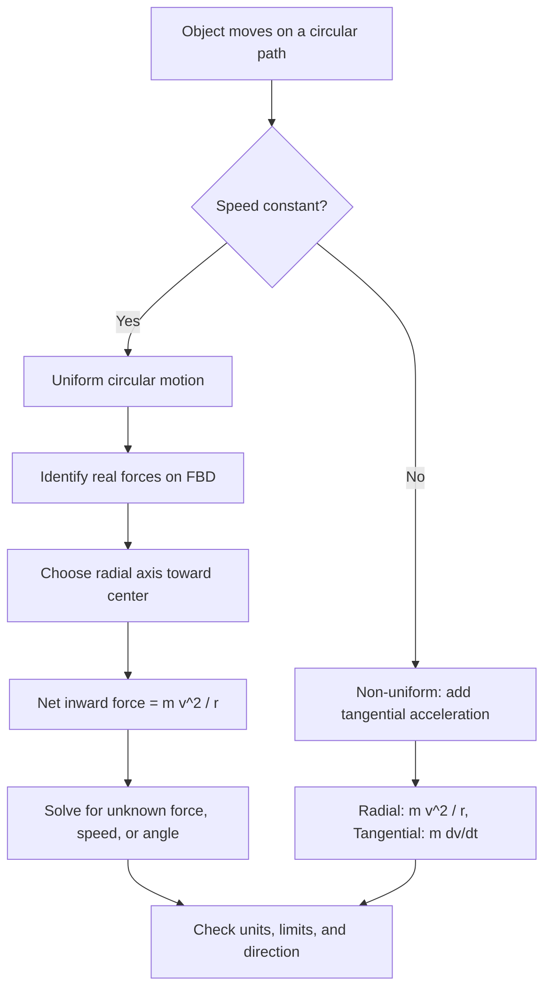

## Uniform Circular Motion


**Uniform circular motion (UCM)** is the motion of a particle along a circular path at **constant speed**. Although the speed does not change, the **velocity** (a vector) changes continuously in direction, so the particle is always accelerating. That acceleration, called **centripetal acceleration**, points toward the center of the circle, and by Newton's second law it requires a net inward force. UCM is the simplest example of curvilinear motion and underlies orbital mechanics, rotating machinery, particle accelerators, and the description of periodic phenomena such as oscillations and waves.

### Foundational Concepts

#### Defining Characteristics

- The path is a circle of fixed radius $r$.
- The speed $v = |\vec{v}|$ is constant.
- The velocity vector is always **tangent** to the circle.
- The acceleration is always directed **radially inward**, perpendicular to the velocity.
- The tangential acceleration is zero, so the kinetic energy is constant and the net force does no work.

#### Position in Polar and Cartesian Form

With the origin at the center of the circle and angular position $\theta(t)$:

$$\vec{r}(t) = r\cos\theta(t)\,\hat{x} + r\sin\theta(t)\,\hat{y}$$

For UCM, $\theta(t) = \theta_0 + \omega t$, where $\omega$ is the constant angular velocity.

#### Angular Quantities

| Quantity | Symbol | Definition | SI unit |
| --- | --- | --- | --- |
| Angular position | $\theta$ | Angle from a reference direction | rad |
| Angular velocity | $\omega$ | $d\theta/dt$ | rad/s |
| Period | $T$ | Time for one revolution | s |
| Frequency | $f$ | Revolutions per unit time, $f = 1/T$ | Hz |
| Angular acceleration | $\alpha$ | $d\omega/dt$ (zero in UCM) | rad/s² |

#### Relations Between Linear and Angular Quantities

$$v = \omega r, \qquad \omega = \frac{2\pi}{T} = 2\pi f, \qquad v = \frac{2\pi r}{T}$$

The arc length traveled is $s = r\theta$, valid when $\theta$ is measured in radians.

#### Unit Conversions

$$1\ \text{rev} = 2\pi\ \text{rad}, \qquad 1\ \text{rpm} = \frac{2\pi}{60}\ \text{rad/s} \approx 0.1047\ \text{rad/s}$$

### Kinematics of Uniform Circular Motion

#### Velocity Vector

Differentiating the position with respect to time:

$$\vec{v}(t) = \frac{d\vec{r}}{dt} = -r\omega\sin\theta\,\hat{x} + r\omega\cos\theta\,\hat{y}$$

Its magnitude is $|\vec{v}| = r\omega$, constant, and $\vec{v}\cdot\vec{r} = 0$, confirming that the velocity is perpendicular to the radius vector.

#### Acceleration Vector

$$\vec{a}(t) = \frac{d\vec{v}}{dt} = -r\omega^2\cos\theta\,\hat{x} - r\omega^2\sin\theta\,\hat{y} = -\omega^2\,\vec{r}$$

This shows that $\vec{a}$ is antiparallel to $\vec{r}$, meaning it points toward the center, with magnitude:

$$a_c = \omega^2 r = \frac{v^2}{r} = v\omega = \frac{4\pi^2 r}{T^2}$$

#### Geometric Derivation of Centripetal Acceleration

Consider two velocity vectors $\vec{v}_1$ and $\vec{v}_2$ separated by a small angle $\Delta\theta$. Both have magnitude $v$, so the change in velocity has magnitude:

$$|\Delta\vec{v}| \approx v\,\Delta\theta$$

for small $\Delta\theta$, and its direction approaches the inward radial direction as $\Delta\theta \to 0$. The time to sweep the angle is $\Delta t = r\Delta\theta/v$, so:

$$a_c = \lim_{\Delta t\to0}\frac{|\Delta\vec{v}|}{\Delta t} = \frac{v\,\Delta\theta}{r\,\Delta\theta/v} = \frac{v^2}{r}$$

#### Polar-Coordinate Description

In plane polar coordinates with unit vectors $\hat{r}$ and $\hat{\theta}$:

$$\vec{v} = r\omega\,\hat{\theta}, \qquad \vec{a} = -r\omega^2\,\hat{r}$$

For the more general case (non-uniform circular motion), the acceleration has both radial and tangential components:

$$\vec{a} = -r\omega^2\,\hat{r} + r\alpha\,\hat{\theta}$$

UCM is the special case $\alpha = 0$.

#### Projection onto an Axis: Link to Simple Harmonic Motion

The projection of UCM onto a diameter is simple harmonic motion:

$$x(t) = r\cos(\omega t + \theta_0), \qquad v_x(t) = -r\omega\sin(\omega t + \theta_0), \qquad a_x(t) = -\omega^2 x(t)$$

This relation, the **reference circle**, connects uniform circular motion and oscillatory motion with angular frequency $\omega$.

### Dynamics of Uniform Circular Motion

#### Centripetal Force

By Newton's second law, the net force along the inward radial direction must be:

$$F_c = m a_c = \frac{mv^2}{r} = m\omega^2 r = \frac{4\pi^2 m r}{T^2}$$

**Centripetal force is not a new kind of force.** It is the name for the net inward force provided by real interactions such as tension, gravity, friction, the normal force, or electromagnetic forces. It should not be drawn as an additional force on a free body diagram alongside the real forces.

#### Role of Each Real Force

| Situation | Force supplying the centripetal force |
| --- | --- |
| Ball on a string (horizontal circle) | Tension |
| Car on a flat curve | Static friction between tires and road |
| Satellite in circular orbit | Gravity |
| Charged particle in a magnetic field | Magnetic (Lorentz) force $qvB$ |
| Rider on a rotor ride wall | Normal force from the wall |
| Electron in a Bohr-model orbit (classical picture) | Coulomb attraction |

#### What Happens If the Force Vanishes

If the centripetal force is suddenly removed, the object moves off in a **straight line tangent to the circle** at the instant of release, with constant velocity (Newton's first law). It does not fly radially outward.

#### Work and Energy

Since $\vec{F}_c\perp\vec{v}$ at every instant:

$$W = \int\vec{F}_c\cdot d\vec{r} = 0$$

so kinetic energy $K = \tfrac{1}{2}mv^2$ stays constant. The force changes the direction of the velocity but not its magnitude.

#### Angular Momentum

For a particle in UCM about the center:

$$\vec{L} = \vec{r}\times m\vec{v}, \qquad |\vec{L}| = mvr = m\omega r^2 = I\omega$$

with $I = mr^2$. The direction is perpendicular to the plane of motion (right-hand rule) and is constant, consistent with the zero net torque from a central force.

### The Rotating Frame Viewpoint

In a frame rotating with the particle at angular velocity $\omega$, the particle is at rest, and the inward force is balanced by a **fictitious centrifugal force**:

$$\vec{F}_{\text{cf}} = m\omega^2\,\vec{r} \quad\text{(directed outward)}$$

The centrifugal force is not a real interaction, and it appears only when describing motion in a rotating (non-inertial) frame. In an inertial frame, no outward force acts on the object. Confusion between the two frames is a major source of errors, so any problem should commit to a single frame.

### Common Applications and Derivations

#### Banked Curves (Frictionless)

A car of mass $m$ rounds a curve of radius $r$ banked at angle $\theta$. With no friction, the normal force $N$ (perpendicular to the road) and weight $mg$ are the only forces.

Vertical: $N\cos\theta = mg$

Radial: $N\sin\theta = \dfrac{mv^2}{r}$

Dividing:

$$\tan\theta = \frac{v^2}{rg} \;\Rightarrow\; v_{\text{design}} = \sqrt{rg\tan\theta}$$

#### Banked Curves with Friction

At the maximum speed (friction acting down the slope at its limit $\mu_s N$):

$$v_{\max}^2 = rg\,\frac{\tan\theta + \mu_s}{1 - \mu_s\tan\theta}$$

At the minimum speed (friction acting up the slope):

$$v_{\min}^2 = rg\,\frac{\tan\theta - \mu_s}{1 + \mu_s\tan\theta}$$

valid when $\tan\theta > \mu_s$ (otherwise a car can remain at rest on the bank, and $v_{\min}=0$). If $\mu_s\tan\theta \ge 1$, the expression for $v_{\max}$ diverges, which indicates no upper speed limit from slipping in this idealization.

#### Vertical Circle

A mass on a string swings in a vertical circle. Because gravity has a component along the path, the speed is **not** constant in general, so this is non-uniform circular motion. The radial equation at any angle $\phi$ measured from the bottom is:

$$T - mg\cos\phi = \frac{mv^2}{r}$$

At the top ($\phi = 180^\circ$): $T_{\text{top}} + mg = \dfrac{mv_{\text{top}}^2}{r}$. The minimum speed at the top to keep the string taut ($T_{\text{top}} \ge 0$) is:

$$v_{\text{top,min}} = \sqrt{gr}$$

By energy conservation, the minimum speed at the bottom is:

$$v_{\text{bottom,min}} = \sqrt{5gr}$$

#### Conical Pendulum

A bob on a string of length $L$ traces a horizontal circle with the string at angle $\theta$ to the vertical:

$$T\cos\theta = mg, \qquad T\sin\theta = m\omega^2 r, \quad r = L\sin\theta$$


$$\omega^2 = \frac{g}{L\cos\theta}, \qquad T_{\text{period}} = 2\pi\sqrt{\frac{L\cos\theta}{g}}$$

#### Circular Orbits

For a satellite of mass $m$ orbiting a much larger mass $M$ at radius $r$, gravity supplies the centripetal force:

$$\frac{GMm}{r^2} = \frac{mv^2}{r} \;\Rightarrow\; v = \sqrt{\frac{GM}{r}}$$

The period follows Kepler's third law for circular orbits:

$$T^2 = \frac{4\pi^2}{GM}\,r^3$$

The orbital speed decreases as $r$ increases, while the angular velocity $\omega = \sqrt{GM/r^3}$ decreases faster.

#### Charged Particle in a Uniform Magnetic Field

For a particle of charge $q$ and mass $m$ moving with speed $v$ perpendicular to a uniform magnetic field $B$, the magnetic force supplies the centripetal force:

$$qvB = \frac{mv^2}{r} \;\Rightarrow\; r = \frac{mv}{qB}$$

The angular velocity (the cyclotron frequency) is independent of speed in the non-relativistic regime:

$$\omega_c = \frac{qB}{m}$$

#### Turning an Aircraft

For a coordinated banked turn at bank angle $\theta$ and speed $v$, the horizontal component of lift provides the centripetal force:

$$L\sin\theta = \frac{mv^2}{r}, \qquad L\cos\theta = mg \;\Rightarrow\; r = \frac{v^2}{g\tan\theta}$$

The load factor is $n = L/(mg) = 1/\cos\theta$.

#### Rotating Space Habitat (Artificial Gravity)

A habitat rotating at angular velocity $\omega$ produces an apparent "weight" at radius $r$ equal to the normal force from the floor:

$$N = m\omega^2 r \;\Rightarrow\; \text{apparent } g = \omega^2 r$$

### Worked Examples

#### Example 1: Basic Kinematics

A wheel of radius $r = 0.30\ \text{m}$ rotates at $120\ \text{rpm}$. Find $\omega$, the speed of a point on the rim, and its centripetal acceleration.

$$\omega = 120\times\frac{2\pi}{60} = 4\pi\ \text{rad/s} \approx 12.57\ \text{rad/s}$$


$$v = \omega r = 12.57\times0.30 \approx 3.77\ \text{m/s}$$


$$a_c = \omega^2 r = (12.57)^2(0.30) \approx 47.4\ \text{m/s}^2$$

**Output**: $\omega \approx 12.6\ \text{rad/s}$, $v \approx 3.77\ \text{m/s}$, $a_c \approx 47.4\ \text{m/s}^2$ (about $4.8g$).

#### Example 2: Ball on a String

A $0.50\ \text{kg}$ ball moves in a horizontal circle of radius $0.80\ \text{m}$ at $4.0\ \text{m/s}$ on a string (gravity is balanced by other means, for example, the ball is on a frictionless horizontal table). Find the tension.

$$T = \frac{mv^2}{r} = \frac{0.50(4.0)^2}{0.80}$$

**Output**: $T = 10\ \text{N}$. Doubling the speed to $8.0\ \text{m/s}$ quadruples the tension to $40\ \text{N}$.

#### Example 3: Maximum Speed on a Flat Curve

A car rounds a flat curve of radius $r = 80\ \text{m}$ with $\mu_s = 0.65$. Find the maximum speed.

$$\mu_s mg = \frac{mv^2}{r} \;\Rightarrow\; v_{\max} = \sqrt{\mu_s g r}$$

**Output**: $v_{\max} = \sqrt{0.65(9.81)(80)} \approx 22.6\ \text{m/s}$ (about $81\ \text{km/h}$). The result is independent of the car's mass.

#### Example 4: Low Earth Orbit

Find the orbital speed and period of a satellite at altitude $h = 400\ \text{km}$ above Earth. Use $GM_E = 3.986\times10^{14}\ \text{m}^3/\text{s}^2$ and $R_E = 6.371\times10^6\ \text{m}$.

$$r = R_E + h = 6.771\times10^6\ \text{m}$$


$$v = \sqrt{\frac{GM_E}{r}} = \sqrt{\frac{3.986\times10^{14}}{6.771\times10^6}} \approx 7.67\times10^3\ \text{m/s}$$


$$T = \frac{2\pi r}{v} = \frac{2\pi(6.771\times10^6)}{7.67\times10^3} \approx 5.55\times10^3\ \text{s}$$

**Output**: $v \approx 7.67\ \text{km/s}$ and $T \approx 92.5\ \text{minutes}$. The centripetal acceleration equals the local gravitational field, $a_c = v^2/r \approx 8.7\ \text{m/s}^2$, and the astronauts feel weightless because they are in free fall, not because gravity is absent.

#### Example 5: Banked Curve Design Speed

A highway curve of radius $r = 150\ \text{m}$ is banked at $\theta = 8^\circ$. Find the speed at which no friction is needed.

$$v = \sqrt{rg\tan\theta} = \sqrt{150(9.81)(0.1405)}$$

**Output**: $v \approx 14.4\ \text{m/s}$ (about $52\ \text{km/h}$). Traffic at higher speed relies on friction to stay on the road.

#### Example 6: Conical Pendulum

A conical pendulum of length $L = 1.2\ \text{m}$ makes an angle $\theta = 25^\circ$ with the vertical. Find the period and the speed of the bob.

$$T_{\text{period}} = 2\pi\sqrt{\frac{L\cos\theta}{g}} = 2\pi\sqrt{\frac{1.2(0.9063)}{9.81}} \approx 2.09\ \text{s}$$


$$r = L\sin\theta = 1.2(0.4226) \approx 0.507\ \text{m}, \qquad v = \frac{2\pi r}{T_{\text{period}}} \approx 1.52\ \text{m/s}$$

**Output**: Period $\approx 2.09\ \text{s}$ and speed $\approx 1.52\ \text{m/s}$. The tension is $T = mg/\cos\theta \approx 1.10\,mg$.

#### Example 7: Cyclotron Radius

A proton ($m = 1.673\times10^{-27}\ \text{kg}$, $q = 1.602\times10^{-19}\ \text{C}$) moves at $2.0\times10^{6}\ \text{m/s}$ perpendicular to a $0.50\ \text{T}$ field. Find the orbit radius and frequency.

$$r = \frac{mv}{qB} = \frac{(1.673\times10^{-27})(2.0\times10^{6})}{(1.602\times10^{-19})(0.50)} \approx 4.18\times10^{-2}\ \text{m}$$


$$f = \frac{qB}{2\pi m} \approx 7.62\times10^{6}\ \text{Hz}$$

**Output**: $r \approx 4.2\ \text{cm}$ and $f \approx 7.6\ \text{MHz}$. The frequency does not depend on $v$ in the non-relativistic regime.

#### Example 8: Vertical Circle Tension

A $0.40\ \text{kg}$ ball swings in a vertical circle of radius $0.90\ \text{m}$ and passes the top at $v_{\text{top}} = 4.0\ \text{m/s}$. Find the tension at the top and at the bottom.

At the top:

$$T_{\text{top}} = \frac{mv_{\text{top}}^2}{r} - mg = \frac{0.40(16)}{0.90} - 0.40(9.81) \approx 7.11 - 3.92 \approx 3.19\ \text{N}$$

Energy conservation gives the speed at the bottom:

$$v_{\text{bot}}^2 = v_{\text{top}}^2 + 4gr = 16 + 4(9.81)(0.90) = 51.3\ \text{m}^2/\text{s}^2$$


$$T_{\text{bot}} = mg + \frac{mv_{\text{bot}}^2}{r} = 3.92 + \frac{0.40(51.3)}{0.90} \approx 3.92 + 22.8 \approx 26.7\ \text{N}$$

**Output**: $T_{\text{top}} \approx 3.2\ \text{N}$ and $T_{\text{bot}} \approx 26.7\ \text{N}$, a difference of $6mg$, as the general result for a vertical circle predicts. Since $v_{\text{top}}^2 = 16 > gr = 8.83$, the string stays taut.

### Numerical Simulation Example

The code below computes the trajectory of a particle in UCM by integrating the equation of motion with the centripetal force, and compares a naive explicit Euler integration with the exact solution. It illustrates a known numerical behavior: explicit Euler causes the orbit radius to grow steadily, while a symplectic method (velocity Verlet) keeps it nearly constant.

```python
import numpy as np

def exact(r0, omega, t):
    return r0 * np.cos(omega * t), r0 * np.sin(omega * t)

def euler(r0, omega, dt, n):
    x, y = r0, 0.0
    vx, vy = 0.0, r0 * omega
    xs, ys = [x], [y]
    for _ in range(n):
        ax, ay = -omega**2 * x, -omega**2 * y   # a = -omega^2 * r
        x, y = x + vx * dt, y + vy * dt
        vx, vy = vx + ax * dt, vy + ay * dt
        xs.append(x); ys.append(y)
    return np.array(xs), np.array(ys)

def verlet(r0, omega, dt, n):
    x, y = r0, 0.0
    vx, vy = 0.0, r0 * omega
    ax, ay = -omega**2 * x, -omega**2 * y
    xs, ys = [x], [y]
    for _ in range(n):
        vx += 0.5 * ax * dt; vy += 0.5 * ay * dt
        x += vx * dt;        y += vy * dt
        ax, ay = -omega**2 * x, -omega**2 * y
        vx += 0.5 * ax * dt; vy += 0.5 * ay * dt
        xs.append(x); ys.append(y)
    return np.array(xs), np.array(ys)

r0, omega = 1.0, 2.0 * np.pi          # radius 1 m, period 1 s
dt, n = 0.01, 1000                     # 10 revolutions

xe, ye = euler(r0, omega, dt, n)
xv, yv = verlet(r0, omega, dt, n)

print(f"Exact radius:          {r0:.4f} m")
print(f"Euler final radius:    {np.hypot(xe[-1], ye[-1]):.4f} m")
print(f"Verlet final radius:   {np.hypot(xv[-1], yv[-1]):.4f} m")
```

**Output** (approximate; values depend on step size, and behavior may vary with the integration scheme):



```
Exact radius:          1.0000 m
Euler final radius:    ~2.0 m
Verlet final radius:   ~1.0000 m
```

For explicit Euler applied to this linear oscillator, the radius grows by a factor of $\sqrt{1 + (\omega\,\Delta t)^2}$ per step, so it inflates steadily, whereas velocity Verlet keeps the radius essentially constant over many periods.

### Diagram: Velocity and Acceleration Vectors (svg_diagram)

<svg xmlns="http://www.w3.org/2000/svg" viewBox="0 0 640 400" width="640" height="400" font-family="sans-serif" font-size="13">
<text x="320" y="24" text-anchor="middle" font-size="15" font-weight="bold">Uniform Circular Motion Vectors (svg_diagram)</text>
<circle cx="320" cy="215" r="130" fill="none" stroke="#555" stroke-width="2" />
<circle cx="320" cy="215" r="4" fill="#000" />
<text x="330" y="232">O</text>
<line x1="320" y1="215" x2="450" y2="215" stroke="#888" stroke-width="2" stroke-dasharray="5,4" />
<text x="380" y="208" fill="#666">r</text>
<circle cx="450" cy="215" r="7" fill="#f39c12" stroke="#333" />
<line x1="450" y1="215" x2="450" y2="120" stroke="#2c6fbb" stroke-width="3" />
<polygon points="450,112 444,126 456,126" fill="#2c6fbb" />
<text x="458" y="150" fill="#2c6fbb">v (tangent)</text>
<line x1="450" y1="215" x2="375" y2="215" stroke="#c0392b" stroke-width="3" />
<polygon points="367,215 381,209 381,221" fill="#c0392b" />
<text x="378" y="240" fill="#c0392b">a_c, F_c (toward O)</text>
<path d="M 450,215 A 130,130 0 0 0 440,170" fill="none" stroke="#1a7f37" stroke-width="2" />
<text x="470" y="190" fill="#1a7f37">direction of motion</text>
<text x="320" y="385" text-anchor="middle" fill="#333">|a_c| = v^2 / r = omega^2 r, v = omega r</text>
</svg>

### Diagram: Banked Curve Forces (svg_diagram)

<svg xmlns="http://www.w3.org/2000/svg" viewBox="0 0 640 360" width="640" height="360" font-family="sans-serif" font-size="13">
<text x="320" y="24" text-anchor="middle" font-size="15" font-weight="bold">Frictionless Banked Curve (svg_diagram)</text>
<polygon points="80,320 560,320 560,170" fill="#e6e6e6" stroke="#333" stroke-width="2" />
<g transform="translate(320,245) rotate(-17.4)">
<rect x="-45" y="-32" width="90" height="32" fill="#f4e3c1" stroke="#333" stroke-width="2" />
<text x="0" y="-11" text-anchor="middle">car</text>
</g>
<circle cx="320" cy="229" r="4" fill="#000" />
<line x1="320" y1="229" x2="320" y2="309" stroke="#c0392b" stroke-width="3" />
<polygon points="320,317 314,303 326,303" fill="#c0392b" />
<text x="328" y="304" fill="#c0392b">mg</text>
<line x1="320" y1="229" x2="296" y2="133" stroke="#1a7f37" stroke-width="3" />
<polygon points="294,125 289,139 302,136" fill="#1a7f37" />
<text x="250" y="130" fill="#1a7f37">N</text>
<line x1="320" y1="229" x2="400" y2="229" stroke="#8e44ad" stroke-width="2" stroke-dasharray="5,4" />
<text x="405" y="234" fill="#8e44ad">toward center of circle</text>
<text x="130" y="308">bank angle theta</text>
<text x="320" y="345" text-anchor="middle" fill="#333">N cos(theta) = mg, N sin(theta) = m v^2 / r, so tan(theta) = v^2 / (r g)</text>
</svg>

### Diagram: Choosing the Approach



### Comparison: Linear and Rotational Descriptions

| Linear quantity | Rotational analogue | Relation for a point at radius $r$ |
| --- | --- | --- |
| Displacement $s$ | Angle $\theta$ | $s = r\theta$ |
| Speed $v$ | Angular speed $\omega$ | $v = \omega r$ |
| Tangential acceleration $a_t$ | Angular acceleration $\alpha$ | $a_t = \alpha r$ |
| Centripetal acceleration $a_c$ | Not applicable | $a_c = \omega^2 r = v^2/r$ |
| Mass $m$ | Moment of inertia $I$ | $I = mr^2$ for a point mass |
| Force $F$ | Torque $\tau$ | $\tau = rF_t$ |
| Momentum $p$ | Angular momentum $L$ | $L = rp = I\omega$ |

### Common Misconceptions

- **"Centripetal force is an additional force"**: it is the net inward force from real interactions and should not be added to an FBD as an extra arrow.
- **"Centrifugal force pushes objects outward in an inertial frame"**: it appears only in the rotating frame. A released object moves along the tangent, not radially outward.
- **"Constant speed means zero acceleration"**: the velocity direction changes, so the acceleration is nonzero and equals $v^2/r$.
- **"The velocity and acceleration are parallel"**: in UCM, they are perpendicular.
- **"Centripetal force does work"**: it is perpendicular to the velocity at every instant, so it does zero work and does not change the kinetic energy.
- **"Astronauts in orbit feel weightless because gravity vanishes"**: gravity is nearly as strong as on the surface, and the weightlessness results from free fall.
- **"Doubling the speed doubles the required force"**: $F_c\propto v^2$, so the required force quadruples.
- **"Vertical circular motion is uniform"**: gravity does work along the path, so the speed varies unless an additional force compensates.

### Limitations and Domain of Validity

- **Non-uniform motion**: real rotating systems often have varying speeds, requiring the tangential component $a_t = r\alpha$ in addition to $a_c$.
- **Relativistic regime**: at speeds approaching $c$, momentum is $\gamma mv$, and the radius of a charged-particle orbit becomes $r = \gamma mv/(qB)$, so the cyclotron frequency depends on energy: $\omega_c = qB/(\gamma m)$. Cyclotron designs must compensate for this.
- **Extended bodies**: for a rigid body rotating about a fixed axis, each element has its own radius and centripetal acceleration, and the analysis uses the moment of inertia and rotational dynamics.
- **Earth's rotation**: an observer on Earth is in a rotating frame, so effects such as reduced effective gravity at the equator (by about $0.034\ \text{m/s}^2$ from $\omega_E^2 R_E$) and the Coriolis force arise. Effective gravity also varies due to Earth's oblateness.
- **Orbits are only circular under special conditions**: general bound orbits under an inverse-square force are ellipses, with circular orbits as the special case of zero eccentricity.

### Key Points

- UCM has constant speed but continuously changing velocity direction, so it is always accelerating.
- Centripetal acceleration has magnitude $a_c = v^2/r = \omega^2 r$ and points toward the center.
- The net inward force $F_c = mv^2/r$ must come from real interactions and does no work.
- Kinematic relations: $v = \omega r$, $\omega = 2\pi/T = 2\pi f$.
- Applications include banked curves ($\tan\theta = v^2/rg$), orbits ($v = \sqrt{GM/r}$), conical pendulums, cyclotron motion ($r = mv/qB$), and artificial gravity.
- Projecting UCM onto an axis gives simple harmonic motion.
- Numerical simulations must use methods that preserve orbit radius (for example, Verlet), since explicit Euler drifts.

### Conclusion

Uniform circular motion links kinematics, dynamics, and conservation laws in a single compact model. Its central insight is that changing the direction of velocity requires a net force just as changing its magnitude does, and that this force is always perpendicular to the velocity and therefore does no work. Mastery comes from identifying which real force supplies the inward net force in each situation, working consistently in an inertial frame, and applying the relations among $v$, $\omega$, $T$, and $r$. The same framework extends to orbital mechanics, electromagnetism, rotational dynamics, and oscillations.

### Next Steps

**Related Topics**

- Non-uniform circular motion and tangential acceleration
- Rotational kinematics with constant angular acceleration
- Torque, moment of inertia, and rotational dynamics
- Angular momentum and its conservation
- Kepler's laws and orbital mechanics (elliptical orbits, escape velocity)
- Non-inertial frames: centrifugal and Coriolis forces
- Simple harmonic motion and the reference-circle connection
- Motion of charged particles in electric and magnetic fields (cyclotrons, mass spectrometers)
- Relativistic circular motion and synchrotron radiation
- Banked turns in aviation and rail design
- Symplectic integrators (Verlet, leapfrog) for orbital simulations