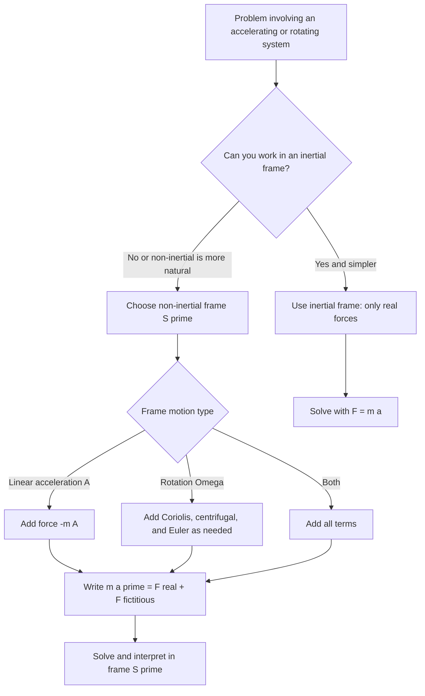

## Non-Inertial Reference Frames


A **non-inertial reference frame** is a frame that accelerates (linearly, rotationally, or both) relative to an inertial frame. In such a frame, Newton's second law in its usual form $\sum\vec{F} = m\vec{a}'$ fails unless additional terms, called **fictitious forces** (also called inertial forces or pseudo-forces), are included. These terms are not caused by any physical interaction between bodies. They arise because the frame itself accelerates, and they are proportional to the mass of the body on which they act. Non-inertial frames are unavoidable in practice: a laboratory on Earth rotates with the planet, vehicles accelerate and turn, and rotating machinery, weather systems, and ocean currents are most naturally described in rotating frames.

### Foundational Concepts

#### Inertial Frames Revisited

An inertial frame is one in which Newton's first law holds: a body on which no net force acts moves with constant velocity. Any frame moving at constant velocity relative to an inertial frame is also inertial, and the transformation between them is the **Galilean transformation**:

$$\vec{r}' = \vec{r} - \vec{V}t, \qquad \vec{v}' = \vec{v} - \vec{V}, \qquad \vec{a}' = \vec{a}$$

For constant $\vec{V}$, accelerations and hence forces are the same in both frames.

#### Definition of Non-Inertial Frames

A frame $S'$ is non-inertial if its origin accelerates relative to an inertial frame $S$, if it rotates relative to $S$, or both. In $S'$, a free particle (no real forces) is generally observed to accelerate.

#### Real vs. Fictitious Forces

| Property | Real force | Fictitious force |
| --- | --- | --- |
| Physical origin | Interaction with another body or field | Acceleration of the reference frame |
| Third-law partner | Exists (equal and opposite on the other body) | None |
| Frame dependence | Same in all inertial frames | Appears only in non-inertial frames |
| Proportional to mass | Not necessarily | Yes, always |
| Vanishes in inertial frame | No | Yes |
| Measurable by a spring scale or accelerometer | Contact forces are | Effects are, but the source is the frame |

Fictitious forces are "real" in the sense that observers in the accelerating frame measure their effects, for example, a passenger is pressed into the seat when the car accelerates. However, they have no physical agent and no reaction force.

### Linearly Accelerating Frames

#### Transformation

Let frame $S'$ have origin acceleration $\vec{A}$ relative to inertial frame $S$, with no rotation. Then a particle's acceleration in $S'$ is:

$$\vec{a}' = \vec{a} - \vec{A}$$

Newton's second law in the inertial frame is $m\vec{a} = \vec{F}$, so in $S'$:

$$m\vec{a}' = \vec{F} - m\vec{A}$$

#### Fictitious Force

$$\vec{F}_{\text{fict}} = -m\vec{A}$$

It points opposite to the frame's acceleration and is uniform for all points in space (like a uniform gravitational field).

#### Illustrations

- A passenger is pushed back into the seat as a car accelerates forward, because the fictitious force points backward.
- A pendulum hung from the ceiling of an accelerating train car tilts backward, at angle $\theta = \arctan(A/g)$ from the vertical relative to the car.
- An elevator accelerating upward increases the apparent weight: $N = m(g + A)$.

#### Effective Gravity

In a linearly accelerating frame, the net uniform "gravity" is the vector sum:

$$\vec{g}_{\text{eff}} = \vec{g} - \vec{A}$$

Experiments inside a closed accelerating laboratory cannot distinguish this from an ordinary gravitational field of strength $g_{\text{eff}}$, which is the seed of Einstein's **equivalence principle** (valid locally).

### Rotating Frames

#### Setup

Let frame $S'$ rotate with angular velocity $\vec{\Omega}$ about an axis through the origin (shared with the inertial frame $S$). For any vector $\vec{Q}$, the time derivatives in the two frames are related by:

$$\left(\frac{d\vec{Q}}{dt}\right)_S = \left(\frac{d\vec{Q}}{dt}\right)_{S'} + \vec{\Omega}\times\vec{Q}$$

#### Velocity and Acceleration Transformations

Applying the relation to the position vector:

$$\vec{v}_S = \vec{v}' + \vec{\Omega}\times\vec{r}$$

Applying it again, and allowing $\vec{\Omega}$ to vary with time:

$$\vec{a}_S = \vec{a}' + 2\vec{\Omega}\times\vec{v}' + \vec{\Omega}\times(\vec{\Omega}\times\vec{r}) + \dot{\vec{\Omega}}\times\vec{r}$$

where $\vec{v}'$ and $\vec{a}'$ are measured in the rotating frame.

#### Equation of Motion in a Rotating Frame

Using $m\vec{a}_S = \vec{F}$ and solving for $m\vec{a}'$:

$$m\vec{a}' = \vec{F} - 2m\vec{\Omega}\times\vec{v}' - m\vec{\Omega}\times(\vec{\Omega}\times\vec{r}) - m\dot{\vec{\Omega}}\times\vec{r}$$

Each extra term on the right is a fictitious force.

#### The Three Fictitious Forces in a Rotating Frame

| Name | Expression | Depends on | Direction |
| --- | --- | --- | --- |
| Coriolis force | $\vec{F}_{\text{Cor}} = -2m\vec{\Omega}\times\vec{v}'$ | Velocity in the rotating frame | Perpendicular to both $\vec{\Omega}$ and $\vec{v}'$ |
| Centrifugal force | $\vec{F}_{\text{cf}} = -m\vec{\Omega}\times(\vec{\Omega}\times\vec{r}) = m\Omega^2\vec{r}_\perp$ | Position from the axis | Radially outward from the axis |
| Euler force | $\vec{F}_{\text{Eul}} = -m\dot{\vec{\Omega}}\times\vec{r}$ | Change of rotation rate and position | Tangential, opposing the angular acceleration |

Here $\vec{r}_\perp$ is the component of $\vec{r}$ perpendicular to the rotation axis. For constant $\Omega$, the Euler force vanishes.

#### General Case: Translating and Rotating Frame

When the origin of $S'$ also accelerates at $\vec{A}_0$ relative to $S$, an additional term appears:

$$m\vec{a}' = \vec{F} - m\vec{A}_0 - 2m\vec{\Omega}\times\vec{v}' - m\vec{\Omega}\times(\vec{\Omega}\times\vec{r}') - m\dot{\vec{\Omega}}\times\vec{r}'$$

Every term after $\vec{F}$ is a fictitious contribution.

### Properties of Each Fictitious Force

#### Centrifugal Force

$$\vec{F}_{\text{cf}} = m\Omega^2\,\vec{r}_\perp$$

- Acts on any body in the rotating frame, moving or not.
- Grows linearly with distance from the axis.
- Conservative, with potential energy $U_{\text{cf}} = -\tfrac{1}{2}m\Omega^2 r_\perp^2$.
- For a body at rest in the rotating frame, the centrifugal force balances the real inward force that provides the centripetal acceleration in the inertial description.

#### Coriolis Force

$$\vec{F}_{\text{Cor}} = -2m\vec{\Omega}\times\vec{v}'$$

- Acts only on bodies moving relative to the rotating frame.
- Always perpendicular to $\vec{v}'$, so it does **no work** and changes only the direction of motion in the rotating frame.
- Its magnitude is $2m\Omega v'_\perp$ where $v'_\perp$ is the component of $\vec{v}'$ perpendicular to $\vec{\Omega}$.
- For counterclockwise rotation (viewed from above, $\vec{\Omega}$ pointing up), a body moving radially outward is deflected to the right of its motion relative to the rotating frame, and in the Northern Hemisphere the deflection of horizontal motion is likewise to the right.

#### Euler Force

$$\vec{F}_{\text{Eul}} = -m\dot{\vec{\Omega}}\times\vec{r}$$

- Appears only when the rotation rate or axis changes.
- Perpendicular to $\vec{r}$ (and $\dot{\vec{\Omega}}$).
- A rider on a merry-go-round that is speeding up feels pushed backward, opposing the increase in rotation.

#### Diagram: Choosing a Frame



### Rotating Frame Kinematics in Component Form

For a frame rotating about the $z$-axis with constant $\Omega$, and with $\vec{r}' = (x, y, z)$ and $\vec{v}' = (\dot{x}, \dot{y}, \dot{z})$:

$$\vec{\Omega}\times\vec{v}' = \Omega(-\dot{y},\ \dot{x},\ 0)$$

The equations of motion become:

$$m\ddot{x} = F_x + 2m\Omega\dot{y} + m\Omega^2 x$$


$$m\ddot{y} = F_y - 2m\Omega\dot{x} + m\Omega^2 y$$


$$m\ddot{z} = F_z$$

These coupled equations are the basis for analyzing free-particle motion on a turntable and for many rotating-frame problems.

#### Free Particle in a Rotating Frame

A particle with no real force and initial velocity $\vec{v}_0$ (relative to the inertial frame) moves in a straight line in the inertial frame. In the rotating frame, its path is a **spiral** or curved trajectory, because $\vec{r}'(t)$ is the inertial position rotated by $-\Omega t$. The Coriolis and centrifugal terms account for this apparent curvature.

### Earth as a Rotating Frame

#### Rotation Rate

Earth rotates once per sidereal day, about $86{,}164\ \text{s}$:

$$\Omega_E = \frac{2\pi}{86164\ \text{s}} \approx 7.292\times10^{-5}\ \text{rad/s}$$

#### Effective Gravity

The gravity measured at the surface, $\vec{g}_{\text{eff}}$, includes the centrifugal contribution:

$$\vec{g}_{\text{eff}} = \vec{g}_0 - \vec{\Omega}\times(\vec{\Omega}\times\vec{R})$$

At latitude $\lambda$ on a spherical Earth of radius $R_E$, the centrifugal acceleration has magnitude $\Omega^2 R_E\cos\lambda$:

$$a_{\text{cf}}(\lambda) = \Omega_E^2 R_E\cos\lambda$$

**Output**: At the equator, $a_{\text{cf}} = (7.292\times10^{-5})^2(6.378\times10^{6}) \approx 0.0339\ \text{m/s}^2$, about $0.35\%$ of $g$, and it is zero at the poles. Earth's equatorial bulge, a consequence of the rotation, adds further variation. The measured surface gravity varies from about $9.780\ \text{m/s}^2$ at the equator to about $9.832\ \text{m/s}^2$ at the poles.

The direction of a plumb line deviates slightly from the direction to Earth's center because of the tangential component of the centrifugal term.

#### Coriolis Effect on Earth

For a horizontal velocity at latitude $\lambda$, the relevant component of $\vec{\Omega}$ is the vertical one, $\Omega\sin\lambda$. The horizontal Coriolis acceleration has magnitude:

$$a_{\text{Cor}} = 2\Omega v\sin\lambda = f\,v, \qquad f = 2\Omega\sin\lambda$$

where $f$ is the **Coriolis parameter**. The deflection is to the **right** in the Northern Hemisphere and to the **left** in the Southern Hemisphere, and it vanishes for purely horizontal motion at the equator.

Vertical motion produces an east-west deflection through the horizontal component of $\vec{\Omega}$:

- A falling object is deflected slightly **eastward** (Northern or Southern Hemisphere alike, away from the poles).
- An upward-moving object is deflected **westward**.

#### Eastward Deflection of a Falling Body

To lowest order, an object dropped from height $h$ at latitude $\lambda$ (no air resistance) lands displaced eastward by:

$$d = \frac{1}{3}\,\Omega\cos\lambda\,\sqrt{\frac{8h^3}{g}}$$

**Output**: For $h = 100\ \text{m}$ at $\lambda = 45^\circ$: fall time $t = \sqrt{2h/g} \approx 4.52\ \text{s}$, and $d \approx \tfrac{1}{3}(7.292\times10^{-5})(0.7071)\sqrt{8\times10^{6}/9.81}\approx 1.55\times10^{-2}\ \text{m}$, about $1.6\ \text{cm}$.

#### Foucault Pendulum

A long pendulum swinging in a fixed vertical plane in the inertial frame appears, from the rotating Earth, to have its plane rotate. The precession rate at latitude $\lambda$ is:

$$\Omega_{\text{prec}} = \Omega_E\sin\lambda$$

The plane rotates clockwise in the Northern Hemisphere (viewed from above), and the period for a full rotation is:

$$T_F = \frac{T_{\text{sidereal}}}{\sin\lambda}$$

**Output**: At latitude $48.85^\circ$ (Paris), $T_F \approx 86164/0.7518 \approx 1.146\times10^{5}\ \text{s}\approx 31.8\ \text{hours}$, about $11.3^\circ$ per hour. At the poles $T_F = 1$ sidereal day, and at the equator there is no precession.

#### Weather and Ocean Circulation

- In the Northern Hemisphere, air flowing toward a low-pressure region is deflected to the right, producing counterclockwise (cyclonic) circulation around lows. In the Southern Hemisphere, the rotation is clockwise.
- Geostrophic balance, in which the pressure-gradient force balances the Coriolis force, describes large-scale winds and ocean currents when the Rossby number is small:

$$f\,\vec{k}\times\vec{v}_g = -\frac{1}{\rho}\nabla p$$

- The **Rossby number** $\text{Ro} = U/(fL)$ measures how important Coriolis effects are for a flow of speed $U$ and length scale $L$. Small $\text{Ro}$ implies rotation dominates.
- Coriolis effects on small-scale phenomena such as a draining bathtub are negligible compared to other influences (residual motion, basin shape), so the direction of drainage is not reliably determined by hemisphere.

### Worked Examples

#### Example 1: Pendulum in an Accelerating Car

A pendulum bob hangs in a car accelerating forward at $A = 3.0\ \text{m/s}^2$. Find the equilibrium angle and the tension for $m = 0.50\ \text{kg}$.

In the car frame, the forces on the bob are: tension $T$ (along the string), weight $mg$ (down), and the fictitious force $-mA$ (backward).

Equilibrium in the car frame:

$$T\cos\theta = mg, \qquad T\sin\theta = mA$$


$$\tan\theta = \frac{A}{g}, \qquad T = m\sqrt{g^2 + A^2}$$

**Output**: $\theta = \arctan(3.0/9.81) \approx 17.0^\circ$ (bob displaced toward the rear) and $T = 0.50\sqrt{96.2 + 9} \approx 5.13\ \text{N}$.

In the inertial frame, the same result follows: the net force on the bob is $mA$ forward, supplied by the horizontal component of tension.

#### Example 2: Block on an Accelerating Wedge

A block sits on a frictionless wedge of angle $\theta$ that accelerates horizontally with acceleration $A$. Find $A$ such that the block stays at rest relative to the wedge.

In the wedge frame, the fictitious force $mA$ acts horizontally (opposite to the wedge's acceleration). For equilibrium along the incline, with the incline rising away from the direction of acceleration so that the wedge pushes the block:

$$mA\cos\theta = mg\sin\theta \;\Rightarrow\; A = g\tan\theta$$

**Output**: For $\theta = 20^\circ$, $A = 9.81\times0.364 \approx 3.57\ \text{m/s}^2$. The normal force is $N = m(g\cos\theta + A\sin\theta) = mg/\cos\theta$.

#### Example 3: Rotor Amusement Ride

A cylindrical drum of radius $R = 2.5\ \text{m}$ rotates about a vertical axis. Riders press against the wall, and the floor drops away. The static friction coefficient between rider and wall is $\mu_s = 0.40$. Find the minimum angular speed to keep a rider from sliding down.

In the rotating frame, the normal force from the wall balances the centrifugal force:

$$N = m\Omega^2 R$$

Vertical balance requires static friction to support the weight:

$$\mu_s N \ge mg \;\Rightarrow\; \mu_s\,\Omega^2 R \ge g \;\Rightarrow\; \Omega_{\min} = \sqrt{\frac{g}{\mu_s R}}$$

**Output**: $\Omega_{\min} = \sqrt{9.81/(0.40\times2.5)} \approx 3.13\ \text{rad/s}\approx 29.9\ \text{rpm}$. The result does not depend on the rider's mass.

In the inertial frame, the wall's normal force provides the centripetal force $m\Omega^2R$, giving the same result without invoking a fictitious force.

#### Example 4: Bead on a Rotating Hoop

A bead slides without friction on a vertical circular hoop of radius $R$ that rotates about its vertical diameter at constant $\Omega$. Find the equilibrium positions, with the polar angle $\phi$ measured from the bottom.

In the rotating frame, the bead feels gravity, the normal force from the hoop (which has no tangential component), and the centrifugal force $m\Omega^2R\sin\phi$ directed horizontally outward. The tangential balance gives:

$$mg\sin\phi = m\Omega^2R\sin\phi\cos\phi$$

so the solutions are $\sin\phi = 0$ (bottom or top of the hoop) or:

$$\cos\phi_0 = \frac{g}{\Omega^2R}$$

**Output**: The off-axis equilibrium exists only when $\Omega > \sqrt{g/R}$. For $R = 0.50\ \text{m}$ the threshold is $\Omega_c = \sqrt{9.81/0.50}\approx 4.43\ \text{rad/s}$. Below $\Omega_c$, the bottom is stable, and above it, the bottom becomes unstable and the bead settles at $\phi_0$, an example of a pitchfork bifurcation.

#### Example 5: Coriolis Deflection of a Projectile

A shell is fired due north at $v = 800\ \text{m/s}$ at latitude $45^\circ$ N, with a flight time of $60\ \text{s}$. Estimate the sideways deflection using a constant horizontal Coriolis acceleration.

$$a_{\text{Cor}} = 2\Omega v\sin\lambda = 2(7.292\times10^{-5})(800)(0.7071)\approx 0.0825\ \text{m/s}^2$$

The lateral displacement over time $t$ starting from rest sideways is:

$$d \approx \tfrac{1}{2}a_{\text{Cor}}t^2 = \tfrac{1}{2}(0.0825)(60)^2\approx 148\ \text{m}$$

**Output**: The deflection is about $150\ \text{m}$ to the right (east). [Inference] This is a rough estimate that treats the speed as constant and ignores drag and vertical motion, and real ballistic computations include these effects.

#### Example 6: Man Walking on a Turntable

A person walks radially outward at $v' = 1.0\ \text{m/s}$ on a turntable rotating at $\Omega = 2.0\ \text{rad/s}$ counterclockwise. Find the Coriolis force on a $70\ \text{kg}$ person.

$$F_{\text{Cor}} = 2m\Omega v' = 2(70)(2.0)(1.0) = 280\ \text{N}$$

**Output**: The magnitude is $280\ \text{N}$, directed perpendicular to the radial motion, to the **right** of the direction of walking for counterclockwise rotation viewed from above ($-2m\vec{\Omega}\times\vec{v}'$ with $\vec{\Omega} = \Omega\hat{z}$ and $\vec{v}' = v'\hat{r}$ gives $-2m\Omega v'\hat{\theta}$, opposite the direction of rotation). In the inertial frame this corresponds to the friction force needed to give the person the increasing tangential speed $\Omega r$ as $r$ grows.

### Numerical Simulation Example

The code below integrates the equations of motion of a free particle (no real forces) in a frame rotating at constant $\Omega$, including the Coriolis and centrifugal terms. It then verifies the result against the exact answer obtained by rotating the straight-line inertial path into the rotating frame.

```python
import numpy as np

def rotating_frame_free_particle(x0, y0, vx0, vy0, omega, dt, n):
    """
    Free particle in a frame rotating about z at constant omega.
    m x'' =  2 m omega y' + m omega^2 x
    m y'' = -2 m omega x' + m omega^2 y
    Integrated with RK4.
    """
    def f(s):
        x, y, vx, vy = s
        ax =  2*omega*vy + omega**2 * x
        ay = -2*omega*vx + omega**2 * y
        return np.array([vx, vy, ax, ay])

    s = np.array([x0, y0, vx0, vy0], dtype=float)
    traj = [s[:2].copy()]
    for _ in range(n):
        k1 = f(s)
        k2 = f(s + 0.5*dt*k1)
        k3 = f(s + 0.5*dt*k2)
        k4 = f(s + dt*k3)
        s = s + dt*(k1 + 2*k2 + 2*k3 + k4)/6
        traj.append(s[:2].copy())
    return np.array(traj)

def exact_from_inertial(x0, y0, vx0_rot, vy0_rot, omega, dt, n):
    """
    Convert initial rotating-frame velocity to inertial velocity:
    v_S = v' + Omega x r, with Omega = omega * z_hat.
    Propagate in a straight line, then rotate by -omega*t.
    """
    vx_in = vx0_rot - omega * y0
    vy_in = vy0_rot + omega * x0
    t = np.arange(n + 1) * dt
    X = x0 + vx_in * t
    Y = y0 + vy_in * t
    c, s = np.cos(omega * t), np.sin(omega * t)
    xr =  c * X + s * Y
    yr = -s * X + c * Y
    return np.column_stack([xr, yr])

omega = 1.0
dt, n = 0.001, 5000                   # integrate to t = 5 s
sim = rotating_frame_free_particle(1.0, 0.0, 0.0, 0.0, omega, dt, n)
ref = exact_from_inertial(1.0, 0.0, 0.0, 0.0, omega, dt, n)

err = np.max(np.linalg.norm(sim - ref, axis=1))
print(f"Max deviation from exact path over 5 s: {err:.2e} m")
print(f"Final simulated position: ({sim[-1,0]:.4f}, {sim[-1,1]:.4f})")
print(f"Final exact position:     ({ref[-1,0]:.4f}, {ref[-1,1]:.4f})")
```

**Output** (approximate; results depend on step size, and behavior may vary with the integrator):



```
Max deviation from exact path over 5 s: ~1e-11 m
Final simulated position: (~-0.6100, ~-5.3170)
Final exact position:     (~-0.6100, ~-5.3170)
```

A particle released at rest in the rotating frame (at $x_0 = 1$) is moving tangentially in the inertial frame at speed $\Omega r$, so it travels in a straight line there. In the rotating frame, the same motion appears as a spiral drifting outward and curving backward.

### Diagram: Pendulum in an Accelerating Frame (svg_diagram)

<svg xmlns="http://www.w3.org/2000/svg" viewBox="0 0 640 380" width="640" height="380" font-family="sans-serif" font-size="13">
<text x="320" y="24" text-anchor="middle" font-size="15" font-weight="bold">Pendulum in an Accelerating Car, Car Frame (svg_diagram)</text>
<rect x="60" y="50" width="520" height="300" fill="none" stroke="#333" stroke-width="2" />
<line x1="60" y1="70" x2="580" y2="70" stroke="#333" stroke-width="3" />
<circle cx="320" cy="70" r="4" fill="#000" />
<line x1="320" y1="70" x2="280" y2="230" stroke="#555" stroke-width="2" />
<circle cx="280" cy="230" r="14" fill="#f39c12" stroke="#333" />
<line x1="320" y1="70" x2="320" y2="230" stroke="#999" stroke-width="1" stroke-dasharray="4,4" />
<text x="326" y="150" fill="#666">vertical</text>
<line x1="280" y1="230" x2="280" y2="320" stroke="#c0392b" stroke-width="3" />
<polygon points="280,328 274,314 286,314" fill="#c0392b" />
<text x="288" y="318" fill="#c0392b">mg</text>
<line x1="280" y1="230" x2="205" y2="230" stroke="#8e44ad" stroke-width="3" />
<polygon points="197,230 211,224 211,236" fill="#8e44ad" />
<text x="150" y="222" fill="#8e44ad">-mA (fictitious)</text>
<line x1="280" y1="230" x2="302" y2="140" stroke="#1a7f37" stroke-width="3" />
<polygon points="304,132 297,146 309,143" fill="#1a7f37" />
<text x="312" y="128" fill="#1a7f37">T</text>
<line x1="420" y1="300" x2="520" y2="300" stroke="#2c6fbb" stroke-width="3" />
<polygon points="528,300 514,294 514,306" fill="#2c6fbb" />
<text x="440" y="322" fill="#2c6fbb">car acceleration A</text>
<text x="335" y="200">theta</text>
<text x="320" y="370" text-anchor="middle" fill="#333">tan(theta) = A / g</text>
</svg>

### Diagram: Coriolis Deflection on a Rotating Disk (svg_diagram)

<svg xmlns="http://www.w3.org/2000/svg" viewBox="0 0 640 400" width="640" height="400" font-family="sans-serif" font-size="13">
<text x="320" y="24" text-anchor="middle" font-size="15" font-weight="bold">Coriolis Deflection on a Rotating Disk (svg_diagram)</text>
<circle cx="320" cy="215" r="150" fill="#eef3fa" stroke="#333" stroke-width="2" />
<circle cx="320" cy="215" r="4" fill="#000" />
<text x="326" y="232">axis</text>
<path d="M 200,120 A 150,150 0 0 0 175,175" fill="none" stroke="#1a7f37" stroke-width="2" />
<polygon points="172,183 168,169 181,172" fill="#1a7f37" />
<text x="80" y="110" fill="#1a7f37">rotation Omega (counterclockwise)</text>
<line x1="320" y1="215" x2="320" y2="90" stroke="#888" stroke-width="2" stroke-dasharray="5,4" />
<circle cx="320" cy="150" r="7" fill="#f39c12" stroke="#333" />
<line x1="320" y1="150" x2="320" y2="100" stroke="#2c6fbb" stroke-width="3" />
<polygon points="320,92 314,106 326,106" fill="#2c6fbb" />
<text x="328" y="110" fill="#2c6fbb">v' (radially outward)</text>
<line x1="320" y1="150" x2="270" y2="150" stroke="#c0392b" stroke-width="3" />
<polygon points="262,150 276,144 276,156" fill="#c0392b" />
<text x="120" y="170" fill="#c0392b">F_Cor (deflects motion</text>
<text x="120" y="187" fill="#c0392b">to the right of v')</text>
<path d="M 320,150 C 322,130 305,110 270,95" fill="none" stroke="#8e44ad" stroke-width="2" stroke-dasharray="4,3" />
<text x="400" y="330" fill="#8e44ad">curved path seen from the</text>
<text x="400" y="347" fill="#8e44ad">rotating frame</text>
<text x="320" y="385" text-anchor="middle" fill="#333">F_Cor = -2 m Omega x v'</text>
</svg>

### Inertial vs. Non-Inertial Descriptions

| Situation | Inertial-frame description | Non-inertial-frame description |
| --- | --- | --- |
| Passenger in a braking car | Passenger continues at constant velocity (no net force) while the car decelerates | Fictitious forward force $-m\vec{A}$ pushes the passenger forward |
| Car on a curve | Friction supplies the centripetal force; the passenger's body tends to go straight | Centrifugal force pushes the passenger outward, balanced by the real inward force |
| Object on a turntable | Static friction supplies $m\Omega^2r$ | Friction balances the outward centrifugal force |
| Foucault pendulum | Pendulum plane fixed, Earth rotates beneath | Coriolis force rotates the plane |
| Satellite in orbit | Gravity supplies the centripetal force | Gravity balanced by centrifugal force (apparent weightlessness) |

Both descriptions predict identical physical outcomes. The inertial description is usually simpler for isolated systems, while the non-inertial description is often more natural for systems fixed in the rotating or accelerating frame, such as meteorology, oceanography, and rotating machinery.

### Connection to General Relativity and the Equivalence Principle

- Inertial-mass proportionality of fictitious forces is analogous to the proportionality of gravity to mass ($m_i = m_g$), so locally a uniform gravitational field and a uniformly accelerating frame are indistinguishable (the **equivalence principle**).
- General relativity extends this idea: in a freely falling frame, gravity is locally absent, and true inertial frames exist only locally.
- Rotating frames provide analogues of gravitomagnetic effects, and phenomena such as frame dragging in rotating spacetimes are described in general relativity (a topic beyond Newtonian mechanics).

### Common Misconceptions

- **"Centrifugal force is real and acts in the inertial frame"**: it is fictitious and appears only in rotating frames. In the inertial frame, an object that leaves a circular path moves along the tangent.
- **"Centrifugal and centripetal forces are an action-reaction pair"**: they act on the same body in different frames' descriptions and are not a third-law pair.
- **"Fictitious forces do not affect measurements"**: in the non-inertial frame, their effects are physically measurable (apparent weight, deflection of falling bodies, precession of a pendulum plane).
- **"Coriolis force does work"**: it is always perpendicular to velocity in the rotating frame, so it does zero work. It redirects motion without changing speed.
- **"Coriolis force determines bathtub drain direction"**: the effect is far too small at that scale to override residual flow and basin geometry.
- **"Fictitious forces have third-law reaction partners"**: they do not, since no physical body exerts them.
- **"One can mix frames within a single problem"**: use a single frame consistently. Adding both the centripetal acceleration and a centrifugal force to the same equation double-counts the effect.
- **"Objects thrown north from the equator are deflected west"**: relative to the Earth, a horizontal Northern-Hemisphere trajectory is deflected to the right (east for northward motion), consistent with the eastward angular momentum the object carries from the equator.

### Limitations and Domain of Validity

- The fictitious force expressions apply at **non-relativistic** speeds. At relativistic speeds, rotating frames require the machinery of special relativity (for example, the Ehrenfest paradox for rigid rotating disks).
- The rotating frame description of an extended system requires a rigid rotation. Differential rotation (for example, in fluids or stars) needs a local treatment.
- In a rotating frame, the light-speed limit implies that beyond a distance $r = c/\Omega$, the frame's co-rotating points would exceed $c$, so a co-rotating frame can only be used within the region $r < c/\Omega$.
- Approximations such as the constant-acceleration, flat-Earth, and constant-$\Omega$ treatments are only valid over limited distances and durations.
- Real Earth phenomena also involve nutation, precession of the equinoxes, tidal effects, and the non-spherical shape, which the simple rotating-frame model ignores.

### Key Points

- A non-inertial frame accelerates or rotates relative to an inertial frame, and Newton's second law in it requires fictitious forces: $m\vec{a}' = \vec{F}_{\text{real}} + \vec{F}_{\text{fict}}$.
- For a linearly accelerating frame, $\vec{F}_{\text{fict}} = -m\vec{A}$.
- In a rotating frame, the fictitious forces are the Coriolis force $-2m\vec{\Omega}\times\vec{v}'$, the centrifugal force $-m\vec{\Omega}\times(\vec{\Omega}\times\vec{r})$, and the Euler force $-m\dot{\vec{\Omega}}\times\vec{r}$.
- Fictitious forces are proportional to mass, have no reaction partners, and disappear in an inertial frame.
- On Earth, the Coriolis force governs weather patterns, ocean currents, the Foucault pendulum precession $\Omega\sin\lambda$, and long-range ballistic deflection, while the centrifugal term slightly reduces effective gravity, most at the equator.
- The Coriolis force does no work, and the centrifugal force is conservative.
- Choose one frame and stay consistent. The inertial frame usually avoids the extra terms, but a non-inertial frame is often more natural for problems fixed in a rotating or accelerating body.

### Conclusion

Non-inertial frames extend Newtonian mechanics to observers who accelerate or rotate, at the cost of adding frame-dependent fictitious forces. The central skill is bookkeeping: identify the frame's acceleration and angular velocity, write the equation of motion with the appropriate extra terms, and solve consistently in a single frame. Understanding the Coriolis and centrifugal forces explains phenomena from the shape of hurricanes and the precession of a Foucault pendulum to the operation of centrifuges and the design of rotating space habitats, and the underlying idea, that local gravity and acceleration are indistinguishable, motivates the equivalence principle and general relativity.

### Next Steps

**Related Topics**

- Galilean transformations and Galilean relativity
- Lagrangian mechanics in rotating frames and generalized coordinates
- Geostrophic balance, Rossby waves, and atmospheric and oceanic dynamics
- Rigid-body dynamics and Euler's equations for a rotating body
- Precession, nutation, and gyroscopic motion
- Tides and tidal forces (a non-inertial effect of orbital motion)
- The equivalence principle and an introduction to general relativity
- Special relativity and rotating frames (Ehrenfest paradox, Sagnac effect)
- Artificial gravity in rotating space habitats
- Numerical integration of equations of motion in rotating frames
- Centrifuges, gyroscopes, and inertial navigation systems