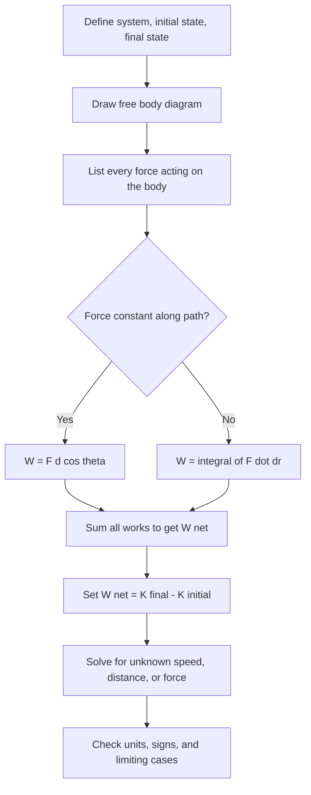

## Work and the Work-Energy Theorem


**Work** is the energy transferred to or from a body by a force acting through a displacement. The **work-energy theorem** states that the net work done on a particle equals the change in its kinetic energy. Together they provide an alternative to direct application of Newton's second law: instead of tracking vectors through time, one tracks a scalar quantity through space. This makes many problems (variable forces, curved paths, motion under springs or gravity) far easier, and it leads directly to the concepts of potential energy, conservation of mechanical energy, and power.

### Foundational Concepts

#### Definition of Work for a Constant Force

For a constant force $\vec{F}$ acting on a particle that undergoes a displacement $\vec{d}$:

$$W = \vec{F}\cdot\vec{d} = Fd\cos\theta$$

where $\theta$ is the angle between $\vec{F}$ and $\vec{d}$.

- $W$ is a **scalar** and can be positive, negative, or zero.
- The SI unit is the **joule**: $1\ \text{J} = 1\ \text{N}\cdot\text{m} = 1\ \text{kg}\cdot\text{m}^2/\text{s}^2$.
- Only the component of force **along the displacement** does work.

| Angle $\theta$ | $\cos\theta$ | Work | Interpretation |
| --- | --- | --- | --- |
| $0^\circ$ | $+1$ | $W = Fd$ | Force fully along motion; energy added to the body |
| $0^\circ < \theta < 90^\circ$ | $> 0$ | $W > 0$ | Force partly along motion |
| $90^\circ$ | $0$ | $W = 0$ | Force perpendicular to motion (normal force on a horizontal surface, centripetal force) |
| $90^\circ < \theta < 180^\circ$ | $< 0$ | $W < 0$ | Force partly opposes motion |
| $180^\circ$ | $-1$ | $W = -Fd$ | Force fully opposes motion (kinetic friction on a sliding body) |

#### Work by a Variable Force: Line Integral

For a force that varies along a path $C$, the work is the line integral:

$$W = \int_C \vec{F}\cdot d\vec{r}$$

In Cartesian components:

$$W = \int\left(F_x\,dx + F_y\,dy + F_z\,dz\right)$$

For one-dimensional motion along $x$ from $x_1$ to $x_2$:

$$W = \int_{x_1}^{x_2}F_x(x)\,dx$$

Geometrically, this is the **area under the $F_x$ vs. $x$ curve**, with area below the axis counted negative.

#### Work by Several Forces

Work is additive. The **net work** is:

$$W_{\text{net}} = \sum_i W_i = \int\vec{F}_{\text{net}}\cdot d\vec{r}$$

Because the dot product distributes over vector addition, computing the work of each force separately and summing gives the same result as computing the work of the net force.

#### Kinetic Energy

The **kinetic energy** of a particle of mass $m$ and speed $v$ is:

$$K = \tfrac{1}{2}mv^2$$

It is a scalar, always non-negative, and depends on the reference frame through $v$. In terms of momentum $p = mv$:

$$K = \frac{p^2}{2m}$$

### The Work-Energy Theorem

#### Statement

The net work done on a particle equals the change in its kinetic energy:

$$W_{\text{net}} = \Delta K = K_f - K_i = \tfrac{1}{2}mv_f^2 - \tfrac{1}{2}mv_i^2$$

#### Derivation (One Dimension)

Start from Newton's second law and apply the chain rule, $\dfrac{dv}{dt} = \dfrac{dv}{dx}\dfrac{dx}{dt} = v\dfrac{dv}{dx}$:

$$F_{\text{net}} = m\frac{dv}{dt} = mv\frac{dv}{dx}$$

Multiply both sides by $dx$ and integrate:

$$\int_{x_1}^{x_2}F_{\text{net}}\,dx = \int_{v_1}^{v_2}mv\,dv = \tfrac{1}{2}mv_2^2 - \tfrac{1}{2}mv_1^2$$

#### Derivation (Three Dimensions)

$$W_{\text{net}} = \int\vec{F}_{\text{net}}\cdot d\vec{r} = \int m\frac{d\vec{v}}{dt}\cdot\vec{v}\,dt = \int m\,\vec{v}\cdot d\vec{v} = \int d\!\left(\tfrac{1}{2}mv^2\right) = \Delta K$$

using $\vec{v}\cdot d\vec{v} = \tfrac{1}{2}\,d(v^2)$. The result holds for any path and any force, including nonconservative ones.

#### Key Features of the Theorem

- It follows from Newton's second law, and it is not an independent physical principle, but it is often the most efficient route to a solution.
- It requires only the **initial and final** speeds and the work along the path, so details of the intermediate motion are not needed.
- It applies in **inertial frames**. In a non-inertial frame, the work of fictitious forces must be included.
- It applies to a **particle** (or to the center-of-mass translational motion of an extended body). For systems with internal structure and internal forces, the total energy accounting must include internal energy changes and the work of internal forces.
- Forces perpendicular to the velocity (such as the magnetic force or the normal force on a frictionless track) do no work and cannot change kinetic energy.

#### Procedure for Applying the Theorem

1. Choose the system (a particle or effectively point-like body) and the initial and final states.
2. Identify all forces acting on it, using a free body diagram.
3. Compute the work of each force along the actual path, with attention to sign.
4. Sum the works to get $W_{\text{net}}$.
5. Set $W_{\text{net}} = \tfrac{1}{2}mv_f^2 - \tfrac{1}{2}mv_i^2$ and solve for the unknown.
6. Check units, signs, and limiting cases.

#### Diagram: Work-Energy Workflow



### Work Done by Common Forces

#### Gravity (Near Earth's Surface)

For a body of mass $m$ moving from height $y_i$ to $y_f$ (with $y$ upward), the weight $\vec{F}_g = -mg\,\hat{y}$ does work:

$$W_g = -mg\,(y_f - y_i) = -mg\,\Delta y$$

The result depends only on the vertical displacement, not on the path taken. Gravity does negative work when the body rises and positive work when it falls.

#### Universal Gravitation

Moving from radial distance $r_i$ to $r_f$ from a point mass $M$:

$$W_g = \int_{r_i}^{r_f}\left(-\frac{GMm}{r^2}\right)dr = GMm\left(\frac{1}{r_f} - \frac{1}{r_i}\right)$$

This is negative when $r_f > r_i$ (moving away).

#### Spring Force (Hooke's Law)

The restoring force is $F_x = -kx$, where $x$ is the displacement from the equilibrium (relaxed) position. The work done **by the spring** as the displacement changes from $x_i$ to $x_f$ is:

$$W_s = \int_{x_i}^{x_f}(-kx)\,dx = \tfrac{1}{2}kx_i^2 - \tfrac{1}{2}kx_f^2$$

The work done **by an external agent** slowly stretching the spring from rest at $x = 0$ to $x$ is $+\tfrac{1}{2}kx^2$.

#### Kinetic Friction

For a body sliding a path length $s$ (total distance, not net displacement), with constant kinetic friction magnitude $f_k = \mu_kN$ opposing the motion:

$$W_f = -f_k\,s = -\mu_kN\,s$$

This depends on the **path length**, not just the endpoints. It is a signature of a nonconservative force.

#### Normal Force and Tension

- The normal force on a body sliding over a **stationary** surface is perpendicular to the displacement, so it does zero work.
- Tension in a string attached to a swinging pendulum bob is perpendicular to the velocity, so it does zero work on the bob.
- Tension can do work on a body when the point of attachment moves or the string is pulled along the displacement.

#### Static Friction

Static friction on a body whose contact point does not slip relative to a stationary surface does no work on that surface. It can, however, do positive work on a body when the surface itself moves (for example, friction from a conveyor belt accelerating a box, or from the ground on a car's driving wheels when viewed from the ground frame, where the contact point is instantaneously at rest and the work transferred to the vehicle's translational energy comes from the engine via internal forces).

[Inference] For a car, a simple treatment says static friction from the road accelerates the car as a whole, but the energy comes from the engine's chemical energy, and the friction force at the contact point does no work in the ground frame because the contact point has zero velocity.

#### Drag

For quadratic drag $F_d = \tfrac{1}{2}\rho C_dAv^2$, the work over a path is negative and depends on the path taken:

$$W_d = -\int F_d\,ds$$

#### Magnetic Force

$$\vec{F} = q\vec{v}\times\vec{B} \perp \vec{v}$$

so magnetic forces do no work and cannot change the kinetic energy of a charged particle.

### Power

#### Definitions

The rate at which work is done is the **power**.

Average power:

$$P_{\text{avg}} = \frac{W}{\Delta t}$$

Instantaneous power:

$$P = \frac{dW}{dt} = \vec{F}\cdot\vec{v}$$

The SI unit is the **watt**: $1\ \text{W} = 1\ \text{J/s}$. Another common unit is the horsepower: $1\ \text{hp}\approx 746\ \text{W}$. The **kilowatt-hour** is a unit of energy: $1\ \text{kWh} = 3.6\times10^{6}\ \text{J}$.

#### Power and Kinetic Energy

$$\frac{dK}{dt} = \vec{F}_{\text{net}}\cdot\vec{v} = P_{\text{net}}$$

This is the differential form of the work-energy theorem.

#### Power at Constant Speed

A vehicle moving at constant velocity against a resistive force $F_r$ requires engine power $P = F_rv$. For quadratic drag, $P\propto v^3$.

### Worked Examples

#### Example 1: Constant Force on a Sliding Block

A $5.0\ \text{kg}$ block on a frictionless surface is pulled by a $20\ \text{N}$ force at $30^\circ$ above the horizontal over a distance of $4.0\ \text{m}$, starting from rest. Find its final speed.

Work by the pulling force:

$$W = Fd\cos\theta = 20(4.0)(0.866) \approx 69.3\ \text{J}$$

Weight and normal force do zero work (perpendicular to displacement). By the work-energy theorem:

$$69.3 = \tfrac{1}{2}(5.0)v_f^2 \;\Rightarrow\; v_f = \sqrt{27.7}$$

**Output**: $v_f \approx 5.27\ \text{m/s}$.

#### Example 2: Block on a Rough Incline

A $2.0\ \text{kg}$ block slides from rest down a $37^\circ$ incline for $3.0\ \text{m}$ along the slope, with $\mu_k = 0.25$. Find the speed at the bottom.

Work by gravity (component along the slope times distance):

$$W_g = mg\sin\theta\,d = 2.0(9.81)(0.602)(3.0)\approx 35.4\ \text{J}$$

Work by kinetic friction (with $N = mg\cos\theta$):

$$W_f = -\mu_kmg\cos\theta\,d = -0.25(2.0)(9.81)(0.799)(3.0)\approx -11.8\ \text{J}$$

Normal force: $W_N = 0$.

$$W_{\text{net}} = 35.4 - 11.8 = 23.6\ \text{J} = \tfrac{1}{2}(2.0)v^2$$

**Output**: $v = \sqrt{23.6}\approx 4.86\ \text{m/s}$.

#### Example 3: Compressing a Spring

A $0.50\ \text{kg}$ block moving at $6.0\ \text{m/s}$ on a frictionless surface hits a spring with $k = 200\ \text{N/m}$. Find the maximum compression.

At maximum compression, the block is momentarily at rest. The spring does work $-\tfrac{1}{2}kx_{\max}^2$ on the block:

$$-\tfrac{1}{2}kx_{\max}^2 = 0 - \tfrac{1}{2}mv_i^2 \;\Rightarrow\; x_{\max} = v_i\sqrt{\frac{m}{k}}$$

**Output**: $x_{\max} = 6.0\sqrt{0.50/200} = 6.0(0.0500) = 0.30\ \text{m}$.

#### Example 4: Variable Force from a Given Function

A particle of mass $m = 2.0\ \text{kg}$ moves along the $x$-axis under the force $F(x) = (6x - 3x^2)\ \text{N}$ ($x$ in meters). It starts at $x = 0$ with speed $v_i = 1.0\ \text{m/s}$. Find the speed at $x = 3.0\ \text{m}$.

$$W = \int_0^{3}(6x - 3x^2)\,dx = \left[3x^2 - x^3\right]_0^3 = 27 - 27 = 0$$

**Output**: $W = 0$, so $\Delta K = 0$ and $v_f = v_i = 1.0\ \text{m/s}$. The force is positive for $0 < x < 2$ (adding energy) and negative for $x > 2$ (removing exactly that much energy by $x = 3$).

#### Example 5: Raising a Load with Constant Speed

A worker lifts a $15\ \text{kg}$ box vertically by $1.2\ \text{m}$ at constant speed. Find the work done by the worker and by gravity, and the net work.

At constant speed, $F_{\text{worker}} = mg$:

$$W_{\text{worker}} = mg\,h = 15(9.81)(1.2)\approx 176.6\ \text{J}$$


$$W_g = -mg\,h\approx -176.6\ \text{J}$$

**Output**: $W_{\text{net}} = 0$, consistent with $\Delta K = 0$. The worker's work goes into raising the box's gravitational potential energy, an accounting introduced in the study of conservative forces.

#### Example 6: Stopping Distance of a Car

A $1200\ \text{kg}$ car traveling at $25\ \text{m/s}$ brakes with all wheels locked and $\mu_k = 0.70$ on a level road. Find the stopping distance.

$$W_f = -\mu_kmg\,d = 0 - \tfrac{1}{2}mv_i^2 \;\Rightarrow\; d = \frac{v_i^2}{2\mu_kg}$$

**Output**: $d = \dfrac{625}{2(0.70)(9.81)}\approx 45.5\ \text{m}$. The result is independent of the car's mass, and the distance scales with $v_i^2$, so doubling the speed quadruples the stopping distance.

#### Example 7: Power Required to Climb a Hill

A $75\ \text{kg}$ cyclist (with bike, total $90\ \text{kg}$) climbs a $5.0^\circ$ slope at a constant $6.0\ \text{m/s}$. Ignore drag and rolling resistance. Find the required power.

At constant speed, the propulsive force balances the gravity component along the slope:

$$F = mg\sin\theta = 90(9.81)(0.0872)\approx 77.0\ \text{N}$$


$$P = Fv = 77.0(6.0)\approx 462\ \text{W}$$

**Output**: $P\approx 460\ \text{W}$ [Inference: real cycling also requires power against air drag and rolling resistance, so the actual figure is higher].

#### Example 8: Conveyor Belt and Kinetic Friction

A box of mass $m = 4.0\ \text{kg}$ is placed at rest on a horizontal conveyor belt moving at $v_b = 2.0\ \text{m/s}$, with $\mu_k = 0.30$. Find the work done by friction on the box while it accelerates to belt speed, and the energy dissipated as heat.

On the box (ground frame):

$$W_{f,\text{box}} = \Delta K = \tfrac{1}{2}mv_b^2 = \tfrac{1}{2}(4.0)(4.0) = 8.0\ \text{J}$$

The time to reach belt speed is $t = v_b/(\mu_kg) = 2.0/(0.30\times9.81)\approx 0.680\ \text{s}$. During that time the box moves $d_{\text{box}} = \tfrac{1}{2}v_bt\approx 0.680\ \text{m}$ and the belt moves $d_{\text{belt}} = v_bt\approx 1.36\ \text{m}$. The relative sliding distance is:

$$d_{\text{rel}} = d_{\text{belt}} - d_{\text{box}} = 0.680\ \text{m}$$

**Output**: Heat generated $Q = \mu_kmg\,d_{\text{rel}} = 0.30(4.0)(9.81)(0.680)\approx 8.0\ \text{J}$, equal to the box's kinetic energy gain. The motor supplies $16\ \text{J}$ in total, half going to kinetic energy and half to heat.

### Extension: Work-Energy Theorem with Conservative Forces

For a conservative force, the work depends only on endpoints and can be written as the negative change of a **potential energy** function:

$$W_{\text{cons}} = -\Delta U, \qquad \vec{F} = -\nabla U$$

The work-energy theorem then separates conservative and nonconservative contributions:

$$W_{\text{nc}} + W_{\text{cons}} = \Delta K \;\Rightarrow\; W_{\text{nc}} = \Delta K + \Delta U = \Delta E_{\text{mech}}$$

where $E_{\text{mech}} = K + U$. When $W_{\text{nc}} = 0$, mechanical energy is conserved.

| Force | Conservative? | Potential energy $U$ |
| --- | --- | --- |
| Uniform gravity | Yes | $U = mgy$ |
| Spring | Yes | $U = \tfrac{1}{2}kx^2$ |
| Universal gravitation | Yes | $U = -GMm/r$ |
| Coulomb (electrostatic) | Yes | $U = kq_1q_2/r$ |
| Kinetic friction | No | Not definable |
| Drag | No | Not definable |
| Applied (human) forces | Generally no | Not applicable |

A force is conservative if and only if the work around every closed path is zero, equivalently if $\nabla\times\vec{F} = 0$ on a simply connected region.

### Numerical Example

The code below evaluates the work done by a nonuniform force along a curved path using numerical line integration, and verifies the work-energy theorem by integrating the equations of motion.

```python
import numpy as np

# Particle in 2D under a spatially varying force (non-conservative because of the curl term)
m = 1.0

def force(x, y):
    # F = (-k x + c y, -k y - c x) + drag-free; last term produces nonzero curl
    k, c = 4.0, 1.5
    return np.array([-k * x + c * y, -k * y - c * x])

def integrate(x0, v0, dt, n):
    x = np.array(x0, dtype=float)
    v = np.array(v0, dtype=float)
    W = 0.0
    for _ in range(n):
        # velocity Verlet with position-dependent force
        a = force(*x) / m
        v_half = v + 0.5 * dt * a
        x_new = x + dt * v_half
        a_new = force(*x_new) / m
        v_new = v_half + 0.5 * dt * a_new
        # work by trapezoid on F . dr
        F_mid = 0.5 * (force(*x) + force(*x_new))
        W += np.dot(F_mid, x_new - x)
        x, v = x_new, v_new
    return x, v, W

x0, v0 = [1.0, 0.0], [0.0, 1.0]
x, v, W = integrate(x0, v0, dt=1e-4, n=20000)     # 2 s

K_i = 0.5 * m * np.dot(v0, v0)
K_f = 0.5 * m * np.dot(v, v)
print(f"Work from line integral: {W:.5f} J")
print(f"Kinetic energy change:   {K_f - K_i:.5f} J")
print(f"Relative difference:     {abs(W - (K_f - K_i)) / abs(K_f - K_i):.2e}")
```

**Output** (approximate; exact values depend on the integrator, step size, and parameters, and the difference should be small):



```
Work from line integral: ~-0.6 J   (varies with parameters)
Kinetic energy change:   ~-0.6 J
Relative difference:     ~1e-6 or smaller
```

The agreement between $\int\vec{F}\cdot d\vec{r}$ and $\Delta K$ illustrates the theorem, and it holds here even though the force field has a nonzero curl and therefore no potential energy.

### Diagram: Work as Area Under a Force Curve (svg_diagram)

<svg xmlns="http://www.w3.org/2000/svg" viewBox="0 0 640 380" width="640" height="380" font-family="sans-serif" font-size="13">
<text x="320" y="24" text-anchor="middle" font-size="15" font-weight="bold">Work as Area Under F vs. x (svg_diagram)</text>
<line x1="70" y1="200" x2="590" y2="200" stroke="#333" stroke-width="2" />
<line x1="70" y1="50" x2="70" y2="340" stroke="#333" stroke-width="2" />
<text x="330" y="365" text-anchor="middle">Position x</text>
<text x="24" y="195" transform="rotate(-90 24 195)" text-anchor="middle">Force F</text>
<polygon points="130,200 130,140 190,105 250,90 310,100 370,140 400,200" fill="#a9d6b0" stroke="none" />
<polygon points="400,200 430,240 470,265 510,270 530,250 530,200" fill="#f0b3aa" stroke="none" />
<path d="M 130,140 C 170,100 230,80 310,100 S 390,180 400,200 S 470,275 510,270 S 530,240 530,200" fill="none" stroke="#2c6fbb" stroke-width="3" />
<line x1="130" y1="196" x2="130" y2="204" stroke="#333" stroke-width="2" />
<line x1="530" y1="196" x2="530" y2="204" stroke="#333" stroke-width="2" />
<text x="125" y="222">x1</text>
<text x="525" y="222">x2</text>
<text x="235" y="160" fill="#1a7f37">Area above axis:</text>
<text x="235" y="177" fill="#1a7f37">positive work</text>
<text x="410" y="292" fill="#c0392b">Area below axis:</text>
<text x="410" y="309" fill="#c0392b">negative work</text>
<text x="320" y="335" text-anchor="middle" fill="#333">W = integral of F dx from x1 to x2 = net signed area</text>
</svg>

### Diagram: Spring Force and Work (svg_diagram)

<svg xmlns="http://www.w3.org/2000/svg" viewBox="0 0 640 330" width="640" height="330" font-family="sans-serif" font-size="13">
<text x="320" y="24" text-anchor="middle" font-size="15" font-weight="bold">Work Done by a Spring, F = -kx (svg_diagram)</text>
<line x1="70" y1="170" x2="580" y2="170" stroke="#333" stroke-width="2" />
<line x1="320" y1="50" x2="320" y2="290" stroke="#333" stroke-width="2" />
<text x="560" y="190">x</text>
<text x="330" y="60">F</text>
<line x1="120" y1="60" x2="520" y2="280" stroke="#2c6fbb" stroke-width="3" />
<polygon points="320,170 480,170 480,258" fill="#a9d6b0" fill-opacity="0.7" stroke="#1a7f37" />
<line x1="480" y1="165" x2="480" y2="175" stroke="#333" stroke-width="2" />
<text x="474" y="150">x</text>
<text x="380" y="215" fill="#1a7f37">area = (1/2) k x^2</text>
<text x="140" y="90" fill="#2c6fbb">F = -kx</text>
<text x="320" y="315" text-anchor="middle" fill="#333">Work by external agent stretching from 0 to x: +(1/2) k x^2; work by the spring: -(1/2) k x^2</text>
</svg>

### Common Misconceptions

- **"Work is force times distance, always"**: only the force component along the displacement counts, so $W = Fd\cos\theta$.
- **"Carrying a heavy box horizontally at constant speed requires work against gravity"**: the force supporting the box is vertical and the displacement is horizontal, so the person exerts zero work on the box in the physics sense, although the muscles consume metabolic energy.
- **"Holding a weight stationary requires work"**: no displacement means no mechanical work on the weight, although muscles expend energy internally.
- **"The work-energy theorem applies only to conservative forces"**: it holds for any force. Conservative forces just allow the bookkeeping to be shifted to a potential energy function.
- **"Kinetic friction always removes energy from the body only"**: friction converts mechanical energy into thermal energy of both surfaces, and in the conveyor-belt example it does positive work on the box in the ground frame.
- **"Work is a property of the body"**: work is a process quantity, the energy transferred by a force over a path, not a state variable.
- **"Kinetic energy is conserved in collisions"**: only in elastic collisions. Work-energy applies to each body during the collision, but internal deformation and heat can absorb kinetic energy.
- **"Negative work means the force is bad or wasted"**: it means the force removes energy from the body, such as brakes stopping a car.
- **"Work depends on the frame only through the force"**: both the displacement and the kinetic energy depend on the observer's frame, so the numerical value of the work and $\Delta K$ change between inertial frames, though the theorem holds in each.
- **Using the wrong distance for friction**: the friction work uses total path length, not net displacement.

### Limitations and Domain of Validity

- The particle form of the work-energy theorem tracks only the center-of-mass translational kinetic energy. For deformable bodies or systems with internal degrees of freedom, part of the work goes into internal energy (heat, elastic deformation), and a full energy accounting requires thermodynamics.
- The theorem requires an inertial frame. In a rotating or accelerating frame, the work of fictitious forces must be added.
- The expression $K = \tfrac{1}{2}mv^2$ is valid at non-relativistic speeds. Relativistically, $K = (\gamma - 1)mc^2$, and the work-energy theorem $W_{\text{net}} = \Delta K$ still holds with this definition.
- For rotating rigid bodies, the rotational form $W = \int\tau\,d\theta = \Delta\left(\tfrac{1}{2}I\omega^2\right)$ applies, and the total kinetic energy includes both translational and rotational parts.
- For point-of-application subtleties (for example, a rolling wheel or a person pushing off the ground), the "work" done by a force on an extended body depends on the displacement of the point of application, not the center of mass, so the center-of-mass work-energy relation should be used with care.
- Values such as friction coefficients are empirical and approximate, and results based on them are estimates.

### Key Points

- Work is $W = \int\vec{F}\cdot d\vec{r}$, a scalar measuring energy transferred by a force over a displacement, in joules.
- For a constant force, $W = Fd\cos\theta$, and only the component of force along the displacement does work.
- The work-energy theorem states $W_{\text{net}} = \Delta K = \tfrac{1}{2}mv_f^2 - \tfrac{1}{2}mv_i^2$, and it follows from Newton's second law for any force.
- Perpendicular forces (normal force on a stationary surface, centripetal force, magnetic force) do no work.
- Spring work is $\tfrac{1}{2}k(x_i^2 - x_f^2)$, gravity work near Earth is $-mg\Delta y$, and kinetic friction work is $-\mu_kNs$ (path-dependent).
- Power is $P = dW/dt = \vec{F}\cdot\vec{v}$, and it equals $dK/dt$ for the net force.
- Conservative forces allow $W = -\Delta U$ and lead to conservation of mechanical energy, and nonconservative work equals the change in mechanical energy.

### Conclusion

The work-energy theorem turns a dynamics problem, which involves vectors and time, into a scalar bookkeeping problem tied only to the initial and final states and to the work done along the path. Its strength is that it bypasses accelerations and trajectories, which makes it especially effective for variable forces, curved paths, and situations where only speeds are needed. Careful sign conventions, correct identification of which forces do work, and attention to the frame and to the system boundary are the essential skills. The same ideas extend naturally to potential energy, conservation of mechanical energy, power, rotational work, and the general principle of conservation of energy.

### Next Steps

**Related Topics**

- Conservative forces, potential energy functions, and force as the negative gradient of potential
- Conservation of mechanical energy and energy diagrams (turning points, stable and unstable equilibrium)
- Nonconservative forces and energy dissipation
- Power, efficiency, and energy transfer in machines
- Momentum, impulse, and the impulse-momentum theorem
- Collisions: elastic and inelastic, and the interplay between energy and momentum conservation
- Rotational work, torque, and rotational kinetic energy
- Work and energy in special relativity ($K = (\gamma - 1)mc^2$)
- Thermodynamic work and the first law of thermodynamics
- Lagrangian and Hamiltonian formulations of mechanics
- Numerical line integration and energy-conserving integrators