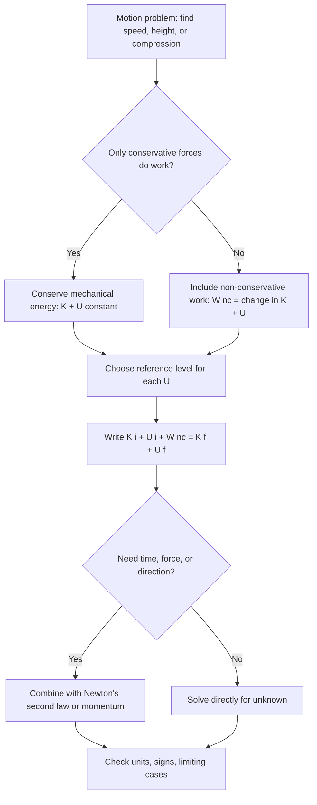

## Kinetic and Potential Energy


**Kinetic energy** is the energy a body possesses because of its motion, and **potential energy** is energy stored in a system because of the configuration of its parts, such as their separation in a gravitational field or the deformation of a spring. Together they make up **mechanical energy**, $E_{\text{mech}} = K + U$. When only conservative forces do work, mechanical energy is conserved, which allows the motion of a system to be determined from its energy alone, without solving for forces at every instant. This framework connects the work-energy theorem to conservation laws, equilibrium and stability analysis, orbital mechanics, oscillations, and the more general formulations of Lagrangian and Hamiltonian mechanics.

### Foundational Concepts

#### Energy as a State Function

Kinetic and potential energy are **state quantities**: they depend on the current state of the system (velocities and configuration), not on how the system arrived there. Work, by contrast, is a process quantity. The link between them is the work-energy theorem:

$$W_{\text{net}} = \Delta K$$

and, for conservative forces, the definition of potential energy:

$$W_{\text{cons}} = -\Delta U$$

#### Units and Dimensions

Energy is measured in **joules** (J), with dimensions $\text{M}\,\text{L}^2\,\text{T}^{-2}$. Other common units:

| Unit | Symbol | Value in joules |
| --- | --- | --- |
| Electronvolt | eV | $1.602\times10^{-19}\ \text{J}$ |
| Calorie (thermochemical) | cal | $4.184\ \text{J}$ |
| Kilowatt-hour | kWh | $3.6\times10^{6}\ \text{J}$ |
| Erg | erg | $10^{-7}\ \text{J}$ |
| Foot-pound | ft·lb | $1.356\ \text{J}$ |

#### Scale and Frame Dependence

- Kinetic energy depends on the inertial frame, because it depends on $v$. A passenger has zero kinetic energy relative to the train and large kinetic energy relative to the ground.
- Potential energy is defined only up to an **additive constant**, since only differences $\Delta U$ have physical meaning. The choice of reference (zero) level is a convention that must be applied consistently within one problem.

### Kinetic Energy

#### Translational Kinetic Energy

For a particle of mass $m$ and speed $v$:

$$K = \tfrac{1}{2}mv^2 = \frac{p^2}{2m}$$

Properties:

- $K \ge 0$ always, and $K = 0$ only if the particle is at rest in the chosen frame.
- $K$ is a scalar and is proportional to $v^2$, so doubling the speed quadruples the kinetic energy.
- For a system of particles, $K = \sum_i\tfrac{1}{2}m_iv_i^2$.

#### König's Theorem (Center-of-Mass Decomposition)

The total kinetic energy of a system splits into the motion of the center of mass and the motion relative to it:

$$K_{\text{total}} = \tfrac{1}{2}Mv_{\text{cm}}^2 + K_{\text{rel}}, \qquad K_{\text{rel}} = \sum_i\tfrac{1}{2}m_i|\vec{v}_i - \vec{v}_{\text{cm}}|^2$$

where $M = \sum m_i$. Only the relative part can be converted into internal energy in an inelastic collision, and the center-of-mass part is fixed by momentum conservation.

#### Rotational Kinetic Energy

For a rigid body rotating with angular velocity $\omega$ about a fixed axis with moment of inertia $I$:

$$K_{\text{rot}} = \tfrac{1}{2}I\omega^2$$

For a body that both translates and rotates (for example, a rolling wheel), applying König's theorem:

$$K = \tfrac{1}{2}Mv_{\text{cm}}^2 + \tfrac{1}{2}I_{\text{cm}}\omega^2$$

For rolling without slipping, $v_{\text{cm}} = \omega R$, so:

$$K = \tfrac{1}{2}\left(M + \frac{I_{\text{cm}}}{R^2}\right)v_{\text{cm}}^2$$

| Shape (rolling without slipping) | $I_{\text{cm}}$ | Fraction of $K$ that is rotational |
| --- | --- | --- |
| Solid sphere | $\tfrac{2}{5}MR^2$ | $2/7\approx 0.286$ |
| Solid cylinder or disk | $\tfrac{1}{2}MR^2$ | $1/3\approx 0.333$ |
| Hollow sphere (thin shell) | $\tfrac{2}{3}MR^2$ | $2/5 = 0.400$ |
| Hoop or thin cylindrical shell | $MR^2$ | $1/2 = 0.500$ |

#### Relativistic Kinetic Energy

At speeds comparable to $c$, the correct expression is:

$$K = (\gamma - 1)mc^2, \qquad \gamma = \frac{1}{\sqrt{1 - v^2/c^2}}$$

For $v\ll c$, a Taylor expansion gives $K\approx\tfrac{1}{2}mv^2 + \tfrac{3}{8}mv^4/c^2 + \cdots$, recovering the Newtonian result. The Newtonian formula is accurate to better than about $1\%$ for $v\lesssim 0.1c$ [Unverified for specific tolerance requirements; the leading correction is $\tfrac{3}{4}v^2/c^2$ relative, about $0.75\%$ at $v = 0.1c$].

### Potential Energy

#### Definition

For a conservative force field $\vec{F}(\vec{r})$, the potential energy relative to a reference point $\vec{r}_0$ is:

$$U(\vec{r}) = -\int_{\vec{r}_0}^{\vec{r}}\vec{F}\cdot d\vec{r}'$$

and the force is recovered as the negative gradient:

$$\vec{F} = -\nabla U = -\left(\frac{\partial U}{\partial x}\hat{x} + \frac{\partial U}{\partial y}\hat{y} + \frac{\partial U}{\partial z}\hat{z}\right)$$

In one dimension, $F_x = -dU/dx$: the force points in the direction of decreasing $U$.

#### Conservative vs. Nonconservative Forces

A force is **conservative** if any of the following equivalent conditions holds:

- The work done between two points is independent of the path.
- The work done around any closed loop is zero: $\oint\vec{F}\cdot d\vec{r} = 0$.
- On a simply connected region, $\nabla\times\vec{F} = 0$.
- The force can be written as $-\nabla U$ for some scalar function $U$.

| Force | Conservative? | Reason |
| --- | --- | --- |
| Gravity (uniform or inverse-square) | Yes | Path-independent work |
| Ideal spring | Yes | Depends on endpoints only |
| Electrostatic (Coulomb) | Yes | Central force with $\nabla\times\vec{F} = 0$ |
| Kinetic friction | No | Work scales with path length |
| Air drag | No | Always opposes velocity |
| Time-varying or velocity-dependent applied forces | Generally no | No potential exists |
| Magnetic force | Does no work, but is velocity dependent | Not derivable from a scalar $U(\vec{r})$ |

#### Gravitational Potential Energy (Near Earth's Surface)

For a uniform field $\vec{g} = -g\hat{y}$ with $y$ measured upward:

$$U_g = mgy$$

Only differences matter: $\Delta U_g = mg\,\Delta y$. Any reference height may be chosen as $y = 0$. The approximation requires the height change to be small compared with Earth's radius ($\Delta y\ll R_E$).

#### Gravitational Potential Energy (General, Inverse-Square)

For two point masses $m_1$ and $m_2$ separated by distance $r$:

$$U(r) = -\frac{Gm_1m_2}{r}$$

with the zero of energy at infinite separation. The energy is negative for bound configurations, and the force is $F = -dU/dr = -Gm_1m_2/r^2$ (attractive).

Consistency with the near-surface formula: for a height $h$ above Earth's surface,

$$U(R_E + h) - U(R_E) = GMm\left(\frac{1}{R_E} - \frac{1}{R_E + h}\right)\approx \frac{GMm}{R_E^2}h = mgh \quad (h\ll R_E)$$

#### Elastic (Spring) Potential Energy

For an ideal spring obeying Hooke's law $F = -kx$, with $x$ measured from the relaxed length:

$$U_s = \tfrac{1}{2}kx^2$$

This is symmetric about $x = 0$ and applies to both stretching and compression. The same expression describes torsional springs with $U = \tfrac{1}{2}\kappa\theta^2$.

#### Electrostatic Potential Energy

For two point charges $q_1$ and $q_2$ separated by $r$:

$$U(r) = \frac{1}{4\pi\varepsilon_0}\frac{q_1q_2}{r}$$

with zero at infinity. It is positive for like charges and negative for opposite charges.

#### Other Potentials

| System | Potential energy |
| --- | --- |
| Uniform electric field $E$ (charge $q$) | $U = -qEx$ |
| Simple pendulum (small angles) | $U\approx\tfrac{1}{2}mgL\theta^2$ |
| Lennard-Jones (molecular interaction) | $U(r) = 4\varepsilon\left[(\sigma/r)^{12} - (\sigma/r)^{6}\right]$ |
| Isotropic 3D harmonic oscillator | $U = \tfrac{1}{2}kr^2$ |
| Centrifugal (rotating frame) | $U_{\text{cf}} = -\tfrac{1}{2}m\Omega^2r_\perp^2$ |

#### Potential Energy Is a Property of the System

Potential energy belongs to the **interacting system**, not to a single body. "The gravitational potential energy of the ball" is shorthand for the energy of the ball–Earth system. When the Earth is treated as fixed and infinitely massive, this energy is assigned to the ball for convenience.

### Conservation of Mechanical Energy

#### Statement

If only conservative forces do work (or nonconservative forces do zero net work), the total mechanical energy is constant:

$$E = K + U = \text{constant}, \qquad \Delta K + \Delta U = 0$$

#### With Nonconservative Forces

The general work-energy relation is:

$$W_{\text{nc}} = \Delta K + \Delta U = \Delta E_{\text{mech}}$$

- $W_{\text{nc}} < 0$ (friction, drag) removes mechanical energy, which appears as thermal energy of the surfaces.
- $W_{\text{nc}} > 0$ (motor, muscle, applied push) adds mechanical energy.

For sliding friction, the dissipated energy is $Q = f_k\,d_{\text{rel}}$ where $d_{\text{rel}}$ is the relative sliding distance between the surfaces.

#### Procedure for Energy Problems

1. Define the system and its initial and final states.
2. Choose the reference level for each potential energy.
3. Write $K_i + U_i + W_{\text{nc}} = K_f + U_f$.
4. Solve for the unknown speed, height, compression, or work.
5. Verify units, limiting cases, and sign of $W_{\text{nc}}$.

#### Diagram: Energy Method Selection



### Energy Diagrams and Equilibrium

#### Reading a Potential Energy Curve

For one-dimensional motion with total energy $E$:

$$K(x) = E - U(x) \ge 0$$

The particle can only be found where $U(x)\le E$. Points where $U(x) = E$ are **turning points**, where the speed is zero. The force at any point is the negative slope: $F_x = -dU/dx$.

#### Equilibrium Points

Equilibrium occurs where $dU/dx = 0$ (net force zero).

| Type | Condition | Behavior after a small displacement |
| --- | --- | --- |
| Stable | $d^2U/dx^2 > 0$ (local minimum) | Restoring force returns the particle; small oscillations |
| Unstable | $d^2U/dx^2 < 0$ (local maximum) | Particle accelerates away |
| Neutral | $dU/dx = 0$ over a region (flat) | No force; stays at new position |

#### Small Oscillations About a Stable Minimum

Expanding $U(x)$ about a minimum $x_0$:

$$U(x)\approx U(x_0) + \tfrac{1}{2}U''(x_0)(x - x_0)^2$$

so the motion is approximately simple harmonic with effective spring constant $k_{\text{eff}} = U''(x_0)$ and angular frequency:

$$\omega = \sqrt{\frac{U''(x_0)}{m}}$$

#### Bound vs. Unbound Motion

- If $E$ lies between the minimum of a potential well and its rim, the motion is **bounded** between two turning points.
- If $E$ exceeds all barrier heights, the particle escapes to infinity (unbounded).
- In quantum mechanics, particles can penetrate barriers classically forbidden (tunneling), a case outside Newtonian mechanics.

#### Escape Velocity

The minimum launch speed from radius $r$ to reach infinity with zero speed (ignoring drag and other bodies) follows from $E = 0$:

$$\tfrac{1}{2}mv_{\text{esc}}^2 - \frac{GMm}{r} = 0 \;\Rightarrow\; v_{\text{esc}} = \sqrt{\frac{2GM}{r}}$$

It is independent of the direction of launch and of the mass of the projectile, and it equals $\sqrt{2}$ times the circular orbital speed at the same radius.

#### Orbital Energy

For a circular orbit of radius $r$ around mass $M$, with $v^2 = GM/r$:

$$K = \frac{GMm}{2r}, \qquad U = -\frac{GMm}{r}, \qquad E = K + U = -\frac{GMm}{2r} = -K = \frac{U}{2}$$

This result is the **virial theorem** for an inverse-square force. Losing energy (for example, through atmospheric drag) makes $E$ more negative, which moves the satellite to a lower orbit where its speed is actually **higher**.

For an elliptical orbit with semi-major axis $a$, the total energy is $E = -GMm/(2a)$.

### Worked Examples

#### Example 1: Falling Object and Impact Speed

A $2.0\ \text{kg}$ ball is released from rest at height $h = 15\ \text{m}$. Ignoring drag, find its speed at the ground.

Take $y = 0$ at the ground: $U_i = mgh$, $K_i = 0$, $U_f = 0$.

$$mgh = \tfrac{1}{2}mv^2 \;\Rightarrow\; v = \sqrt{2gh}$$

**Output**: $v = \sqrt{2(9.81)(15)}\approx 17.2\ \text{m/s}$, independent of the mass.

#### Example 2: Roller Coaster Loop

A car starts from rest at height $h$ above the bottom of a frictionless track containing a vertical circular loop of radius $R$. Find the minimum $h$ so the car stays on the track at the top of the loop.

At the top (height $2R$), contact requires $N\ge 0$. With $N = 0$:

$$\frac{mv_{\text{top}}^2}{R} = mg \;\Rightarrow\; v_{\text{top}}^2 = gR$$

Energy conservation from the start to the top:

$$mgh = mg(2R) + \tfrac{1}{2}mv_{\text{top}}^2 = 2mgR + \tfrac{1}{2}mgR$$

**Output**: $h_{\min} = \tfrac{5}{2}R = 2.5R$.

#### Example 3: Block Launched by a Spring

A $0.40\ \text{kg}$ block compresses a spring ($k = 250\ \text{N/m}$) by $0.12\ \text{m}$ and is released on a frictionless horizontal surface. Find the launch speed, then find how far up a frictionless $30^\circ$ incline it travels.

Spring to kinetic energy:

$$\tfrac{1}{2}kx^2 = \tfrac{1}{2}mv^2 \;\Rightarrow\; v = x\sqrt{\frac{k}{m}} = 0.12\sqrt{625} = 3.0\ \text{m/s}$$

Kinetic energy to gravitational potential energy on the incline ($h = s\sin30^\circ$):

$$\tfrac{1}{2}mv^2 = mgs\sin30^\circ \;\Rightarrow\; s = \frac{v^2}{2g\sin30^\circ} = \frac{9.0}{9.81}$$

**Output**: $v = 3.0\ \text{m/s}$ and $s\approx 0.917\ \text{m}$ along the incline (height gain $\approx 0.459\ \text{m}$).

#### Example 4: Pendulum Speed and Tension at the Bottom

A pendulum bob of mass $m = 0.30\ \text{kg}$ on a string of length $L = 1.2\ \text{m}$ is released from rest at $60^\circ$ from the vertical. Find the speed and tension at the bottom.

The height drop is $L(1 - \cos60^\circ) = 0.60\ \text{m}$:

$$\tfrac{1}{2}mv^2 = mgL(1 - \cos\theta_0) \;\Rightarrow\; v = \sqrt{2gL(1 - \cos\theta_0)} = \sqrt{2(9.81)(0.60)}$$


$$T - mg = \frac{mv^2}{L} \;\Rightarrow\; T = mg + 2mg(1 - \cos\theta_0) = mg(3 - 2\cos\theta_0)$$

**Output**: $v\approx 3.43\ \text{m/s}$ and $T = 0.30(9.81)(3 - 1) = 5.89\ \text{N}$, which is twice the weight for $\theta_0 = 60^\circ$.

#### Example 5: Escape Velocity from Earth

Find the escape velocity from Earth's surface ($GM_E = 3.986\times10^{14}\ \text{m}^3/\text{s}^2$, $R_E = 6.371\times10^{6}\ \text{m}$).

$$v_{\text{esc}} = \sqrt{\frac{2GM_E}{R_E}} = \sqrt{\frac{2(3.986\times10^{14})}{6.371\times10^{6}}}$$

**Output**: $v_{\text{esc}}\approx 1.12\times10^{4}\ \text{m/s}\approx 11.2\ \text{km/s}$ (neglecting air resistance and Earth's rotation).

#### Example 6: Energy of a Satellite Changing Orbit

A $500\ \text{kg}$ satellite moves from a circular orbit of radius $r_1 = 7.0\times10^{6}\ \text{m}$ to $r_2 = 4.2\times10^{7}\ \text{m}$ (geostationary). Find the change in total energy, the kinetic energy change, and the potential energy change.

$$E = -\frac{GMm}{2r}$$


$$\Delta E = -\frac{GMm}{2}\left(\frac{1}{r_2} - \frac{1}{r_1}\right) = \frac{(3.986\times10^{14})(500)}{2}\left(\frac{1}{7.0\times10^{6}} - \frac{1}{4.2\times10^{7}}\right)$$

**Output**: $\Delta E\approx 9.97\times10^{7}\times(1.429\times10^{-7} - 2.38\times10^{-8})\times10^{7}\ldots$ Computing directly: $\tfrac{GMm}{2} = 9.965\times10^{16}\ \text{J}\cdot\text{m}$, and the bracket is $1.190\times10^{-7}\ \text{m}^{-1}$, so $\Delta E\approx 1.19\times10^{10}\ \text{J}$.

The kinetic energy **decreases** by $|\Delta K| = \Delta E\approx 1.19\times10^{10}\ \text{J}$ (since $K = -E$), and the potential energy **increases** by $\Delta U = 2\Delta E\approx 2.37\times10^{10}\ \text{J}$. The energy the launch system must supply between orbits is $\Delta E$, and the actual transfer (for example, a Hohmann transfer) requires two velocity changes.

#### Example 7: Block Sliding Down a Rough Incline into a Spring

A $3.0\ \text{kg}$ block slides from rest down a $2.0\ \text{m}$ (along the slope) incline of angle $30^\circ$ with $\mu_k = 0.20$ and then compresses a horizontal spring ($k = 800\ \text{N/m}$) on a frictionless section. Find the maximum compression.

Energy at the bottom of the incline, with friction work $W_f = -\mu_kmg\cos\theta\,d$:

$$K_{\text{bottom}} = mg\,d\sin\theta - \mu_kmg\cos\theta\,d = 3.0(9.81)(2.0)(0.5 - 0.20\times0.866)$$


$$K_{\text{bottom}} = 58.86\times0.3268\approx 19.2\ \text{J}$$

Then $\tfrac{1}{2}kx^2 = K_{\text{bottom}}$:

**Output**: $x = \sqrt{2(19.2)/800}\approx 0.219\ \text{m}$. Total mechanical energy lost to friction is $58.86\times0.1732\approx 10.2\ \text{J}$.

#### Example 8: Equilibrium and Small Oscillations from a Potential

A particle of mass $m = 0.50\ \text{kg}$ moves under the potential $U(x) = U_0\left[(x/a)^4 - 2(x/a)^2\right]$ with $U_0 = 4.0\ \text{J}$ and $a = 1.0\ \text{m}$. Find the equilibrium points, classify them, and find the small-oscillation frequency about the stable ones.

$$\frac{dU}{dx} = U_0\left[\frac{4x^3}{a^4} - \frac{4x}{a^2}\right] = 0 \;\Rightarrow\; x = 0,\ \pm a$$


$$\frac{d^2U}{dx^2} = U_0\left[\frac{12x^2}{a^4} - \frac{4}{a^2}\right]$$

At $x = 0$: $U'' = -4U_0/a^2 = -16\ \text{J/m}^2 < 0$, so it is **unstable**. At $x = \pm a$: $U'' = 8U_0/a^2 = 32\ \text{J/m}^2 > 0$, so they are **stable** minima with $U(\pm a) = -U_0 = -4.0\ \text{J}$.

**Output**: The small-oscillation angular frequency about $x = \pm a$ is $\omega = \sqrt{U''/m} = \sqrt{32/0.50} = 8.0\ \text{rad/s}$, giving a period $T = 2\pi/\omega\approx 0.785\ \text{s}$. The barrier at $x = 0$ has height $U_0 = 4.0\ \text{J}$ above the well bottoms, so a particle with total energy $E < 0$ stays confined to one well, while $E > 0$ lets it cross between wells.

### Numerical Simulation Example

The code below integrates the motion of a particle in the double-well potential from Example 8 with the velocity Verlet method, and monitors the total mechanical energy to demonstrate conservation and integrator quality.

```python
import numpy as np

m, U0, a = 0.50, 4.0, 1.0

def U(x):
    return U0 * ((x/a)**4 - 2*(x/a)**2)

def F(x):
    return -U0 * (4*x**3/a**4 - 4*x/a**2)      # F = -dU/dx

def simulate(x0, v0, dt, n):
    x, v = x0, v0
    a_now = F(x) / m
    E = np.empty(n + 1)
    xs = np.empty(n + 1)
    E[0] = 0.5*m*v**2 + U(x)
    xs[0] = x
    for i in range(1, n + 1):
        v_half = v + 0.5*dt*a_now
        x = x + dt*v_half
        a_now = F(x) / m
        v = v_half + 0.5*dt*a_now
        E[i] = 0.5*m*v**2 + U(x)
        xs[i] = x
    return xs, E

# Start near the right minimum with E < 0: confined oscillation
xs, E = simulate(x0=1.2, v0=0.0, dt=1e-3, n=20000)     # 20 s

drift = (E.max() - E.min()) / abs(E[0])
print(f"Initial energy:       {E[0]:.5f} J")
print(f"Energy range:         {E.min():.5f} to {E.max():.5f} J")
print(f"Relative fluctuation: {drift:.2e}")
print(f"x range:              {xs.min():.3f} to {xs.max():.3f} m (stays in one well: {xs.min() > 0})")
```

**Output** (approximate; exact values depend on step size, and behavior may vary with the integrator):



```
Initial energy:       -2.7648 J
Energy range:         about -2.7648 to -2.7647 J
Relative fluctuation: ~1e-5 or smaller
x range:              about 0.7 to 1.2 m (stays in one well: True)
```

With $E_i = U(1.2) = 4(2.0736 - 2.88) = -3.226\ \text{J}$ as computed from the potential, the printed value should match this formula. The important observations are that the total energy stays essentially constant, with only small oscillations from the integrator's discretization error (velocity Verlet is symplectic, so it does not accumulate secular drift for conservative systems), and that the particle remains confined to a single well because $E < 0$.

### Diagram: Potential Energy Curve with Turning Points (svg_diagram)

<svg xmlns="http://www.w3.org/2000/svg" viewBox="0 0 640 400" width="640" height="400" font-family="sans-serif" font-size="13">
<text x="320" y="24" text-anchor="middle" font-size="15" font-weight="bold">Energy Diagram: U(x) and Total Energy E (svg_diagram)</text>
<line x1="60" y1="340" x2="600" y2="340" stroke="#333" stroke-width="2" />
<line x1="60" y1="50" x2="60" y2="340" stroke="#333" stroke-width="2" />
<text x="330" y="372" text-anchor="middle">Position x</text>
<text x="22" y="200" transform="rotate(-90 22 200)" text-anchor="middle">Energy</text>
<path d="M 90,80 C 140,180 170,280 200,290 C 240,300 260,200 320,150 C 370,105 395,175 430,275 C 450,325 470,335 500,290 C 540,235 560,130 580,80" fill="none" stroke="#2c6fbb" stroke-width="3" />
<text x="95" y="72" fill="#2c6fbb">U(x)</text>
<line x1="130" y1="220" x2="520" y2="220" stroke="#c0392b" stroke-width="2" stroke-dasharray="6,4" />
<text x="530" y="216" fill="#c0392b">E</text>
<circle cx="153" cy="220" r="5" fill="#c0392b" />
<text x="120" y="240" fill="#c0392b">turning</text>
<text x="120" y="256" fill="#c0392b">point</text>
<circle cx="264" cy="220" r="5" fill="#c0392b" />
<text x="225" y="204" fill="#c0392b">turning point</text>
<line x1="200" y1="220" x2="200" y2="290" stroke="#1a7f37" stroke-width="2" />
<text x="208" y="262" fill="#1a7f37">K = E - U</text>
<circle cx="205" cy="291" r="5" fill="#1a7f37" />
<text x="150" y="325" fill="#1a7f37">stable equilibrium</text>
<circle cx="330" cy="147" r="5" fill="#8e44ad" />
<text x="340" y="140" fill="#8e44ad">unstable equilibrium (local max)</text>
<circle cx="480" cy="308" r="5" fill="#1a7f37" />
<text x="420" y="325" fill="#1a7f37">stable equilibrium</text>
<text x="320" y="392" text-anchor="middle" fill="#333">Force F = -dU/dx; allowed region where U(x) is at or below E</text>
</svg>

### Diagram: Energy Transformations in a Pendulum (svg_diagram)

<svg xmlns="http://www.w3.org/2000/svg" viewBox="0 0 640 360" width="640" height="360" font-family="sans-serif" font-size="13">
<text x="320" y="24" text-anchor="middle" font-size="15" font-weight="bold">Pendulum Energy Exchange (svg_diagram)</text>
<line x1="200" y1="50" x2="440" y2="50" stroke="#333" stroke-width="4" />
<circle cx="320" cy="50" r="4" fill="#000" />
<line x1="320" y1="50" x2="180" y2="230" stroke="#999" stroke-width="1.5" stroke-dasharray="4,4" />
<circle cx="180" cy="230" r="14" fill="#f39c12" stroke="#333" />
<text x="90" y="215" fill="#c0392b">Release point</text>
<text x="90" y="232" fill="#c0392b">K = 0, U max</text>
<line x1="320" y1="50" x2="320" y2="300" stroke="#555" stroke-width="2" />
<circle cx="320" cy="300" r="14" fill="#f39c12" stroke="#333" />
<text x="335" y="315" fill="#1a7f37">Lowest point:</text>
<text x="335" y="332" fill="#1a7f37">K max, U min</text>
<line x1="320" y1="50" x2="460" y2="230" stroke="#999" stroke-width="1.5" stroke-dasharray="4,4" />
<circle cx="460" cy="230" r="14" fill="#f39c12" stroke="#333" fill-opacity="0.6" />
<text x="480" y="215" fill="#c0392b">Other turning point</text>
<text x="480" y="232" fill="#c0392b">K = 0 again</text>
<path d="M 180,230 Q 320,340 460,230" fill="none" stroke="#2c6fbb" stroke-width="2" stroke-dasharray="3,3" />
<text x="320" y="355" text-anchor="middle" fill="#333">K + U = constant (no dissipation); energy shuttles between kinetic and potential</text>
</svg>

### Comparison: Kinetic and Potential Energy

| Feature | Kinetic energy | Potential energy |
| --- | --- | --- |
| Depends on | Speed (state of motion) | Configuration (position, deformation) |
| Sign | Always $\ge 0$ | Positive, negative, or zero (reference dependent) |
| Reference dependence | Depends on inertial frame | Depends on the choice of zero level |
| Belongs to | A moving body or system | The interacting system |
| Defined for | Any motion | Only conservative forces |
| Relation to force | $dK/dt = \vec{F}_{\text{net}}\cdot\vec{v}$ | $\vec{F} = -\nabla U$ |
| Example | $\tfrac{1}{2}mv^2$ | $mgh$, $\tfrac{1}{2}kx^2$, $-GMm/r$ |

### Common Misconceptions

- **"Potential energy belongs to the object alone"**: it is a property of the system of interacting bodies, such as the ball and Earth.
- **"Potential energy has an absolute value"**: only differences are physical, and the zero level is a convention, though it must be used consistently.
- **"Negative potential energy means negative energy is somehow unphysical"**: a negative $U$ (for example, $-GMm/r$) simply means the system is bound relative to the zero at infinity.
- **"Kinetic energy can be negative"**: $\tfrac{1}{2}mv^2\ge 0$ always. Negative total energy arises from the potential energy term.
- **"Doubling speed doubles kinetic energy"**: $K\propto v^2$, so it quadruples.
- **"Energy is lost when friction acts"**: total energy is conserved. Mechanical energy is converted to thermal energy, so only the mechanical part decreases.
- **"Conservation of mechanical energy holds in every collision"**: only elastic collisions conserve kinetic energy. Momentum is conserved in isolated collisions, but kinetic energy generally is not.
- **"A satellite that loses energy slows down"**: in a circular orbit, losing total energy moves the satellite to a lower orbit, where $K = -E$ is larger, so it speeds up.
- **"Energy diagrams show the actual path of the particle"**: they plot $U$ versus a single coordinate, and the particle's position moves along the $x$-axis, not along the curve.
- **"Work and energy are the same thing"**: work is energy transferred by a force over a displacement, while energy is a state property of the system.

### Limitations and Domain of Validity

- The formula $K = \tfrac{1}{2}mv^2$ holds only for $v\ll c$. Relativistic kinetic energy is $(\gamma - 1)mc^2$, and the rest energy $mc^2$ is part of the total energy.
- Potential energy exists only for conservative forces (forces with zero curl in a simply connected domain). Friction, drag, and generic velocity-dependent forces have no potential.
- $U = mgy$ assumes a uniform field, valid for heights small compared to the planet's radius. For larger separations, use $-GMm/r$.
- The spring formula $U = \tfrac{1}{2}kx^2$ holds only within the elastic (linear) range. Real springs and materials deviate at large deformations, and anharmonic terms then matter.
- Mechanical energy conservation ignores internal energy. For deformable or thermodynamic systems, the full first law of thermodynamics, including heat and internal energy, is required.
- In the presence of time-dependent potentials, total mechanical energy is not conserved even when the force is derivable from a potential.
- Electromagnetic fields carry energy, and for moving charges the energy accounting must include field energy, which goes beyond the simple two-body potential above.

### Key Points

- Kinetic energy is $K = \tfrac{1}{2}mv^2$ (translation) and $\tfrac{1}{2}I\omega^2$ (rotation). It is nonnegative and frame dependent.
- Potential energy is defined for conservative forces by $U = -\int\vec{F}\cdot d\vec{r}$, with $\vec{F} = -\nabla U$, and only differences are physically meaningful.
- Common forms: $mgy$ (uniform gravity), $-GMm/r$ (inverse-square gravity), $\tfrac{1}{2}kx^2$ (spring), and $q_1q_2/(4\pi\varepsilon_0r)$ (electrostatic).
- For conservative systems, $E = K + U$ is constant. With other forces, $W_{\text{nc}} = \Delta K + \Delta U$.
- Energy diagrams reveal turning points ($E = U$), equilibrium ($dU/dx = 0$), stability (sign of $U''$), and the small-oscillation frequency $\omega = \sqrt{U''/m}$.
- For circular orbits, $K = -E = -U/2$, and escape requires $E\ge 0$, giving $v_{\text{esc}} = \sqrt{2GM/r}$.
- Numerical work should use energy-preserving (symplectic) integrators, and energy drift is a useful diagnostic of accuracy.

### Conclusion

Kinetic and potential energy give a scalar description of mechanical systems that complements the vector picture of Newton's laws. Kinetic energy measures the energy of motion, while potential energy encodes the stored capacity of conservative interactions to produce motion. Their sum is conserved whenever nonconservative forces are absent, and this single statement is often enough to determine speeds, heights, and compressions without solving the equations of motion. Reading potential energy curves extends the method to qualitative analysis of equilibrium, stability, oscillation, bound versus unbound motion, and orbital behavior. Mastery comes from carefully defining the system, choosing reference levels, tracking nonconservative work, and recognizing where the simple formulas stop applying.

### Next Steps

**Related Topics**

- Conservation of energy with dissipation and the connection to thermodynamics
- Linear momentum, impulse, and the relationship between momentum and energy conservation
- Collisions: elastic, inelastic, and perfectly inelastic
- Rotational dynamics: torque, moment of inertia, and rotational energy
- Simple harmonic motion and anharmonic oscillators
- Central forces, effective potential, and orbital mechanics (Kepler's laws)
- Lagrangian and Hamiltonian mechanics ($L = K - U$, $H = K + U$)
- Virial theorem and its applications
- Special relativity: mass-energy equivalence and relativistic kinetic energy
- Electrostatic potential and potential difference
- Symplectic integrators (Verlet, leapfrog) and long-term energy conservation