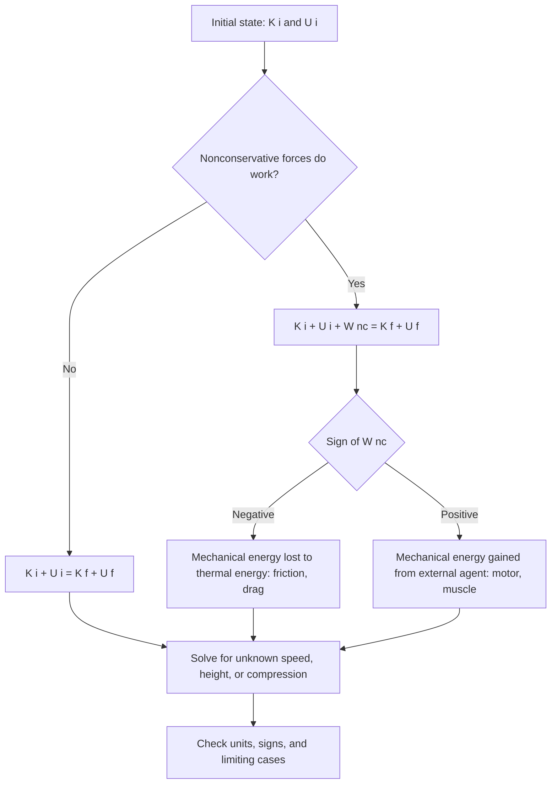

## Conservation of Mechanical Energy


The **principle of conservation of mechanical energy** states that in a system where only **conservative forces** do work, the sum of kinetic energy $K$ and potential energy $U$ remains constant in time. It is a direct consequence of Newton's second law together with the definition of a potential energy function, and it turns many dynamics problems into algebraic bookkeeping between an initial and a final state. When nonconservative forces (friction, drag, applied forces) also act, the principle generalizes to an accounting statement: the change in mechanical energy equals the work done by the nonconservative forces. This idea underlies pendulums, springs, orbits, roller coasters, and the more general conservation of total energy, of which mechanical energy is one component.

### Foundational Concepts

#### Mechanical Energy

The **mechanical energy** of a system is the sum of its kinetic and potential energies:

$$E_{\text{mech}} = K + U$$

- $K = \sum_i \tfrac{1}{2}m_iv_i^2$ (plus rotational terms $\tfrac{1}{2}I\omega^2$ where relevant).
- $U$ is the total potential energy of all conservative interactions in the system (gravitational, elastic, electrostatic, and so on).

#### Conservative Forces

A force is conservative if the work it does between two points is independent of the path, or equivalently, if the work around any closed loop is zero:

$$\oint\vec{F}\cdot d\vec{r} = 0 \iff \vec{F} = -\nabla U \quad (\text{on a simply connected region, } \nabla\times\vec{F} = 0)$$

| Force | Conservative? | Potential energy |
| --- | --- | --- |
| Uniform gravity | Yes | $U = mgy$ |
| Inverse-square gravity | Yes | $U = -GMm/r$ |
| Ideal spring | Yes | $U = \tfrac{1}{2}kx^2$ |
| Electrostatic force | Yes | $U = q_1q_2/(4\pi\varepsilon_0r)$ |
| Kinetic friction | No | Not defined |
| Air drag | No | Not defined |
| Muscle or motor force | Generally no | Not defined |
| Normal force, tension, magnetic force | Do zero work when perpendicular to the velocity | No contribution to $\Delta E$ |

#### Internal vs. External Forces and System Choice

The statement of conservation depends on how the system is defined.

- **Earth + ball as the system**: gravity is an internal conservative force, and its energy is included as $U_g$. External work is zero, so $K + U_g$ is conserved.
- **Ball alone as the system**: gravity is an external force doing work $W_g = -\Delta U_g$, and the ball's kinetic energy changes by that amount. The theorem applied here is the work-energy theorem.

Both descriptions are equivalent. The choice determines whether a force is treated as external work or as an internal potential energy, and using both simultaneously double counts.

### The Principle

#### Statement

If only conservative forces do work on the system (or the net work of nonconservative forces is zero), then:

$$K_i + U_i = K_f + U_f \quad\Longleftrightarrow\quad \Delta K + \Delta U = 0 \quad\Longleftrightarrow\quad \Delta E_{\text{mech}} = 0$$

Equivalently, at every instant:

$$\frac{d}{dt}\left(K + U\right) = 0$$

#### Derivation (One Dimension)

From the work-energy theorem for a particle under a conservative force $F(x) = -dU/dx$:

$$\Delta K = \int_{x_i}^{x_f}F\,dx = -\int_{x_i}^{x_f}\frac{dU}{dx}\,dx = -(U_f - U_i)$$

Rearranging gives $K_f + U_f = K_i + U_i$.

#### Derivation (Time Derivative Form)

For a particle with $m\ddot{\vec{r}} = -\nabla U(\vec{r})$, and $U$ having no explicit time dependence:

$$\frac{dE}{dt} = m\vec{v}\cdot\dot{\vec{v}} + \nabla U\cdot\vec{v} = \vec{v}\cdot\left(m\dot{\vec{v}} + \nabla U\right) = 0$$

The last step uses Newton's second law. This derivation also shows what is needed: the force must be derivable from a potential, and the potential must not depend explicitly on time.

#### Conditions for Validity

1. All forces doing work are conservative, or the nonconservative work is zero.
2. Forces that do work are derivable from a potential $U(\vec{r})$ with no explicit time dependence.
3. The frame is inertial (or fictitious forces are included appropriately, with their potentials where they exist, such as the centrifugal potential).
4. The system is properly identified so that all relevant potential energies are included and none is counted twice.

### The Generalized Statement with Nonconservative Forces

$$W_{\text{nc}} = \Delta K + \Delta U = E_f - E_i$$

or equivalently:

$$K_i + U_i + W_{\text{nc}} = K_f + U_f$$

| Sign of $W_{\text{nc}}$ | Effect on $E_{\text{mech}}$ | Example |
| --- | --- | --- |
| Negative | Decreases | Kinetic friction, drag, braking |
| Positive | Increases | Engine, motor, muscle, a person pushing a cart |
| Zero | Conserved | Frictionless slide, ideal pendulum |

#### Friction and Thermal Energy

Kinetic friction converts mechanical energy into thermal (internal) energy of the surfaces. The dissipated energy is:

$$Q = f_k\,d_{\text{rel}} = \mu_kN\,d_{\text{rel}}$$

where $d_{\text{rel}}$ is the relative sliding distance between the two surfaces. The **total energy** (mechanical plus thermal) is conserved:

$$\Delta K + \Delta U + \Delta E_{\text{thermal}} = W_{\text{ext}}$$

Mechanical energy alone is not conserved with friction, but the broader law of conservation of energy still holds.

#### Diagram: Energy Bookkeeping



### Conservation Across Different Systems

#### Free Fall and Projectile Motion

For a projectile in a uniform gravitational field without drag:

$$\tfrac{1}{2}mv^2 + mgy = \text{constant}$$

The speed at a given height depends only on the height and the launch speed, not on the launch angle:

$$v^2 = v_0^2 - 2g(y - y_0)$$

#### Pendulum

For a simple pendulum released from angle $\theta_0$ (from the vertical), the speed at angle $\theta$ is:

$$\tfrac{1}{2}mv^2 = mgL(\cos\theta - \cos\theta_0) \;\Rightarrow\; v = \sqrt{2gL(\cos\theta - \cos\theta_0)}$$

The tension is:

$$T = mg\cos\theta + \frac{mv^2}{L} = mg\left(3\cos\theta - 2\cos\theta_0\right)$$

The tension does no work because it is perpendicular to the velocity.

#### Spring-Mass System

For a horizontal spring-mass system with amplitude $A$:

$$\tfrac{1}{2}mv^2 + \tfrac{1}{2}kx^2 = \tfrac{1}{2}kA^2$$

The speed at displacement $x$ is:

$$v = \omega\sqrt{A^2 - x^2}, \qquad \omega = \sqrt{k/m}$$

For a vertical spring, the equilibrium position shifts to $y_{\text{eq}} = mg/k$ below the relaxed length. Measured from that equilibrium, the combined gravitational and elastic potential energy takes the same form $\tfrac{1}{2}k\,y'^2$ plus a constant.

#### Sliding on Frictionless Curved Tracks

The speed at any point depends only on the height, not on the shape of the track:

$$v = \sqrt{v_0^2 + 2g(h_0 - h)}$$

The normal force does no work, but it determines whether the object stays on the track (contact requires $N\ge 0$).

#### Orbital Motion

For a satellite of mass $m$ about a central mass $M$:

$$E = \tfrac{1}{2}mv^2 - \frac{GMm}{r} = -\frac{GMm}{2a}$$

where $a$ is the semi-major axis. The **vis-viva equation** follows directly from energy conservation:

$$v^2 = GM\left(\frac{2}{r} - \frac{1}{a}\right)$$

The speed is highest at periapsis and lowest at apoapsis, and $E<0$ characterizes bound orbits.

#### Rolling Without Slipping

Static friction at the contact point of a body rolling without slipping does no work (the contact point is instantaneously at rest), so mechanical energy is conserved even though friction is present. For a body of mass $M$, radius $R$, and moment of inertia $I = \beta MR^2$ rolling down a height $h$ from rest:

$$Mgh = \tfrac{1}{2}Mv^2 + \tfrac{1}{2}I\omega^2 = \tfrac{1}{2}Mv^2(1 + \beta) \;\Rightarrow\; v = \sqrt{\frac{2gh}{1 + \beta}}$$

| Shape | $\beta = I/(MR^2)$ | $v$ at the bottom |
| --- | --- | --- |
| Sliding block (frictionless, no rotation) | $0$ | $\sqrt{2gh}$ |
| Solid sphere | $2/5$ | $\sqrt{10gh/7}\approx 1.195\sqrt{gh}$ |
| Solid cylinder | $1/2$ | $\sqrt{4gh/3}\approx 1.155\sqrt{gh}$ |
| Hollow sphere | $2/3$ | $\sqrt{6gh/5}\approx 1.095\sqrt{gh}$ |
| Hoop | $1$ | $\sqrt{gh}$ |

The result does not depend on mass or radius, so a solid sphere always beats a solid cylinder, which beats a hoop, regardless of size.

#### Collisions and Explosions

Mechanical energy is generally **not** conserved in collisions, since internal forces during deformation dissipate energy. In a perfectly elastic collision, kinetic energy is conserved, and momentum is conserved in all isolated collisions. In an explosion, chemical or elastic potential energy converts to kinetic energy, so kinetic energy increases while momentum is conserved. Energy conservation and momentum conservation are independent statements and must be applied separately.

### Energy Diagrams and Turning Points

For one-dimensional motion with conserved energy $E$:

$$K(x) = E - U(x)\ge 0 \;\Rightarrow\; \text{motion allowed only where } U(x)\le E$$

- **Turning points** occur where $U(x) = E$ (speed zero).
- **Equilibrium** occurs where $dU/dx = 0$, stable if $d^2U/dx^2>0$ and unstable if $d^2U/dx^2<0$.
- The speed at any position is:

$$v(x) = \sqrt{\frac{2\left[E - U(x)\right]}{m}}$$

- The period of bounded motion between turning points $x_1$ and $x_2$ follows by quadrature:

$$T = 2\int_{x_1}^{x_2}\frac{dx}{v(x)} = 2\int_{x_1}^{x_2}\sqrt{\frac{m}{2\left[E - U(x)\right]}}\,dx$$

This formula gives the exact period, including the amplitude dependence of anharmonic oscillators such as a large-angle pendulum.

### Worked Examples

#### Example 1: Ball Thrown Off a Cliff

A ball is thrown from the edge of a $40\ \text{m}$ cliff at $15\ \text{m/s}$ at an arbitrary angle. Ignoring drag, find the speed when it hits the ground.

Take $y = 0$ at the ground:

$$\tfrac{1}{2}mv_0^2 + mgh = \tfrac{1}{2}mv^2 \;\Rightarrow\; v = \sqrt{v_0^2 + 2gh}$$

**Output**: $v = \sqrt{225 + 2(9.81)(40)} = \sqrt{1009.8}\approx 31.8\ \text{m/s}$, regardless of the launch angle.

#### Example 2: Pendulum with a Peg

A pendulum of length $L = 1.0\ \text{m}$ is released from rest with the string horizontal. When the string reaches the vertical, it catches on a peg a distance $d = 0.60\ \text{m}$ below the pivot, so the bob then swings about the peg on a shorter radius $r = L - d = 0.40\ \text{m}$. Find the speed at the top of the small circle if the bob completes it, and the minimum $d$ for which the bob just completes the circle.

Speed at the bottom: $v_b^2 = 2gL$. At the top of the small circle (height $2r$ above the bottom):

$$v_t^2 = v_b^2 - 4gr = 2gL - 4g(L - d) = g(4d - 2L)$$

Completing the circle requires $v_t^2\ge gr = g(L - d)$:

$$4d - 2L\ge L - d \;\Rightarrow\; d\ge \tfrac{3}{5}L$$

**Output**: $d_{\min} = 0.60\ \text{m}$, so the given peg position is exactly the critical case, with $v_t = \sqrt{gr} = \sqrt{9.81\times0.40}\approx 1.98\ \text{m/s}$ and zero tension at the top.

#### Example 3: Spring-Loaded Launcher on an Incline with Friction

A $1.5\ \text{kg}$ block is pressed against a spring ($k = 600\ \text{N/m}$) compressed by $0.30\ \text{m}$ at the bottom of a $25^\circ$ incline with $\mu_k = 0.15$. It is released and slides up the incline. Find the distance traveled along the incline before it stops (assume the spring's release point coincides with the start of free motion, and the spring is fully relaxed by the time the block leaves it).

Initial energy: $\tfrac{1}{2}kx^2 = \tfrac{1}{2}(600)(0.09) = 27.0\ \text{J}$.

Let $s$ be the distance traveled along the incline from the release point. The work of friction is $-\mu_kmg\cos\theta\,s$, and the potential energy gain is $mgs\sin\theta$:

$$27.0 = mg\,s\left(\sin\theta + \mu_k\cos\theta\right)$$


$$s = \frac{27.0}{1.5(9.81)(0.4226 + 0.15\times0.9063)} = \frac{27.0}{14.715\times0.5585}$$

**Output**: $s\approx 3.29\ \text{m}$. Without friction the block would travel $27.0/(14.715\times0.4226)\approx 4.34\ \text{m}$, so friction reduces the distance by about $24\%$.

#### Example 4: Loop-the-Loop with a Rolling Sphere

A solid sphere of radius $r\ll R$ rolls without slipping down a track and around a vertical loop of radius $R$. Find the minimum release height $h$ (above the loop's bottom) for it to complete the loop.

At the top of the loop, contact requires $v_t^2\ge gR$ (treating the sphere's center as moving on a circle of radius $R$, valid for $r\ll R$). Energy conservation with rolling:

$$mgh = mg(2R) + \tfrac{1}{2}mv_t^2\left(1 + \tfrac{2}{5}\right) = 2mgR + \tfrac{7}{10}mv_t^2$$

With $v_t^2 = gR$:

$$h = 2R + \tfrac{7}{10}R = 2.7R$$

**Output**: $h_{\min} = 2.7R$, higher than the $2.5R$ for a sliding block, because part of the energy goes into rotation.

#### Example 5: Vertical Spring and Falling Mass

A $0.50\ \text{kg}$ mass is released from rest at the relaxed length of a vertical spring ($k = 80\ \text{N/m}$). Find the maximum stretch and the maximum speed.

Maximum stretch $x_m$ (speed zero at the bottom), taking gravity and elastic energy:

$$mg\,x_m = \tfrac{1}{2}kx_m^2 \;\Rightarrow\; x_m = \frac{2mg}{k}$$

Maximum speed occurs at equilibrium $x_{\text{eq}} = mg/k$:

$$mg\,x_{\text{eq}} = \tfrac{1}{2}mv_{\max}^2 + \tfrac{1}{2}kx_{\text{eq}}^2 \;\Rightarrow\; v_{\max} = g\sqrt{\frac{m}{k}}$$

**Output**: $x_m = 2(0.50)(9.81)/80\approx 0.123\ \text{m}$ and $v_{\max} = 9.81\sqrt{0.50/80}\approx 0.776\ \text{m/s}$. The maximum stretch is **twice** the static equilibrium stretch of $0.0613\ \text{m}$, a standard result for a suddenly applied load.

#### Example 6: Escape and Orbital Energy

A probe is launched from Earth's surface. Find the minimum launch speed to reach a maximum distance of $r_{\max} = 4R_E$ from Earth's center (radial launch, ignoring drag and Earth's rotation).

$$\tfrac{1}{2}mv_0^2 - \frac{GMm}{R_E} = -\frac{GMm}{4R_E} \;\Rightarrow\; v_0^2 = \frac{2GM}{R_E}\left(1 - \frac{1}{4}\right) = \frac{3}{2}\frac{GM}{R_E}$$

**Output**: $v_0 = \sqrt{1.5\times3.986\times10^{14}/6.371\times10^{6}}\approx 9.69\times10^{3}\ \text{m/s}$, about $9.7\ \text{km/s}$, lower than the $11.2\ \text{km/s}$ escape speed.

#### Example 7: Bungee Jump

A $70\ \text{kg}$ jumper drops from a platform. The bungee cord has unstretched length $L_0 = 25\ \text{m}$ and stiffness $k = 60\ \text{N/m}$ (treated as an ideal spring once taut and slack otherwise). Find the maximum extension of the cord.

Let $x$ be the extension. At the lowest point, all gravitational potential energy lost has become elastic energy:

$$mg(L_0 + x) = \tfrac{1}{2}kx^2 \;\Rightarrow\; \tfrac{1}{2}kx^2 - mgx - mgL_0 = 0$$


$$x = \frac{mg + \sqrt{(mg)^2 + 2kmgL_0}}{k}$$

**Output**: With $mg = 686.7\ \text{N}$: $\sqrt{686.7^2 + 2(60)(686.7)(25)} = \sqrt{471{,}545 + 2{,}060{,}100} = \sqrt{2{,}531{,}645}\approx 1591\ \text{N}$, so $x\approx(686.7 + 1591)/60\approx 38.0\ \text{m}$. The total drop is about $63\ \text{m}$. The peak acceleration is $kx/m - g\approx 60(38.0)/70 - 9.81\approx 22.8\ \text{m/s}^2$, upward, about $2.3g$.

#### Example 8: Block Sliding and Stopping on a Rough Surface

A $2.0\ \text{kg}$ block slides down a frictionless curved track from a height of $1.8\ \text{m}$ onto a rough horizontal surface with $\mu_k = 0.35$. Find the distance it slides on the rough surface before stopping, and the energy dissipated.

Speed at the bottom: $v = \sqrt{2gh}$, so $K = mgh = 2.0(9.81)(1.8)\approx 35.3\ \text{J}$.

Friction dissipates all of it:

$$\mu_kmg\,d = mgh \;\Rightarrow\; d = \frac{h}{\mu_k}$$

**Output**: $d = 1.8/0.35\approx 5.14\ \text{m}$, independent of the mass, and $Q\approx 35.3\ \text{J}$ of thermal energy is generated.

### Numerical Simulation Example

The code below simulates a pendulum without the small-angle approximation, monitors energy conservation with two integrators, and compares the numerical period against the exact energy-based quadrature (elliptic-integral) value.

```python
import numpy as np
from math import pi, sqrt

g, L, m = 9.81, 1.0, 1.0
theta0 = np.radians(120.0)

def energy(theta, omega):
    return 0.5 * m * (L * omega)**2 + m * g * L * (1 - np.cos(theta))

def accel(theta):
    return -(g / L) * np.sin(theta)

def euler(dt, n):
    th, om = theta0, 0.0
    E = [energy(th, om)]
    for _ in range(n):
        th, om = th + om * dt, om + accel(th) * dt        # explicit Euler
        E.append(energy(th, om))
    return np.array(E)

def verlet(dt, n):
    th, om = theta0, 0.0
    a = accel(th)
    E = [energy(th, om)]
    ths = [th]
    for _ in range(n):
        om += 0.5 * dt * a
        th += dt * om
        a = accel(th)
        om += 0.5 * dt * a
        E.append(energy(th, om))
        ths.append(th)
    return np.array(E), np.array(ths)

dt, n = 0.001, 20000       # 20 s
E_euler = euler(dt, n)
E_verlet, ths = verlet(dt, n)
E0 = energy(theta0, 0.0)

print(f"Euler:  max relative energy error = {np.max(np.abs(E_euler - E0)) / E0:.2e}")
print(f"Verlet: max relative energy error = {np.max(np.abs(E_verlet - E0)) / E0:.2e}")

# Period via the energy integral: T = 4 sqrt(L/g) K(k), k = sin(theta0/2), using AGM for K(k)
def agm(a, b, tol=1e-15):
    while abs(a - b) > tol:
        a, b = 0.5 * (a + b), sqrt(a * b)
    return a

k = np.sin(theta0 / 2)
K_ell = pi / (2 * agm(1.0, sqrt(1 - k**2)))
T_exact = 4 * sqrt(L / g) * K_ell
T_small = 2 * pi * sqrt(L / g)

# Numerical period from Verlet: the time of the first return to a maximum (second zero crossing of theta)
sign_changes = np.where(np.diff(np.sign(ths)) != 0)[0]
T_num = 2 * (sign_changes[1] - sign_changes[0]) * dt   # two zero crossings span half a period

print(f"Small-angle period:     {T_small:.4f} s")
print(f"Exact period (120 deg): {T_exact:.4f} s")
print(f"Verlet numerical:       {T_num:.4f} s")
```

**Output** (approximate; exact values depend on step size, and behavior may vary with the integrator):



```
Euler:  max relative energy error = large (grows over time, of order 1 or more)
Verlet: max relative energy error = ~1e-7 or smaller
Small-angle period:     2.0064 s
Exact period (120 deg): ~2.3 s (about 15 to 20 percent above the small-angle value)
Verlet numerical:       ~2.3 s
```

The explicit Euler method adds energy each step and the error grows steadily, violating the conservation law numerically. Velocity Verlet is symplectic and keeps the energy error bounded and small over long times. The exact period from the energy quadrature exceeds the small-angle value $2\pi\sqrt{L/g}$, and the difference grows with amplitude.

### Diagram: Energy Bar Chart for a Falling Ball (svg_diagram)

<svg xmlns="http://www.w3.org/2000/svg" viewBox="0 0 640 380" width="640" height="380" font-family="sans-serif" font-size="13">
<text x="320" y="24" text-anchor="middle" font-size="15" font-weight="bold">Energy Bars During a Fall (svg_diagram)</text>
<line x1="60" y1="320" x2="600" y2="320" stroke="#333" stroke-width="2" />
<line x1="60" y1="50" x2="60" y2="320" stroke="#333" stroke-width="2" />
<text x="22" y="190" transform="rotate(-90 22 190)" text-anchor="middle">Energy</text>
<line x1="60" y1="80" x2="600" y2="80" stroke="#888" stroke-width="1" stroke-dasharray="5,4" />
<text x="520" y="72" fill="#666">E total (constant)</text>
<rect x="110" y="80" width="40" height="240" fill="#2c6fbb" />
<rect x="160" y="320" width="40" height="0" fill="#c0392b" />
<text x="110" y="340">Top</text>
<text x="100" y="356" fill="#2c6fbb">U = max</text>
<text x="100" y="372" fill="#c0392b">K = 0</text>
<rect x="270" y="80" width="40" height="120" fill="#2c6fbb" fill-opacity="0.85" />
<rect x="270" y="200" width="40" height="0" fill="none" />
<rect x="320" y="200" width="40" height="120" fill="#c0392b" fill-opacity="0.85" />
<text x="272" y="340">Middle</text>
<text x="255" y="356" fill="#2c6fbb">U half</text>
<text x="315" y="356" fill="#c0392b">K half</text>
<rect x="430" y="320" width="40" height="0" fill="#2c6fbb" />
<rect x="480" y="80" width="40" height="240" fill="#c0392b" />
<text x="450" y="340">Bottom</text>
<text x="440" y="356" fill="#2c6fbb">U = 0</text>
<text x="495" y="356" fill="#c0392b">K = max</text>
<rect x="70" y="60" width="12" height="12" fill="#2c6fbb" />
<text x="88" y="71">U (potential)</text>
<rect x="180" y="60" width="12" height="12" fill="#c0392b" />
<text x="198" y="71">K (kinetic)</text>
</svg>

### Diagram: Energy Loss by Friction (svg_diagram)

<svg xmlns="http://www.w3.org/2000/svg" viewBox="0 0 640 360" width="640" height="360" font-family="sans-serif" font-size="13">
<text x="320" y="24" text-anchor="middle" font-size="15" font-weight="bold">Mechanical Energy with Friction (svg_diagram)</text>
<line x1="60" y1="300" x2="600" y2="300" stroke="#333" stroke-width="2" />
<line x1="60" y1="50" x2="60" y2="300" stroke="#333" stroke-width="2" />
<text x="330" y="335" text-anchor="middle">Distance along path</text>
<text x="22" y="180" transform="rotate(-90 22 180)" text-anchor="middle">Energy</text>
<line x1="60" y1="90" x2="580" y2="90" stroke="#2c6fbb" stroke-width="2" stroke-dasharray="6,4" />
<text x="400" y="82" fill="#2c6fbb">Frictionless: E constant</text>
<line x1="60" y1="90" x2="580" y2="270" stroke="#c0392b" stroke-width="3" />
<text x="330" y="205" fill="#c0392b">With friction: E decreases linearly</text>
<text x="330" y="222" fill="#c0392b">slope = -mu N</text>
<polygon points="580,90 580,270 500,240 500,90" fill="#f0b3aa" fill-opacity="0.35" stroke="none" />
<text x="470" y="180" fill="#8e44ad">Dissipated as heat</text>
<text x="470" y="197" fill="#8e44ad">Q = mu N d</text>
<text x="320" y="352" text-anchor="middle" fill="#333">W nc = change in E mech = -mu N d (total energy including heat is conserved)</text>
</svg>

### Comparison: Approaches to Solving Motion Problems

| Feature | Newton's second law | Energy conservation |
| --- | --- | --- |
| Quantity handled | Vectors (force, acceleration) | Scalars (energy) |
| Gives | Acceleration, time dependence | Speed as a function of position |
| Path details needed | Yes (forces along the path) | No (only endpoints) |
| Handles curved tracks easily | Requires normal-force analysis | Yes, if friction is absent |
| Time information | Direct (integrate) | Not directly (needs an extra step) |
| Force information (tension, normal force) | Direct | Needs a separate radial equation |
| Best for | Force and time questions | Speed, height, compression questions |

A common strategy is to use energy conservation to find the speed at a point, then Newton's second law along the radial direction to find forces such as tension or the normal force at that point.

### Common Misconceptions

- **"Mechanical energy is always conserved"**: it is conserved only when nonconservative forces do zero net work. With friction or drag, mechanical energy decreases, though total energy (including thermal) is conserved.
- **"Energy is lost to friction"**: it is converted to thermal energy. The phrase "lost" refers only to mechanical energy.
- **"Friction always dissipates energy"**: static friction on a body rolling without slipping does no work, so mechanical energy is conserved, and friction can also do positive work on a body (a box on an accelerating conveyor).
- **"Normal force always does zero work"**: it does zero work when the surface is stationary and the motion is along it. If the surface moves (an elevator floor, a moving ramp), the normal force can do work on the body.
- **"Conservation of energy and conservation of momentum are interchangeable"**: they are independent laws. In an inelastic collision, momentum is conserved but kinetic energy is not.
- **"Include both the work of gravity and gravitational potential energy"**: this double counts. Use either the work-energy theorem with gravity as an external force, or the conservation form with $U_g$ in the system.
- **"The shape of the track affects the final speed of a frictionless slider"**: only the height difference matters, although the shape affects the time taken and the contact force.
- **"Potential energy has a preferred zero"**: any reference level works, provided it is used consistently within a single problem, since only differences enter.
- **"A satellite speeds up in a higher orbit because it has more energy"**: total energy is higher (less negative), but the speed is lower, since $v = \sqrt{GM/r}$.
- **"Energy conservation tells you how long the motion takes"**: it gives speed versus position. Time requires additional integration, such as $t = \int dx/v(x)$.

### Limitations and Domain of Validity

- The principle holds only for systems where all forces that do work are conservative, or where nonconservative work is accounted for explicitly.
- If the potential depends explicitly on time (for example, a moving support or a time-varying field), the mechanical energy is not conserved even though the force is derivable from a potential.
- Velocity-dependent forces such as drag and the magnetic force need care: the magnetic force does no work, so it conserves kinetic energy, but it is not derivable from a simple position-dependent $U$.
- For deformable or thermal systems, the total energy must include internal energy, and the full first law of thermodynamics applies: $\Delta E_{\text{total}} = Q + W_{\text{ext}}$.
- At relativistic speeds, kinetic energy is $(\gamma - 1)mc^2$, and the conserved quantity is total relativistic energy, including rest energy.
- In non-inertial frames, fictitious forces must be included. Some (centrifugal) are conservative with an effective potential, while others (Coriolis) do no work, and Euler forces generally break the conservation form.
- Approximations such as $U = mgy$ are valid only for small height changes relative to the planet's radius, and the Hooke's-law spring potential is valid only within the elastic range.
- Quantum systems conserve energy but do not follow classical trajectories, so the classical turning-point picture does not apply directly (tunneling allows classically forbidden regions).

### Key Points

- If only conservative forces do work, $K + U$ is constant: $K_i + U_i = K_f + U_f$.
- With nonconservative forces, $K_i + U_i + W_{\text{nc}} = K_f + U_f$, and $W_{\text{nc}} = -\mu_kN\,d_{\text{rel}}$ for kinetic friction (with the lost mechanical energy appearing as thermal energy).
- The principle follows from Newton's second law for forces derivable from a time-independent potential, via $dE/dt = \vec{v}\cdot(m\dot{\vec{v}} + \nabla U) = 0$.
- Perpendicular forces (tension on a pendulum bob, normal force on a fixed track, magnetic force) do no work and do not change mechanical energy.
- The final speed on a frictionless track depends only on the height change, not on the path shape.
- Energy diagrams give speeds ($v = \sqrt{2[E - U]/m}$), turning points, equilibrium and stability, and the exact period by quadrature.
- Rolling without slipping conserves mechanical energy, and the fraction of energy in rotation depends only on the shape factor $\beta = I/(MR^2)$.
- Energy conservation gives speed, and Newton's second law is still needed for forces and times.
- Numerical simulation should use symplectic integrators such as velocity Verlet to preserve energy over long durations.

### Conclusion

Conservation of mechanical energy converts a dynamical problem into a comparison of two states, so that speeds, heights, compressions, and turning points can be found without tracking the detailed motion in between. Its power comes from the scalar nature of energy and the path independence of conservative forces, and its limits come from the presence of dissipation, external driving, and time-dependent potentials, all of which are handled by adding the nonconservative work term. Correct use depends on defining the system, choosing consistent reference levels, avoiding double counting between work and potential energy, and recognizing which forces do work. The principle is the classical seed of the broader law of conservation of energy, and it connects naturally to momentum conservation, rotational dynamics, orbital mechanics, oscillations, and the Hamiltonian formulation of mechanics.

### Next Steps

**Related Topics**

- Conservation of total energy and the first law of thermodynamics
- Linear momentum, impulse, and conservation of momentum
- Elastic and inelastic collisions in one and two dimensions
- Rotational dynamics and rotational energy, rolling motion
- Central forces, effective potential, and Kepler orbits
- Simple harmonic motion and anharmonic oscillators
- Noether's theorem: time-translation symmetry and energy conservation
- Lagrangian and Hamiltonian mechanics (the Hamiltonian as the conserved energy function)
- Dissipative systems: damping, driven oscillators, and resonance
- Relativistic energy and mass-energy equivalence
- Symplectic integrators and long-term energy behavior in numerical simulation