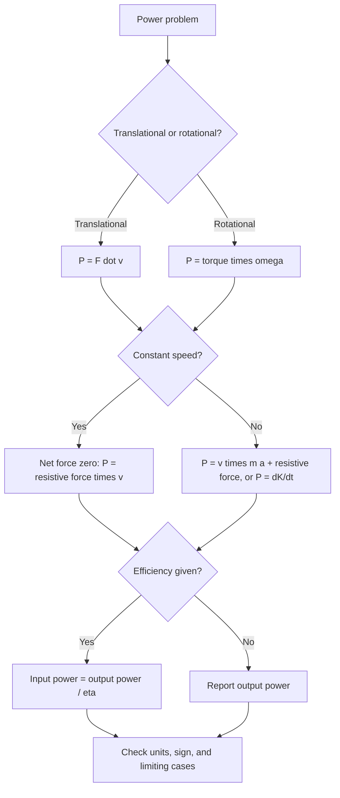

## Power


**Power** is the rate at which work is done or, more generally, the rate at which energy is transferred or converted. It answers the question "how fast?" for energy processes: two engines can do the same total work, but the one that finishes sooner has the greater power. The concept is central to mechanical engineering, vehicle dynamics, human physiology, electrical systems, and thermodynamics, and it connects the work-energy theorem to time-dependent behavior. In mechanics, the instantaneous power delivered by a force equals the dot product of the force and the velocity of its point of application, $P = \vec{F}\cdot\vec{v}$, and for rotation, $P = \tau\omega$.

### Foundational Concepts

#### Definition

**Average power** over a time interval $\Delta t$:

$$P_{\text{avg}} = \frac{W}{\Delta t} = \frac{\Delta E}{\Delta t}$$

**Instantaneous power**:

$$P = \frac{dW}{dt} = \frac{dE}{dt}$$

Power is a **scalar**. It can be positive (energy delivered to the body), negative (energy removed from the body), or zero.

#### Units

The SI unit is the **watt**:

$$1\ \text{W} = 1\ \text{J/s} = 1\ \text{kg}\cdot\text{m}^2/\text{s}^3$$

| Unit | Symbol | Equivalent |
| --- | --- | --- |
| Kilowatt | kW | $10^{3}\ \text{W}$ |
| Megawatt | MW | $10^{6}\ \text{W}$ |
| Gigawatt | GW | $10^{9}\ \text{W}$ |
| Horsepower (mechanical) | hp | $\approx 745.7\ \text{W}$ |
| Metric horsepower (PS) | PS | $\approx 735.5\ \text{W}$ |
| Foot-pound per second | ft·lb/s | $\approx 1.356\ \text{W}$ |
| BTU per hour | BTU/h | $\approx 0.293\ \text{W}$ |

Energy units derived from power: the **kilowatt-hour** is $1\ \text{kWh} = 3.6\times10^{6}\ \text{J}$. A kilowatt-hour is a unit of energy, not power, and confusing the two is a common error.

#### Typical Magnitudes

The values below are order-of-magnitude figures [Unverified for specific devices or conditions].

| System | Approximate power |
| --- | --- |
| Human resting metabolic rate | $\sim 80\ \text{W}$ |
| Sustained cycling (recreational) | $\sim 100$ to $200\ \text{W}$ mechanical |
| Elite cyclist (one hour) | $\sim 400\ \text{W}$ mechanical |
| Passenger car cruising on a highway | $\sim 15$ to $30\ \text{kW}$ at the wheels |
| Passenger car engine (peak) | $\sim 100$ to $300\ \text{kW}$ |
| Large wind turbine | $\sim 2$ to $15\ \text{MW}$ |
| Large power plant | $\sim 1\ \text{GW}$ |
| Sunlight at Earth's surface (clear sky, normal incidence) | $\sim 1\ \text{kW/m}^2$ |
| Solar constant (top of atmosphere) | $\approx 1361\ \text{W/m}^2$ |

### Mechanical Power

#### Power Delivered by a Force

For a force $\vec{F}$ acting on a body (or a point) moving with velocity $\vec{v}$, since $dW = \vec{F}\cdot d\vec{r}$:

$$P = \vec{F}\cdot\vec{v} = Fv\cos\theta$$

where $\theta$ is the angle between the force and the velocity.

- $\theta = 0^\circ$: maximum positive power, $P = Fv$.
- $\theta = 90^\circ$: zero power. The centripetal force in uniform circular motion, the magnetic force, and the normal force on a stationary surface do no work and deliver no power.
- $\theta > 90^\circ$: negative power. The force removes energy (friction, drag, braking).

#### Power and Kinetic Energy

From the work-energy theorem:

$$\frac{dK}{dt} = \vec{F}_{\text{net}}\cdot\vec{v} = P_{\text{net}}$$

The net power equals the rate of change of kinetic energy. For constant net force $F$ on a mass $m$ starting from rest, $v = (F/m)t$, so:

$$P(t) = Fv = \frac{F^2}{m}t$$

The power grows linearly in time, and the average power over $[0, t]$ is half the final instantaneous power.

#### Power and Potential Energy

For a conservative force with potential $U$:

$$P_{\text{cons}} = \vec{F}_{\text{cons}}\cdot\vec{v} = -\frac{dU}{dt}$$

For lifting a mass $m$ at constant speed $v$ against gravity, the required power is $P = mgv$.

#### Power and Mechanical Energy

The rate of change of mechanical energy equals the power of nonconservative forces:

$$\frac{dE_{\text{mech}}}{dt} = P_{\text{nc}} = \vec{F}_{\text{nc}}\cdot\vec{v}$$

For kinetic friction $f_k$ acting during sliding at relative speed $v_{\text{rel}}$, the rate of thermal energy production is:

$$\dot{Q} = f_kv_{\text{rel}} = \mu_kNv_{\text{rel}}$$

### Rotational Power

For a torque $\tau$ acting on a body rotating with angular velocity $\omega$:

$$P = \vec{\tau}\cdot\vec{\omega} = \tau\omega$$

With $\omega$ in rad/s and $\tau$ in N·m, $P$ is in watts. The rotational analogue of the work-energy relation is:

$$\frac{d}{dt}\left(\tfrac{1}{2}I\omega^2\right) = \tau_{\text{net}}\,\omega$$

**Engines and motors**: the power output of a rotating shaft is $P = \tau\omega = 2\pi n\tau$ where $n$ is the rotation rate in revolutions per second. In practical units:

$$P(\text{kW}) = \frac{\tau(\text{N}\cdot\text{m})\times n(\text{rpm})}{9549}$$

Because an engine's torque varies with speed, the peak power typically occurs at a higher rpm than the peak torque.

### Power at Constant Speed Against Resistance

A vehicle moving at constant velocity has zero net force, so the propulsive force equals the sum of the resistive forces, and the power delivered to the wheels is:

$$P = F_{\text{resist}}\,v$$

#### Rolling Resistance and Aerodynamic Drag

$$F_{\text{roll}} = \mu_{rr}mg, \qquad F_{\text{drag}} = \tfrac{1}{2}\rho C_dAv^2$$


$$P(v) = \mu_{rr}mg\,v + \tfrac{1}{2}\rho C_dA\,v^3$$

- The rolling term grows **linearly** with speed.
- The drag term grows with the **cube** of speed. Doubling speed requires eight times the aerodynamic power.
- The crossover speed at which the two contributions are equal is:

$$v_c = \sqrt{\frac{2\mu_{rr}mg}{\rho C_dA}}$$

#### On a Slope

For a grade angle $\theta$ (positive uphill), with the road force needed to overcome gravity, rolling resistance, and drag at constant speed:

$$P = v\left[mg\sin\theta + \mu_{rr}mg\cos\theta + \tfrac{1}{2}\rho C_dAv^2\right]$$

Descending a steep enough slope makes the gravity term negative, and the required driving power can become negative, meaning braking power must be dissipated.

#### Acceleration

To accelerate at rate $a$ at speed $v$:

$$P = v\left[ma + F_{\text{resist}}(v)\right]$$

A vehicle of constant available engine power $P_{\max}$ accelerating on a level road without resistance has:

$$P_{\max} = mav = mv\frac{dv}{dt} \;\Rightarrow\; v(t) = \sqrt{\frac{2P_{\max}t}{m}}, \qquad x(t) = \frac{2}{3}\sqrt{\frac{2P_{\max}}{m}}\,t^{3/2}$$

The acceleration $a = P_{\max}/(mv)$ decreases as speed rises, unlike the constant-force case.

### Power in Fluids and Energy Conversion

#### Power in a Moving Fluid

A fluid of density $\rho$ moving at speed $v$ through a cross-sectional area $A$ carries kinetic energy at the rate:

$$P_{\text{flow}} = \tfrac{1}{2}\dot{m}v^2 = \tfrac{1}{2}\rho Av^3$$

(with mass flow rate $\dot{m} = \rho Av$). This is the basis of wind and hydro power estimates.

#### Wind Turbine and the Betz Limit

A turbine cannot extract all of the kinetic energy flux, since the air must continue to move away. The maximum fraction extractable by an ideal actuator disk is the **Betz limit**:

$$C_{p,\max} = \frac{16}{27}\approx 0.593$$

so the maximum extractable power is:

$$P_{\max} = \frac{16}{27}\cdot\tfrac{1}{2}\rho Av^3$$

Real turbines achieve a power coefficient $C_p$ somewhat below this limit [Unverified for specific turbine models].

#### Hydroelectric Power

For water falling through a height $h$ with volume flow rate $Q$ and overall efficiency $\eta$:

$$P = \eta\,\rho g\,Q\,h$$

#### Pumping Power

The hydraulic power needed to raise fluid at volume flow rate $Q$ against a pressure difference $\Delta p$ is:

$$P_{\text{hyd}} = Q\,\Delta p$$

and the shaft power required is $P_{\text{shaft}} = P_{\text{hyd}}/\eta_{\text{pump}}$.

### Efficiency

**Efficiency** is the ratio of useful output power (or energy) to the input:

$$\eta = \frac{P_{\text{out}}}{P_{\text{in}}} = \frac{E_{\text{out}}}{E_{\text{in}}}, \qquad 0\le\eta\le1$$

The difference is dissipated, usually as heat: $P_{\text{loss}} = P_{\text{in}} - P_{\text{out}} = (1 - \eta)P_{\text{in}}$.

For machines in series, the overall efficiency is the product:

$$\eta_{\text{total}} = \eta_1\eta_2\cdots\eta_n$$

| Device | Typical efficiency (approximate) |
| --- | --- |
| Large electric motor | $0.90$ to $0.97$ |
| Gasoline car engine (thermal) | $0.25$ to $0.35$ |
| Diesel engine (thermal) | $0.35$ to $0.45$ |
| Combined-cycle gas power plant | $\sim 0.55$ to $0.60$ |
| Photovoltaic panel (commercial) | $\sim 0.15$ to $0.23$ |
| Incandescent bulb (visible light) | $\sim 0.02$ to $0.05$ |
| LED lamp (visible light) | $\sim 0.15$ to $0.30$ |
| Human muscle (mechanical work from metabolic energy) | $\sim 0.20$ to $0.25$ |

These values vary strongly with design, load, and operating conditions [Unverified for specific products].

A heat engine's efficiency is fundamentally limited by the second law of thermodynamics, with the Carnot bound $\eta\le 1 - T_c/T_h$ (absolute temperatures).

### Electrical Power (Connection)

For an electrical element with voltage $V$ across it and current $I$ through it:

$$P = VI = I^2R = \frac{V^2}{R}$$

The last two forms apply to resistive elements (Joule heating). For AC circuits, the average power is $P = V_{\text{rms}}I_{\text{rms}}\cos\phi$, where $\cos\phi$ is the power factor. Electrical energy is billed in kWh.

### Instantaneous vs. Average Power

For a time-varying power, the work done over an interval is the integral:

$$W = \int_{t_1}^{t_2}P\,dt$$

which is the **area under the $P$-$t$ curve**. The average power over the interval is:

$$P_{\text{avg}} = \frac{1}{t_2 - t_1}\int_{t_1}^{t_2}P\,dt$$

For periodic signals, average over a full period. For sinusoidal power with $P(t) = P_0\sin^2(\omega t)$, $P_{\text{avg}} = P_0/2$.

### Diagram: Power Analysis Workflow



### Worked Examples

#### Example 1: Average Power of a Lift

A $70\ \text{kg}$ climber ascends a $600\ \text{m}$ vertical distance in $2.0\ \text{hours}$. Find the average mechanical power.

$$W = mgh = 70(9.81)(600)\approx 4.12\times10^{5}\ \text{J}$$


$$P_{\text{avg}} = \frac{W}{t} = \frac{4.12\times10^{5}}{7200}\approx 57.2\ \text{W}$$

**Output**: About $57\ \text{W}$ of mechanical power (against gravity alone). With a muscular efficiency of about $25\%$, the metabolic power is roughly $230\ \text{W}$ [Inference: the efficiency is an approximate typical value].

#### Example 2: Constant-Force Acceleration

A $1000\ \text{kg}$ car accelerates from rest under a constant net force of $3000\ \text{N}$. Find the instantaneous power at $t = 5.0\ \text{s}$ and the average power over the first $5.0\ \text{s}$.

$$a = \frac{F}{m} = 3.0\ \text{m/s}^2, \qquad v(5) = 15\ \text{m/s}$$


$$P(5) = Fv = 3000(15) = 45{,}000\ \text{W}$$


$$P_{\text{avg}} = \frac{\tfrac{1}{2}mv^2}{t} = \frac{\tfrac{1}{2}(1000)(225)}{5.0} = 22{,}500\ \text{W}$$

**Output**: $P(5) = 45\ \text{kW}$ and $P_{\text{avg}} = 22.5\ \text{kW}$, half the final instantaneous value, as expected for a linearly increasing power.

#### Example 3: Cruising Power of a Car

A car of mass $1400\ \text{kg}$ with $C_dA = 0.65\ \text{m}^2$ and $\mu_{rr} = 0.012$ cruises at constant $30\ \text{m/s}$ ($108\ \text{km/h}$) on a level road in air of $\rho = 1.2\ \text{kg/m}^3$. Find the power at the wheels, and the fuel power if the drivetrain-plus-engine efficiency is $25\%$.

$$F_{\text{roll}} = 0.012(1400)(9.81)\approx 164.8\ \text{N}$$


$$F_{\text{drag}} = \tfrac{1}{2}(1.2)(0.65)(30)^2\approx 351\ \text{N}$$


$$P_{\text{wheels}} = (164.8 + 351)(30)\approx 15.5\ \text{kW}$$


$$P_{\text{fuel}} = \frac{P_{\text{wheels}}}{\eta} = \frac{15.5}{0.25}\approx 62\ \text{kW}$$

**Output**: About $15.5\ \text{kW}$ at the wheels and roughly $62\ \text{kW}$ of chemical power from the fuel. The aerodynamic drag accounts for about two thirds of the wheel power at this speed. The crossover speed where rolling and drag powers are equal is $v_c = \sqrt{2(0.012)(1400)(9.81)/(1.2\times0.65)}\approx 20.5\ \text{m/s}$.

#### Example 4: Effect of Speed on Aerodynamic Power

Using the car of Example 3, compare the drag power at $20\ \text{m/s}$ and at $40\ \text{m/s}$.

$$P_{\text{drag}}(v) = \tfrac{1}{2}\rho C_dAv^3 = 0.39\,v^3$$

At $20\ \text{m/s}$: $0.39(8000) = 3.12\ \text{kW}$. At $40\ \text{m/s}$: $0.39(64000) = 24.96\ \text{kW}$.

**Output**: Doubling the speed multiplies the drag power by $2^3 = 8$ (from about $3.1\ \text{kW}$ to about $25.0\ \text{kW}$), even though the drag force only quadruples. This is why fuel consumption per distance rises sharply at highway speeds.

#### Example 5: Maximum Speed with Limited Power

A vehicle with $C_dA = 0.65\ \text{m}^2$ and negligible rolling resistance has $60\ \text{kW}$ of usable wheel power on a level road. Find the top speed.

$$P = \tfrac{1}{2}\rho C_dAv^3 \;\Rightarrow\; v_{\max} = \left(\frac{2P}{\rho C_dA}\right)^{1/3} = \left(\frac{2(60{,}000)}{1.2\times0.65}\right)^{1/3}$$

**Output**: $v_{\max} = (1.538\times10^{5})^{1/3}\approx 53.6\ \text{m/s}\approx 193\ \text{km/h}$. Because $v_{\max}\propto P^{1/3}$, doubling the power raises the top speed by only about $26\%$.

#### Example 6: Motor Torque and Power

An electric motor delivers $15\ \text{kW}$ at $3000\ \text{rpm}$. Find the shaft torque.

$$\omega = 3000\times\frac{2\pi}{60}\approx 314.2\ \text{rad/s}$$


$$\tau = \frac{P}{\omega} = \frac{15{,}000}{314.2}\approx 47.7\ \text{N}\cdot\text{m}$$

**Output**: $\tau\approx 47.7\ \text{N}\cdot\text{m}$. Through a gearbox with a $5{:}1$ reduction and ideal efficiency, the output speed is $600\ \text{rpm}$ and the output torque rises to about $239\ \text{N}\cdot\text{m}$, with the power unchanged. With a real efficiency $\eta<1$, the output power is $\eta P$.

#### Example 7: Hydroelectric Plant

Water flows at $Q = 40\ \text{m}^3/\text{s}$ through a net head of $h = 60\ \text{m}$, with an overall efficiency of $88\%$. Find the electrical output.

$$P = \eta\rho gQh = 0.88(1000)(9.81)(40)(60)$$

**Output**: $P\approx 2.07\times10^{7}\ \text{W}\approx 20.7\ \text{MW}$. The ideal (lossless) power would be $23.5\ \text{MW}$, and the difference of $2.8\ \text{MW}$ appears as heat and other losses.

#### Example 8: Wind Turbine Output

A turbine with rotor radius $r = 45\ \text{m}$ faces a wind of $v = 12\ \text{m/s}$ in air of density $1.2\ \text{kg/m}^3$. Find the available wind power, the Betz maximum, and the electrical output for a realistic overall coefficient $C_p = 0.40$ (an assumed value).

$$A = \pi r^2 = \pi(45)^2\approx 6362\ \text{m}^2$$


$$P_{\text{wind}} = \tfrac{1}{2}\rho Av^3 = 0.5(1.2)(6362)(1728)\approx 6.60\times10^{6}\ \text{W}$$


$$P_{\text{Betz}} = \tfrac{16}{27}P_{\text{wind}}\approx 3.91\ \text{MW}, \qquad P_{\text{out}} = 0.40\,P_{\text{wind}}\approx 2.64\ \text{MW}$$

**Output**: $6.6\ \text{MW}$ available, $3.9\ \text{MW}$ theoretical maximum, and about $2.6\ \text{MW}$ for the assumed $C_p$. Because $P\propto v^3$, a $10\%$ increase in wind speed raises the available power by about $33\%$.

#### Example 9: Climbing Stairs and Metabolic Power

A $65\ \text{kg}$ person runs up a staircase rising $4.0\ \text{m}$ in $3.5\ \text{s}$. Find the average mechanical power, and the metabolic power at a muscular efficiency of $22\%$.

$$P_{\text{mech}} = \frac{mgh}{t} = \frac{65(9.81)(4.0)}{3.5}\approx 729\ \text{W}$$


$$P_{\text{metabolic}} = \frac{729}{0.22}\approx 3.3\ \text{kW}$$

**Output**: About $0.73\ \text{kW}$ (roughly $1\ \text{hp}$) of mechanical power, which can be sustained only briefly, and about $3.3\ \text{kW}$ of metabolic power [Inference: the efficiency is an approximate typical value].

#### Example 10: Power Dissipated by Kinetic Friction

A $5.0\ \text{kg}$ crate slides at $2.0\ \text{m/s}$ on a rough floor with $\mu_k = 0.40$. Find the rate of energy dissipation.

$$\dot{Q} = \mu_kmg\,v = 0.40(5.0)(9.81)(2.0)\approx 39.2\ \text{W}$$

**Output**: About $39\ \text{W}$ of mechanical energy is converted to thermal energy. The crate decelerates uniformly at $a = \mu_kg = 3.92\ \text{m/s}^2$, so the dissipation rate decreases linearly with speed until it stops after $0.51\ \text{s}$ and $0.51\ \text{m}$.

### Numerical Simulation Example

The code below simulates a vehicle accelerating from rest with a power limit and a torque limit, including aerodynamic drag and rolling resistance. It reports the time to reach $100\ \text{km/h}$ and the top speed, and it verifies the power balance $P_{\text{wheels}} = dK/dt + P_{\text{losses}}$ numerically.

```python
import numpy as np

# Vehicle parameters (illustrative)
m, g, rho = 1400.0, 9.81, 1.2
CdA, mu_rr = 0.65, 0.012
P_max = 90e3            # W, available power at the wheels
F_max = 6000.0          # N, traction limit (tire/torque limit at low speed)

def drive_force(v):
    """Force limited by traction at low speed and by power at high speed."""
    v = max(v, 0.1)
    return min(F_max, P_max / v)

def resist(v):
    return mu_rr * m * g + 0.5 * rho * CdA * v**2

dt, t_end = 0.001, 60.0
n = int(t_end / dt)
v, x, t = 0.0, 0.0, 0.0
t_100 = None
E_in = 0.0             # energy supplied by the drive
E_loss = 0.0           # energy dissipated by resistance

for i in range(n):
    F = drive_force(v)
    a = (F - resist(v)) / m
    E_in += F * v * dt
    E_loss += resist(v) * v * dt
    v += a * dt
    x += v * dt
    t += dt
    if t_100 is None and v >= 100 / 3.6:
        t_100 = t

K = 0.5 * m * v**2
print(f"Time to 100 km/h:      {t_100:.2f} s")
print(f"Speed at t = 60 s:     {v*3.6:.1f} km/h")
print(f"Energy balance check:  E_in = {E_in/1e6:.3f} MJ, "
      f"K + E_loss = {(K + E_loss)/1e6:.3f} MJ")

# Analytic top speed (drag + rolling equals P_max / v): solve numerically
vs = np.linspace(1, 100, 100000)
balance = P_max / vs - resist(vs)
v_top = vs[np.argmin(np.abs(balance))]
print(f"Analytic top speed:    {v_top*3.6:.1f} km/h")
```

**Output** (approximate; exact values depend on parameters and step size, and behavior may vary with the integration scheme):



```
Time to 100 km/h:      ~9 s
Speed at t = 60 s:     ~ 200+ km/h approaching the analytic top speed
Energy balance check:  E_in and K + E_loss agree to within numerical error
Analytic top speed:    ~ 200+ km/h
```

The simulation shows the two regimes of a power-limited vehicle: at low speed, the traction limit sets a constant acceleration, and above the crossover speed $v = P_{\max}/F_{\max}$ (about $15\ \text{m/s}$ here), the acceleration falls as $1/v$ because the constant-power limit applies. The energy bookkeeping check confirms that the input work equals the kinetic energy plus the dissipated energy, which is the time-integrated form of the power balance.

### Diagram: Power vs. Speed for a Vehicle (svg_diagram)

<svg xmlns="http://www.w3.org/2000/svg" viewBox="0 0 640 380" width="640" height="380" font-family="sans-serif" font-size="13">
<text x="320" y="24" text-anchor="middle" font-size="15" font-weight="bold">Power Required vs. Speed (svg_diagram)</text>
<line x1="70" y1="320" x2="600" y2="320" stroke="#333" stroke-width="2" />
<line x1="70" y1="50" x2="70" y2="320" stroke="#333" stroke-width="2" />
<text x="335" y="357" text-anchor="middle">Speed v</text>
<text x="24" y="190" transform="rotate(-90 24 190)" text-anchor="middle">Power P</text>
<line x1="70" y1="318" x2="580" y2="240" stroke="#1a7f37" stroke-width="3" />
<text x="440" y="270" fill="#1a7f37">Rolling: P proportional to v</text>
<path d="M 70,320 C 250,318 380,290 470,215 S 560,90 585,60" fill="none" stroke="#c0392b" stroke-width="3" />
<text x="330" y="145" fill="#c0392b">Aerodynamic drag:</text>
<text x="330" y="162" fill="#c0392b">P proportional to v cubed</text>
<path d="M 70,318 C 250,305 380,270 470,190 S 560,80 585,50" fill="none" stroke="#2c6fbb" stroke-width="3" stroke-dasharray="6,4" />
<text x="90" y="110" fill="#2c6fbb">Total P(v) = rolling + drag</text>
<line x1="70" y1="120" x2="600" y2="120" stroke="#8e44ad" stroke-width="2" stroke-dasharray="5,4" />
<text x="90" y="138" fill="#8e44ad">Engine power limit P max</text>
<line x1="510" y1="120" x2="510" y2="320" stroke="#888" stroke-width="1" stroke-dasharray="3,3" />
<text x="440" y="336" fill="#666">v max where the</text>
<text x="440" y="350" fill="#666">curves meet</text>
</svg>

### Diagram: Constant Torque vs. Constant Power (svg_diagram)

<svg xmlns="http://www.w3.org/2000/svg" viewBox="0 0 640 360" width="640" height="360" font-family="sans-serif" font-size="13">
<text x="320" y="24" text-anchor="middle" font-size="15" font-weight="bold">Motor Operating Regimes (svg_diagram)</text>
<line x1="70" y1="300" x2="590" y2="300" stroke="#333" stroke-width="2" />
<line x1="70" y1="50" x2="70" y2="300" stroke="#333" stroke-width="2" />
<text x="335" y="335" text-anchor="middle">Rotation speed omega</text>
<text x="24" y="175" transform="rotate(-90 24 175)" text-anchor="middle">Torque / Power (normalized)</text>
<line x1="70" y1="100" x2="300" y2="100" stroke="#2c6fbb" stroke-width="3" />
<path d="M 300,100 C 350,150 420,205 580,250" fill="none" stroke="#2c6fbb" stroke-width="3" />
<text x="90" y="90" fill="#2c6fbb">Torque: constant, then falls as 1/omega</text>
<line x1="70" y1="300" x2="300" y2="100" stroke="#c0392b" stroke-width="3" />
<line x1="300" y1="100" x2="580" y2="100" stroke="#c0392b" stroke-width="3" />
<text x="330" y="90" fill="#c0392b">Power: rises linearly, then constant</text>
<line x1="300" y1="100" x2="300" y2="300" stroke="#888" stroke-width="1" stroke-dasharray="4,4" />
<text x="240" y="318" fill="#666">base speed</text>
<text x="90" y="250" fill="#666">constant-torque</text>
<text x="90" y="266" fill="#666">region</text>
<text x="430" y="200" fill="#666">constant-power region</text>
<text x="320" y="350" text-anchor="middle" fill="#333">P = torque times omega</text>
</svg>

### Power and Energy: Comparison

| Feature | Energy / Work | Power |
| --- | --- | --- |
| Meaning | Capacity to do work / amount transferred | Rate of energy transfer |
| Symbol | $E$, $W$ | $P$ |
| SI unit | Joule (J) | Watt (W) = J/s |
| Practical unit | kWh, cal, eV | kW, hp |
| Relation | $W = \int P\,dt$ | $P = dW/dt$ |
| Path-dependent process quantity? | Work is a process quantity | An instantaneous rate |
| Question answered | "How much?" | "How fast?" |
| Example | A battery stores $60\ \text{Wh}$ | A charger supplies $20\ \text{W}$ |

### Common Misconceptions

- **"Power and energy are the same"**: power is a rate. A kilowatt-hour is energy, and a kilowatt is power.
- **"A more powerful machine does more work"**: not necessarily. Power tells how fast the work is done, and total work depends on the duration too.
- **"Holding a heavy weight stationary requires power"**: no mechanical work is done on the weight when there is no displacement, so its mechanical power is zero, although muscles consume metabolic energy.
- **"Doubling speed doubles the power against drag"**: it multiplies it by eight, since $P_{\text{drag}}\propto v^3$.
- **"Doubling engine power doubles top speed"**: with drag-limited motion, $v_{\max}\propto P^{1/3}$, so the increase is only about $26\%$.
- **"Peak torque and peak power occur at the same rpm"**: they generally do not, and peak power occurs at higher rpm.
- **"Efficiency can exceed 100%"**: efficiency is at most $1$ for any real device. Heat pumps report a coefficient of performance greater than $1$, which is a different quantity comparing heat delivered to work input.
- **"Normal force and centripetal force deliver power"**: a force perpendicular to the velocity delivers zero power.
- **"Average power equals half the peak power"**: this holds only for specific profiles, such as a linear ramp or $\sin^2$ variation.
- **"The rating on an electrical appliance is the energy it uses"**: the rating is power. The energy used equals power times the running time.

### Limitations and Domain of Validity

- $P = \vec{F}\cdot\vec{v}$ uses the velocity of the **point of application** of the force. For extended bodies (a rolling wheel, a deforming object), the power delivered by a force depends on the motion of that point, not only on the center-of-mass velocity.
- The relation $P = dK/dt$ applies to the net force and the translational kinetic energy of a particle. For systems with internal degrees of freedom, part of the input power goes into internal or thermal energy.
- The formulas for aerodynamic drag and rolling resistance are empirical approximations, and coefficients vary with speed, temperature, surface conditions, and Reynolds number.
- The Betz limit assumes an ideal, axially symmetric actuator disk in steady, incompressible flow, and real turbines fall short of it.
- Efficiency figures depend on operating conditions, such as load fraction and temperature, and the quoted numbers are representative only.
- At relativistic speeds, the power relation becomes $P = \vec{F}\cdot\vec{v}$ with $\vec{F} = d(\gamma m\vec{v})/dt$, and $dE/dt = \vec{F}\cdot\vec{v}$ still holds for the total relativistic energy.
- In AC electrical systems, instantaneous power oscillates, and the average (real) power depends on the phase between voltage and current.

### Key Points

- Power is the rate of energy transfer: $P = dW/dt$, with $P_{\text{avg}} = W/\Delta t$, measured in watts (J/s).
- For a force acting on a moving point, $P = \vec{F}\cdot\vec{v}$. For rotation, $P = \tau\omega$.
- Net power equals the rate of change of kinetic energy: $P_{\text{net}} = dK/dt$.
- Work is the time integral of power, $W = \int P\,dt$, the area under the $P$-$t$ curve.
- At constant speed, power equals resistive force times speed. Rolling resistance power grows linearly and aerodynamic power grows as $v^3$.
- Fluid power scales as $\tfrac{1}{2}\rho Av^3$, and a wind turbine can capture at most $16/27$ (the Betz limit) of it.
- Efficiency is $\eta = P_{\text{out}}/P_{\text{in}}\le1$, efficiencies multiply in series, and the loss $(1 - \eta)P_{\text{in}}$ appears as heat.
- Kilowatt-hours measure energy, and kilowatts measure power.
- Numerical simulation should include an energy-balance check as a consistency test.

### Conclusion

Power adds the dimension of time to the energy framework: it tells how quickly forces transfer energy to a body, how demanding a task is for an engine or a muscle, and how large a machine must be to accomplish a job within a given time. The compact relations $P = \vec{F}\cdot\vec{v}$ and $P = \tau\omega$ unify translational and rotational cases, while the strong speed dependence of drag explains why vehicle performance and fuel consumption change so sharply with speed. Efficiency, fluid power, and the Betz limit extend the idea to real energy conversion systems. Correct use requires attention to units (watts versus kilowatt-hours), to the point of application of forces, and to the distinction between instantaneous and average values.

### Next Steps

**Related Topics**

- Efficiency, heat engines, and the second law of thermodynamics (Carnot limit)
- Conservation of energy and energy conversion chains
- Impulse, momentum, and the relation between force, time, and power
- Rotational dynamics: torque, moment of inertia, and rotational kinetic energy
- Vehicle dynamics: traction limits, gearing, and power curves
- Fluid dynamics: Bernoulli's equation and turbomachinery (pumps, turbines)
- Renewable energy: wind, hydro, and solar power estimation
- Electrical power: Joule heating, AC power, and the power factor
- Human biomechanics and metabolic power
- Power in oscillating and damped systems, and resonance
- Numerical energy-balance diagnostics in simulation