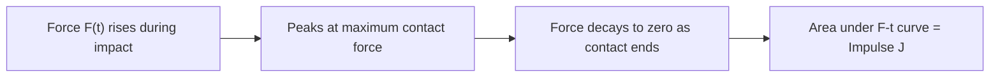
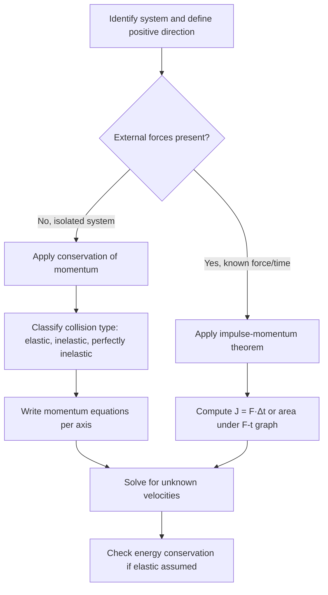

## Linear Momentum and Impulse

### Definition of Linear Momentum

Linear momentum is a vector quantity describing the "quantity of motion" possessed by an object due to its mass and velocity.

$$p = mv$$

Where:

- $p$ = momentum (kg·m/s)
- $m$ = mass (kg)
- $v$ = velocity (m/s)

**Key Points**

- Momentum is a vector; it has both magnitude and direction, matching the direction of velocity.
- SI unit: kilogram-meter per second (kg·m/s), equivalent to newton-second (N·s).
- A heavy, slow-moving object can have the same momentum as a light, fast-moving one.
- Momentum is a conserved quantity in isolated systems, making it one of the most powerful tools in mechanics.

### Momentum as a Vector

Because momentum depends on velocity, it must be treated component-wise in two or three dimensions:

$$p_x = mv_x, \quad p_y = mv_y$$

$$\vec{p} = p_x\hat{i} + p_y\hat{j}$$

The magnitude is $|\vec{p}| = \sqrt{p_x^2 + p_y^2}$, and direction is found via $\theta = \tan^{-1}(p_y/p_x)$.

### Newton's Second Law in Terms of Momentum

Newton originally expressed his second law not as $F = ma$, but as the rate of change of momentum:

$$F_{net} = \frac{dp}{dt}$$

For constant mass, this reduces to the familiar form:

$$F_{net} = \frac{d(mv)}{dt} = m\frac{dv}{dt} = ma$$

This momentum-based formulation is more general because it also applies to systems with **variable mass** (e.g., rockets losing fuel mass, conveyor belts gaining mass), where $F = ma$ alone fails without modification.

### Impulse

Impulse ($J$) is the change in momentum produced by a force acting over a time interval. It links force and time to the resulting change in motion.

$$J = \int F \, dt$$

For a constant force:

$$J = F \Delta t$$

**Impulse-Momentum Theorem**

$$J = \Delta p = p_f - p_i = m v_f - m v_i$$

This theorem states that the impulse delivered to an object equals its change in momentum. It is derived directly by integrating Newton's second law over time:

$$\int F \, dt = \int \frac{dp}{dt} dt = \Delta p$$

**Key Points**

- Impulse is a vector, same direction as the net force (or the change in momentum).
- SI unit: N·s, dimensionally identical to kg·m/s.
- A given impulse can be delivered by a large force over a short time, or a small force over a long time — the product determines the outcome.

### Graphical Interpretation of Impulse

When force varies with time, impulse equals the **area under the force-vs-time curve**:

$$J = \int_{t_i}^{t_f} F(t)\, dt$$

For irregular force curves, the **average force** over the interval satisfies:

$$J = F_{avg} \Delta t$$

### Why Impulse Explains Safety Design

Since $J = F\Delta t$ is fixed for a given momentum change, increasing the time of collision **decreases** the average force experienced.

**Example**

A 70 kg person in a car decelerates from 20 m/s to 0 m/s.

- Impulse required: $J = m\Delta v = 70 \times (0 - 20) = -1400$ N·s
- Case 1 (rigid impact, $\Delta t = 0.05$ s): $F_{avg} = 1400 / 0.05 = 28{,}000$ N
- Case 2 (airbag + crumple zone, $\Delta t = 0.5$ s): $F_{avg} = 1400 / 0.5 = 2{,}800$ N

This tenfold increase in collision time reduces the average force by a factor of 10 — the physical basis for airbags, crumple zones, padded flooring, and catching a ball with "give" in the hand.

### Conservation of Linear Momentum

For an isolated system (no net external force), total momentum is conserved:

$$\sum \vec{p}_{initial} = \sum \vec{p}_{final}$$

For a two-object system:

$$m_1v_{1i} + m_2v_{2i} = m_1v_{1f} + m_2v_{2f}$$

This follows from Newton's third law: internal forces between objects in the system are equal and opposite, so they cancel when summed over the whole system, leaving only external forces to change total momentum.

### Types of Collisions

**Key Points**

- **Elastic collision**: both momentum and kinetic energy are conserved. Objects bounce apart without permanent deformation or heat loss (e.g., idealized billiard balls, atomic/molecular collisions).
- **Inelastic collision**: momentum is conserved, but kinetic energy is not (some converts to heat, sound, deformation).
- **Perfectly inelastic collision**: objects stick together after collision, moving with a common final velocity; this represents the maximum kinetic energy loss allowed by momentum conservation.

**Perfectly Inelastic Collision Formula**

$$v_f = \frac{m_1v_{1i} + m_2v_{2i}}{m_1 + m_2}$$

**Elastic Collision Formulas (1D)**

$$v_{1f} = \frac{(m_1 - m_2)v_{1i} + 2m_2v_{2i}}{m_1 + m_2}$$

$$v_{2f} = \frac{(m_2 - m_1)v_{2i} + 2m_1v_{1i}}{m_1 + m_2}$$

### Example: Perfectly Inelastic Collision

A 1000 kg car moving at 15 m/s collides with and sticks to a stationary 1500 kg car.

$$v_f = \frac{(1000)(15) + (1500)(0)}{1000+1500} = \frac{15000}{2500} = 6 \text{ m/s}$$

**Kinetic energy check:**

- $KE_i = \frac{1}{2}(1000)(15)^2 = 112{,}500$ J
- $KE_f = \frac{1}{2}(2500)(6)^2 = 45{,}000$ J
- Energy lost to deformation/heat/sound: 67,500 J

This confirms momentum conservation holds ($p_i = 15{,}000$ kg·m/s $= p_f$) while kinetic energy is not conserved, consistent with the classification as perfectly inelastic.

### Two-Dimensional Momentum Conservation

For collisions not confined to a line, momentum conservation applies independently along each axis:

$$\sum p_{x,i} = \sum p_{x,f}, \qquad \sum p_{y,i} = \sum p_{y,f}$$

This is commonly used in problems involving glancing collisions, explosions, or billiard-ball scattering at angles.

**Example**

Two identical pucks on frictionless ice: puck A (mass $m$, velocity 4 m/s along +x) strikes stationary puck B. After collision, puck A moves at 30° above the x-axis with speed $v_A'$, and puck B moves at −60° (below x-axis) with speed $v_B'$.

x: $4m = v_A'\cos(30°)\,m + v_B'\cos(60°)\,m$

y: $0 = v_A'\sin(30°)\,m - v_B'\sin(60°)\,m$

Solving these simultaneous equations (standard for equal masses at right-angle separation) gives $v_A' \approx 3.46$ m/s and $v_B' \approx 2.0$ m/s.

### Center of Mass and Momentum

The total momentum of a system equals the total mass times the velocity of the center of mass:

$$\vec{p}_{total} = M_{total}\vec{v}_{cm}$$

If no external force acts on a system, the center of mass moves at constant velocity (or remains at rest) even as individual components of the system interact, collide, or explode internally.

### Momentum in Variable-Mass Systems (Rocket Propulsion)

For systems where mass itself changes (e.g., rockets expelling fuel), the momentum form of Newton's second law must include the mass flow rate. This yields the **rocket equation**:

$$M\frac{dv}{dt} = v_{rel}\frac{dM}{dt}$$

Integrating gives the **Tsiolkovsky rocket equation**:

$$\Delta v = v_{rel}\ln\left(\frac{M_i}{M_f}\right)$$

Where $v_{rel}$ is the exhaust velocity relative to the rocket, $M_i$ is initial mass, and $M_f$ is final mass after fuel burn. [Inference: application of this equation assumes no external forces such as gravity or drag during the burn; real rocket trajectories require additional correction terms.]

### Force-Time Graph (svg_diagram)

<svg xmlns="http://www.w3.org/2000/svg" viewBox="0 0 500 300">
<title>Force-Time Graph (svg_diagram)</title>
<rect x="0" y="0" width="500" height="300" fill="#ffffff" />
<line x1="60" y1="250" x2="460" y2="250" stroke="#333" stroke-width="2" />
<line x1="60" y1="250" x2="60" y2="30" stroke="#333" stroke-width="2" />
<text x="250" y="285" font-size="14" text-anchor="middle" fill="#000">Time (t)</text>
<text x="20" y="140" font-size="14" text-anchor="middle" fill="#000" transform="rotate(-90 20,140)">Force (F)</text>
<path d="M 60 250 Q 150 250 200 100 Q 250 40 300 100 Q 350 250 460 250" fill="none" stroke="#1f77b4" stroke-width="3" />
<path d="M 60 250 Q 150 250 200 100 Q 250 40 300 100 Q 350 250 460 250 L 460 250 L 60 250 Z" fill="#1f77b4" fill-opacity="0.15" />
<text x="230" y="230" font-size="13" fill="#1f77b4" font-style="italic">Area = Impulse J</text>
<line x1="60" y1="180" x2="460" y2="180" stroke="#d62728" stroke-width="2" stroke-dasharray="6,4" />
<text x="400" y="175" font-size="12" fill="#d62728">F_avg</text>
</svg>

### Common Problem-Solving Strategy

### Worked Example: Impulse from a Bat Hitting a Ball

A 0.145 kg baseball approaches a bat at 40 m/s and leaves at 50 m/s in the opposite direction. Contact time is 0.7 ms.

Taking incoming direction as positive:

$$v_i = 40 \text{ m/s}, \quad v_f = -50 \text{ m/s}$$

$$\Delta p = m(v_f - v_i) = 0.145 \times (-50 - 40) = -13.05 \text{ kg·m/s}$$

$$J = \Delta p = -13.05 \text{ N·s}$$

$$F_{avg} = \frac{J}{\Delta t} = \frac{-13.05}{0.0007} \approx -18{,}643 \text{ N}$$

The negative sign indicates the force on the ball acts opposite to its initial direction (i.e., back toward the pitcher), consistent with the bat reversing the ball's motion.

### Common Misconceptions

**Key Points**

- Momentum is not the same as kinetic energy; momentum conservation and energy conservation are separate principles that only both hold simultaneously in elastic collisions.
- An object can have zero net force but still have momentum (constant velocity motion).
- "Heavier objects always have more momentum" is false — momentum depends on the product of mass and velocity, not mass alone.
- Momentum conservation applies to the *system*, not to individual objects within it, unless no internal forces act between them.

### Conclusion

Linear momentum and impulse together provide a time-based, vector framework for analyzing interactions and collisions, complementing the energy-based approach of work and kinetic energy. The impulse-momentum theorem connects force and duration to changes in motion, while conservation of momentum provides a powerful tool for solving collision and explosion problems without needing detailed knowledge of the internal forces involved.

**Next Steps**

- Angular momentum and its conservation in rotational systems
- Work-energy theorem and its relationship to kinetic energy
- Coefficient of restitution and quantifying collision elasticity
- Center of mass motion and systems of particles
- Rocket propulsion and variable-mass dynamics in depth
- Collisions in higher dimensions (3D scattering problems)
- Momentum conservation in relativistic mechanics (advanced/optional)