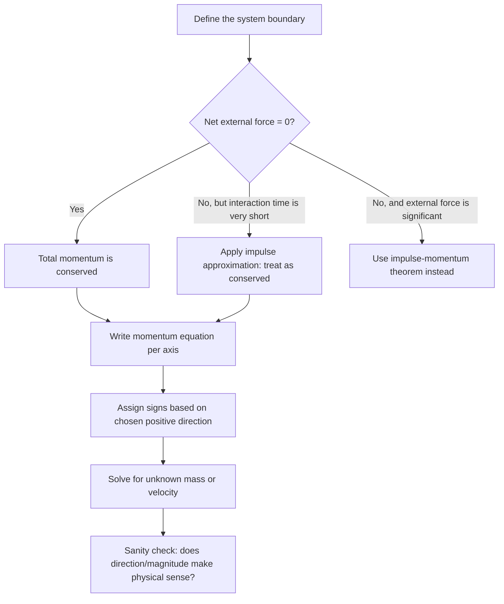

## Conservation of Linear Momentum

### Statement of the Law

The law of conservation of linear momentum states that the total momentum of an isolated system remains constant over time, provided no net external force acts on it.

$$\vec{p}_{total, i} = \vec{p}_{total, f}$$

For a system of $n$ particles:

$$\sum_{k=1}^{n} m_k \vec{v}_{k,i} = \sum_{k=1}^{n} m_k \vec{v}_{k,f}$$

**Key Points**

- This is one of the most fundamental conservation laws in physics, holding in classical mechanics, relativity, and quantum mechanics alike.
- It applies to the *total* momentum of a system, not to each individual object within it.
- The law holds regardless of the nature of the interaction (collision, explosion, gravitational pull, etc.), as long as the system is isolated.

### Derivation from Newton's Third Law

Consider two interacting objects, 1 and 2, exerting forces on each other. By Newton's third law:

$$\vec{F}_{12} = -\vec{F}_{21}$$

The net force on the system equals the sum of these internal forces plus any external forces:

$$\vec{F}_{net} = \vec{F}_{12} + \vec{F}_{21} + \vec{F}_{ext} = \vec{F}_{ext}$$

Since $\vec{F}_{12} + \vec{F}_{21} = 0$, the internal forces cancel. Using $\vec{F}_{net} = d\vec{p}_{total}/dt$:

$$\frac{d\vec{p}_{total}}{dt} = \vec{F}_{ext}$$

If $\vec{F}_{ext} = 0$ (isolated system), then:

$$\frac{d\vec{p}_{total}}{dt} = 0 \implies \vec{p}_{total} = \text{constant}$$

This derivation shows conservation of momentum is not an independent postulate but a direct consequence of Newton's third law applied to a closed system.

### Conditions for Validity

**Key Points**

- **Isolated system**: no net external force acts on the system as a whole.
- Internal forces (collisions, explosions, friction between system components, tension in connecting ropes) do **not** violate conservation, since they cancel in pairs.
- External forces (gravity from outside bodies, applied pushes, friction with the ground/air from outside the system) **do** change total momentum unless they sum to zero.
- Momentum conservation can hold along one axis even if not in another — e.g., if the only external force is vertical (gravity), horizontal momentum is still conserved during a collision.

### Component-Wise Conservation

Because momentum is a vector, conservation applies independently to each spatial component:

$$\sum p_{x,i} = \sum p_{x,f}$$

$$\sum p_{y,i} = \sum p_{y,f}$$

$$\sum p_{z,i} = \sum p_{z,f}$$

This allows momentum conservation to be applied selectively — for example, in projectile-collision problems where gravity acts vertically but the collision itself is analyzed horizontally over a negligibly short time interval.

### Isolated System Diagram (svg_diagram)

<svg xmlns="http://www.w3.org/2000/svg" viewBox="0 0 500 260">
<title>Isolated System Diagram (svg_diagram)</title>
<rect x="0" y="0" width="500" height="260" fill="#ffffff" />
<rect x="130" y="40" width="240" height="160" fill="none" stroke="#333" stroke-width="2" stroke-dasharray="8,4" />
<text x="250" y="30" font-size="14" text-anchor="middle" fill="#000">System Boundary (Isolated)</text>
<circle cx="200" cy="120" r="20" fill="#1f77b4" />
<text x="200" y="125" font-size="12" text-anchor="middle" fill="#fff">m1</text>
<circle cx="300" cy="120" r="28" fill="#d62728" />
<text x="300" y="125" font-size="12" text-anchor="middle" fill="#fff">m2</text>
<line x1="230" y1="120" x2="270" y2="120" stroke="#000" stroke-width="2" marker-end="url(#arrow)" />
<text x="250" y="230" font-size="13" text-anchor="middle" fill="#333">Internal forces (F12, F21) cancel — no external force crosses boundary</text>
</svg>

### Explosive Separation (Recoil)

Conservation of momentum applies equally to systems that separate (explode) as to systems that combine (collide). If an object initially at rest splits into two pieces:

$$0 = m_1\vec{v}_1 + m_2\vec{v}_2$$

This implies the two pieces move in exactly opposite directions with momenta of equal magnitude.

**Example: Recoil of a Gun**

A 4 kg rifle fires a 0.02 kg bullet at 300 m/s. Find the recoil velocity of the rifle.

$$0 = m_{bullet}v_{bullet} + m_{rifle}v_{rifle}$$

$$0 = (0.02)(300) + (4)(v_{rifle})$$

$$v_{rifle} = \frac{-6}{4} = -1.5 \text{ m/s}$$

The negative sign indicates the rifle recoils in the direction opposite to the bullet's motion, consistent with the initial total momentum of zero.

### Example: Two-Body Collision (Conservation Applied)

A 3 kg ball moving at 5 m/s collides with a stationary 2 kg ball. After collision, the 3 kg ball moves at 2 m/s in the same direction. Find the velocity of the 2 kg ball.

$$m_1v_{1i} + m_2v_{2i} = m_1v_{1f} + m_2v_{2f}$$

$$(3)(5) + (2)(0) = (3)(2) + (2)v_{2f}$$

$$15 = 6 + 2v_{2f} \implies v_{2f} = 4.5 \text{ m/s}$$

The second ball moves at 4.5 m/s in the same direction as the first ball's initial motion.

### Momentum Conservation with External Forces (Impulse Approximation)

In many real collisions (bat-ball, car crashes, molecular collisions), external forces like gravity or friction do act on the system, but the collision occurs over such a short time interval that their impulse contribution is negligible compared to the internal collision force:

$$J_{ext} = F_{ext}\Delta t \approx 0 \quad \text{when } \Delta t \to 0$$

This is called the **impulse approximation**, and it justifies treating momentum as conserved during brief, high-force interactions even though the system is not perfectly isolated. [Inference: the validity of this approximation depends on how large external forces are relative to internal collision forces and how short the interaction time is; it is an approximation, not an exact law, whenever external forces are nonzero.]

### Multi-Object Systems and Center of Mass

For a system of multiple particles, total momentum relates to the center of mass velocity:

$$\vec{p}_{total} = M_{total}\vec{v}_{cm}$$

If momentum is conserved, the center of mass moves at constant velocity, unaffected by internal collisions, explosions, or rearrangements of mass within the system. This is why, for example, the center of mass of a fireworks shell continues along its original projectile trajectory even as fragments scatter in all directions after explosion (ignoring air resistance).

### Conservation of Momentum vs. Conservation of Energy

**Key Points**

- Momentum conservation holds in **all** collision types (elastic, inelastic, perfectly inelastic) as long as the system is isolated.
- Kinetic energy conservation holds **only** in elastic collisions.
- Both principles can be applied together only when the collision is confirmed or assumed elastic; otherwise, only momentum conservation is guaranteed.
- This distinction is a frequent source of errors: students sometimes incorrectly assume kinetic energy is conserved in all collisions.

### Problem-Solving Procedure

### Worked Example: Two-Dimensional Explosion

A 6 kg object at rest explodes into two fragments. Fragment A (mass 2 kg) moves at 10 m/s along the +x axis. Fragment B (mass 4 kg) moves at some angle. Find fragment B's velocity components.

Initial momentum is zero, so:

$$0 = m_A\vec{v}_A + m_B\vec{v}_B$$

x-component: $0 = (2)(10) + (4)v_{Bx} \implies v_{Bx} = -5$ m/s

y-component: $0 = (2)(0) + (4)v_{By} \implies v_{By} = 0$ m/s

Fragment B moves at 5 m/s in the $-x$ direction, confirming the fragments separate along a single line (since fragment A had no y-component of velocity) with momenta of equal magnitude and opposite direction.

### Applications

**Key Points**

- **Ballistic pendulum**: determining bullet speed from the swing height of a block it embeds into, combining momentum conservation (during impact) with energy conservation (during the subsequent swing).
- **Rocket and jet propulsion**: expelling mass backward to conserve total system momentum and accelerate forward.
- **Particle physics**: momentum conservation is used to infer the existence and properties of undetected particles (e.g., the neutrino was first proposed to preserve momentum and energy balance in beta decay).
- **Vehicle collision analysis**: accident reconstruction uses momentum conservation to estimate pre-collision speeds from post-collision motion and mass.
- **Sports biomechanics**: analyzing forces in tackles, kicks, and bat/racket impacts.

### Common Misconceptions

**Key Points**

- Conservation of momentum does not mean individual object momenta stay constant — only the vector sum of the system's momentum is constant.
- A system can have conserved momentum while kinetic energy is lost (inelastic collisions) — the two principles are independent unless the collision is elastic.
- "No motion" does not mean "no momentum consideration is needed" — an initially at-rest system still has (zero) total momentum that must be conserved if it later separates or moves.
- External forces such as gravity do not violate momentum conservation instantaneously during a collision if the impulse approximation applies, but they do affect momentum over longer time scales (e.g., a thrown ball's momentum changes continuously due to gravity's constant force).

### Conclusion

Conservation of linear momentum is a direct consequence of Newton's third law and holds for any isolated system regardless of the details of internal interactions. It provides a robust problem-solving tool for collisions, explosions, and recoil scenarios, often succeeding where force-based analysis would be impractical due to unknown or complex internal forces.

**Next Steps**

- Elastic vs. inelastic collisions in greater depth, including coefficient of restitution
- Center of mass calculations for extended and multi-particle systems
- Ballistic pendulum derivation combining momentum and energy conservation
- Angular momentum conservation and its analogy to linear momentum
- Two-dimensional and oblique collision problem-solving techniques
- Momentum conservation in variable-mass systems (rocket propulsion)