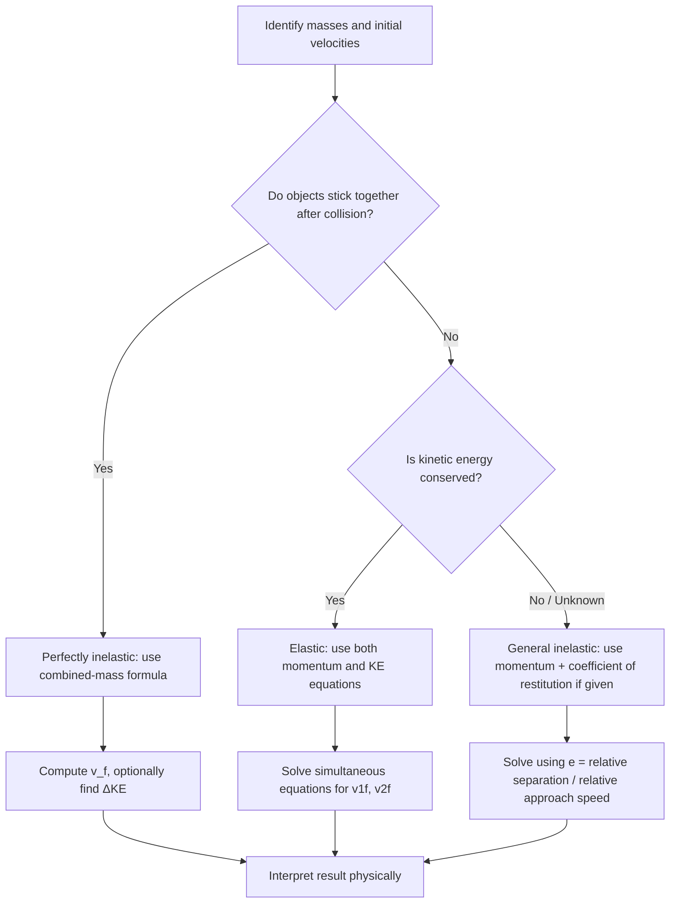

## Elastic and Inelastic Collisions

### Overview and Classification

Collisions are classified by whether kinetic energy is conserved during the interaction. In all collision types (within an isolated system), linear momentum is conserved; the distinguishing factor is the fate of kinetic energy.

**Key Points**

- **Elastic collision**: both momentum and kinetic energy are conserved.
- **Inelastic collision**: momentum is conserved, but kinetic energy is not (converted to heat, sound, deformation, etc.).
- **Perfectly inelastic collision**: a special case of inelastic collision where the objects stick together and move with a common final velocity, representing maximum kinetic energy loss consistent with momentum conservation.
- **Superelastic (explosive) collision**: kinetic energy actually increases, typically due to stored energy (chemical, spring, etc.) being released during contact — e.g., a spring-loaded collision or an explosion within a collision.

### Governing Equations

**Momentum conservation (always applies in an isolated system):**

$$m_1v_{1i} + m_2v_{2i} = m_1v_{1f} + m_2v_{2f}$$

**Kinetic energy conservation (elastic collisions only):**

$$\frac{1}{2}m_1v_{1i}^2 + \frac{1}{2}m_2v_{2i}^2 = \frac{1}{2}m_1v_{1f}^2 + \frac{1}{2}m_2v_{2f}^2$$

### Elastic Collisions: One-Dimensional Solution

Solving the two conservation equations simultaneously for a 1D elastic collision yields:

$$v_{1f} = \frac{(m_1 - m_2)}{m_1 + m_2}v_{1i} + \frac{2m_2}{m_1+m_2}v_{2i}$$

$$v_{2f} = \frac{2m_1}{m_1+m_2}v_{1i} + \frac{(m_2 - m_1)}{m_1+m_2}v_{2i}$$

**Special cases:**

- **Equal masses** ($m_1 = m_2$): the objects exchange velocities entirely. $v_{1f} = v_{2i}$, $v_{2f} = v_{1i}$.
- **$m_2$ initially at rest, $m_1 \gg m_2$**: $v_{1f} \approx v_{1i}$ (heavy object barely slows), $v_{2f} \approx 2v_{1i}$ (light object shoots off at roughly double the incoming speed).
- **$m_2$ initially at rest, $m_1 \ll m_2$**: $v_{1f} \approx -v_{1i}$ (light object bounces straight back), $v_{2f} \approx 0$ (heavy object barely moves).

### Example: Elastic Collision (Equal Masses)

A 2 kg cart moving at 6 m/s elastically collides with a stationary 2 kg cart.

Since masses are equal:

$$v_{1f} = 0 \text{ m/s}, \quad v_{2f} = 6 \text{ m/s}$$

The moving cart stops completely, transferring all its velocity to the previously stationary cart — a classic demonstration (e.g., Newton's cradle).

### Example: Elastic Collision (Unequal Masses)

A 1 kg ball moving at 4 m/s strikes a stationary 3 kg ball elastically.

$$v_{1f} = \frac{(1-3)}{4}(4) + \frac{2(3)}{4}(0) = -2 \text{ m/s}$$

$$v_{2f} = \frac{2(1)}{4}(4) + \frac{(3-1)}{4}(0) = 2 \text{ m/s}$$

The lighter ball rebounds backward at 2 m/s, and the heavier ball moves forward at 2 m/s.

**Verification (kinetic energy):**

- $KE_i = \frac{1}{2}(1)(4)^2 = 8$ J
- $KE_f = \frac{1}{2}(1)(2)^2 + \frac{1}{2}(3)(2)^2 = 2 + 6 = 8$ J ✓

### Perfectly Inelastic Collisions

Objects stick together and share a common final velocity:

$$v_f = \frac{m_1v_{1i} + m_2v_{2i}}{m_1+m_2}$$

**Kinetic energy lost** in a perfectly inelastic collision can be found directly:

$$\Delta KE = \frac{1}{2}\frac{m_1m_2}{m_1+m_2}(v_{1i}-v_{2i})^2$$

This formula shows the energy loss depends on the **relative velocity** of approach and the **reduced mass** $\mu = \dfrac{m_1m_2}{m_1+m_2}$ of the system — larger relative speeds and comparable masses lead to greater energy dissipation.

### Example: Perfectly Inelastic Collision

A 1200 kg car moving at 20 m/s rear-ends a stationary 1000 kg car, and they lock together.

$$v_f = \frac{(1200)(20) + (1000)(0)}{2200} = \frac{24000}{2200} \approx 10.91 \text{ m/s}$$

$$\Delta KE = \frac{1}{2}\cdot\frac{(1200)(1000)}{2200}(20-0)^2 = \frac{1}{2}(545.45)(400) \approx 109{,}091 \text{ J}$$

This energy is dissipated as heat, sound, and permanent deformation of the vehicles.

### General Inelastic Collisions

Between the extremes of perfectly elastic and perfectly inelastic lies the general inelastic case, where objects separate after collision but with some kinetic energy loss. These are characterized using the **coefficient of restitution** ($e$):

$$e = \frac{v_{2f} - v_{1f}}{v_{1i} - v_{2i}} = \frac{\text{relative speed of separation}}{\text{relative speed of approach}}$$

**Key Points**

- $e = 1$: perfectly elastic collision (no kinetic energy loss).
- $0 < e < 1$: general inelastic collision (partial kinetic energy loss).
- $e = 0$: perfectly inelastic collision (objects move together after collision, no separation).
- $e$ is a property of the colliding materials and their surfaces, determined experimentally, not derived from mass or momentum alone. [Inference: real-world $e$ values are influenced by factors such as impact speed, material composition, and temperature, so values often quoted for specific materials are typical rather than universal constants.]

### Collision Spectrum Diagram (svg_diagram)

<svg xmlns="http://www.w3.org/2000/svg" viewBox="0 0 520 220">
<title>Collision Spectrum by Coefficient of Restitution (svg_diagram)</title>
<rect x="0" y="0" width="520" height="220" fill="#ffffff" />
<line x1="60" y1="120" x2="460" y2="120" stroke="#333" stroke-width="3" />
<circle cx="60" cy="120" r="6" fill="#d62728" />
<circle cx="460" cy="120" r="6" fill="#2ca02c" />
<text x="60" y="150" font-size="13" text-anchor="middle" fill="#d62728">e = 0</text>
<text x="60" y="170" font-size="12" text-anchor="middle" fill="#333">Perfectly Inelastic</text>
<text x="260" y="100" font-size="13" text-anchor="middle" fill="#333">0 &lt; e &lt; 1</text>
<text x="260" y="150" font-size="12" text-anchor="middle" fill="#333">General Inelastic</text>
<text x="460" y="150" font-size="13" text-anchor="middle" fill="#2ca02c">e = 1</text>
<text x="460" y="170" font-size="12" text-anchor="middle" fill="#333">Perfectly Elastic</text>
<text x="260" y="30" font-size="14" text-anchor="middle" fill="#000">Increasing Kinetic Energy Retention</text>
</svg>

### Superelastic Collisions

In some interactions, kinetic energy after collision exceeds the initial kinetic energy, meaning $e > 1$. This occurs when internal stored energy (chemical, elastic, nuclear) is released during contact.

**Example**: an explosive charge triggered at the moment of impact between two objects, or a compressed spring released during collision, both convert stored potential energy into additional kinetic energy of the system.

### Kinetic Energy Loss Fraction

For a perfectly inelastic collision with one object initially at rest, the fraction of kinetic energy lost is:

$$\frac{\Delta KE}{KE_i} = \frac{m_2}{m_1+m_2}$$

This shows that if a heavy object strikes a light stationary one, only a small fraction of kinetic energy is lost (most remains as motion), whereas if a light object strikes a heavy stationary one, most kinetic energy is lost (absorbed as heat/deformation) — directly relevant to why lightweight projectiles striking heavy, fixed targets (like a hammer striking a nail head backed by heavy material) transfer energy efficiently into the target rather than causing significant rebound.

### Two-Dimensional (Oblique) Elastic Collisions

For elastic collisions at an angle (e.g., billiard balls), momentum is conserved along both axes, and kinetic energy is conserved overall:

$$m_1v_{1ix} = m_1v_{1fx} + m_2v_{2fx}$$

$$0 = m_1v_{1fy} + m_2v_{2fy}$$

$$\frac{1}{2}m_1v_{1i}^2 = \frac{1}{2}m_1v_{1f}^2 + \frac{1}{2}m_2v_{2f}^2$$

**Special case — equal masses, one initially at rest**: the two objects separate at exactly 90° to each other after an elastic collision. This is a direct geometric consequence of simultaneously satisfying vector momentum conservation and scalar kinetic energy conservation for equal masses, and is frequently observed in billiards and particle-collision (e.g., cosmic ray or nuclear scattering) contexts.

### Problem-Solving Procedure

### Applications and Real-World Examples

**Key Points**

- **Elastic**: gas molecule collisions (kinetic theory of gases), idealized billiard ball collisions, some subatomic particle scattering (e.g., Rutherford scattering approximations), Newton's cradle.
- **Perfectly inelastic**: ballistic pendulum, vehicle collisions where cars crumple and lock together, a dart sticking into a board, coupling railway cars.
- **General inelastic**: bouncing balls (basketball, tennis ball on court — $e$ between 0.6–0.9 depending on ball and surface), most everyday macroscopic collisions.
- **Superelastic**: explosive separations, spring-mediated impacts, some nuclear reactions releasing binding energy.

### Common Misconceptions

**Key Points**

- Momentum is conserved in *all* isolated-system collisions, not just elastic ones — this is a frequent point of confusion.
- "Elastic" does not mean "bouncy" in the everyday sense; it specifically means zero kinetic energy loss, a much stricter condition than simply rebounding.
- Two objects sticking together is sufficient for a collision to be classified as perfectly inelastic, but objects separating afterward does not automatically make a collision elastic — energy loss must be checked explicitly (or $e$ must equal 1).
- The coefficient of restitution $e$ describes the collision/material pair, not a universal property of a single object in isolation.

### Conclusion

Elastic and inelastic collisions represent two ends of a spectrum characterized by kinetic energy conservation (or lack thereof), while momentum conservation applies throughout the entire spectrum in isolated systems. The coefficient of restitution provides a quantitative bridge between these idealized cases, allowing analysis of real-world collisions that fall between perfectly elastic and perfectly inelastic extremes.

**Next Steps**

- Coefficient of restitution: experimental determination and material dependence
- Ballistic pendulum: full derivation combining collision and energy-conservation phases
- Two-dimensional and oblique collision problem-solving in depth
- Center of mass frame analysis for simplifying collision problems
- Kinetic theory of gases and elastic molecular collisions
- Impulse and force-time analysis during collision contact intervals