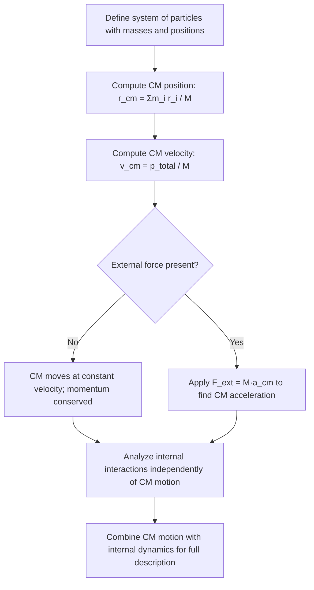

## Center of Mass and Systems of Particles

### Definition of Center of Mass

The center of mass (CM) is the unique point in a system where the entire mass of the system can be considered to be concentrated for the purposes of analyzing translational motion. It represents the mass-weighted average position of all particles in the system.

For a system of discrete particles:

$$\vec{r}_{cm} = \frac{\sum_{i} m_i \vec{r}_i}{\sum_i m_i} = \frac{1}{M}\sum_i m_i \vec{r}_i$$

Where $M = \sum_i m_i$ is the total mass of the system.

In component form:

$$x_{cm} = \frac{\sum_i m_i x_i}{M}, \quad y_{cm} = \frac{\sum_i m_i y_i}{M}, \quad z_{cm} = \frac{\sum_i m_i z_i}{M}$$

**Key Points**

- The center of mass need not coincide with any physical particle in the system (e.g., a donut's CM is in the empty hole).
- For a uniform, symmetric object, the CM coincides with the geometric center.
- CM is distinct from "center of gravity," which coincides with CM only when gravitational field strength is uniform across the object.

### Center of Mass for Continuous Bodies

For a continuous mass distribution, sums become integrals:

$$\vec{r}_{cm} = \frac{1}{M}\int \vec{r}\, dm$$

$$x_{cm} = \frac{1}{M}\int x\, dm, \quad y_{cm} = \frac{1}{M}\int y\, dm, \quad z_{cm} = \frac{1}{M}\int z\, dm$$

For objects with uniform density $\rho$, $dm = \rho\, dV$, simplifying to:

$$x_{cm} = \frac{1}{M}\int x\, \rho\, dV$$

**Symmetry shortcut**: If an object has a line, plane, or point of symmetry combined with uniform density, the CM lies on that symmetry element. This avoids integration in many practical cases (spheres, rectangles, uniform rods, etc.).

### Example: CM of a Two-Particle System

A 3 kg particle is at $x = 0$ m, and a 5 kg particle is at $x = 8$ m.

$$x_{cm} = \frac{(3)(0) + (5)(8)}{3+5} = \frac{40}{8} = 5 \text{ m}$$

The CM lies closer to the heavier particle, as expected — it divides the separation in inverse proportion to the masses.

### Example: CM of a Non-Uniform Rod

A rod of length $L$ has linear density $\lambda(x) = \lambda_0 x$ (density increases linearly along its length), with $x$ measured from one end.

$$M = \int_0^L \lambda_0 x\, dx = \frac{\lambda_0 L^2}{2}$$

$$x_{cm} = \frac{1}{M}\int_0^L x(\lambda_0 x)\, dx = \frac{1}{M}\cdot\frac{\lambda_0 L^3}{3} = \frac{\lambda_0 L^3/3}{\lambda_0 L^2/2} = \frac{2L}{3}$$

The CM lies at $\frac{2L}{3}$ from the thin end — closer to the denser (thick) end, consistent with physical intuition.

### Center of Mass by Composite Parts

For objects composed of several simpler shapes, treat each shape as a point mass at its own CM, then combine:

$$x_{cm} = \frac{\sum_i M_i x_{cm,i}}{\sum_i M_i}$$

This technique also works for **removing** a section (e.g., a hole) by treating the removed piece as a **negative mass**.

**Example**: A uniform square plate of side 4 m (mass 16 kg, density 1 kg/m²) has a circular hole of radius 1 m (mass $\pi$ kg) cut from its center.

Since the hole is at the plate's center (which coincides with the plate's own CM by symmetry), removing it does not shift the CM — it remains at the geometric center of the square, because the "negative mass" is placed exactly at the position of the original CM.

### Center of Mass Diagram (svg_diagram)

<svg xmlns="http://www.w3.org/2000/svg" viewBox="0 0 500 260">
<title>Center of Mass of a Two-Particle System (svg_diagram)</title>
<rect x="0" y="0" width="500" height="260" fill="#ffffff" />
<line x1="40" y1="200" x2="460" y2="200" stroke="#333" stroke-width="2" />
<circle cx="100" cy="200" r="18" fill="#1f77b4" />
<text x="100" y="205" font-size="11" text-anchor="middle" fill="#fff">m1</text>
<text x="100" y="230" font-size="12" text-anchor="middle" fill="#333">x = 0</text>
<circle cx="380" cy="200" r="28" fill="#d62728" />
<text x="380" y="205" font-size="11" text-anchor="middle" fill="#fff">m2</text>
<text x="380" y="245" font-size="12" text-anchor="middle" fill="#333">x = 8</text>
<line x1="285" y1="160" x2="285" y2="200" stroke="#2ca02c" stroke-width="3" />
<polygon points="285,160 278,175 292,175" fill="#2ca02c" />
<text x="285" y="145" font-size="13" text-anchor="middle" fill="#2ca02c">CM (x=5)</text>
</svg>

### Velocity and Acceleration of Center of Mass

Differentiating the position of the CM gives its velocity and acceleration:

$$\vec{v}_{cm} = \frac{1}{M}\sum_i m_i\vec{v}_i = \frac{\vec{p}_{total}}{M}$$

$$\vec{a}_{cm} = \frac{1}{M}\sum_i m_i\vec{a}_i$$

This directly links CM motion to total system momentum:

$$\vec{p}_{total} = M\vec{v}_{cm}$$

### Newton's Second Law for Systems of Particles

The total external force on a system equals the total mass times the acceleration of the center of mass — **internal forces do not affect CM motion**, since they cancel in pairs by Newton's third law:

$$\vec{F}_{ext, net} = M\vec{a}_{cm}$$

This is a profound simplification: regardless of how complex the internal interactions of a system are (explosions, collisions, deformations, rotations), the center of mass moves exactly as if all the mass were concentrated there and all external forces acted directly on that point.

**Key Points**

- If $\vec{F}_{ext,net} = 0$, the CM moves at constant velocity (or remains at rest) — this is precisely the condition for momentum conservation.
- Internal explosions, collisions, or fragmentations change the individual trajectories of pieces but never change the CM's trajectory (in the absence of external force).
- This principle underlies why a spinning, tumbling object thrown through the air still has its CM follow a simple parabolic trajectory under gravity alone.

### Example: Projectile Explosion and CM Trajectory

A shell is launched and follows a parabolic trajectory. At the peak of its flight, it explodes into two fragments of equal mass. Fragment A lands directly below the explosion point; where does fragment B land relative to where the unexploded shell would have landed?

Since the explosion is an internal event with no new external force, the CM of the two fragments continues along the **original parabolic trajectory** and lands where the intact shell would have landed. If fragment A (half the total mass) lands at the explosion point's ground projection (call it distance $d_1$ from launch), and the CM lands at distance $d_{cm}$ (same as unexploded range), then by the CM formula:

$$d_{cm} = \frac{m_A d_1 + m_B d_2}{m_A + m_B} \implies d_2 = 2d_{cm} - d_1$$

Fragment B lands at whatever distance satisfies this relation — a classic application demonstrating that CM motion is unaffected by internal explosive forces.

### Reduced Mass and Two-Body Problems

For analyzing the relative motion of two interacting particles, it is often useful to transform to the **center of mass reference frame**, using the reduced mass:

$$\mu = \frac{m_1 m_2}{m_1 + m_2}$$

This allows a two-body problem (e.g., gravitational orbits, diatomic molecule vibration) to be reduced to an equivalent one-body problem of a particle with mass $\mu$ moving under the interaction force, referenced to the CM. [Inference: this technique is standard in celestial mechanics and molecular physics; its direct classroom application is more common in advanced coursework than introductory treatments.]

### Center of Mass Frame Analysis

Analyzing collisions in the **center of mass (zero-momentum) frame** simplifies many problems because, by definition, total momentum in this frame is always zero:

$$\vec{p}_{total, cm frame} = 0$$

**Key Points**

- In the CM frame, for an elastic collision between two particles, both particles simply reverse their velocity direction (magnitudes preserved), since momentum must remain zero and kinetic energy must be conserved.
- Converting results back to the lab frame requires adding the CM velocity $\vec{v}_{cm}$ to each particle's CM-frame velocity.
- This technique is widely used in particle physics and simplifies otherwise complex two-dimensional scattering problems.

### Systems of Particles: General Framework

### Applications

**Key Points**

- **Rocket and jet propulsion**: analyzing overall vehicle trajectory via CM motion while internal mass ejection redistributes momentum among rocket body and exhaust.
- **Astrophysics**: binary star systems orbit their common center of mass rather than one body orbiting a fixed point.
- **Structural engineering**: locating the CM (and center of gravity) is essential for stability analysis of buildings, vehicles, and cranes.
- **Sports biomechanics**: a diver's or gymnast's CM follows a simple parabolic path during flight even as the body rotates and reshapes around it.
- **Robotics**: balance and locomotion control algorithms track a robot's CM (or "zero-moment point") for stability.

### Common Misconceptions

**Key Points**

- The center of mass is not necessarily located inside the physical material of the object (e.g., a boomerang, horseshoe, or hollow sphere).
- Center of mass and centroid are the same only for uniform-density objects; for non-uniform density, they differ.
- Rotational motion about the CM does not affect the CM's own translational trajectory — these two aspects of motion are independent and can be analyzed separately.
- A system with zero total momentum does not mean the individual particles are at rest — it means their momenta sum to zero vectorially (e.g., two equal masses moving toward each other at equal speed).

### Conclusion

The center of mass concept allows complex, multi-particle or extended systems to be analyzed as if all mass were concentrated at a single point, with external forces determining the CM's motion independent of internal interactions. This principle directly connects to momentum conservation, since a constant CM velocity is equivalent to conserved total momentum, and provides essential simplification for analyzing explosions, collisions, rotations, and extended rigid-body motion.

**Next Steps**

- Moment of inertia and rotational analogs of mass distribution
- Rigid body dynamics: combining CM translation with rotation about the CM
- Reduced mass and the two-body problem in orbital mechanics
- Center of mass frame techniques for elastic and inelastic collision analysis
- Torque and angular momentum about the center of mass
- Stability and center of gravity in engineering applications