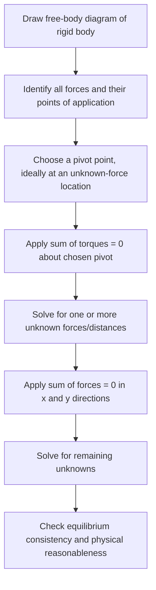

## Torque and Rotational Equilibrium

### Definition of Torque

Torque ($\tau$) is the rotational analog of force — it measures the tendency of a force to produce angular acceleration about a pivot or rotation axis. Torque depends not only on the magnitude of the applied force but also on where and in what direction it is applied relative to the axis.

$$\vec{\tau} = \vec{r}\times\vec{F}$$

In scalar form, for the magnitude:

$$\tau = rF\sin\theta$$

Where:

- $r$ = distance from the rotation axis to the point of force application (the **position vector** magnitude)
- $F$ = magnitude of the applied force
- $\theta$ = angle between $\vec{r}$ and $\vec{F}$

Units: newton-meters (N·m). Note that although dimensionally identical to the joule (N·m = J), torque is **not** measured in joules, since it is not a form of energy — this distinction is maintained by convention to avoid confusion.

**Key Points**

- Torque is a vector; its direction is given by the right-hand rule, curling fingers from $\vec{r}$ toward $\vec{F}$, thumb pointing along $\vec{\tau}$ (along the rotation axis).
- Maximum torque occurs when the force is applied perpendicular to the position vector ($\theta = 90°$); zero torque occurs when force is applied along the position vector ($\theta = 0°$ or $180°$).
- Torque depends on the choice of pivot/axis — the same force can produce different torques about different reference points.

### Lever Arm (Moment Arm)

An equivalent and often more intuitive way to compute torque magnitude uses the **lever arm** (or moment arm), $d$ — the perpendicular distance from the rotation axis to the *line of action* of the force:

$$\tau = Fd$$

Where $d = r\sin\theta$.

**Key Points**

- The lever arm is always measured perpendicular to the force's line of action, not simply the distance to the point of application.
- Maximizing lever arm (e.g., using a longer wrench, or pushing a door far from its hinges) maximizes torque for a given force — the basis of mechanical advantage in levers and tools.

### Torque Diagram (svg_diagram)

<svg xmlns="http://www.w3.org/2000/svg" viewBox="0 0 460 300">
<title>Torque and Lever Arm (svg_diagram)</title>
<rect x="0" y="0" width="460" height="300" fill="#ffffff" />
<circle cx="80" cy="220" r="6" fill="#333" />
<text x="80" y="250" font-size="12" text-anchor="middle" fill="#333">Pivot</text>
<line x1="80" y1="220" x2="340" y2="220" stroke="#555" stroke-width="6" stroke-linecap="round" />
<line x1="80" y1="220" x2="300" y2="110" stroke="#333" stroke-width="1" stroke-dasharray="3,3" />
<text x="190" y="160" font-size="12" fill="#333">r</text>
<line x1="300" y1="110" x2="360" y2="60" stroke="#d62728" stroke-width="4" marker-end="url(#arrowF)" />
<text x="370" y="55" font-size="13" fill="#d62728">F</text>
<line x1="80" y1="220" x2="300" y2="110" stroke="none" />
<path d="M 300 110 L 240 220" stroke="#2ca02c" stroke-width="2" stroke-dasharray="5,3" />
<text x="255" y="180" font-size="12" fill="#2ca02c">d (lever arm)</text>
<path d="M 100 210 A 30 30 0 0 1 130 190" fill="none" stroke="#1f77b4" stroke-width="2" />
<text x="140" y="205" font-size="12" fill="#1f77b4">θ</text>
</svg>

### Net Torque and Rotational Newton's Second Law

When multiple torques act on a rigid body, they combine as vectors (typically as signed scalars for rotation about a fixed axis, with counterclockwise conventionally positive):

$$\tau_{net} = \sum_i \tau_i = I\alpha$$

This is the rotational analog of $F_{net} = ma$, where $I$ is the moment of inertia (rotational inertia) and $\alpha$ is angular acceleration.

**Key Points**

- Torque causes angular acceleration, just as force causes linear acceleration.
- The same net torque produces less angular acceleration on an object with greater moment of inertia — $I$ plays the role of rotational "resistance to change in motion."
- Multiple forces can produce canceling torques even if they don't cancel as forces (and vice versa), so torque and force balance must be analyzed separately.

### Sign Convention for Torque

**Key Points**

- By standard convention, counterclockwise torques are taken as positive, clockwise as negative (though the reverse convention is equally valid if applied consistently).
- The sign of torque depends on the direction of the force's rotational tendency about the chosen pivot, not on the force's own direction in space.
- Consistent sign convention is essential when summing multiple torques acting on the same body.

### Rotational Equilibrium

An object is in **rotational equilibrium** when the net torque acting on it is zero:

$$\sum \tau = 0$$

This means the object's angular velocity is constant (including possibly zero — no rotation).

**Static equilibrium** requires both translational and rotational equilibrium simultaneously:

$$\sum \vec{F} = 0 \quad \text{and} \quad \sum \tau = 0$$

**Key Points**

- An object can be in translational equilibrium (net force zero) while still experiencing angular acceleration if net torque is nonzero (e.g., a couple — two equal, opposite, offset forces).
- Conversely, an object can be in rotational equilibrium while accelerating translationally (e.g., a rigid body with all forces acting through its center of mass).
- For statics problems, torque can be summed about **any** chosen pivot point — the equilibrium condition $\sum\tau = 0$ holds regardless of pivot choice, but choosing a pivot that eliminates unknown forces (e.g., at a hinge or contact point) greatly simplifies calculation.

### Example: Torque on a See-Saw

A 40 kg child sits 2 m from the pivot of a see-saw. Where must an 80 kg adult sit on the opposite side to balance it (ignore the see-saw's own mass)?

Using rotational equilibrium about the pivot, with $g$ canceling from both sides:

$$\tau_{child} = \tau_{adult}$$

$$(40)(2) = (80)(d_{adult})$$

$$d_{adult} = \frac{80}{80} = 1 \text{ m}$$

The adult must sit 1 m from the pivot to balance the 40 kg child sitting 2 m away, since torque depends on the product of weight and distance.

### Example: Beam Supported at Two Points (Static Equilibrium)

A uniform 5 m beam of weight 200 N rests on two supports: one at the left end ($A$) and one 1 m from the right end ($B$). A 150 N weight hangs 1 m from the left end. Find the forces at $A$ and $B$.

The beam's own weight acts at its center (2.5 m from $A$). Taking torques about $A$ (eliminating the unknown force at $A$ from the torque equation):

$$\sum \tau_A = 0: \quad F_B(4) - (200)(2.5) - (150)(1) = 0$$

$$F_B(4) = 500 + 150 = 650 \implies F_B = 162.5 \text{ N}$$

Using translational equilibrium:

$$F_A + F_B = 200 + 150 = 350 \implies F_A = 350 - 162.5 = 187.5 \text{ N}$$

This two-step method — apply $\sum\tau = 0$ about a strategically chosen pivot, then $\sum F = 0$ — is the standard technique for rigid-body statics problems.

### Example: Ladder Against a Wall

A ladder of length $L$ and weight $W$ leans against a frictionless wall, with friction $f$ at the ground providing horizontal support. Find the minimum coefficient of friction needed for the ladder to remain in equilibrium at angle $\theta$ from the ground, with the ladder's weight acting at its midpoint.

Taking torques about the base of the ladder (eliminating both ground reaction forces from the torque equation):

$$\sum \tau_{base} = 0: \quad N_{wall}(L\sin\theta) - W\left(\frac{L}{2}\cos\theta\right) = 0$$

$$N_{wall} = \frac{W}{2\tan\theta}$$

From horizontal force balance, $f = N_{wall}$, and from vertical balance, $N_{ground} = W$. The minimum coefficient of static friction required is:

$$\mu_{min} = \frac{f}{N_{ground}} = \frac{W/(2\tan\theta)}{W} = \frac{1}{2\tan\theta}$$

This shows that as the ladder becomes more vertical (larger $\theta$), less friction is required — consistent with physical intuition that a steeply-leaned ladder is more stable against slipping at its base.

### Couples

A **couple** consists of two equal and opposite forces acting along different (parallel) lines of action, producing a net torque with **zero net force**:

$$\tau_{couple} = Fd$$

Where $d$ is the perpendicular distance between the two lines of action.

**Key Points**

- A couple causes pure rotation with no translational effect, since the forces cancel exactly.
- The torque produced by a couple is the same about *any* chosen pivot point — unlike torque from a single force, which depends on pivot location.
- Steering wheels, screwdrivers being turned, and certain wrench applications approximate couples.

### Problem-Solving Procedure for Statics

### Center of Gravity vs. Center of Mass

The **center of gravity** is the point where the total gravitational torque on an object can be considered to act. In a uniform gravitational field, this coincides exactly with the center of mass:

$$\vec{r}_{cg} = \vec{r}_{cm} \quad \text{(uniform } g\text{)}$$

**Key Points**

- For everyday objects on Earth's surface, the gravitational field is uniform to an excellent approximation, so center of gravity and center of mass are used interchangeably in practice.
- For very large objects (e.g., tall structures, or objects in strongly non-uniform fields), center of gravity can differ slightly from center of mass, since parts of the object experience different gravitational field strengths. [Inference: this distinction is negligible for typical introductory-level problems and becomes relevant primarily in specialized contexts like large-scale structural or orbital mechanics analysis.]

### Stability and Equilibrium Types

**Key Points**

- **Stable equilibrium**: a small displacement creates a restoring torque back toward the equilibrium position (center of gravity rises when displaced — e.g., a cone resting on its base).
- **Unstable equilibrium**: a small displacement creates a torque that increases the displacement further (center of gravity falls when displaced — e.g., a cone balanced on its point).
- **Neutral equilibrium**: a small displacement produces no net torque (center of gravity stays at the same height — e.g., a ball on a flat surface).
- An object tips over when its center of gravity's vertical projection moves outside its base of support.

### Applications

**Key Points**

- **Structural engineering**: analyzing beams, bridges, cranes, and cantilevers for static equilibrium under distributed and point loads.
- **Biomechanics**: torque analysis of joints (e.g., elbow, knee) under muscular forces and external loads.
- **Tool design**: wrenches, levers, and pliers are designed to maximize torque via lever-arm length for mechanical advantage.
- **Vehicle stability**: analyzing rollover torque and center-of-gravity height in vehicle design.
- **Robotics**: joint torque control and balance algorithms for legged robots and manipulators.

### Common Misconceptions

**Key Points**

- Zero net force does not guarantee zero net torque, and vice versa — both conditions must be checked independently for full static equilibrium.
- Torque depends on the perpendicular lever arm distance, not simply the straight-line distance to the point of force application, unless the force is applied perpendicular to the position vector.
- The choice of pivot point for summing torques is arbitrary in equilibrium problems (the equation $\sum\tau=0$ holds about any point), but choosing it strategically greatly simplifies algebra by eliminating unknown forces from the equation.
- A larger applied force does not necessarily produce more torque if it is applied with a shorter lever arm or at an unfavorable angle.

### Conclusion

Torque quantifies the rotational effectiveness of a force based on both its magnitude and its lever arm relative to a rotation axis, serving as the direct rotational analog of force in translational mechanics. Rotational equilibrium, achieved when net torque is zero, combines with translational equilibrium to fully describe static systems, forming the foundation of structural analysis, biomechanics, and mechanical design.

**Next Steps**

- Moment of inertia: calculation methods for various rigid body geometries
- Rotational form of Newton's second law: $\tau = I\alpha$ in dynamic (non-equilibrium) problems
- Angular momentum and its conservation in rotational systems
- Rotational kinetic energy and the work-energy theorem for rotation
- Rolling motion: combining translational and rotational dynamics
- Precession and gyroscopic effects in rotating systems