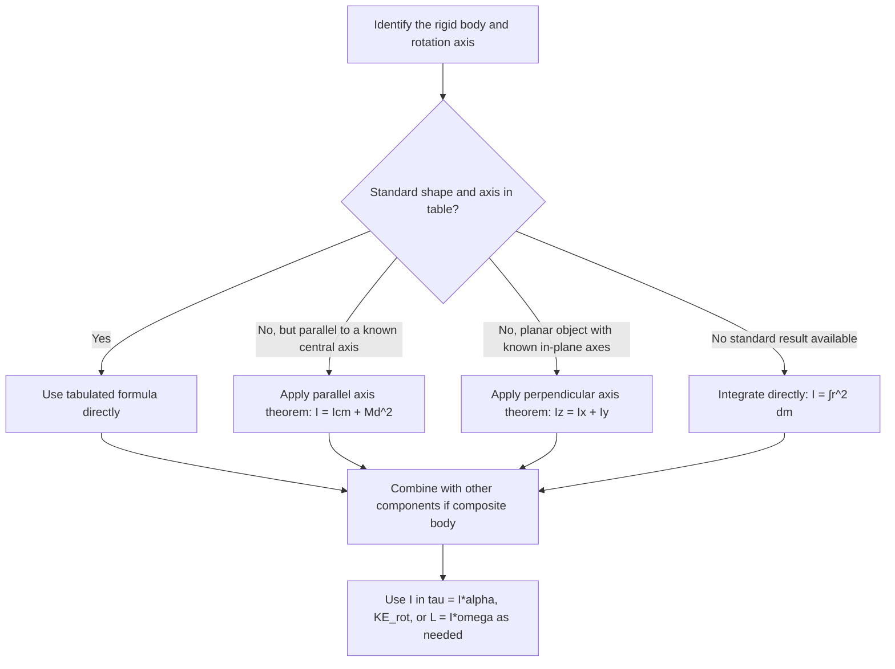

## Moment of Inertia

### Definition of Moment of Inertia

Moment of inertia ($I$) is the rotational analog of mass — it quantifies an object's resistance to changes in its angular velocity (rotational inertia) about a specific axis. Unlike mass, which is an intrinsic scalar property, moment of inertia depends on **both** the distribution of mass **and** the location of the rotation axis.

For a system of discrete point particles:

$$I = \sum_i m_i r_i^2$$

Where $r_i$ is the perpendicular distance of particle $i$ from the rotation axis.

For a continuous mass distribution:

$$I = \int r^2\, dm$$

Units: kilogram-meters squared (kg·m²).

**Key Points**

- The same object has different moments of inertia about different axes — there is no single "moment of inertia" for a rigid body without specifying the axis.
- Mass located farther from the rotation axis contributes disproportionately more to $I$, since the contribution scales with $r^2$.
- Moment of inertia plays the role of mass in the rotational form of Newton's second law: $\tau = I\alpha$.

### Physical Significance

**Key Points**

- A higher $I$ means more torque is required to produce the same angular acceleration — the object is "harder to spin up" or "harder to slow down."
- Distributing mass farther from the axis (even with the same total mass) increases $I$, which is why a figure skater spins faster when arms are pulled in (reducing $I$) and slower when arms are extended (increasing $I$), consistent with angular momentum conservation.
- Objects with identical mass and shape but different axis choices (e.g., a rod rotated about its center vs. about its end) have significantly different $I$ values.

### Moment of Inertia for Common Shapes

The following are standard results derived via integration for uniform-density rigid bodies, widely tabulated and used directly in problem-solving:

| Shape | Axis | Moment of Inertia |
| --- | --- | --- |
| Point mass | Distance $r$ from axis | $I = mr^2$ |
| Thin rod, length $L$ | Through center, perpendicular to rod | $I = \frac{1}{12}mL^2$ |
| Thin rod, length $L$ | Through one end, perpendicular to rod | $I = \frac{1}{3}mL^2$ |
| Solid cylinder/disk, radius $R$ | Through central (symmetry) axis | $I = \frac{1}{2}mR^2$ |
| Thin-walled hollow cylinder, radius $R$ | Through central axis | $I = mR^2$ |
| Solid sphere, radius $R$ | Through center (any diameter) | $I = \frac{2}{5}mR^2$ |
| Thin spherical shell, radius $R$ | Through center | $I = \frac{2}{3}mR^2$ |
| Rectangular plate, sides $a, b$ | Through center, perpendicular to plate | $I = \frac{1}{12}m(a^2+b^2)$ |
| Thin ring/hoop, radius $R$ | Through central axis | $I = mR^2$ |

**Key Points**

- Objects with mass concentrated closer to the axis (solid sphere, solid cylinder) have smaller $I$ coefficients than those with mass concentrated farther out (hoop, thin shell), for the same total mass and radius.
- These formulas assume uniform density; non-uniform density distributions require direct integration.

### Derivation Example: Thin Rod About Its Center

For a uniform rod of mass $M$, length $L$, linear density $\lambda = M/L$, rotated about an axis through its center perpendicular to its length:

$$I = \int_{-L/2}^{L/2} x^2 \lambda\, dx = \lambda\left[\frac{x^3}{3}\right]_{-L/2}^{L/2} = \lambda\left(\frac{L^3}{24} + \frac{L^3}{24}\right) = \frac{\lambda L^3}{12}$$

Substituting $\lambda = M/L$:

$$I = \frac{M}{L}\cdot\frac{L^3}{12} = \frac{1}{12}ML^2$$

This confirms the standard tabulated result and illustrates the direct integration method $I = \int r^2\, dm$ applied to a simple geometry.

### Derivation Example: Solid Disk About Its Central Axis

For a uniform disk of mass $M$, radius $R$, surface density $\sigma = M/(\pi R^2)$, using thin ring elements of radius $r$, thickness $dr$:

$$dm = \sigma(2\pi r\, dr)$$

$$I = \int_0^R r^2\, \sigma(2\pi r)\, dr = 2\pi\sigma\int_0^R r^3\, dr = 2\pi\sigma\frac{R^4}{4} = \frac{\pi\sigma R^4}{2}$$

Substituting $\sigma = M/(\pi R^2)$:

$$I = \frac{\pi R^4}{2}\cdot\frac{M}{\pi R^2} = \frac{1}{2}MR^2$$

This matches the standard tabulated result for a solid disk/cylinder about its central axis.

### Mass Distribution Comparison (svg_diagram)

<svg xmlns="http://www.w3.org/2000/svg" viewBox="0 0 520 240">
<title>Moment of Inertia by Mass Distribution (svg_diagram)</title>
<rect x="0" y="0" width="520" height="240" fill="#ffffff" />
<circle cx="110" cy="120" r="60" fill="#dbe9f6" stroke="#1f77b4" stroke-width="2" />
<circle cx="110" cy="120" r="8" fill="#1f77b4" />
<circle cx="150" cy="90" r="6" fill="#1f77b4" />
<circle cx="80" cy="150" r="6" fill="#1f77b4" />
<circle cx="130" cy="150" r="6" fill="#1f77b4" />
<text x="110" y="210" font-size="13" text-anchor="middle" fill="#333">Solid disk: I = ½MR²</text>
<circle cx="400" cy="120" r="60" fill="none" stroke="#d62728" stroke-width="3" />
<circle cx="400" cy="60" r="6" fill="#d62728" />
<circle cx="460" cy="120" r="6" fill="#d62728" />
<circle cx="400" cy="180" r="6" fill="#d62728" />
<circle cx="340" cy="120" r="6" fill="#d62728" />
<text x="400" y="210" font-size="13" text-anchor="middle" fill="#333">Thin hoop: I = MR²</text>
</svg>

### The Parallel Axis Theorem

The parallel axis theorem allows the moment of inertia about **any** axis parallel to an axis through the center of mass to be found without re-integrating:

$$I = I_{cm} + Md^2$$

Where:

- $I_{cm}$ = moment of inertia about the axis through the center of mass
- $M$ = total mass of the object
- $d$ = perpendicular distance between the two parallel axes

**Key Points**

- $I_{cm}$ is always the **minimum** possible moment of inertia among all parallel axes, since $Md^2 \geq 0$ always adds a positive quantity.
- This theorem is extremely useful for finding $I$ about off-center axes (e.g., a rod rotated about its end) directly from the known central-axis value.
- The theorem applies only between parallel axes — it does not relate moments of inertia about axes with different orientations.

### Example: Parallel Axis Theorem Applied to a Rod

Verify the rod-about-end formula using the parallel axis theorem, given $I_{cm} = \frac{1}{12}ML^2$ and $d = L/2$ (distance from center to end):

$$I_{end} = I_{cm} + Md^2 = \frac{1}{12}ML^2 + M\left(\frac{L}{2}\right)^2 = \frac{1}{12}ML^2 + \frac{1}{4}ML^2$$

$$I_{end} = \frac{1}{12}ML^2 + \frac{3}{12}ML^2 = \frac{4}{12}ML^2 = \frac{1}{3}ML^2$$

This confirms the tabulated result for a rod rotated about its end, obtained directly from the central-axis value without separate integration.

### The Perpendicular Axis Theorem

For a **planar (2D, laminar)** object, the moment of inertia about an axis perpendicular to the plane equals the sum of moments of inertia about two perpendicular in-plane axes intersecting at the same point:

$$I_z = I_x + I_y$$

**Key Points**

- This theorem applies **only** to flat, planar objects (effectively zero thickness) — it does not apply to three-dimensional solids like spheres or cylinders.
- Commonly used for rings, disks, and flat plates to relate the axis perpendicular to the plane with in-plane axes.

### Example: Perpendicular Axis Theorem Applied to a Ring

A thin ring of mass $M$, radius $R$ has $I_z = MR^2$ about its central axis (perpendicular to the ring's plane). By symmetry, the two in-plane diameters share equal moments of inertia ($I_x = I_y$):

$$I_z = I_x + I_y = 2I_x \implies I_x = \frac{MR^2}{2}$$

This gives the moment of inertia of a ring about a diameter (an in-plane axis) as $\frac{1}{2}MR^2$, derived directly from the perpendicular axis theorem without separate integration.

### Moment of Inertia for Composite Bodies

For objects composed of multiple simple shapes, the total moment of inertia about a common axis is the sum of the individual moments of inertia (each computed about that same axis, using the parallel axis theorem as needed):

$$I_{total} = \sum_i I_i = \sum_i\left(I_{cm,i} + m_id_i^2\right)$$

**Example**: A dumbbell consists of two 2 kg spheres (treated as point masses) at the ends of a massless 1 m rod, rotating about the rod's center.

$$I = 2\left[m\left(\frac{L}{2}\right)^2\right] = 2\left[(2)(0.5)^2\right] = 2(0.5) = 1 \text{ kg·m}^2$$

If the rod itself has mass 0.5 kg (uniform), its contribution ($I_{rod} = \frac{1}{12}(0.5)(1)^2 \approx 0.0417$ kg·m²) is added to the point-mass contributions for the total system moment of inertia.

### Radius of Gyration

The **radius of gyration** ($k$) is a convenient way to express an object's moment of inertia as if all its mass were concentrated at a single distance from the axis:

$$I = Mk^2 \implies k = \sqrt{\frac{I}{M}}$$

**Key Points**

- Radius of gyration allows comparison of rotational inertia "efficiency" across different shapes independent of total mass.
- For a solid disk, $k = R/\sqrt{2} \approx 0.707R$; for a hoop, $k = R$ — reflecting the hoop's mass being entirely at maximum radius.

### Moment of Inertia in Rotational Dynamics

Moment of inertia appears directly in the rotational form of Newton's second law and in rotational kinetic energy:

$$\tau_{net} = I\alpha$$

$$KE_{rot} = \frac{1}{2}I\omega^2$$

$$L = I\omega \quad \text{(angular momentum, fixed axis case)}$$

These relationships mirror $F=ma$, $KE = \frac{1}{2}mv^2$, and $p=mv$ directly, with $I$ replacing $m$, confirming its role as the rotational analog of mass.

### Example: Comparing Rolling Objects

A solid sphere, solid cylinder, and thin hoop (all same mass $M$ and radius $R$) are released from rest at the top of an incline and roll without slipping. Which reaches the bottom first?

Using energy conservation with rolling constraint $v = R\omega$:

$$Mgh = \frac{1}{2}Mv^2 + \frac{1}{2}I\omega^2 = \frac{1}{2}Mv^2\left(1 + \frac{I}{MR^2}\right)$$

$$v^2 = \frac{2gh}{1 + I/(MR^2)}$$

Since the hoop has the largest $I/(MR^2)$ ratio (= 1), it has the smallest $v$ and arrives last. The solid sphere has the smallest ratio ($2/5$), giving the largest $v$, so it arrives first — regardless of mass or radius, since these cancel out of the ratio $I/(MR^2)$ for each shape.

$$\text{Order (fastest to slowest): solid sphere} > \text{solid cylinder} > \text{thin hoop}$$

### Problem-Solving Procedure

### Applications

**Key Points**

- **Flywheels**: designed with mass concentrated at the rim (high $I$) to store rotational kinetic energy efficiently for energy storage systems and engines.
- **Sports**: figure skaters, divers, and gymnasts manipulate body $I$ by changing limb position to control spin rate via angular momentum conservation.
- **Vehicle design**: wheel and rotor moment of inertia affects acceleration, braking response, and fuel efficiency.
- **Mechanical engineering**: gear trains, turbines, and rotating machinery require precise $I$ calculations for torque and speed analysis.
- **Structural/seismic engineering**: rotational inertia of building components factors into dynamic response analysis under torsional loading.

### Common Misconceptions

**Key Points**

- Moment of inertia is not a fixed property of an object like mass — it depends explicitly on the chosen rotation axis, and can vary significantly for the same object.
- Larger objects do not automatically have larger $I$ — distribution of mass relative to the axis matters more than overall size or total mass alone.
- The parallel axis theorem can only be applied starting from the **center of mass** axis value ($I_{cm}$) — it cannot be used to relate two arbitrary parallel axes directly, only via the center-of-mass axis as an intermediate reference.
- The perpendicular axis theorem applies only to planar (2D) objects, not three-dimensional solids — a common source of misapplication.

### Conclusion

Moment of inertia is the rotational analog of mass, quantifying resistance to angular acceleration based on both the amount and spatial distribution of mass relative to a chosen rotation axis. Standard formulas for common shapes, combined with the parallel and perpendicular axis theorems, provide efficient tools for calculating $I$ in composite and off-center configurations, forming an essential foundation for rotational dynamics, energy, and angular momentum analysis.

**Next Steps**

- Rotational kinetic energy and the work-energy theorem for rotation
- Angular momentum: definition, conservation, and applications
- Rolling motion: combining translational and rotational dynamics
- Torque and the rotational form of Newton's second law in dynamic problems
- Physical pendulum analysis using moment of inertia
- Precession and gyroscopic motion (advanced topic)