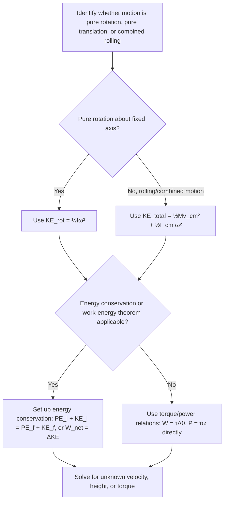

## Rotational Kinetic Energy

### Definition

Rotational kinetic energy is the kinetic energy associated with an object's rotational motion about an axis, arising from the collective motion of all mass elements as they move in circles around that axis.

For a rigid body rotating with angular velocity $\omega$ about a fixed axis, each mass element $m_i$ at distance $r_i$ from the axis moves with tangential speed $v_i = r_i\omega$. Summing the kinetic energy of all elements:

$$KE_{rot} = \sum_i \frac{1}{2}m_iv_i^2 = \sum_i\frac{1}{2}m_i(r_i\omega)^2 = \frac{1}{2}\omega^2\sum_i m_ir_i^2$$

Recognizing $\sum_i m_ir_i^2 = I$ (moment of inertia):

$$KE_{rot} = \frac{1}{2}I\omega^2$$

Units: joules (J), same as translational kinetic energy.

**Key Points**

- This equation is the direct rotational analog of $KE_{trans} = \frac{1}{2}mv^2$, with $I$ replacing $m$ and $\omega$ replacing $v$.
- Rotational kinetic energy depends on both the moment of inertia (mass distribution relative to the axis) and the square of angular velocity.
- Rotational KE is always non-negative and is a scalar quantity, regardless of the direction of rotation.

### Derivation Significance

**Key Points**

- The derivation shows rotational KE emerges naturally from summing translational KE of individual mass elements moving in circular paths — it is not a fundamentally new form of energy, but a convenient bookkeeping of translational KE for rotating systems.
- Because $I$ already encodes the mass distribution (via $\sum m_ir_i^2$), the formula $\frac{1}{2}I\omega^2$ avoids needing to track each mass element's individual speed separately.

### Total Kinetic Energy for Rolling and Combined Motion

For an object undergoing both translation (of its center of mass) and rotation (about its center of mass) simultaneously — such as a rolling wheel — total kinetic energy is the sum of translational and rotational contributions:

$$KE_{total} = KE_{trans} + KE_{rot} = \frac{1}{2}Mv_{cm}^2 + \frac{1}{2}I_{cm}\omega^2$$

**Key Points**

- This decomposition is valid because the total kinetic energy of a rigid body can always be split into center-of-mass translational motion plus rotation about the center of mass — a general theorem in rigid body dynamics.
- For rolling without slipping, $v_{cm} = R\omega$ links the two terms, allowing total KE to be expressed in terms of a single variable.

### Rolling Without Slipping: Combined KE Formula

Substituting $\omega = v_{cm}/R$ into the total KE expression:

KE_{total} = \frac{1}{2}Mv_{cm}^2 + \frac{1}{2}I_{cm}\left(\frac{v_{cm}}{R}\right)^2 = \frac{1}{2}Mv_{cm}^2\left(1 + \frac{I_{cm}}{MR^2}\right)$}

This form is especially useful for energy-conservation problems involving objects rolling down inclines, where the ratio $I_{cm}/(MR^2)$ determines how the total kinetic energy is partitioned between translational and rotational forms.

### Rolling and Kinetic Energy Diagram (svg_diagram)

<svg xmlns="http://www.w3.org/2000/svg" viewBox="0 0 480 260">
<title>Energy Partition in Rolling Motion (svg_diagram)</title>
<rect x="0" y="0" width="480" height="260" fill="#ffffff" />
<circle cx="150" cy="150" r="60" fill="#dbe9f6" stroke="#1f77b4" stroke-width="2" />
<line x1="150" y1="150" x2="200" y2="120" stroke="#1f77b4" stroke-width="2" />
<circle cx="150" cy="150" r="4" fill="#333" />
<line x1="150" y1="150" x2="330" y2="150" stroke="#d62728" stroke-width="3" marker-end="url(#arrowV)" />
<text x="240" y="140" font-size="13" fill="#d62728">v_cm (translation)</text>
<path d="M 130 100 A 25 25 0 0 1 170 100" fill="none" stroke="#2ca02c" stroke-width="2" marker-end="url(#arrowW)" />
<text x="150" y="85" font-size="13" text-anchor="middle" fill="#2ca02c">ω (rotation)</text>
<text x="150" y="230" font-size="13" text-anchor="middle" fill="#333">KE_total = ½Mv_cm² + ½I_cm ω²</text>
</svg>

### Work-Energy Theorem for Rotation

The rotational work-energy theorem relates net work done by torque to the change in rotational kinetic energy:

$$W_{rot} = \int \tau\, d\theta = \Delta KE_{rot} = \frac{1}{2}I\omega_f^2 - \frac{1}{2}I\omega_i^2$$

For a constant torque:

$$W_{rot} = \tau\Delta\theta$$

**Key Points**

- This is the direct rotational analog of the translational work-energy theorem $W = \Delta KE = \frac{1}{2}mv_f^2 - \frac{1}{2}mv_i^2$.
- Rotational work is the product of torque and angular displacement (in radians), analogous to force times linear displacement.
- Rotational power (rate of doing rotational work) is $P_{rot} = \tau\omega$, analogous to $P = Fv$.

### Example: Rotational Work-Energy Theorem

A flywheel with $I = 2$ kg·m² starts at $\omega_i = 5$ rad/s. A constant torque of 10 N·m is applied over an angular displacement of $20$ rad. Find the final angular velocity.

$$W_{rot} = \tau\Delta\theta = (10)(20) = 200 \text{ J}$$

$$\Delta KE_{rot} = \frac{1}{2}I\omega_f^2 - \frac{1}{2}I\omega_i^2 = 200$$

$$\frac{1}{2}(2)\omega_f^2 - \frac{1}{2}(2)(5)^2 = 200$$

$$\omega_f^2 - 25 = 200 \implies \omega_f^2 = 225 \implies \omega_f = 15 \text{ rad/s}$$

### Example: Rolling Sphere Down an Incline (Energy Conservation)

A solid sphere ($I_{cm} = \frac{2}{5}MR^2$) rolls without slipping from rest down an incline of height $h = 2$ m. Find its speed at the bottom, using energy conservation.

$$Mgh = \frac{1}{2}Mv_{cm}^2\left(1 + \frac{I_{cm}}{MR^2}\right) = \frac{1}{2}Mv_{cm}^2\left(1+\frac{2}{5}\right) = \frac{7}{10}Mv_{cm}^2$$

$$v_{cm}^2 = \frac{10gh}{7} = \frac{10(9.8)(2)}{7} \approx 28 \text{ m}^2/\text{s}^2$$

$$v_{cm} \approx 5.29 \text{ m/s}$$

**Comparison note**: A frictionless sliding block (no rotation) released from the same height would reach $v = \sqrt{2gh} \approx 6.26$ m/s — faster than the rolling sphere, since some of the gravitational potential energy converts to rotational KE rather than entirely to translational KE in the rolling case.

### Example: Comparing Rolling Objects via Energy

For any rolling object released from height $h$, the general result is:

$$v_{cm} = \sqrt{\frac{2gh}{1+I_{cm}/(MR^2)}}$$

| Object | $I_{cm}/(MR^2)$ | Relative $v_{cm}$ (fraction of $\sqrt{2gh}$) |
| --- | --- | --- |
| Solid sphere | 2/5 | $\sqrt{10/7} \approx 0.845$ |
| Solid cylinder/disk | 1/2 | $\sqrt{4/3} \approx 0.816$ |
| Thin spherical shell | 2/3 | $\sqrt{6/5} \approx 0.775$ |
| Thin hoop/ring | 1 | $\sqrt{1} = 0.707$ |

This confirms the general principle: objects with a **smaller** $I_{cm}/(MR^2)$ ratio convert more of their gravitational PE into translational KE (rather than rotational KE), reaching the bottom faster and with higher $v_{cm}$, **independent of mass or radius**.

### Rotational Power

$$P_{rot} = \frac{dW_{rot}}{dt} = \tau\frac{d\theta}{dt} = \tau\omega$$

**Key Points**

- This relation is used extensively in engineering to relate motor/engine torque output to rotational speed and power delivered (e.g., horsepower ratings of engines at specific RPM).
- At a fixed power output, higher $\omega$ requires proportionally lower $\tau$, and vice versa — a fundamental trade-off in gear and transmission design. [Inference: real engine and motor power-torque curves are not perfectly described by this simple inverse relationship alone, since they also depend on the specific power source's characteristics across its operating range.]

### Angular Momentum-Energy Relationship

Rotational kinetic energy can also be expressed in terms of angular momentum $L = I\omega$:

$$KE_{rot} = \frac{1}{2}I\omega^2 = \frac{(I\omega)^2}{2I} = \frac{L^2}{2I}$$

**Key Points**

- This form is useful when angular momentum is conserved but moment of inertia changes (e.g., a figure skater pulling in their arms).
- Since $L$ stays constant while $I$ decreases, $KE_{rot} = L^2/(2I)$ **increases** — meaning rotational kinetic energy is **not** conserved during such a maneuver, even though angular momentum is. The additional energy comes from the internal (muscular) work done pulling the arms inward against the centripetal requirement.

### Problem-Solving Procedure

### Applications

**Key Points**

- **Flywheel energy storage**: mechanical systems store energy as rotational KE ($\frac{1}{2}I\omega^2$), with high-$I$, high-$\omega$ designs maximizing stored energy for applications like regenerative braking and grid energy storage.
- **Vehicle dynamics**: engine and wheel rotational KE must be accounted for in braking distance and fuel efficiency calculations, in addition to translational KE.
- **Sports**: analyzing energy transfer in spinning objects (discus, hammer throw) and rotating athletes (divers, gymnasts, figure skaters).
- **Turbines and generators**: rotational KE and power ($P = \tau\omega$) are central to analyzing energy conversion efficiency in power generation.
- **Orbital mechanics**: rotational KE of spinning celestial bodies and satellites factors into total mechanical energy budgets.

### Common Misconceptions

**Key Points**

- Rolling objects released from the same height do **not** all reach the bottom at the same speed (unlike frictionless sliding blocks) — the fraction of energy diverted to rotation depends on the object's moment of inertia distribution.
- A faster-rotating object does not necessarily have more rotational KE than a slower one with larger $I$ — both factors must be considered together via $\frac{1}{2}I\omega^2$.
- Rotational kinetic energy is not automatically conserved just because angular momentum is conserved — these are independent conservation principles that coincide only under specific conditions (e.g., no internal work being done).
- Static friction in rolling-without-slipping does no work on the rolling object (since the contact point has zero velocity), so it does not dissipate energy in ideal rolling — a common point of confusion, since friction is often associated with energy loss.

### Conclusion

Rotational kinetic energy, given by $\frac{1}{2}I\omega^2$, is the direct rotational analog of translational kinetic energy, arising naturally from summing the kinetic energies of all mass elements in a rotating rigid body. Combined with translational kinetic energy for rolling or general rigid-body motion, and linked to torque via the rotational work-energy theorem, it provides essential tools for analyzing energy conservation and transfer in rotating and rolling systems across engineering, sports, and physical science applications.

**Next Steps**

- Angular momentum: definition, conservation, and applications
- Rolling motion: friction requirements and dynamics beyond energy methods
- Torque and the rotational form of Newton's second law
- Moment of inertia calculations for various rigid body geometries
- Combined translational-rotational dynamics problems (e.g., yo-yos, pulleys with mass)
- Precession and gyroscopic motion (advanced topic)