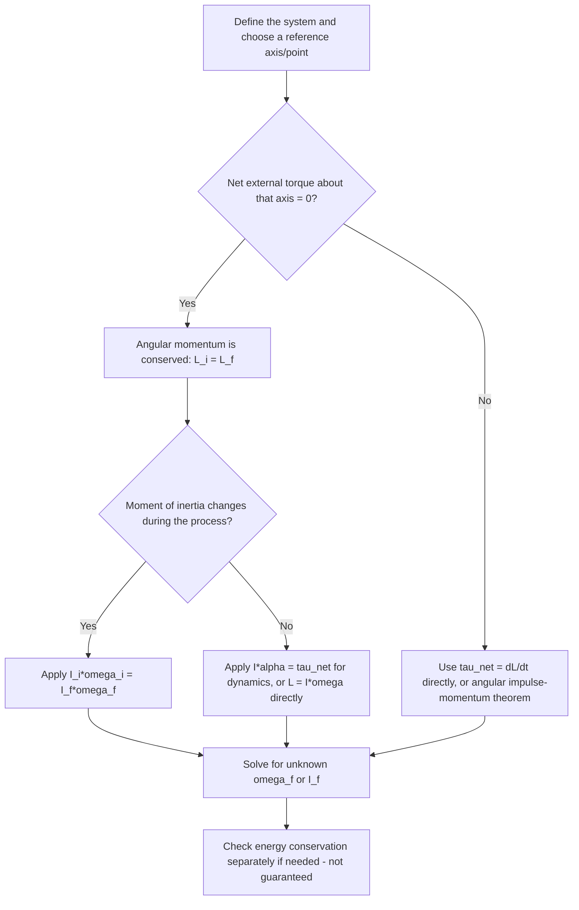

## Angular Momentum and Its Conservation

### Definition of Angular Momentum

Angular momentum ($\vec{L}$) is the rotational analog of linear momentum — it quantifies the "quantity of rotational motion" possessed by an object or system, depending on mass distribution, rotation rate, and (for point particles) position relative to a reference point.

**For a point particle:**

$$\vec{L} = \vec{r}\times\vec{p} = \vec{r}\times m\vec{v}$$

In scalar form (magnitude): $L = rp\sin\theta = rmv\sin\theta$, where $\theta$ is the angle between $\vec{r}$ and $\vec{v}$ (or $\vec{p}$).

**For a rigid body rotating about a fixed axis:**

$$\vec{L} = I\vec{\omega}$$

Units: kilogram-meters squared per second (kg·m²/s), equivalent to joule-seconds (J·s).

**Key Points**

- Angular momentum is a vector; for the fixed-axis case, its direction is along the rotation axis, given by the right-hand rule.
- Angular momentum depends on the choice of reference point (for particles) or rotation axis (for rigid bodies) — like torque, it is not a universal property independent of reference.
- A particle moving in a straight line can still have nonzero angular momentum about a point not on its path, since $\vec{r}$ and $\vec{v}$ need not be parallel.

### Angular Momentum of a Particle in Straight-Line Motion

For a particle moving in a straight line, angular momentum about a point $O$ not on the line of motion is constant, since the perpendicular distance from $O$ to the line of motion (the effective lever arm) does not change:

$$L = mvd$$

Where $d$ is the perpendicular distance from $O$ to the particle's line of motion. This demonstrates that angular momentum conservation applies even to non-rotating, non-interacting particles, provided no torque acts about the reference point — directly connecting to the derivation of conservation from the torque-angular momentum relationship below.

### Angular Momentum of a Particle Diagram (svg_diagram)

<svg xmlns="http://www.w3.org/2000/svg" viewBox="0 0 480 260">
<title>Angular Momentum of a Particle in Straight-Line Motion (svg_diagram)</title>
<rect x="0" y="0" width="480" height="260" fill="#ffffff" />
<circle cx="100" cy="200" r="6" fill="#333" />
<text x="100" y="225" font-size="12" text-anchor="middle" fill="#333">O</text>
<line x1="60" y1="80" x2="440" y2="80" stroke="#1f77b4" stroke-width="3" marker-end="url(#arrowP)" />
<circle cx="250" cy="80" r="7" fill="#1f77b4" />
<text x="440" y="70" font-size="12" fill="#1f77b4">v (particle path)</text>
<line x1="100" y1="200" x2="250" y2="80" stroke="#333" stroke-width="1" stroke-dasharray="3,3" />
<text x="160" y="155" font-size="12" fill="#333">r</text>
<line x1="100" y1="200" x2="100" y2="80" stroke="#2ca02c" stroke-width="2" stroke-dasharray="4,2" />
<text x="70" y="140" font-size="12" fill="#2ca02c">d (perpendicular)</text>
<text x="240" y="240" font-size="13" text-anchor="middle" fill="#333">L = mvd (constant, since d is fixed)</text>
</svg>

### Torque as the Rate of Change of Angular Momentum

Analogous to $\vec{F} = d\vec{p}/dt$ in linear dynamics, torque is defined as the time rate of change of angular momentum:

$$\vec{\tau}_{net} = \frac{d\vec{L}}{dt}$$

For a rigid body with constant moment of inertia:

$$\tau_{net} = \frac{d(I\omega)}{dt} = I\frac{d\omega}{dt} = I\alpha$$

recovering the familiar rotational form of Newton's second law. However, the more general form $\tau_{net} = dL/dt$ also applies when $I$ itself changes (e.g., a skater pulling in their arms), which $\tau = I\alpha$ alone cannot handle.

### Conservation of Angular Momentum

If the net external torque on a system is zero, its total angular momentum remains constant:

$$\tau_{net,ext} = 0 \implies \vec{L} = \text{constant}$$

For a system changing its moment of inertia while conserving angular momentum:

$$I_i\omega_i = I_f\omega_f$$

**Key Points**

- This is analogous to conservation of linear momentum when net external force is zero, and follows from the same logic: internal torques (from internal forces, by Newton's third law) cancel in pairs when summed over an isolated system.
- Conservation of angular momentum holds independently for each axis in general, though most introductory problems involve a single fixed axis or a system with a well-defined symmetry axis.
- Angular momentum conservation applies broadly: from macroscopic rotating systems (planets, skaters, divers) to atomic and subatomic scales (electron orbital angular momentum, particle spin in quantum mechanics).

### Example: Figure Skater Pulling in Arms

A skater spinning at $\omega_i = 2$ rad/s has $I_i = 5$ kg·m² with arms extended. Pulling arms in reduces $I_f = 2$ kg·m². Find the new angular velocity.

$$I_i\omega_i = I_f\omega_f$$

$$(5)(2) = (2)\omega_f \implies \omega_f = 5 \text{ rad/s}$$

The skater's spin rate increases substantially as $I$ decreases, since $L$ remains constant. **Kinetic energy check**: $KE_i = \frac{1}{2}(5)(2)^2 = 10$ J; $KE_f = \frac{1}{2}(2)(5)^2 = 25$ J. The additional 15 J comes from internal work done by the skater's muscles pulling the arms inward against the centripetal force requirement — angular momentum is conserved, but kinetic energy is not, since this is not an isolated energy system (external biological work is input).

### Example: Angular Momentum of an Orbiting Planet

A planet of mass $m$ orbits a star in an elliptical orbit. At perihelion (closest approach), distance is $r_1$ and speed is $v_1$; at aphelion (farthest point), distance is $r_2$ and speed is $v_2$. Since gravitational force acts along the line connecting star and planet (zero torque about the star), angular momentum is conserved:

$$mv_1r_1 = mv_2r_2 \implies v_1r_1 = v_2r_2$$

This directly derives **Kepler's Second Law** (equal areas in equal times) from angular momentum conservation: the planet moves faster when closer to the star (smaller $r$) and slower when farther away (larger $r$), since the product $vr$ must remain constant.

### Example: Rotating Platform (Person Pulling in Weights)

A person stands on a frictionless rotating platform ($I_{person+platform} = 3$ kg·m²) spinning at $\omega_i = 1.5$ rad/s while holding two 2 kg weights at $r_i = 0.8$ m from the axis. The person pulls the weights in to $r_f = 0.2$ m. Find the new angular velocity.

$$I_i = I_{person} + 2m_wr_i^2 = 3 + 2(2)(0.8)^2 = 3 + 2.56 = 5.56 \text{ kg·m}^2$$

$$I_f = I_{person} + 2m_wr_f^2 = 3 + 2(2)(0.2)^2 = 3 + 0.16 = 3.16 \text{ kg·m}^2$$

$$\omega_f = \frac{I_i\omega_i}{I_f} = \frac{(5.56)(1.5)}{3.16} \approx 2.64 \text{ rad/s}$$

The rotation rate increases as the weights move closer to the axis, consistent with the conservation principle.

### Example: Angular Momentum in Collisions (Rotational Analog)

A disk of moment of inertia $I_1 = 4$ kg·m² spins at $\omega_1 = 6$ rad/s. It is dropped onto a stationary disk of $I_2 = 2$ kg·m² sharing the same axis, and friction between them brings them to a common final angular velocity (analogous to a perfectly inelastic linear collision).

$$I_1\omega_1 = (I_1+I_2)\omega_f$$

$$(4)(6) = (6)\omega_f \implies \omega_f = 4 \text{ rad/s}$$

**Energy check**: $KE_i = \frac{1}{2}(4)(6)^2 = 72$ J; $KE_f = \frac{1}{2}(6)(4)^2 = 48$ J. Kinetic energy is lost (24 J, dissipated as heat/friction between the disks), exactly analogous to a perfectly inelastic linear collision — angular momentum is conserved, but kinetic energy is not.

### Angular Momentum for Systems of Particles

Total angular momentum of a system is the vector sum of the angular momenta of its individual particles:

$$\vec{L}_{total} = \sum_i \vec{r}_i\times m_i\vec{v}_i$$

For a rigid body, this can be decomposed into orbital angular momentum (motion of the center of mass about a reference point) plus spin angular momentum (rotation about the center of mass):

$$\vec{L}_{total} = \vec{L}_{orbital} + \vec{L}_{spin} = \vec{r}_{cm}\times M\vec{v}_{cm} + I_{cm}\vec{\omega}$$

**Key Points**

- This decomposition is directly analogous to how total kinetic energy splits into translational and rotational parts for a rigid body.
- Earth's total angular momentum, for example, includes orbital angular momentum (its motion around the Sun) and spin angular momentum (its daily rotation), which can be treated and conserved somewhat independently under most circumstances. [Inference: tidal interactions do slowly transfer angular momentum between Earth's spin and the Moon's orbit over long timescales, so strict independent conservation is an approximation valid over shorter periods.]

### Conservation Comparison Table

| Conserved Quantity | Condition | Formula |
| --- | --- | --- |
| Linear momentum | $\vec{F}_{ext,net} = 0$ | $\sum m_i\vec{v}_i = $ const |
| Angular momentum | $\vec{\tau}_{ext,net} = 0$ | $I\omega = $ const (fixed axis) |
| Mechanical energy | Only conservative forces do work | $KE + PE = $ const |

**Key Points**

- These three conservation laws are independent of one another; a system can conserve one, two, or all three, depending on the physical conditions present.
- Angular momentum conservation and mechanical energy conservation coincide in "elastic" rotational interactions (e.g., ideal orbital motion), but not in cases involving internal work (e.g., muscular effort) or dissipative losses (e.g., friction).

### Problem-Solving Procedure

### Angular Impulse

Analogous to linear impulse, **angular impulse** is the integral of torque over time, equal to the change in angular momentum:

$$\Delta L = \int \tau\, dt$$

For constant torque: $\Delta L = \tau\Delta t$.

**Key Points**

- This is the rotational analog of the linear impulse-momentum theorem $J = \Delta p = F\Delta t$.
- Useful for analyzing angular momentum changes due to applied torques over specific time intervals, such as a motor spinning up a flywheel.

### Applications

**Key Points**

- **Astrophysics**: conservation of angular momentum explains the increasing rotation rate of collapsing stars (leading to rapidly spinning neutron stars/pulsars) and the flattening of protoplanetary disks and galaxies into rotating disks.
- **Sports**: divers, gymnasts, and figure skaters manipulate body $I$ mid-air or mid-spin to control rotation rate, since angular momentum (not angular velocity) is conserved during flight (no external torque about the center of mass).
- **Engineering**: gyroscopes exploit angular momentum conservation for stabilization in navigation systems, spacecraft attitude control, and stabilized camera platforms.
- **Orbital mechanics**: angular momentum conservation directly underlies Kepler's second law and is essential for analyzing satellite and planetary orbits.
- **Quantum mechanics**: angular momentum (including intrinsic spin) is quantized and conserved, playing a central role in atomic structure and particle physics. [Inference: the quantum mechanical treatment involves additional postulates beyond classical mechanics and is typically covered in advanced coursework rather than introductory classical mechanics.]

### Common Misconceptions

**Key Points**

- Conservation of angular momentum does not imply conservation of rotational kinetic energy — these are independent principles that coincide only in specific (e.g., perfectly "elastic" rotational) cases.
- Angular momentum depends on the choice of reference point/axis, just like torque — a particle can have different angular momentum values about different reference points simultaneously.
- A net force acting on an object does not necessarily change its angular momentum about a given point, if that force produces zero torque about that point (i.e., its line of action passes through the reference point).
- "Spinning faster" (increased $\omega$) when $I$ decreases is a direct and necessary consequence of $L$ conservation, not an independent or mysterious effect — it follows mathematically and physically from $I_i\omega_i = I_f\omega_f$.

### Conclusion

Angular momentum, defined as $\vec{L} = \vec{r}\times\vec{p}$ for particles or $\vec{L}=I\vec{\omega}$ for rigid bodies, is conserved whenever net external torque on a system is zero — a direct rotational parallel to linear momentum conservation, arising from Newton's third law applied to internal torques. This principle underlies phenomena ranging from figure skater spins and orbital mechanics to astrophysical processes and gyroscopic stability, and provides a powerful problem-solving tool independent of the often-complex details of internal torques and forces.

**Next Steps**

- Gyroscopic motion and precession (advanced application of angular momentum)
- Kepler's laws of planetary motion derived from angular momentum and energy conservation
- Angular momentum in collisions: rotational analogs of elastic/inelastic collision analysis
- Rolling motion combining linear and angular momentum considerations
- Quantum mechanical angular momentum and spin (advanced/optional topic)
- Torque, moment of inertia, and rotational kinetic energy review and integration