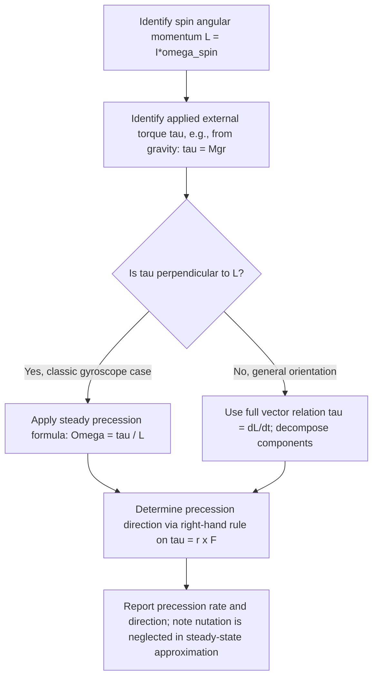

## Gyroscopic Precession

### Overview

Gyroscopic precession is the phenomenon in which a spinning object subjected to an external torque responds not by tipping over in the direction of the applied torque (as intuition from non-rotating objects might suggest), but by rotating its spin axis in a direction **perpendicular** to both the torque and the spin angular momentum. This counterintuitive behavior arises directly from the vector nature of the torque-angular momentum relationship.

**Key Points**

- Precession is the slow rotation of the spin axis itself around a second axis, distinct from the rapid spin of the gyroscope about its own axis.
- The effect is most cleanly demonstrated by a spinning top or gyroscope wheel with one end supported, subjected to gravitational torque.
- Precession is a direct consequence of $\vec{\tau} = d\vec{L}/dt$ applied to a rotating (rather than static) system.

### Governing Physics

For a rapidly spinning object, the total angular momentum is dominated by the spin component:

$$\vec{L} = I\vec{\omega}_{spin}$$

An applied external torque produces a change in angular momentum in the direction of the torque:

$$\vec{\tau} = \frac{d\vec{L}}{dt}$$

Because $\vec{\tau}$ (from gravity acting at a lever arm) is **perpendicular** to $\vec{L}$ (which points along the spin axis) for the classic gyroscope configuration, $d\vec{L}$ is also perpendicular to $\vec{L}$. This means $\vec{L}$ changes **direction** without changing **magnitude** — the spin axis sweeps out a cone rather than tipping down as torque would produce in a non-spinning object.

### Precession Diagram (svg_diagram)

<svg xmlns="http://www.w3.org/2000/svg" viewBox="0 0 480 320">
<title>Gyroscopic Precession Vector Relationships (svg_diagram)</title>
<rect x="0" y="0" width="480" height="320" fill="#ffffff" />
<ellipse cx="240" cy="260" rx="140" ry="30" fill="none" stroke="#999" stroke-width="1.5" stroke-dasharray="4,3" />
<circle cx="240" cy="260" r="5" fill="#333" />
<text x="240" y="290" font-size="12" text-anchor="middle" fill="#333">Pivot</text>
<line x1="240" y1="260" x2="330" y2="90" stroke="#1f77b4" stroke-width="4" marker-end="url(#arrowL)" />
<text x="345" y="80" font-size="13" fill="#1f77b4">L (spin angular momentum)</text>
<line x1="240" y1="260" x2="120" y2="230" stroke="#d62728" stroke-width="3" marker-end="url(#arrowT)" />
<text x="60" y="220" font-size="13" fill="#d62728">τ (gravity torque)</text>
<path d="M 330 90 A 100 30 0 0 1 200 100" fill="none" stroke="#2ca02c" stroke-width="2" stroke-dasharray="5,3" marker-end="url(#arrowPrec)" />
<text x="230" y="60" font-size="13" fill="#2ca02c">Precession (Ω)</text>
</svg>

### Precession Angular Velocity

For a gyroscope with spin angular momentum $L = I\omega_{spin}$, supported at a pivot a horizontal distance $r$ from its center of mass, subjected to gravitational torque $\tau = Mgr$, the precession angular velocity $\Omega$ (rate at which the spin axis sweeps around the vertical) is:

$$\Omega = \frac{\tau}{L} = \frac{Mgr}{I\omega_{spin}}$$

**Derivation logic**: over a small time $dt$, the torque produces a small change in angular momentum $dL = \tau\, dt$, directed perpendicular to $\vec{L}$. This causes the tip of the $\vec{L}$ vector to sweep through a small angle $d\phi = dL/L$ (since $dL \perp L$, this is purely a rotation, not a magnitude change). The precession rate is then:

$$\Omega = \frac{d\phi}{dt} = \frac{dL/L}{dt} = \frac{\tau}{L}$$

**Key Points**

- Precession rate is **inversely proportional** to spin angular momentum — a faster-spinning gyroscope precesses more slowly, and vice versa.
- This is a first-order (simplified, "steady precession") analysis that assumes $L_{spin} \gg L_{precession}$, i.e., the spin rate is much greater than the precession rate — valid for most practical fast-spinning gyroscopes. [Inference: a fully general treatment including nutation (wobbling superimposed on precession) requires more advanced rigid-body dynamics beyond this steady-state approximation.]

### Example: Spinning Top Precession Rate

A toy top has $I = 5\times10^{-5}$ kg·m² about its spin axis, spins at $\omega_{spin} = 100$ rad/s, has mass $M = 0.05$ kg, and its center of mass is $r = 0.03$ m horizontally from the pivot point. Find the precession angular velocity.

$$\tau = Mgr = (0.05)(9.8)(0.03) \approx 0.0147 \text{ N·m}$$

$$L = I\omega_{spin} = (5\times10^{-5})(100) = 5\times10^{-3} \text{ kg·m}^2/\text{s}$$

$$\Omega = \frac{\tau}{L} = \frac{0.0147}{5\times10^{-3}} \approx 2.94 \text{ rad/s}$$

The top's spin axis sweeps around the vertical at approximately 2.94 rad/s (about 0.47 revolutions per second), much slower than its spin rate of 100 rad/s — consistent with the general result that precession is slow relative to spin.

### Direction of Precession

The direction of precession follows directly from the vector cross-product relationship $\vec{\tau} = \vec{r}\times\vec{F}_{gravity}$ and $d\vec{L} = \vec{\tau}\,dt$:

**Key Points**

- For a top spinning counterclockwise (viewed from above) with gravity pulling down on an off-center support, the precession direction is also counterclockwise (viewed from above) — the spin axis circles around the vertical in the same rotational sense as the spin itself, for this standard configuration.
- Reversing the spin direction reverses the precession direction; this follows directly from the right-hand rule applied to $\vec{L} = I\vec{\omega}$ and the resulting torque relationship.
- Precession direction can be determined systematically: point the right-hand thumb along $\vec{L}$ (spin axis), then apply the right-hand rule to $\vec{\tau} = \vec{r}\times\vec{F}$ to find the direction $\vec{L}$ is being pushed, which is the direction the axis tip moves.

### Nutation

Superimposed on steady precession, real gyroscopes typically exhibit **nutation** — a small, oscillatory "nodding" or wobbling motion of the spin axis, occurring at a higher frequency than the precession itself.

**Key Points**

- Nutation arises because the simplified steady-precession formula neglects the initial transient response when torque is first applied (e.g., when a spinning top is released) or when the spin axis is disturbed.
- Nutation typically damps out over time due to friction and air resistance, leaving the smoother, idealized steady precession behavior as the dominant long-term motion. [Inference: the degree and persistence of observable nutation depends on the specific gyroscope's construction, initial conditions, and damping present, so its magnitude varies considerably between systems.]
- A full analytical treatment of nutation requires solving the complete rigid-body Euler equations rather than the simplified torque-precession relation used for steady precession.

### Gyroscopic Stability and Applications

**Key Points**

- **Bicycles and motorcycles**: spinning wheels contribute gyroscopic stability that resists tipping, though this effect is only one of several contributing factors (including trail and rider steering corrections) to overall two-wheeled vehicle stability. [Inference: the relative importance of gyroscopic effects versus other stabilizing mechanisms in bicycle dynamics has been debated in the physics education and engineering literature; it is not the sole or even necessarily dominant factor.]
- **Gyrocompasses**: exploit precession and the Earth's rotation to align a spinning gyroscope's axis with true north, used in navigation systems independent of magnetic fields.
- **Spacecraft attitude control**: reaction wheels and control moment gyroscopes use controlled angular momentum changes (and resulting precessional torques) to reorient satellites and spacecraft without expending propellant.
- **Rifle and artillery projectiles**: spin imparted by rifled barrels stabilizes projectiles via gyroscopic effects, resisting tumbling during flight (though the aerodynamic response of a spinning projectile involves precession-like effects coupled with drag).
- **Earth's axial precession**: the Earth itself precesses (a 26,000-year cycle) due to gravitational torque from the Sun and Moon acting on Earth's equatorial bulge, analogous in principle to a spinning top's precession, though on an astronomical scale and timescale.

### Precession vs. Simple Torque Response (Comparison)

| Scenario | Response to Applied Torque |
| --- | --- |
| Non-spinning object (e.g., a stick pivoted at one end) | Falls/rotates in the direction the torque pushes it (angular acceleration in torque's direction) |
| Rapidly spinning gyroscope | Spin axis precesses perpendicular to both torque and spin angular momentum, tracing a cone rather than falling |

**Key Points**

- This comparison highlights why gyroscopic behavior is often described as "counterintuitive" — the response direction is rotated $90°$ from what non-rotating intuition predicts.
- The transition between these regimes depends on the ratio of spin angular momentum to the torque and moment of inertia involved; a very slowly spinning or non-spinning "gyroscope" behaves essentially like the simple falling-stick case.

### Problem-Solving Procedure

### Limitations of the Simple Precession Model

**Key Points**

- The formula $\Omega = \tau/L$ assumes "fast-spin" or "steady precession" conditions, where spin angular momentum dominates over any angular momentum associated with the precession motion itself.
- It does not capture the initial transient behavior (nutation) that occurs when a gyroscope is first released or disturbed.
- For slowly spinning tops or gyroscopes where spin and precession rates are comparable, the simplified model breaks down, and the complete Euler's equations for rigid body rotation are needed for accurate analysis. [Inference: the precise threshold at which the simple model becomes inadequate depends on the specific system's parameters and required accuracy, rather than a single universal criterion.]

### Common Misconceptions

**Key Points**

- Gyroscopic precession does not "defy gravity" or represent some anti-gravitational effect — gravity's torque is fully responsible for driving the precession; the surprising element is the *direction* of the response, not the absence of gravitational influence.
- A precessing gyroscope's spin axis does not immediately fall in the direction of the applied torque — this is precisely the counterintuitive feature that distinguishes rotating systems from static ones.
- Precession rate and spin rate are not the same motion — they are two distinct, simultaneous rotations (spin about the object's own axis, precession of that axis about a second, typically vertical, axis).
- Gyroscopic effects contributing to bicycle stability are real but are often overstated in popular explanations; multiple factors contribute to two-wheeled vehicle self-stability.

### Conclusion

Gyroscopic precession arises directly from the vector relationship between torque and the time rate of change of angular momentum, producing the counterintuitive result that a spinning object's axis sweeps sideways (perpendicular to the applied torque) rather than simply tipping over. This phenomenon, governed by $\Omega = \tau/L$ in the steady-state approximation, underlies technologies ranging from gyrocompasses and spacecraft attitude control to the stabilization of spinning projectiles, while more complete analysis (including nutation) requires the full rigid-body equations of motion.

**Next Steps**

- Euler's equations for rigid body rotation (advanced treatment of precession and nutation)
- Angular momentum conservation and its role in spin stabilization
- Torque and rotational equilibrium review
- Applications of gyroscopes in navigation and spacecraft attitude control
- Earth's axial precession and its astronomical/climatic significance
- Reaction wheels and control moment gyroscopes in aerospace engineering