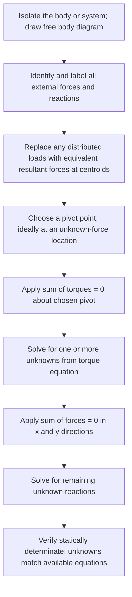

## Statics of Rigid Bodies

### Overview and Conditions for Equilibrium

Statics is the branch of mechanics concerned with rigid bodies at rest (or moving with constant velocity and no rotation), where the net effect of all applied forces and torques produces no acceleration — translational or rotational. A rigid body is in **static equilibrium** when two independent conditions are simultaneously satisfied:

$$\sum \vec{F} = 0 \quad \text{(first/translational condition)}$$

$$\sum \vec{\tau} = 0 \quad \text{(second/rotational condition)}$$

**Key Points**

- Both conditions are necessary and independent — satisfying one does not guarantee the other, and both must be checked separately for full static equilibrium.
- The rotational condition ($\sum\tau=0$) holds about **any** chosen pivot point when the translational condition is also satisfied — a useful property for problem-solving.
- A rigid body assumption means the object does not deform under applied loads; real materials deform slightly, but this is neglected in idealized rigid-body statics.

### The Rigid Body Assumption

**Key Points**

- Treating bodies as rigid allows forces to be analyzed as acting at specific points (or along lines of action) without needing to account for internal deformation, stress, or strain.
- This idealization is valid for many engineering purposes where deformations are small relative to overall dimensions, though it breaks down for highly flexible or elastic structures, which require separate treatment in structural/materials engineering. [Inference: the boundary between "rigid enough" and "requires deformation analysis" depends on the specific application's precision requirements and is a judgment call in practice.]

### Free Body Diagrams

The essential first step in any static equilibrium problem is constructing a **free body diagram (FBD)**: an isolated representation of the object showing all external forces acting on it, with their points of application, magnitudes (known or symbolic), and directions.

**Key Points**

- Only external forces are included — internal forces (between parts of the body being analyzed as a single rigid system) are excluded, since they cancel by Newton's third law within the chosen system boundary.
- Common forces in static problems: weight (acting at the center of gravity), normal forces, tension, friction, applied loads, and reaction forces at supports/pivots.
- Accurately identifying the type and direction of support reactions (discussed below) is critical to correctly setting up the equilibrium equations.

### Types of Supports and Their Reactions

| Support Type | Reaction Forces/Moments Provided |
| --- | --- |
| Roller support | One force, perpendicular to the rolling surface (no moment, no force along surface) |
| Pin/hinge support | Two force components (x and y directions); no moment |
| Fixed support | Two force components AND a moment (fully constrains rotation) |
| Cable/rope | One force, along the direction of the cable (tension only, cannot push) |
| Smooth surface contact | One force, normal to the surface |

**Key Points**

- The number of unknown reaction components a support provides directly affects whether a statics problem is **statically determinate** (solvable using equilibrium equations alone) or **statically indeterminate** (requiring additional material/deformation-based equations).
- A 2D rigid body has exactly three independent equilibrium equations available ($\sum F_x=0$, $\sum F_y=0$, $\sum\tau=0$), so at most three unknown reaction components can be solved for using statics alone.

### Support Reactions Diagram (svg_diagram)

<svg xmlns="http://www.w3.org/2000/svg" viewBox="0 0 500 260">
<title>Common Support Types and Reactions (svg_diagram)</title>
<rect x="0" y="0" width="500" height="260" fill="#ffffff" />
<circle cx="90" cy="180" r="14" fill="#dbe9f6" stroke="#1f77b4" stroke-width="2" />
<line x1="60" y1="200" x2="120" y2="200" stroke="#333" stroke-width="3" />
<line x1="90" y1="180" x2="90" y2="140" stroke="#d62728" stroke-width="3" marker-end="url(#a1)" />
<text x="90" y="225" font-size="11" text-anchor="middle" fill="#333">Roller: 1 force</text>
<circle cx="230" cy="185" r="8" fill="#333" />
<path d="M 205 200 L 255 200 L 230 185 Z" fill="#dbe9f6" stroke="#1f77b4" stroke-width="2" />
<line x1="230" y1="185" x2="230" y2="140" stroke="#d62728" stroke-width="3" marker-end="url(#a1)" />
<line x1="230" y1="185" x2="270" y2="185" stroke="#2ca02c" stroke-width="3" marker-end="url(#a2)" />
<text x="230" y="225" font-size="11" text-anchor="middle" fill="#333">Pin: 2 forces</text>
<rect x="370" y="150" width="10" height="60" fill="#555" />
<line x1="360" y1="150" x2="400" y2="150" stroke="#333" stroke-width="4" />
<line x1="375" y1="150" x2="375" y2="110" stroke="#d62728" stroke-width="3" marker-end="url(#a1)" />
<path d="M 400 140 A 20 20 0 0 1 400 170" fill="none" stroke="#9467bd" stroke-width="2" marker-end="url(#a3)" />
<text x="375" y="230" font-size="11" text-anchor="middle" fill="#333">Fixed: 2 forces + moment</text>
</svg>

### Statically Determinate vs. Indeterminate Systems

**Key Points**

- **Statically determinate**: number of unknown reaction components equals the number of independent equilibrium equations (3 in 2D) — fully solvable using statics alone.
- **Statically indeterminate**: more unknown reactions than available equilibrium equations — requires additional equations from material deformation (beyond the scope of rigid-body statics), studied in mechanics of materials/structural analysis.
- **Unstable/underconstrained**: fewer reactions than needed for equilibrium — the body is not fully constrained and will move under load rather than remain static.

### Distributed Loads

Real structures often experience **distributed loads** (e.g., the weight of a beam itself, wind pressure, fluid pressure) rather than single point forces. For equilibrium calculations, a distributed load can be replaced by an equivalent single resultant force:

$$F_{resultant} = \int w(x)\, dx$$

Acting at the **centroid** of the load distribution (the "center of area" under the load diagram).

**Key Points**

- For a uniform (constant) distributed load $w_0$ over length $L$: resultant force $= w_0L$, acting at the midpoint ($L/2$).
- For a triangular (linearly varying) distributed load with maximum $w_0$ over length $L$: resultant force $= \frac{1}{2}w_0L$, acting at $\frac{2L}{3}$ from the zero-load end (i.e., at the centroid of the triangular area).
- This replacement is valid strictly for equilibrium analysis (finding external reactions); internal stress/deflection analysis of the actual distributed load requires more detailed methods (beyond rigid-body statics).

### Example: Simply Supported Beam with Point Load

A 6 m beam, weight negligible, is supported by a pin at the left end ($A$) and a roller at the right end ($B$). A 500 N load is applied 2 m from $A$. Find the support reactions.

Taking torques about $A$ (eliminating the pin's unknown force components from this equation):

$$\sum\tau_A = 0: \quad F_B(6) - (500)(2) = 0 \implies F_B = \frac{1000}{6} \approx 166.7 \text{ N}$$

Vertical force balance:

$$\sum F_y = 0: \quad F_{Ay} + F_B - 500 = 0 \implies F_{Ay} = 500 - 166.7 = 333.3 \text{ N}$$

Since no horizontal loads are present, $F_{Ax} = 0$.

### Example: Beam with Distributed and Point Loads

A 4 m beam is supported by a pin at $A$ (left end) and a roller at $B$ (right end). A uniform distributed load of 100 N/m acts over the entire beam, plus a 300 N point load at the midpoint (2 m from $A$). Find the reactions.

**Convert distributed load to resultant**: $F_{dist} = (100)(4) = 400$ N, acting at the beam's midpoint (2 m from $A$).

Taking torques about $A$:

$$\sum\tau_A = 0: \quad F_B(4) - (400)(2) - (300)(2) = 0$$

$$F_B(4) = 800 + 600 = 1400 \implies F_B = 350 \text{ N}$$

Vertical force balance:

$$F_{Ay} + F_B - 400 - 300 = 0 \implies F_{Ay} = 700 - 350 = 350 \text{ N}$$

### Example: Cantilever Beam

A 3 m cantilever beam is fixed (built-in) at one end ($A$) and free at the other. A 250 N point load acts at the free end. Find the fixed-end reactions (force components and moment).

$$\sum F_y = 0: \quad F_{Ay} - 250 = 0 \implies F_{Ay} = 250 \text{ N (upward)}$$

$$\sum F_x = 0: \quad F_{Ax} = 0$$

Taking torque about the fixed end $A$:

$$\sum\tau_A = 0: \quad M_A - (250)(3) = 0 \implies M_A = 750 \text{ N·m}$$

The fixed support must provide a reaction moment of 750 N·m (in addition to the vertical force) to prevent rotation, illustrating why fixed supports are necessary wherever a structure must resist bending without additional supports (a defining feature distinguishing cantilevers from simply-supported beams).

### Trusses and Two-Force Members

In truss analysis (structures composed of straight members connected at pin joints, loaded only at the joints), each individual member is a **two-force member**: subjected to force only at its two end points, meaning the net force must act along the line connecting those two points (either pure tension or pure compression).

**Key Points**

- This simplification allows truss members to be analyzed as carrying only axial force (tension/compression), with no bending or shear — a major simplification compared to general beam analysis.
- **Method of joints**: analyze equilibrium ($\sum F_x=0$, $\sum F_y=0$) at each pin joint individually to solve for member forces sequentially.
- **Method of sections**: cut the truss through selected members and apply equilibrium to one resulting section, allowing direct solution for specific member forces without solving the entire truss joint-by-joint.

### Example: Simple Truss Joint Analysis

At a truss joint, two members meet: member 1 at $30°$ above horizontal (in tension, force $T_1$) and member 2 horizontal (force $T_2$), supporting a vertical load of 400 N downward at the joint.

$$\sum F_y = 0: \quad T_1\sin(30°) - 400 = 0 \implies T_1 = \frac{400}{0.5} = 800 \text{ N (tension)}$$

$$\sum F_x = 0: \quad T_1\cos(30°) - T_2 = 0 \implies T_2 = 800\cos(30°) \approx 692.8 \text{ N}$$

The sign and physical interpretation of $T_2$ (tension or compression) depend on the assumed direction in the free body diagram; a negative result would indicate the member is actually in compression rather than tension.

### Problem-Solving Procedure for Rigid Body Statics

### Stability Considerations in Statics

**Key Points**

- A structure can satisfy the equilibrium equations mathematically yet still be physically **unstable** if support arrangement allows for a mechanism (e.g., all reaction forces parallel, allowing free rotation about a point) — a purely algebraic solution does not guarantee physical stability.
- Overall stability also depends on the location of the center of gravity relative to the base of support, particularly for free-standing structures not rigidly fixed to a foundation (e.g., furniture, vehicles, retaining walls).
- Structural stability analysis in practice extends beyond basic rigid-body statics to include buckling, material failure, and dynamic loading considerations. [Inference: comprehensive stability analysis for real engineering structures typically requires specialized structural engineering methods beyond introductory rigid-body statics.]

### Applications

**Key Points**

- **Civil/structural engineering**: analyzing beams, trusses, frames, bridges, and building supports for load-bearing capacity and reaction forces.
- **Mechanical engineering**: static analysis of machine components, brackets, and support structures under load.
- **Biomechanics**: analyzing forces and torques in the human skeletal system under static postures (e.g., standing, holding a weight).
- **Architecture**: ensuring structural elements (columns, beams, cantilevers) satisfy equilibrium under expected loads before detailed material/deflection analysis.
- **Furniture and product design**: verifying tip-over stability based on center of gravity and base of support geometry.

### Common Misconceptions

**Key Points**

- Satisfying $\sum F = 0$ alone does not guarantee full static equilibrium — the rotational condition $\sum\tau = 0$ must also be independently verified.
- The choice of pivot point for the torque equation is mathematically arbitrary (any point works if the body is truly in equilibrium), but a poor choice can make the algebra unnecessarily complex, while a strategic choice (at an unknown-force location) simplifies it significantly.
- A structure with more supports/reactions is not automatically "more stable" from a pure statics standpoint — additional reactions beyond the three available equations create static indeterminacy, requiring different (non-statics) analysis methods, though this often does correspond to greater practical safety margins in engineering design.
- Two-force members carry force strictly along the line connecting their two endpoints only under the idealized truss assumption (pin joints, loads only at joints) — this does not apply to general beams with distributed loads or fixed-end connections.

### Conclusion

Statics of rigid bodies applies the two fundamental equilibrium conditions — zero net force and zero net torque — to analyze structures and mechanical systems at rest, using free body diagrams, strategic pivot selection, and systematic handling of distributed loads and support reactions. These principles underlie structural and mechanical engineering design, from simple beams and trusses to complex load-bearing systems, with the distinction between statically determinate and indeterminate systems marking the boundary of what basic rigid-body statics alone can solve.

**Next Steps**

- Torque and rotational equilibrium fundamentals (single-body focus)
- Method of joints and method of sections for truss analysis in depth
- Center of mass and center of gravity calculations for composite bodies
- Stress, strain, and material deformation (mechanics of materials)
- Stability analysis and tipping conditions for free-standing structures
- Moment of inertia and its role in dynamic (non-static) rotational problems