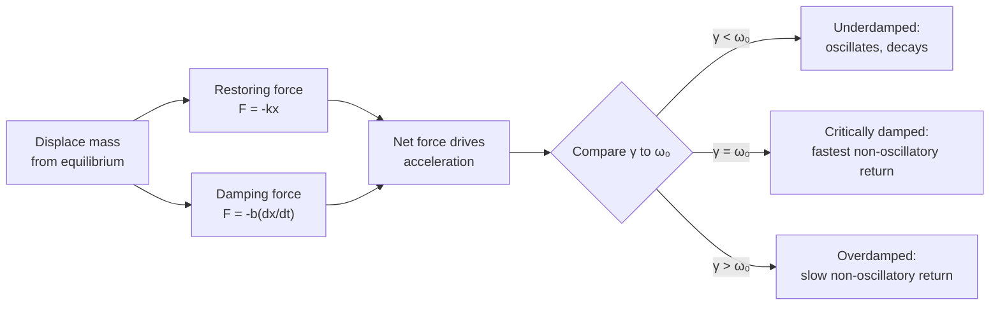

## Damped Oscillations

### Overview

Damped oscillations describe the motion of an oscillating system whose amplitude decreases over time due to energy dissipation. Unlike ideal simple harmonic motion (SHM), where mechanical energy is conserved, real oscillators lose energy to resistive forces such as friction, air resistance, or internal material losses. This energy loss is typically modeled as a velocity-dependent damping force.

### Equation of Motion

For a mass-spring system with damping, three forces act on the mass: the restoring spring force, a velocity-proportional damping force, and (optionally) an external driving force. For free (undriven) damped motion, Newton's second law gives:

$$m\frac{d^2x}{dt^2} + b\frac{dx}{dt} + kx = 0$$

where:

- $m$ is the mass
- $b$ is the damping coefficient (units: kg/s)
- $k$ is the spring constant
- $x(t)$ is displacement from equilibrium

Dividing through by $m$ and defining:

$$\omega_0^2 = \frac{k}{m}, \quad \gamma = \frac{b}{2m}$$

the equation becomes:

$$\frac{d^2x}{dt^2} + 2\gamma\frac{dx}{dt} + \omega_0^2 x = 0$$

Here, $\omega_0$ is the natural (undamped) angular frequency and $\gamma$ is the damping rate.

### Solving the Differential Equation

Assuming a trial solution $x(t) = e^{rt}$ leads to the characteristic equation:

$$r^2 + 2\gamma r + \omega_0^2 = 0$$

Solving for $r$ using the quadratic formula:

$$r = -\gamma \pm \sqrt{\gamma^2 - \omega_0^2}$$

The nature of the solution depends on the sign of the discriminant $\gamma^2 - \omega_0^2$, giving rise to three distinct damping regimes.

### Damping Regimes

**Underdamped ($\gamma < \omega_0$)**

The discriminant is negative, producing complex roots and oscillatory motion with exponentially decaying amplitude:

$$x(t) = A_0 e^{-\gamma t}\cos(\omega_d t + \phi)$$

where the damped angular frequency is:

$$\omega_d = \sqrt{\omega_0^2 - \gamma^2}$$

The system oscillates at a slightly lower frequency than $\omega_0$, with amplitude envelope $A_0 e^{-\gamma t}$. This is the most common case for lightly damped real-world systems (e.g., a plucked guitar string, a swinging pendulum in air).

**Critically Damped ($\gamma = \omega_0$)**

The discriminant is zero, giving a repeated real root $r = -\gamma$. The general solution is:

$$x(t) = (A + Bt)e^{-\gamma t}$$

The system returns to equilibrium in the shortest possible time without oscillating. This regime is important in engineering design — e.g., door closers and analog suspension systems aim for near-critical damping to avoid both overshoot and sluggish response.

**Overdamped ($\gamma > \omega_0$)**

The discriminant is positive, yielding two distinct real roots:

$$r_{1,2} = -\gamma \pm \sqrt{\gamma^2 - \omega_0^2}$$

$$x(t) = C_1 e^{r_1 t} + C_2 e^{r_2 t}$$

Both terms decay exponentially with no oscillation, but the return to equilibrium is slower than critical damping because the slower-decaying term ($r_2$, closer to zero) dominates at large $t$.

### Comparative Behavior (svg_diagram)

<svg xmlns="http://www.w3.org/2000/svg" viewBox="0 0 700 420">
<text x="350" y="25" text-anchor="middle" font-size="16" font-weight="bold" fill="#222">Displacement vs Time — Damping Regimes (svg_diagram)</text>

<line x1="60" y1="360" x2="660" y2="360" stroke="#333" stroke-width="1.5" />
<line x1="60" y1="60" x2="60" y2="360" stroke="#333" stroke-width="1.5" />
<text x="660" y="380" font-size="12" fill="#333">t</text>
<text x="35" y="65" font-size="12" fill="#333">x</text>
<line x1="60" y1="210" x2="660" y2="210" stroke="#ccc" stroke-width="1" stroke-dasharray="4,4" />

<path d="M60,110 C90,60 110,60 140,110 C170,160 190,190 220,190 C250,190 270,175 300,210 C330,235 350,225 380,210 C410,197 430,205 460,210 C500,213 540,210 580,210 L660,210" fill="none" stroke="`#1f77b4`" stroke-width="2.5" />

<path d="M60,110 Q200,150 340,210 Q450,240 660,210" fill="none" stroke="#1f77b4" stroke-width="1" stroke-dasharray="3,3" opacity="0.5" />

<path d="M60,110 C160,140 260,200 380,210 C480,217 580,210 660,210" fill="none" stroke="`#2ca02c`" stroke-width="2.5" />

<path d="M60,110 C220,150 380,190 480,205 C560,213 620,210 660,210" fill="none" stroke="`#d62728`" stroke-width="2.5" />

<rect x="480" y="60" width="16" height="4" fill="#1f77b4" />
<text x="502" y="66" font-size="12" fill="#222">Underdamped</text>
<rect x="480" y="82" width="16" height="4" fill="#2ca02c" />
<text x="502" y="88" font-size="12" fill="#222">Critically Damped</text>
<rect x="480" y="104" width="16" height="4" fill="#d62728" />
<text x="502" y="110" font-size="12" fill="#222">Overdamped</text>
</svg>

### Energy Dissipation

Total mechanical energy in a damped oscillator decreases with time. For the underdamped case, the energy envelope decays as:

$$E(t) \approx E_0 e^{-2\gamma t}$$

since energy is proportional to amplitude squared. The rate of energy loss per cycle relates directly to the damping coefficient $b$; larger $b$ dissipates energy faster (up to the critical threshold, beyond which oscillation ceases entirely).

### Quality Factor (Q)

The quality factor quantifies how underdamped a system is — effectively how many radians of oscillation occur before energy substantially decays:

$$Q = \frac{\omega_0}{2\gamma} = \frac{m\omega_0}{b}$$

**Key Points**

- High $Q$ (≫1): weak damping, many oscillations before decay, sharp resonance peak (e.g., tuning forks, quartz crystal oscillators, $Q \sim 10^4$–$10^6$)
- Low $Q$ (~1 or less): heavy damping, few or no oscillations (e.g., shock absorbers, $Q \sim 0.5$–$2$)
- $Q$ also relates to the fractional energy loss per radian: $Q = 2\pi \dfrac{E}{\Delta E_{\text{per cycle}}}$

### Logarithmic Decrement

For underdamped systems, the logarithmic decrement $\delta$ measures the rate of amplitude decay between successive oscillation peaks separated by one period $T_d = 2\pi/\omega_d$:

$$\delta = \ln\left(\frac{A(t)}{A(t+T_d)}\right) = \gamma T_d$$

This is an experimentally useful quantity, since amplitude ratios between successive peaks can be measured directly from oscilloscope traces or motion-sensor data to extract $\gamma$.

### Worked Example

**Example**

A mass $m = 0.5\ \text{kg}$ is attached to a spring with $k = 50\ \text{N/m}$ and experiences a damping force with $b = 2\ \text{kg/s}$. Determine the damping regime and the damped angular frequency.

Step 1 — Compute $\omega_0$:

$$\omega_0 = \sqrt{k/m} = \sqrt{50/0.5} = 10\ \text{rad/s}$$

Step 2 — Compute $\gamma$:

$$\gamma = \frac{b}{2m} = \frac{2}{2(0.5)} = 2\ \text{s}^{-1}$$

Step 3 — Compare $\gamma$ to $\omega_0$: since $\gamma = 2 < \omega_0 = 10$, the system is **underdamped**.

Step 4 — Compute $\omega_d$:

$$\omega_d = \sqrt{\omega_0^2 - \gamma^2} = \sqrt{100 - 4} = \sqrt{96} \approx 9.80\ \text{rad/s}$$

**Output**: The system oscillates at approximately $9.80\ \text{rad/s}$ with an amplitude envelope decaying as $e^{-2t}$, and $Q = \omega_0/(2\gamma) = 10/4 = 2.5$.

### System Diagram

### Real-World Applications

- **Vehicle suspension systems**: designed near critical damping to absorb road shocks without prolonged bouncing
- **Seismometers**: damping controls sensitivity and response time to ground motion
- **Door closers and hinges**: overdamped or critically damped to prevent slamming
- **Electrical RLC circuits**: the direct analog, where resistance $R$ plays the role of $b$, inductance $L$ plays the role of $m$, and capacitance $C^{-1}$ plays the role of $k$
- **MEMS resonators and sensors**: $Q$ factor is a key design parameter for signal clarity [Unverified: exact target Q varies significantly by device and application]

### Conclusion

Damped oscillations extend the idealized SHM model by incorporating energy dissipation through a velocity-dependent damping force. The interplay between the damping rate $\gamma$ and natural frequency $\omega_0$ determines whether a system oscillates with decaying amplitude (underdamped), returns to equilibrium as quickly as possible without oscillating (critically damped), or returns slowly without oscillating (overdamped). This behavior underlies the design of countless mechanical and electrical systems requiring controlled energy dissipation.

**Related Topics**

- Forced (Driven) Oscillations and Resonance
- Quality Factor and Bandwidth in Resonant Systems
- RLC Circuit Analogy to Mechanical Oscillators
- Logarithmic Decrement Measurement Techniques
- Coupled Oscillators with Damping
- Phase Space Analysis of Damped Systems