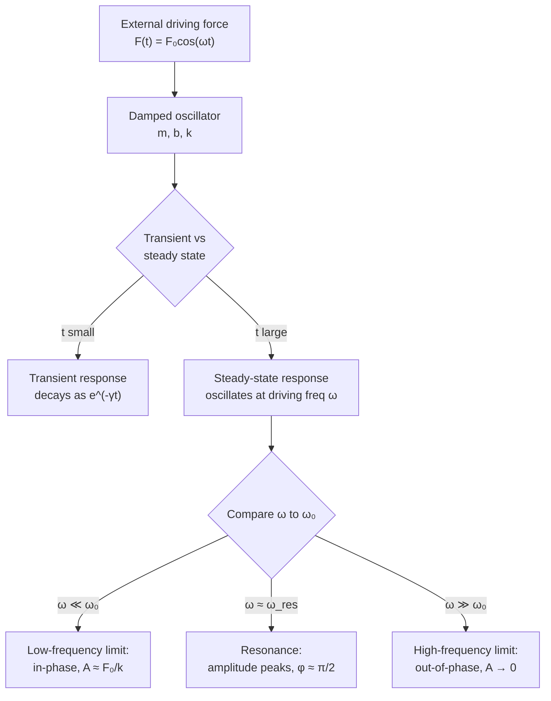

## Driven Oscillations and Resonance

### Overview

Driven (forced) oscillations occur when an external periodic force acts on a damped oscillator, continuously supplying energy to counteract dissipative losses. Unlike free oscillations, which always decay, a driven system can reach a steady state where amplitude remains constant over time. When the driving frequency approaches the system's natural frequency, the amplitude can grow dramatically — a phenomenon known as resonance.

### Equation of Motion

Starting from the damped oscillator equation and adding a sinusoidal driving force $F(t) = F_0\cos(\omega t)$:

$$m\frac{d^2x}{dt^2} + b\frac{dx}{dt} + kx = F_0\cos(\omega t)$$

Dividing by $m$ and using $\omega_0^2 = k/m$, $\gamma = b/(2m)$:

$$\frac{d^2x}{dt^2} + 2\gamma\frac{dx}{dt} + \omega_0^2 x = \frac{F_0}{m}\cos(\omega t)$$

Here $\omega$ is the driving angular frequency, distinct from the system's natural frequency $\omega_0$.

### General Solution Structure

The full solution is the sum of two parts:

$$x(t) = x_{\text{transient}}(t) + x_{\text{steady-state}}(t)$$

- **Transient term**: identical in form to the free damped oscillator solution (underdamped, critically damped, or overdamped), decaying to zero as $t \to \infty$
- **Steady-state term**: persists indefinitely, oscillating at the driving frequency $\omega$ (not $\omega_0$)

After the transient dies out, only the steady-state term remains observable.

### Steady-State Solution

The steady-state response has the form:

$$x_{\text{ss}}(t) = A(\omega)\cos(\omega t - \phi)$$

**Amplitude:**

$$A(\omega) = \frac{F_0/m}{\sqrt{(\omega_0^2 - \omega^2)^2 + (2\gamma\omega)^2}}$$

**Phase lag:**

$$\phi(\omega) = \tan^{-1}\left(\frac{2\gamma\omega}{\omega_0^2 - \omega^2}\right)$$

The phase lag $\phi$ represents how far behind the driving force the displacement trails, ranging from nearly $0$ (driving far below resonance, in-phase) through $\pi/2$ (at resonance) to nearly $\pi$ (driving far above resonance, out-of-phase).

### Resonance

**Amplitude Resonance**

The amplitude $A(\omega)$ is maximized when the denominator is minimized. Differentiating with respect to $\omega$ gives the resonant driving frequency:

$$\omega_{\text{res}} = \sqrt{\omega_0^2 - 2\gamma^2}$$

valid only when $\omega_0^2 > 2\gamma^2$ (light-to-moderate damping); for heavier damping, no amplitude peak exists and $A(\omega)$ decreases monotonically from $\omega = 0$.

At resonance, the peak amplitude is approximately:

$$A_{\text{max}} \approx \frac{F_0}{2m\gamma\omega_0} \quad \text{(for weak damping, } \gamma \ll \omega_0\text{)}$$

**Key Points**

- As $\gamma \to 0$, $\omega_{\text{res}} \to \omega_0$ and $A_{\text{max}} \to \infty$ (ideal undamped resonance is unbounded)
- Increasing damping both lowers the resonant peak and shifts $\omega_{\text{res}}$ further below $\omega_0$
- At $\omega = \omega_0$ exactly, phase lag $\phi = \pi/2$ regardless of damping strength — this is often used experimentally to identify $\omega_0$

### Resonance Curve Behavior (svg_diagram)

<svg xmlns="http://www.w3.org/2000/svg" viewBox="0 0 700 420">
<text x="350" y="25" text-anchor="middle" font-size="16" font-weight="bold" fill="#222">Amplitude vs Driving Frequency (svg_diagram)</text>
<line x1="60" y1="370" x2="660" y2="370" stroke="#333" stroke-width="1.5" />
<line x1="60" y1="50" x2="60" y2="370" stroke="#333" stroke-width="1.5" />
<text x="660" y="392" font-size="12" fill="#333">ω</text>
<text x="30" y="55" font-size="12" fill="#333">A(ω)</text>
<line x1="360" y1="50" x2="360" y2="370" stroke="#999" stroke-width="1" stroke-dasharray="4,4" />
<text x="365" y="65" font-size="11" fill="#666">ω₀</text>

<path d="M60,350 C200,330 320,80 360,70 C400,80 520,330 660,350" fill="none" stroke="`#1f77b4`" stroke-width="2.5" />

<path d="M60,350 C200,320 300,180 360,160 C420,180 520,320 660,350" fill="none" stroke="`#2ca02c`" stroke-width="2.5" />

<path d="M60,350 C220,300 300,260 360,250 C420,260 500,300 660,350" fill="none" stroke="`#d62728`" stroke-width="2.5" />

<rect x="480" y="70" width="16" height="4" fill="#1f77b4" />
<text x="502" y="76" font-size="12" fill="#222">Low damping (high Q)</text>
<rect x="480" y="92" width="16" height="4" fill="#2ca02c" />
<text x="502" y="98" font-size="12" fill="#222">Medium damping</text>
<rect x="480" y="114" width="16" height="4" fill="#d62728" />
<text x="502" y="120" font-size="12" fill="#222">High damping (low Q)</text>
</svg>

### Power Absorption and Bandwidth

Average power delivered to the oscillator by the driving force, in steady state, is:

$$P_{\text{avg}}(\omega) = \frac{1}{2}b\omega^2 A(\omega)^2$$

Power absorption peaks precisely at $\omega = \omega_0$ (not at $\omega_{\text{res}}$), following a Lorentzian-like shape:

$$P_{\text{avg}}(\omega) \propto \frac{\omega^2}{(\omega_0^2-\omega^2)^2 + (2\gamma\omega)^2}$$

**Full Width at Half Maximum (FWHM)** of the power curve, $\Delta\omega$, relates to the quality factor:

$$\Delta\omega \approx 2\gamma = \frac{\omega_0}{Q}$$

A higher $Q$ produces a narrower, sharper resonance peak — the system is more frequency-selective. This relationship underlies the design of radio tuners, filters, and spectroscopic instruments.

### Quality Factor in Driven Systems

$$Q = \frac{\omega_0}{\Delta\omega} = \frac{\omega_0}{2\gamma}$$

**Key Points**

- $Q \gg 1$: sharp resonance, large amplitude gain at resonance, narrow bandwidth (e.g., laser cavities, atomic clocks)
- $Q \sim 1$: broad, shallow resonance (e.g., heavily damped shock absorbers)
- The amplitude at resonance relative to the static ($\omega \to 0$) displacement scales approximately as $Q$: $A_{\text{max}}/A_{\text{static}} \approx Q$ for weak damping

### Worked Example

**Example**

A driven oscillator has $m = 0.2\ \text{kg}$, $k = 80\ \text{N/m}$, $b = 0.4\ \text{kg/s}$, and is driven by $F_0 = 5\ \text{N}$. Find the resonant frequency and peak amplitude.

Step 1 — Natural frequency:

$$\omega_0 = \sqrt{k/m} = \sqrt{80/0.2} = 20\ \text{rad/s}$$

Step 2 — Damping rate:

$$\gamma = \frac{b}{2m} = \frac{0.4}{0.4} = 1\ \text{s}^{-1}$$

Step 3 — Resonant frequency:

$$\omega_{\text{res}} = \sqrt{\omega_0^2 - 2\gamma^2} = \sqrt{400 - 2} = \sqrt{398} \approx 19.95\ \text{rad/s}$$

Step 4 — Peak amplitude (weak-damping approximation):

$$A_{\text{max}} \approx \frac{F_0}{2m\gamma\omega_0} = \frac{5}{2(0.2)(1)(20)} = \frac{5}{8} = 0.625\ \text{m}$$

**Output**: Resonance occurs at $\approx 19.95\ \text{rad/s}$ (very close to $\omega_0 = 20$ since damping is weak), with peak amplitude $\approx 0.625\ \text{m}$ and $Q = \omega_0/(2\gamma) = 10$.

### System Diagram

### Real-World Applications

- **Radio and TV tuning circuits**: LC resonant circuits selectively amplify a chosen broadcast frequency while rejecting others
- **Musical instruments**: resonance bodies (violin, guitar) amplify specific frequencies produced by strings
- **Magnetic Resonance Imaging (MRI)**: nuclear spins driven at their Larmor resonant frequency
- **Structural engineering**: bridges and buildings are analyzed for resonance with wind or seismic driving frequencies to avoid catastrophic amplitude growth (e.g., the Tacoma Narrows Bridge collapse, widely cited though its exact mechanism involved aeroelastic flutter rather than simple forced resonance) [Unverified: precise causal mechanism is debated in structural engineering literature]
- **Microwave ovens**: driving water molecules near their rotational resonance to generate heat

### Conclusion

Driven oscillations combine an external periodic force with a damped oscillator's natural dynamics, producing a transient phase followed by a steady-state oscillation at the driving frequency. Resonance — the dramatic amplitude enhancement near the natural frequency — depends critically on the damping rate, with the quality factor $Q$ governing both the sharpness of the resonance peak and the bandwidth of frequency selectivity. This framework is foundational across mechanical, acoustic, electrical, and quantum systems.

**Related Topics**

- Quality Factor and Bandwidth in Resonant Systems
- RLC Circuits as Electrical Analogs of Driven Oscillators
- Normal Modes and Resonance in Coupled Oscillators
- Nonlinear Resonance and Parametric Oscillation
- Impedance and Power Transfer in Oscillating Systems
- Structural Resonance and Vibration Engineering