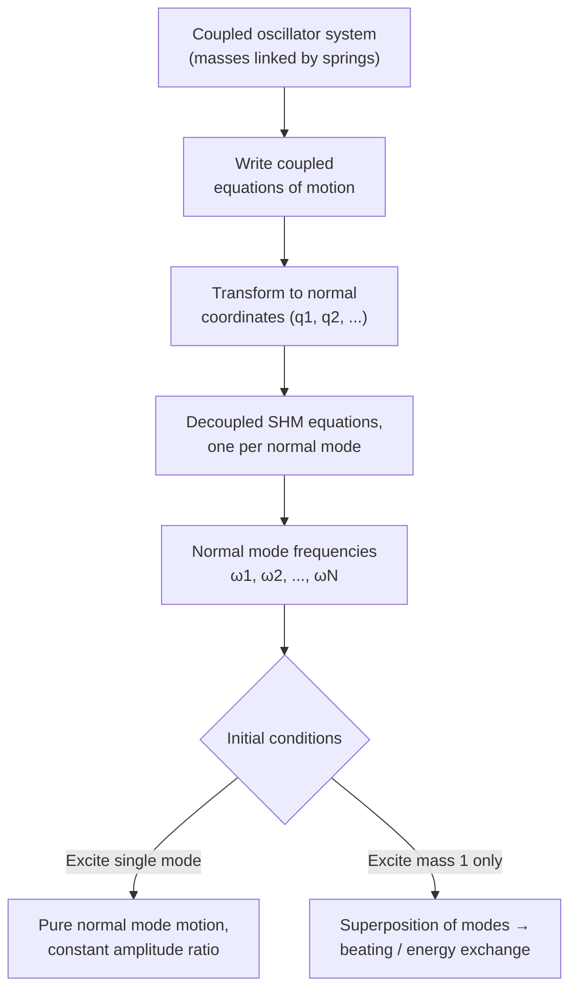

## Coupled Oscillators

### Overview

Coupled oscillators consist of two or more oscillating systems connected such that motion in one affects the others, typically through a shared spring, mechanical link, or field interaction. Unlike isolated oscillators, coupled systems exhibit collective behaviors — normal modes, energy exchange (beating), and mode splitting — that arise purely from the interaction between subsystems.

### Simplest Case: Two Coupled Masses

Consider two identical masses $m$, each attached to a wall by a spring of constant $k$, and connected to each other by a coupling spring of constant $k_c$. Let $x_1$ and $x_2$ be displacements from equilibrium.

**Equations of motion:**

$$m\ddot{x}_1 = -kx_1 - k_c(x_1 - x_2)$$

$$m\ddot{x}_2 = -kx_2 - k_c(x_2 - x_1)$$

Rewriting:

$$m\ddot{x}_1 + (k + k_c)x_1 - k_c x_2 = 0$$

$$m\ddot{x}_2 + (k + k_c)x_2 - k_c x_1 = 0$$

These equations are coupled — each depends on both $x_1$ and $x_2$ — and cannot be solved independently in this form.

### Normal Mode Decomposition

The standard technique is to define new coordinates that decouple the equations. Introduce:

$$q_1 = x_1 + x_2 \quad \text{(symmetric mode)}$$

$$q_2 = x_1 - x_2 \quad \text{(antisymmetric mode)}$$

Adding and subtracting the two equations of motion:

$$m\ddot{q}_1 + kq_1 = 0 \quad \Rightarrow \quad \omega_1 = \sqrt{\frac{k}{m}}$$

$$m\ddot{q}_2 + (k + 2k_c)q_2 = 0 \quad \Rightarrow \quad \omega_2 = \sqrt{\frac{k + 2k_c}{m}}$$

Each normal coordinate now obeys an independent SHM equation, with its own **normal mode frequency**.

**Key Points**

- **Mode 1 (in-phase / symmetric)**: $x_1 = x_2$ at all times; the coupling spring never stretches, so $\omega_1 = \sqrt{k/m}$, identical to a single uncoupled oscillator
- **Mode 2 (out-of-phase / antisymmetric)**: $x_1 = -x_2$; the coupling spring stretches maximally, raising the effective stiffness, so $\omega_2 = \sqrt{(k+2k_c)/m} > \omega_1$
- Any general motion of the system is a superposition of these two normal modes

### General Solution

$$x_1(t) = \frac{1}{2}\left[A_1\cos(\omega_1 t + \phi_1) + A_2\cos(\omega_2 t + \phi_2)\right]$$

$$x_2(t) = \frac{1}{2}\left[A_1\cos(\omega_1 t + \phi_1) - A_2\cos(\omega_2 t + \phi_2)\right]$$

The four constants ($A_1, A_2, \phi_1, \phi_2$) are fixed by initial conditions (initial positions and velocities of both masses).

### Beating: Energy Exchange Between Oscillators

A particularly instructive initial condition: displace mass 1 by $A$ and release both masses from rest ($x_1(0) = A$, $x_2(0) = 0$, both velocities zero). This excites both normal modes equally, giving:

$$x_1(t) = A\cos\left(\frac{\omega_2-\omega_1}{2}t\right)\cos\left(\frac{\omega_1+\omega_2}{2}t\right)$$

$$x_2(t) = A\sin\left(\frac{\omega_2-\omega_1}{2}t\right)\sin\left(\frac{\omega_1+\omega_2}{2}t\right)$$

This is a **beat pattern**: rapid oscillation at the average frequency $(\omega_1+\omega_2)/2$, modulated by a slow envelope at the difference frequency $(\omega_2-\omega_1)/2$. Physically, energy sloshes back and forth between the two masses — when mass 1's amplitude is maximal, mass 2's is near zero, and vice versa, with the exchange period:

$$T_{\text{beat}} = \frac{2\pi}{\omega_2 - \omega_1}$$

**Key Points**

- Weak coupling ($k_c \ll k$) produces slow, pronounced beating with near-complete energy transfer
- Strong coupling produces fast mode-frequency splitting and rapid energy exchange
- This is the mechanical analog of phenomena like quantum tunneling between wells and coupled pendulum energy transfer demonstrations

### Normal Mode Diagram (svg_diagram)

<svg xmlns="http://www.w3.org/2000/svg" viewBox="0 0 700 320">
<text x="350" y="25" text-anchor="middle" font-size="16" font-weight="bold" fill="#222">Two Coupled Masses — Normal Modes (svg_diagram)</text>

<text x="150" y="55" text-anchor="middle" font-size="13" fill="`#1f77b4`" font-weight="bold">Mode 1: In-Phase (ω₁ = √(k/m))</text>

<line x1="30" y1="100" x2="30" y2="140" stroke="#333" stroke-width="2" />

<path d="M30,120 L45,110 L55,130 L65,110 L75,130 L85,110 L95,120" fill="none" stroke="#555" stroke-width="1.5" />

<rect x="95" y="105" width="30" height="30" fill="`#1f77b4`" />

<text x="110" y="125" text-anchor="middle" font-size="10" fill="white">m1</text>

<path d="M125,120 L140,110 L150,130 L160,110 L170,130 L180,110 L195,120" fill="none" stroke="#555" stroke-width="1.5" />

<rect x="195" y="105" width="30" height="30" fill="`#1f77b4`" />

<text x="210" y="125" text-anchor="middle" font-size="10" fill="white">m2</text>

<path d="M225,120 L240,110 L250,130 L260,110 L270,130 L280,110 L290,120" fill="none" stroke="#555" stroke-width="1.5" />

<line x1="290" y1="100" x2="290" y2="140" stroke="#333" stroke-width="2" />

<line x1="110" y1="150" x2="150" y2="150" stroke="`#1f77b4`" stroke-width="1.5" marker-end="url(#arrow1)" />

<line x1="210" y1="150" x2="250" y2="150" stroke="`#1f77b4`" stroke-width="1.5" marker-end="url(#arrow1)" />

<text x="330" y="128" font-size="11" fill="#555">Coupling spring: no net stretch</text>

<text x="150" y="220" text-anchor="middle" font-size="13" fill="`#d62728`" font-weight="bold">Mode 2: Out-of-Phase (ω₂ = √((k+2kc)/m))</text>

<line x1="30" y1="260" x2="30" y2="300" stroke="#333" stroke-width="2" />

<path d="M30,280 L45,270 L55,290 L65,270 L75,290 L85,270 L95,280" fill="none" stroke="#555" stroke-width="1.5" />

<rect x="95" y="265" width="30" height="30" fill="`#d62728`" />

<text x="110" y="285" text-anchor="middle" font-size="10" fill="white">m1</text>

<path d="M125,280 L140,270 L150,290 L160,270 L170,290 L180,270 L195,280" fill="none" stroke="#555" stroke-width="1.5" />

<rect x="195" y="265" width="30" height="30" fill="`#d62728`" />

<text x="210" y="285" text-anchor="middle" font-size="10" fill="white">m2</text>

<path d="M225,280 L240,270 L250,290 L260,270 L270,290 L280,270 L290,280" fill="none" stroke="#555" stroke-width="1.5" />

<line x1="290" y1="260" x2="290" y2="300" stroke="#333" stroke-width="2" />

<line x1="110" y1="310" x2="150" y2="310" stroke="`#d62728`" stroke-width="1.5" marker-end="url(#arrow2)" />

<line x1="250" y1="310" x2="210" y2="310" stroke="`#d62728`" stroke-width="1.5" marker-end="url(#arrow2)" />

<text x="330" y="288" font-size="11" fill="#555">Coupling spring: maximal stretch</text>

</svg>

### N Coupled Oscillators and the Continuum Limit

For a chain of $N$ identical masses coupled by identical springs (a discrete analog of a vibrating string), there are $N$ normal modes with frequencies:

$$\omega_n = 2\sqrt{\frac{k}{m}}\sin\left(\frac{n\pi}{2(N+1)}\right), \quad n = 1, 2, \dots, N$$

**Key Points**

- Each normal mode corresponds to a standing-wave pattern across the chain, with mode number $n$ indicating the number of "humps"
- As $N \to \infty$ with fixed total length and mass density, this discrete system smoothly transitions into a continuous vibrating string, and the normal mode frequencies approach the continuous wave equation's harmonic series
- This discrete-to-continuum limit is the conceptual bridge between coupled oscillator theory and wave mechanics

### Damped and Driven Coupled Systems

Adding damping and/or external driving to each mass generalizes the single-oscillator equations into a coupled system of differential equations, typically solved via matrix methods:

$$\mathbf{M}\ddot{\mathbf{x}} + \mathbf{B}\dot{\mathbf{x}} + \mathbf{K}\mathbf{x} = \mathbf{F}(t)$$

where $\mathbf{M}$, $\mathbf{B}$, $\mathbf{K}$ are mass, damping, and stiffness matrices. Normal modes are found via the generalized eigenvalue problem:

$$\det(\mathbf{K} - \omega^2\mathbf{M}) = 0$$

This matrix formalism generalizes directly to arbitrarily many coupled oscillators and underlies molecular vibration analysis (normal mode/vibrational spectroscopy) and structural vibration analysis in engineering.

### Worked Example

**Example**

Two identical masses $m = 1\ \text{kg}$ connect to walls via springs $k = 100\ \text{N/m}$ and to each other via a coupling spring $k_c = 10\ \text{N/m}$. Find both normal mode frequencies and the beat period if mass 1 is displaced and released.

Step 1 — Mode 1 (in-phase):

$$\omega_1 = \sqrt{k/m} = \sqrt{100/1} = 10\ \text{rad/s}$$

Step 2 — Mode 2 (out-of-phase):

$$\omega_2 = \sqrt{(k+2k_c)/m} = \sqrt{(100+20)/1} = \sqrt{120} \approx 10.954\ \text{rad/s}$$

Step 3 — Beat period:

$$T_{\text{beat}} = \frac{2\pi}{\omega_2-\omega_1} = \frac{2\pi}{0.954} \approx 6.59\ \text{s}$$

**Output**: The system exhibits normal modes at $10\ \text{rad/s}$ and $\approx 10.95\ \text{rad/s}$, with energy fully transferring between the two masses roughly every $6.59\ \text{s}$.

### System Diagram

### Real-World Applications

- **Molecular vibrational spectroscopy**: atoms in a molecule behave as coupled oscillators; normal modes correspond to observed IR/Raman vibrational frequencies
- **Coupled pendulum demonstrations**: classic physics lab setup showing visible energy transfer (beating) between two pendulums linked by a weak spring
- **Crystal lattice dynamics (phonons)**: atoms in a crystal lattice are coupled oscillators; the continuum limit connects to phonon dispersion relations
- **Structural engineering**: multi-story buildings modeled as coupled oscillators to analyze seismic response and mode shapes
- **Quantum two-level systems**: mathematically analogous coupling and beating occurs in quantum systems (e.g., ammonia molecule inversion, avoided crossings) [Inference: the classical-quantum analogy is structural/mathematical, not a claim of identical physical mechanism]

### Conclusion

Coupled oscillators reveal how interacting systems develop collective normal modes — patterns of motion at fixed frequencies where all parts move in a definite phase relationship. Any general motion decomposes into a superposition of these modes, and when modes of nearby frequency are simultaneously excited, the system exhibits beating, a periodic exchange of energy between subsystems. This framework scales from two masses to N-body chains to continuous media, forming a direct conceptual bridge to wave phenomena and underpinning applications from molecular spectroscopy to structural dynamics.

**Related Topics**

- Normal Modes and Eigenvalue Methods for Vibrating Systems
- Transition from Discrete Oscillator Chains to the Wave Equation
- Molecular Vibrational Spectroscopy (IR/Raman)
- Phonons and Lattice Dynamics in Solids
- Coupled Pendulum Energy Transfer Experiments
- Matrix Mechanics for Multi-Degree-of-Freedom Systems