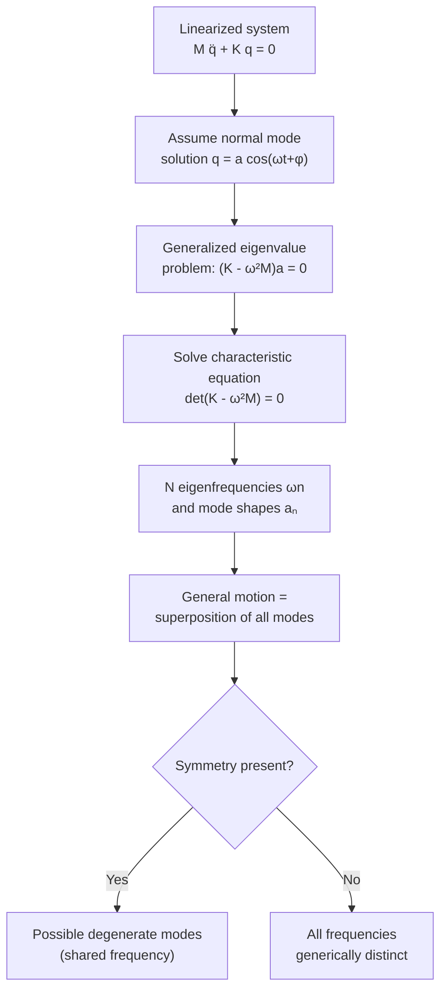

## Normal Modes of Vibration

### Overview

A normal mode is a pattern of motion in which all parts of a coupled oscillating system move sinusoidally at the same frequency and with fixed phase relationships to one another. Any complex vibration of a linear system can be expressed as a superposition of its normal modes, making them the fundamental "basis functions" of oscillatory motion — analogous to how any periodic signal can be decomposed into sinusoids via Fourier analysis.

### Formal Definition

For a system of $N$ coupled degrees of freedom described by generalized coordinates $\mathbf{q} = (q_1, q_2, \dots, q_N)$, the equations of motion in the small-oscillation (linear) approximation take the matrix form:

$$\mathbf{M}\ddot{\mathbf{q}} + \mathbf{K}\mathbf{q} = 0$$

where $\mathbf{M}$ is the mass matrix and $\mathbf{K}$ is the stiffness matrix, both derived from the kinetic and potential energy of the system near equilibrium.

A normal mode solution has the form:

$$\mathbf{q}(t) = \mathbf{a}\cos(\omega t + \phi)$$

where $\mathbf{a}$ is a constant vector (the **mode shape** or **eigenvector**) describing the relative amplitude and phase of each coordinate, and $\omega$ is the **normal mode (eigen)frequency**.

### The Eigenvalue Problem

Substituting the trial solution into the equation of motion:

$$-\omega^2\mathbf{M}\mathbf{a} + \mathbf{K}\mathbf{a} = 0$$

$$\Rightarrow \quad (\mathbf{K} - \omega^2\mathbf{M})\mathbf{a} = 0$$

Nontrivial solutions ($\mathbf{a} \neq 0$) exist only when the determinant vanishes:

$$\det(\mathbf{K} - \omega^2\mathbf{M}) = 0$$

This is the **characteristic equation**, a polynomial in $\omega^2$ of degree $N$, yielding $N$ eigenvalues $\omega_n^2$ and corresponding eigenvectors $\mathbf{a}_n$ — the normal mode frequencies and mode shapes.

**Key Points**

- The number of normal modes equals the number of independent degrees of freedom $N$
- Mode shapes $\mathbf{a}_n$ are generally orthogonal with respect to the mass matrix: $\mathbf{a}_m^T\mathbf{M}\mathbf{a}_n = 0$ for $m \neq n$
- This orthogonality allows any initial condition to be uniquely decomposed into a sum of normal modes

### General Motion as Superposition

The complete solution is a linear combination of all normal modes:

$$\mathbf{q}(t) = \sum_{n=1}^{N} c_n\,\mathbf{a}_n\cos(\omega_n t + \phi_n)$$

The coefficients $c_n$ and phases $\phi_n$ (equivalently, $2N$ real constants) are determined by the $2N$ initial conditions (initial positions and velocities of all coordinates).

### Example: Three Masses on a String / Chain

For $N$ identical masses $m$ connected by identical springs $k$ between two fixed walls (a discrete string model), the normal mode frequencies are:

$$\omega_n = 2\sqrt{\frac{k}{m}}\,\sin\left(\frac{n\pi}{2(N+1)}\right), \quad n = 1, 2, \dots, N$$

and the mode shape (displacement of the $j$-th mass in the $n$-th mode) is:

$$a_{n,j} \propto \sin\left(\frac{n\pi j}{N+1}\right)$$

**Key Points**

- Mode $n=1$ (lowest frequency, the **fundamental**): all masses move together in the same direction, no internal nodes
- Higher-$n$ modes have progressively more **nodes** (points of zero displacement) — mode $n$ has $n-1$ internal nodes
- As $N \to \infty$, this discrete spectrum approaches the continuous normal modes of a vibrating string, forming the harmonic series $\omega_n \propto n$

### Mode Shape Visualization (svg_diagram)

<svg xmlns="http://www.w3.org/2000/svg" viewBox="0 0 700 380">
<text x="350" y="25" text-anchor="middle" font-size="16" font-weight="bold" fill="#222">Normal Mode Shapes — Fixed-Fixed String Analogy (svg_diagram)</text>

<text x="60" y="70" font-size="13" fill="`#1f77b4`" font-weight="bold">n = 1 (fundamental)</text>

<line x1="60" y1="100" x2="640" y2="100" stroke="#ccc" stroke-width="1" stroke-dasharray="3,3" />

<path d="M60,100 Q350,50 640,100" fill="none" stroke="`#1f77b4`" stroke-width="2.5" />

<circle cx="60" cy="100" r="4" fill="#333" />

<circle cx="640" cy="100" r="4" fill="#333" />

<text x="60" y="150" font-size="13" fill="`#2ca02c`" font-weight="bold">n = 2 (one node)</text>

<line x1="60" y1="180" x2="640" y2="180" stroke="#ccc" stroke-width="1" stroke-dasharray="3,3" />

<path d="M60,180 Q200,130 350,180 Q500,230 640,180" fill="none" stroke="`#2ca02c`" stroke-width="2.5" />

<circle cx="60" cy="180" r="4" fill="#333" />

<circle cx="350" cy="180" r="4" fill="#333" />

<circle cx="640" cy="180" r="4" fill="#333" />

<text x="350" y="200" text-anchor="middle" font-size="10" fill="#666">node</text>

<text x="60" y="250" font-size="13" fill="`#d62728`" font-weight="bold">n = 3 (two nodes)</text>

<line x1="60" y1="280" x2="640" y2="280" stroke="#ccc" stroke-width="1" stroke-dasharray="3,3" />

<path d="M60,280 Q157,235 253,280 Q350,325 447,280 Q543,235 640,280" fill="none" stroke="`#d62728`" stroke-width="2.5" />

<circle cx="60" cy="280" r="4" fill="#333" />

<circle cx="253" cy="280" r="4" fill="#333" />

<circle cx="447" cy="280" r="4" fill="#333" />

<circle cx="640" cy="280" r="4" fill="#333" />

<text x="253" y="300" text-anchor="middle" font-size="10" fill="#666">node</text>

<text x="447" y="300" text-anchor="middle" font-size="10" fill="#666">node</text>

<text x="350" y="350" text-anchor="middle" font-size="11" fill="#555">Higher n → higher frequency ωn → more nodes</text>

</svg>

### Degenerate Modes and Symmetry

When a system possesses geometric symmetry (e.g., a square membrane, a symmetric molecule), multiple distinct mode shapes can share the same eigenfrequency — these are called **degenerate modes**. Group theory formally classifies which modes must be degenerate based on the system's symmetry group, a technique heavily used in molecular vibrational analysis.

**Key Points**

- Degenerate modes span a subspace: any linear combination of degenerate mode shapes is itself a valid normal mode at that frequency
- Symmetry-breaking (e.g., an asymmetric perturbation) can lift degeneracy, splitting a single frequency into closely spaced distinct frequencies
- This principle directly parallels degenerate energy levels in quantum mechanics

### Normal Modes in Continuous Systems

For continuous media (strings, membranes, rods, plates), the discrete sum becomes an integral/series over a continuous or countably infinite mode spectrum, governed by the wave equation with boundary conditions:

$$\frac{\partial^2 y}{\partial t^2} = v^2\frac{\partial^2 y}{\partial x^2}$$

For a string fixed at both ends (length $L$), separation of variables yields normal modes:

$$y_n(x,t) = A_n\sin\left(\frac{n\pi x}{L}\right)\cos(\omega_n t + \phi_n), \quad \omega_n = \frac{n\pi v}{L}$$

This is the continuum limit of the discrete mass-chain result and directly produces the harmonic series fundamental to musical acoustics.

### Worked Example

**Example**

Three identical masses $m = 1\ \text{kg}$, connected by springs $k = 50\ \text{N/m}$ between two fixed walls, form a linear chain ($N=3$). Find all three normal mode frequencies.

Step 1 — Apply the formula with $N=3$:

$$\omega_n = 2\sqrt{k/m}\,\sin\left(\frac{n\pi}{2(4)}\right) = 2\sqrt{50}\,\sin\left(\frac{n\pi}{8}\right)$$

Step 2 — Compute the prefactor:

$$2\sqrt{50} \approx 14.142\ \text{rad/s}$$

Step 3 — Evaluate for $n=1,2,3$:

$$\omega_1 = 14.142\sin(\pi/8) \approx 14.142(0.3827) \approx 5.41\ \text{rad/s}$$

$$\omega_2 = 14.142\sin(2\pi/8) \approx 14.142(0.7071) \approx 10.00\ \text{rad/s}$$

$$\omega_3 = 14.142\sin(3\pi/8) \approx 14.142(0.9239) \approx 13.06\ \text{rad/s}$$

**Output**: The three-mass chain has normal modes at approximately $5.41$, $10.00$, and $13.06\ \text{rad/s}$, with mode shapes containing $0$, $1$, and $2$ internal nodes respectively.

### System Diagram

### Real-World Applications

- **Musical instruments**: string and wind instrument overtone series are literal manifestations of normal mode frequencies
- **Molecular spectroscopy**: each vibrational mode of a molecule (stretching, bending, twisting) is a normal mode; IR/Raman spectra directly probe these frequencies
- **Structural engineering**: modal analysis identifies a building's or bridge's natural vibration frequencies to avoid resonant excitation from wind, traffic, or seismic activity
- **Mechanical/aerospace engineering**: finite element analysis (FEA) software numerically computes normal modes of complex structures (aircraft wings, turbine blades) for vibration and fatigue design
- **Acoustics**: room modes and speaker cabinet resonances are normal modes of the enclosed air volume

### Conclusion

Normal modes provide the fundamental decomposition of any small-amplitude oscillatory motion in a linear system, reducing an arbitrarily complex coupled vibration problem to a set of independent, non-interacting simple harmonic oscillators. Each mode is characterized by a unique frequency and a fixed spatial pattern (mode shape), and the eigenvalue formalism $(\mathbf{K}-\omega^2\mathbf{M})\mathbf{a}=0$ generalizes seamlessly from two coupled masses to continuous media, underpinning applications across acoustics, molecular physics, and structural engineering.

**Related Topics**

- Coupled Oscillators and Beating Phenomena
- The Wave Equation and Continuous Media Vibrations
- Fourier Decomposition and Modal Analysis
- Molecular Vibrational Spectroscopy and Group Theory
- Finite Element Modal Analysis in Engineering
- Standing Waves and Harmonic Series in Acoustics