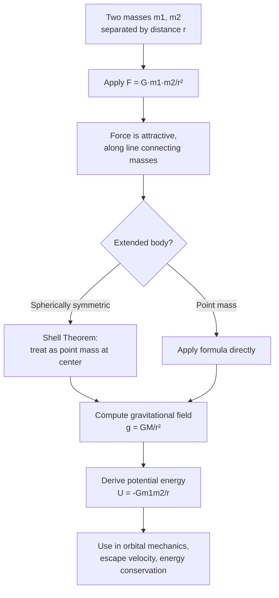

## Newton's Law of Universal Gravitation

### Overview

Newton's Law of Universal Gravitation states that every particle of mass attracts every other particle of mass with a force directed along the line connecting them, with magnitude proportional to the product of their masses and inversely proportional to the square of the distance between them. Formulated by Isaac Newton in the *Principia* (1687), it was the first unified theory of gravity, successfully explaining both terrestrial free-fall and celestial orbital motion with a single mathematical law.

### Mathematical Statement

$$F = G\frac{m_1 m_2}{r^2}$$

where:

- $F$ is the magnitude of the gravitational force between the two masses
- $G$ is the universal gravitational constant, $G \approx 6.674 \times 10^{-11}\ \text{N·m}^2/\text{kg}^2$
- $m_1, m_2$ are the two point masses (or the masses of spherically symmetric bodies)
- $r$ is the distance between the centers of the two masses

### Vector Form

Written as a vector, the force on mass $m_1$ due to mass $m_2$ is:

$$\vec{F}_{12} = -G\frac{m_1 m_2}{r^2}\hat{r}$$

where $\hat{r}$ is the unit vector pointing from $m_2$ toward $m_1$, and the negative sign indicates the force is always attractive (directed toward the other mass, opposing $\hat{r}$).

By Newton's Third Law, the force on $m_2$ due to $m_1$ is equal in magnitude and opposite in direction:

$$\vec{F}_{21} = -\vec{F}_{12}$$

### Key Properties

**Key Points**

- **Inverse-square law**: doubling the distance reduces the force to one-quarter; tripling reduces it to one-ninth
- **Always attractive**: unlike electric forces, gravity has no repulsive analog between ordinary (positive) masses
- **Action at a distance**: in Newtonian formulation, the force acts instantaneously regardless of separation (later reconciled with finite propagation speed in General Relativity)
- **Superposition principle**: the net gravitational force on a mass from multiple sources is the vector sum of the individual pairwise forces
- **Applies to point masses**, but extends to spherically symmetric extended bodies by treating their mass as concentrated at the center (a result Newton proved using integral calculus — the Shell Theorem)

### The Shell Theorem

For a uniform spherical shell (or a solid sphere with spherically symmetric density), Newton proved two critical results:

1. **Outside the shell**: the gravitational force is identical to that of a point mass equal to the shell's total mass, located at its center
2. **Inside a uniform hollow shell**: the net gravitational force is exactly zero everywhere inside the cavity

This justifies treating planets and stars as point masses when calculating external gravitational effects, despite their finite size.

### Gravitational Field

The gravitational force per unit mass defines the **gravitational field** $\vec{g}$ at a point in space:

$$\vec{g} = \frac{\vec{F}}{m} = -G\frac{M}{r^2}\hat{r}$$

This reframes gravity as a field surrounding a mass $M$, independent of any test mass placed within it — a conceptual step toward field theory later generalized in electromagnetism and General Relativity.

**Surface gravity of a planet:**

$$g = \frac{GM}{R^2}$$

where $R$ is the planet's radius. This is why $g \approx 9.8\ \text{m/s}^2$ at Earth's surface — a direct consequence of Earth's mass and radius substituted into this formula.

### Gravitational Potential Energy

The work done against gravity in moving a mass from infinity to distance $r$ defines the gravitational potential energy:

$$U(r) = -\frac{Gm_1 m_2}{r}$$

**Key Points**

- $U \to 0$ as $r \to \infty$ (the conventional reference point)
- $U$ is always negative for a bound configuration, becoming less negative (closer to zero) as separation increases
- The force is the negative gradient of potential energy: $F = -\dfrac{dU}{dr}$, consistent with $F = Gm_1m_2/r^2$ (attractive, pointing inward)
- Near a planet's surface, this reduces to the familiar approximation $U \approx mgh$ for small height changes $h \ll R$

### Force and Potential Energy vs Distance (svg_diagram)

<svg xmlns="http://www.w3.org/2000/svg" viewBox="0 0 700 400">
<text x="350" y="25" text-anchor="middle" font-size="16" font-weight="bold" fill="#222">Gravitational Force and Potential Energy vs Distance (svg_diagram)</text>

<line x1="70" y1="360" x2="660" y2="360" stroke="#333" stroke-width="1.5" />
<line x1="70" y1="40" x2="70" y2="360" stroke="#333" stroke-width="1.5" />
<text x="660" y="382" font-size="12" fill="#333">r</text>
<line x1="70" y1="200" x2="660" y2="200" stroke="#ccc" stroke-width="1" stroke-dasharray="4,4" />
<text x="45" y="205" font-size="11" fill="#666">0</text>

<path d="M110,60 C150,150 200,185 260,195 C340,202 450,203 660,203" fill="none" stroke="`#1f77b4`" stroke-width="2.5" />

<text x="150" y="90" font-size="12" fill="`#1f77b4`" font-weight="bold">F(r) = Gm₁m₂/r²</text>

<path d="M110,340 C150,260 200,220 260,208 C340,201 450,200 660,200" fill="none" stroke="`#d62728`" stroke-width="2.5" />

<text x="150" y="330" font-size="12" fill="`#d62728`" font-weight="bold">U(r) = -Gm₁m₂/r</text>

<text x="500" y="220" font-size="11" fill="#666">Both → 0 as r → ∞</text>

</svg>

### Determining G Experimentally

The gravitational constant $G$ was first measured by Henry Cavendish in 1798 using a torsion balance, allowing (famously) the first calculation of Earth's mass — often described as "weighing the Earth." $G$ remains one of the least precisely known fundamental constants due to the extreme weakness of gravity relative to other fundamental forces.

**Key Points**

- $G \approx 6.674 \times 10^{-11}\ \text{N·m}^2/\text{kg}^2$ (CODATA value, precise to roughly 1 part in $10^4$–$10^5$ — far less precise than constants like the speed of light or elementary charge)
- Modern determinations use refined torsion balances, atom interferometry, and other precision techniques, with ongoing small discrepancies between different experimental methods [Unverified: exact current best value and uncertainty should be checked against the latest CODATA release for precision-critical work]

### Newtonian Gravity vs General Relativity

Newton's law is an excellent approximation in most everyday and astronomical contexts (weak fields, low velocities) but breaks down in strong-field or high-precision regimes:

**Key Points**

- Newtonian gravity predicts instantaneous action at a distance; General Relativity predicts gravitational effects propagate at the speed of light
- Mercury's perihelion precession has a small excess (~43 arcseconds/century) unexplained by Newtonian gravity alone, but correctly predicted by GR
- GPS satellite systems require GR corrections (both special and general relativistic time dilation) for positional accuracy
- For most orbital mechanics, planetary motion, and everyday applications, Newtonian gravity remains the standard and sufficiently accurate framework

### Worked Example

**Example**

Calculate the gravitational force between Earth ($M = 5.972 \times 10^{24}\ \text{kg}$) and a $70\ \text{kg}$ person standing at Earth's surface ($R = 6.371 \times 10^6\ \text{m}$).

Step 1 — Apply the formula:

$$F = G\frac{Mm}{R^2} = (6.674\times10^{-11})\frac{(5.972\times10^{24})(70)}{(6.371\times10^6)^2}$$

Step 2 — Compute the numerator:

$$(6.674\times10^{-11})(5.972\times10^{24})(70) \approx 2.790 \times 10^{16}$$

Step 3 — Compute the denominator:

$$(6.371\times10^6)^2 \approx 4.059\times10^{13}$$

Step 4 — Divide:

$$F \approx \frac{2.790\times10^{16}}{4.059\times10^{13}} \approx 687\ \text{N}$$

**Output**: The gravitational force is approximately $687\ \text{N}$, consistent with $F = mg = 70 \times 9.8 = 686\ \text{N}$ (small difference due to rounding).

### System Diagram

### Real-World Applications

- **Orbital mechanics**: satellite orbits, planetary motion, and spacecraft trajectory design all derive directly from this law combined with Newton's laws of motion
- **Tidal forces**: differential gravitational pull across an extended body (e.g., Earth-Moon system) produces ocean tides
- **Escape velocity calculations**: determining the speed needed to escape a gravitational well, derived from setting total mechanical energy to zero
- **Astronomy and astrophysics**: measuring masses of stars, planets, and galaxies via their gravitational effects on orbiting bodies
- **Geophysics**: gravimetric surveys use small local variations in $g$ to infer subsurface density anomalies (mineral deposits, geological structures)

### Conclusion

Newton's Law of Universal Gravitation unified terrestrial and celestial mechanics under a single inverse-square force law, establishing gravity as a universal attractive interaction between all massive objects. Though superseded in extreme regimes by General Relativity, it remains foundational for orbital mechanics, astrophysics, and everyday engineering calculations, and serves as the essential starting point for the study of planetary motion and satellite dynamics.

**Related Topics**

- Kepler's Laws of Planetary Motion
- Gravitational Potential Energy and Escape Velocity
- Circular and Elliptical Orbital Mechanics
- The Shell Theorem and Gravitational Fields of Extended Bodies
- Tidal Forces and Tidal Locking
- Introduction to General Relativity and Gravitational Time Dilation