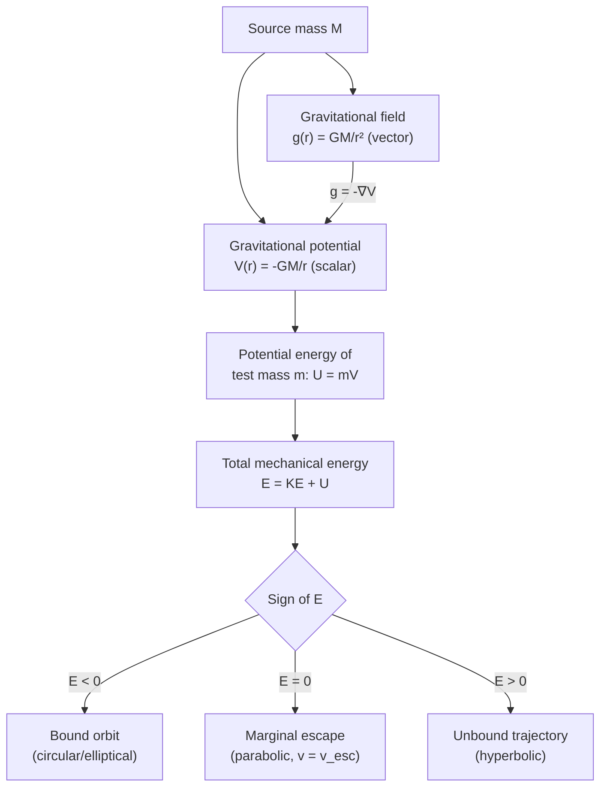

## Gravitational Field and Potential Energy

### Overview

The gravitational field and gravitational potential energy are two complementary formalisms for describing gravitational interactions without directly invoking force between specific pairs of masses. The field describes the force per unit mass at every point in space surrounding a source mass, while potential energy describes the work-related energy stored in a configuration of masses. Together, these concepts enable powerful energy-conservation techniques for solving orbital mechanics problems that would be cumbersome using force analysis alone.

### Gravitational Field

The gravitational field $\vec{g}$ at a point is defined as the gravitational force per unit mass a small test mass would experience at that point:

$$\vec{g} = \frac{\vec{F}}{m_{\text{test}}}$$

For a point mass (or spherically symmetric body) $M$, using Newton's Law of Universal Gravitation:

$$\vec{g}(r) = -\frac{GM}{r^2}\hat{r}$$

where $\hat{r}$ points radially outward from $M$, and the negative sign indicates the field points inward (toward the source).

**Key Points**

- Units: $\text{N/kg}$, equivalent to $\text{m/s}^2$ (acceleration) — the field vector at any point equals the free-fall acceleration a test mass would experience there
- The field exists independently of any test mass — it is a property of space set up by the source mass $M$
- Field magnitude follows an inverse-square dependence: $g \propto 1/r^2$

### Superposition of Fields

For multiple source masses, the net gravitational field at a point is the vector sum of each individual contribution:

$$\vec{g}_{\text{net}} = \sum_i \vec{g}_i = -\sum_i \frac{Gm_i}{r_i^2}\hat{r}_i$$

This linearity allows complex mass distributions to be analyzed by summing (or integrating, for continuous distributions) contributions from infinitesimal mass elements.

### Gravitational Field of Extended Bodies

For a continuous mass distribution, the field at a point is found via integration:

$$\vec{g}(\vec{r}) = -G\int \frac{dm}{|\vec{r}-\vec{r}'|^2}\hat{r}'$$

For spherically symmetric bodies, the **Shell Theorem** dramatically simplifies this:

**Key Points**

- Outside a spherically symmetric mass distribution: field is identical to a point mass at the center, $g = GM/r^2$
- Inside a uniform solid sphere (at radius $r < R$): only the mass enclosed within radius $r$ contributes, giving $g(r) = GM_{\text{enc}}/r^2 = \dfrac{GM r}{R^3}$ (linear increase with $r$ for uniform density)
- Inside a hollow spherical shell: field is exactly zero everywhere in the cavity

### Field Behavior Inside and Outside a Uniform Sphere (svg_diagram)

<svg xmlns="http://www.w3.org/2000/svg" viewBox="0 0 700 380">
<text x="350" y="25" text-anchor="middle" font-size="16" font-weight="bold" fill="#222">Gravitational Field Magnitude vs Radius (svg_diagram)</text>
<line x1="70" y1="340" x2="660" y2="340" stroke="#333" stroke-width="1.5" />
<line x1="70" y1="40" x2="70" y2="340" stroke="#333" stroke-width="1.5" />
<text x="660" y="362" font-size="12" fill="#333">r</text>
<text x="40" y="45" font-size="12" fill="#333">g(r)</text>
<line x1="260" y1="40" x2="260" y2="340" stroke="#999" stroke-width="1" stroke-dasharray="4,4" />
<text x="230" y="358" font-size="11" fill="#666">R (surface)</text>

<path d="M70,340 L260,140" fill="none" stroke="#1f77b4" stroke-width="2.5" />

<path d="M260,140 C320,220 400,270 500,295 C580,310 620,318 660,322" fill="none" stroke="`#d62728`" stroke-width="2.5" />

<circle cx="260" cy="140" r="4" fill="#333" />
<text x="270" y="130" font-size="11" fill="#333">g_max at surface</text>

<text x="130" y="300" font-size="12" fill="`#1f77b4`" font-weight="bold">g ∝ r (interior)</text>

<text x="450" y="260" font-size="12" fill="`#d62728`" font-weight="bold">g ∝ 1/r² (exterior)</text>

</svg>

### Gravitational Potential

The **gravitational potential** $V$ is the potential energy per unit mass — a scalar field related to $\vec{g}$ by:

$$\vec{g} = -\nabla V$$

For a point mass $M$:

$$V(r) = -\frac{GM}{r}$$

**Key Points**

- Units: $\text{J/kg}$
- $V \to 0$ as $r \to \infty$ (standard convention)
- Potential is a scalar, making superposition simpler than vector field addition: $V_{\text{net}} = \sum_i V_i = -\sum_i \dfrac{Gm_i}{r_i}$
- Equipotential surfaces (spheres, for a point mass) are surfaces of constant $V$; the field $\vec{g}$ is always perpendicular to equipotential surfaces, pointing toward lower potential

### Gravitational Potential Energy

The potential energy of a two-mass system is:

$$U(r) = m \cdot V(r) = -\frac{GMm}{r}$$

More generally, for a system of $N$ masses, the total gravitational potential energy is the sum over all unique pairs:

$$U_{\text{total}} = -G\sum_{i<j}\frac{m_i m_j}{r_{ij}}$$

**Key Points**

- $U$ is defined relative to a reference point at infinite separation, where $U = 0$
- $U$ is always negative for any bound (finite-separation) configuration, reflecting that positive work must be done to separate the masses to infinity
- The relationship between force and potential energy: $\vec{F} = -\nabla U$, confirming that force points toward decreasing potential energy (i.e., toward the other mass)

### Escape Velocity

Using conservation of energy, the escape velocity is the minimum speed needed for an object to escape a gravitational field to infinity with zero final kinetic energy:

$$\frac{1}{2}mv_{\text{esc}}^2 + \left(-\frac{GMm}{R}\right) = 0$$

$$\Rightarrow \quad v_{\text{esc}} = \sqrt{\frac{2GM}{R}}$$

This is independent of the escaping object's mass $m$ and direction of launch (assuming no atmospheric drag and a non-rotating, spherically symmetric source).

### Local Approximation Near a Surface

Near a planet's surface, where height $h \ll R$, the potential energy can be linearized:

$$U(h) = -\frac{GMm}{R+h} \approx -\frac{GMm}{R} + \frac{GMm}{R^2}h = U(0) + mgh$$

using $g = GM/R^2$. This recovers the familiar $U \approx mgh$ approximation used in introductory mechanics, valid only for small height changes relative to the planet's radius.

### Total Mechanical Energy and Orbit Classification

For an orbiting body, total mechanical energy combines kinetic and gravitational potential energy:

$$E = \frac{1}{2}mv^2 - \frac{GMm}{r}$$

**Key Points**

- $E < 0$: bound orbit (elliptical or circular) — the object cannot reach infinity
- $E = 0$: marginally unbound — parabolic trajectory, reaching infinity with exactly zero residual speed (this is precisely the escape velocity condition)
- $E > 0$: unbound — hyperbolic trajectory, escaping with excess kinetic energy remaining at infinity

This energy-based classification is fundamental to orbital mechanics and space mission design (e.g., determining whether a spacecraft trajectory will result in a stable orbit, escape, or flyby).

### Worked Example

**Example**

A satellite of mass $500\ \text{kg}$ orbits Earth ($M = 5.972\times10^{24}\ \text{kg}$) at radius $r = 7.0\times10^6\ \text{m}$ (about 630 km altitude) with orbital speed $v = 7546\ \text{m/s}$. Determine the total mechanical energy and classify the orbit.

Step 1 — Compute kinetic energy:

$$KE = \frac{1}{2}mv^2 = \frac{1}{2}(500)(7546)^2 \approx 1.4247\times10^{10}\ \text{J}$$

Step 2 — Compute potential energy:

$$U = -\frac{GMm}{r} = -\frac{(6.674\times10^{-11})(5.972\times10^{24})(500)}{7.0\times10^6}$$

$$U \approx -\frac{1.9928\times10^{17}}{7.0\times10^6} \approx -2.847\times10^{10}\ \text{J}$$

Step 3 — Total energy:

$$E = KE + U \approx 1.4247\times10^{10} - 2.847\times10^{10} \approx -1.42\times10^{10}\ \text{J}$$

**Output**: Since $E < 0$, the satellite is in a bound (elliptical/circular) orbit, consistent with a stable low-Earth orbit configuration.

### System Diagram

### Real-World Applications

- **Spacecraft trajectory design**: energy methods determine fuel requirements for orbital transfers, escape trajectories, and gravity-assist maneuvers
- **Satellite orbit stability analysis**: classifying orbits by total energy simplifies mission planning without needing detailed force integration
- **Planetary science**: escape velocity calculations explain why smaller bodies (e.g., the Moon) cannot retain light atmospheric gases over geological timescales
- **Geodesy**: variations in Earth's gravitational potential (geoid modeling) are used for precise satellite positioning and sea-level reference
- **Black hole physics**: the concept of escape velocity exceeding the speed of light at the Schwarzschild radius provides an intuitive (though not fully rigorous) introduction to the event horizon concept [Inference: this is a simplified pedagogical analogy; a fully correct treatment requires General Relativity]

### Conclusion

The gravitational field and potential energy formalisms recast Newtonian gravity in terms of energy and field concepts rather than direct pairwise forces, enabling powerful conservation-based problem-solving techniques. The field $\vec{g}$ describes force per unit mass at each point in space, while potential energy $U$ and its scalar counterpart, potential $V$, quantify the work associated with gravitational configurations. Together with the total mechanical energy framework, these tools directly determine orbit classification (bound, marginal, or unbound) and underlie virtually all quantitative orbital mechanics and spacecraft mission design.

**Related Topics**

- Kepler's Laws and Orbital Elements
- Escape Velocity and Hyperbolic Trajectories
- Circular Orbit Dynamics and Orbital Velocity
- The Shell Theorem for Extended Mass Distributions
- Energy Methods in Orbital Transfer (Hohmann Transfers)
- Equipotential Surfaces and the Geoid