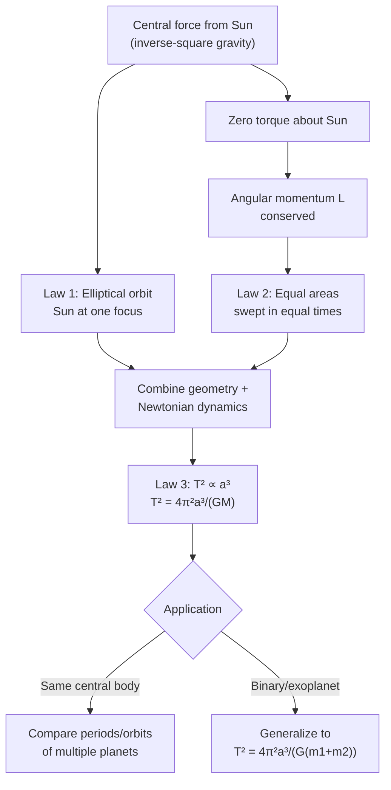

## Kepler's Laws of Planetary Motion

### Overview

Kepler's Laws of Planetary Motion are three empirical laws describing the motion of planets around the Sun, derived by Johannes Kepler in the early 17th century from Tycho Brahe's precise observational data. Formulated decades before Newton's law of gravitation, they were originally purely descriptive/empirical; Newton later showed they follow directly as mathematical consequences of the inverse-square gravitational force law combined with the laws of motion, unifying celestial and terrestrial mechanics.

### Kepler's First Law (Law of Ellipses)

**Statement**: Each planet moves in an elliptical orbit with the Sun located at one focus of the ellipse (not the center).

**Mathematical description**: An ellipse is defined by its semi-major axis $a$ and eccentricity $e$ ($0 \le e < 1$ for a bound ellipse; $e=0$ is a circle). In polar coordinates with the Sun at the focus:

$$r(\theta) = \frac{a(1-e^2)}{1+e\cos\theta}$$

**Key Points**

- **Perihelion** (closest approach to Sun): $r_{\min} = a(1-e)$
- **Aphelion** (farthest point from Sun): $r_{\max} = a(1+e)$
- Most planetary orbits in the Solar System have small eccentricities (nearly circular); Earth's eccentricity is approximately $0.0167$
- Highly eccentric orbits are common among comets and some exoplanets

### Kepler's Second Law (Law of Equal Areas)

**Statement**: A line segment joining a planet to the Sun sweeps out equal areas in equal intervals of time.

**Mathematical description**: The areal velocity is constant:

$$\frac{dA}{dt} = \frac{1}{2}r^2\frac{d\theta}{dt} = \text{constant}$$

This is a direct consequence of **conservation of angular momentum**, since for a central force (one always directed along the line to the Sun), torque about the Sun is zero:

$$L = mr^2\dot{\theta} = \text{constant} \quad \Rightarrow \quad \frac{dA}{dt} = \frac{L}{2m} = \text{constant}$$

**Key Points**

- A planet moves **fastest** at perihelion (closest to the Sun) and **slowest** at aphelion (farthest from the Sun)
- This law holds for any central force, not just inverse-square gravity — it is purely a consequence of angular momentum conservation
- Provides a direct method to compute orbital speed at any point given speed at another point: $r_{\min}v_{\max} = r_{\max}v_{\min}$

### Kepler's Third Law (Law of Periods / Harmonic Law)

**Statement**: The square of a planet's orbital period is proportional to the cube of the semi-major axis of its orbit.

$$T^2 \propto a^3$$

**Full form (derived from Newtonian gravity)**, for a body of mass $m$ orbiting a much larger central mass $M$:

$$T^2 = \frac{4\pi^2}{GM}a^3$$

**Key Points**

- The proportionality constant $4\pi^2/GM$ depends only on the central mass $M$, not on the orbiting body's mass or orbital eccentricity
- This allows direct comparison across all planets orbiting the same star — plotting $T^2$ vs $a^3$ for Solar System planets yields a straight line
- In convenient units (years, AU, solar masses): $T^2 = a^3$ exactly, when $T$ is in years, $a$ is in astronomical units (AU), and the central mass is $1\ M_\odot$

### Kepler's Third Law: Two-Body Generalization

For two comparable masses $m_1$ and $m_2$ orbiting their common center of mass, Kepler's Third Law generalizes to:

$$T^2 = \frac{4\pi^2}{G(m_1+m_2)}a^3$$

where $a$ is now the semi-major axis of the **relative orbit** (separation between the two bodies). This generalized form is essential for binary star systems and exoplanet mass determination, where the orbiting body's mass is not negligible compared to the central mass.

### Elliptical Orbit Geometry (svg_diagram)

<svg xmlns="http://www.w3.org/2000/svg" viewBox="0 0 700 420">
<text x="350" y="25" text-anchor="middle" font-size="16" font-weight="bold" fill="#222">Kepler's First and Second Laws (svg_diagram)</text>

<ellipse cx="380" cy="220" rx="260" ry="150" fill="none" stroke="#1f77b4" stroke-width="2.5" />

<circle cx="200" cy="220" r="10" fill="#ffbf00" stroke="#cc8800" stroke-width="1.5" />
<text x="200" y="250" text-anchor="middle" font-size="12" fill="#222">Sun (focus)</text>
<circle cx="560" cy="220" r="4" fill="#999" />
<text x="560" y="250" text-anchor="middle" font-size="11" fill="#999">empty focus</text>

<circle cx="120" cy="220" r="5" fill="#2ca02c" />
<text x="120" y="205" text-anchor="middle" font-size="11" fill="#2ca02c">Perihelion (fast)</text>
<circle cx="640" cy="220" r="5" fill="#d62728" />
<text x="640" y="205" text-anchor="middle" font-size="11" fill="#d62728">Aphelion (slow)</text>

<path d="M200,220 L145,190 A140,140 0 0 1 145,250 Z" fill="#2ca02c" opacity="0.35" />

<path d="M200,220 L520,178 A260,150 0 0 1 520,262 Z" fill="#d62728" opacity="0.35" />

<text x="380" y="380" text-anchor="middle" font-size="12" fill="#555">Equal areas swept in equal time intervals (Law 2)</text>

<text x="380" y="400" text-anchor="middle" font-size="12" fill="#555">Sun sits at one focus, not the center (Law 1)</text>

</svg>

### Orbital Speed at Any Point

Combining energy conservation with Kepler's laws (the vis-viva equation) gives the orbital speed at any radius $r$ for an elliptical orbit of semi-major axis $a$:

$$v^2 = GM\left(\frac{2}{r} - \frac{1}{a}\right)$$

**Key Points**

- At perihelion ($r = a(1-e)$): speed is maximum
- At aphelion ($r = a(1+e)$): speed is minimum
- For a circular orbit ($r = a$, constant): reduces to $v = \sqrt{GM/a}$
- This single equation unifies circular, elliptical, parabolic ($a\to\infty$), and hyperbolic ($a<0$) trajectories

### Worked Example

**Example**

An exoplanet orbits a star of mass $2.0\ M_\odot$ ($M = 3.978\times10^{30}\ \text{kg}$) with semi-major axis $a = 1.5\ \text{AU} = 2.244\times10^{11}\ \text{m}$. Find the orbital period in years.

Step 1 — Apply Kepler's Third Law:

$$T^2 = \frac{4\pi^2}{GM}a^3$$

Step 2 — Compute $a^3$:

$$a^3 = (2.244\times10^{11})^3 \approx 1.130\times10^{34}\ \text{m}^3$$

Step 3 — Compute $GM$:

$$GM = (6.674\times10^{-11})(3.978\times10^{30}) \approx 2.655\times10^{20}\ \text{m}^3/\text{s}^2$$

Step 4 — Compute $T^2$:

$$T^2 = \frac{4\pi^2 (1.130\times10^{34})}{2.655\times10^{20}} \approx \frac{4.463\times10^{35}}{2.655\times10^{20}} \approx 1.681\times10^{15}\ \text{s}^2$$

Step 5 — Take square root and convert to years:

$$T \approx 4.10\times10^{7}\ \text{s} \approx 1.30\ \text{years}$$

**Output**: The exoplanet's orbital period is approximately **1.30 years**. (Cross-check using the convenient form: $T^2 = a^3/M_{\odot\text{-units}} = (1.5)^3/2.0 = 3.375/2.0 = 1.6875\ \text{yr}^2 \Rightarrow T \approx 1.30\ \text{yr}$ — consistent.)

### System Diagram

### Real-World Applications

- **Exoplanet detection and characterization**: radial velocity and transit timing methods use Kepler's Third Law to infer orbital periods, semi-major axes, and (with additional data) planetary/stellar masses
- **Satellite orbit design**: geostationary and other mission-specific orbits are engineered using Kepler's Third Law to achieve a desired orbital period
- **Binary star systems**: mass determination via the generalized two-body form of the Third Law is a primary method for measuring stellar masses directly
- **Space mission trajectory planning**: Hohmann transfer orbits and interplanetary trajectories rely on Keplerian orbital elements for mission design
- **Historical significance**: Kepler's Laws provided the empirical foundation that Newton's law of gravitation had to reproduce, serving as a critical validation of Newtonian mechanics

### Conclusion

Kepler's three laws — elliptical orbits with the Sun at a focus, equal areas swept in equal times, and the period-semi-major-axis relationship — together provide a complete kinematic description of planetary motion. Although originally empirical, they emerge naturally from Newton's law of universal gravitation combined with conservation of angular momentum and energy, and they remain essential tools for orbital mechanics, exoplanet science, and space mission design today.

**Related Topics**

- Newton's Law of Universal Gravitation
- Angular Momentum Conservation in Central Force Motion
- The Vis-Viva Equation and Orbital Energy
- Orbital Elements and Coordinate Systems
- Hohmann Transfer Orbits and Orbital Maneuvers
- Exoplanet Detection via Radial Velocity and Transit Methods