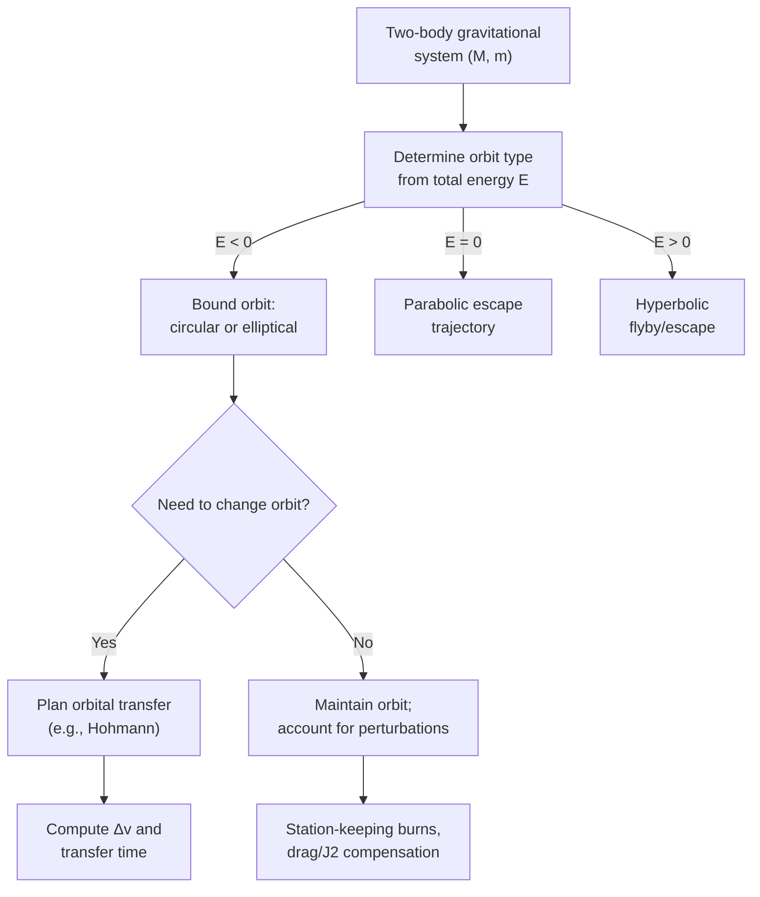

## Orbital Mechanics and Satellite Motion

### Overview

Orbital mechanics is the applied study of the motion of satellites, spacecraft, and celestial bodies under gravitational forces, combining Newton's Law of Gravitation, Kepler's Laws, and energy/momentum conservation into practical tools for analyzing and designing orbits. This field bridges theoretical celestial mechanics with real-world spaceflight engineering — circular orbit design, orbital transfers, and satellite station-keeping.

### Circular Orbits

For a satellite in a circular orbit, gravity provides exactly the centripetal force required:

$$\frac{GMm}{r^2} = \frac{mv^2}{r}$$

Solving for orbital speed:

$$v_{\text{circ}} = \sqrt{\frac{GM}{r}}$$

**Orbital period** for a circular orbit (special case of Kepler's Third Law with $a = r$):

$$T = 2\pi\sqrt{\frac{r^3}{GM}}$$

**Key Points**

- Orbital speed decreases with increasing altitude ($v \propto 1/\sqrt{r}$) — higher orbits are slower
- A circular orbit requires precisely the right combination of speed and altitude; any deviation results in an elliptical orbit
- Total mechanical energy for a circular orbit: $E = \dfrac{1}{2}mv^2 - \dfrac{GMm}{r} = -\dfrac{GMm}{2r}$ (exactly half the potential energy, in magnitude, due to the virial theorem for inverse-square forces)

### Orbit Classification by Altitude

**Key Points**

- **Low Earth Orbit (LEO)**: altitude ~160–2,000 km; short periods (~90 min); used for the ISS, Earth observation, many communication constellations (e.g., Starlink)
- **Medium Earth Orbit (MEO)**: altitude ~2,000–35,786 km; used for navigation satellites (GPS, GLONASS, Galileo) at ~20,200 km altitude
- **Geostationary Orbit (GEO)**: altitude ~35,786 km, equatorial, period exactly matches Earth's rotation (~23h 56m sidereal day), so the satellite appears stationary relative to the ground — used for communications and weather satellites
- **Highly Elliptical Orbit (HEO)**: large eccentricity, used for specialized coverage (e.g., Molniya orbits for high-latitude communication)

### Geostationary Orbit Calculation

Setting the orbital period equal to Earth's sidereal rotation period ($T = 86{,}164\ \text{s}$) and solving for radius using Kepler's Third Law:

$$r_{\text{GEO}} = \left(\frac{GMT^2}{4\pi^2}\right)^{1/3}$$

This yields $r_{\text{GEO}} \approx 42{,}164\ \text{km}$ from Earth's center, or approximately $35{,}786\ \text{km}$ altitude above the surface.

### Elliptical Orbits and the Vis-Viva Equation

For any orbit (circular, elliptical, parabolic, or hyperbolic) with semi-major axis $a$, the speed at any radius $r$ is given by the **vis-viva equation**:

$$v^2 = GM\left(\frac{2}{r} - \frac{1}{a}\right)$$

**Key Points**

- Circular orbit: $a = r$, giving $v = \sqrt{GM/r}$
- Elliptical orbit: $a > 0$, finite; speed varies between perihelion (max) and aphelion (min)
- Parabolic trajectory (marginal escape): $a \to \infty$, giving $v = \sqrt{2GM/r}$ (exactly the escape velocity)
- Hyperbolic trajectory (excess escape energy): $a < 0$ by convention

### Orbital Transfers: Hohmann Transfer

The **Hohmann transfer** is the most fuel-efficient two-impulse maneuver for transferring between two circular, coplanar orbits (radii $r_1 < r_2$), using an elliptical transfer orbit tangent to both.

**Transfer orbit semi-major axis:**

$$a_t = \frac{r_1+r_2}{2}$$

**Delta-v at first burn** (raising from $r_1$ onto the transfer ellipse):

$$\Delta v_1 = \sqrt{\frac{GM}{r_1}}\left(\sqrt{\frac{2r_2}{r_1+r_2}} - 1\right)$$

**Delta-v at second burn** (circularizing at $r_2$):

$$\Delta v_2 = \sqrt{\frac{GM}{r_2}}\left(1 - \sqrt{\frac{2r_1}{r_1+r_2}}\right)$$

**Total transfer time** (half the transfer ellipse's period):

$$t_{\text{transfer}} = \pi\sqrt{\frac{a_t^3}{GM}}$$

**Key Points**

- Two engine burns total: one to leave the initial circular orbit onto the transfer ellipse, one to circularize at the destination orbit
- Minimizes total $\Delta v$ (propellant) among two-impulse transfers between circular orbits, at the cost of longer transfer time compared to faster, higher-energy trajectories
- Widely used for raising satellites from LEO parking orbits to GEO, and for interplanetary trajectory design (approximately, treating planetary orbits as circular and coplanar)

### Hohmann Transfer Diagram (svg_diagram)

<svg xmlns="http://www.w3.org/2000/svg" viewBox="0 0 700 420">
<text x="350" y="25" text-anchor="middle" font-size="16" font-weight="bold" fill="#222">Hohmann Transfer Orbit (svg_diagram)</text>
<circle cx="350" cy="230" r="12" fill="#ffbf00" stroke="#cc8800" stroke-width="1.5" />
<text x="350" y="260" text-anchor="middle" font-size="11" fill="#222">Central body</text>

<circle cx="350" cy="230" r="90" fill="none" stroke="#1f77b4" stroke-width="2" />
<text x="350" y="130" text-anchor="middle" font-size="11" fill="#1f77b4">Initial orbit (r₁)</text>

<circle cx="350" cy="230" r="190" fill="none" stroke="#2ca02c" stroke-width="2" />
<text x="350" y="30" text-anchor="middle" font-size="11" fill="#2ca02c">Target orbit (r₂)</text>

<path d="M 440,230 A 140,90 0 0 1 160,230" fill="none" stroke="#d62728" stroke-width="2.5" stroke-dasharray="6,4" />
<text x="500" y="195" font-size="11" fill="#d62728">Transfer ellipse</text>

<circle cx="440" cy="230" r="5" fill="#333" />
<text x="460" y="250" font-size="11" fill="#222">Δv₁ (depart r₁)</text>
<circle cx="160" cy="230" r="5" fill="#333" />
<text x="40" y="250" font-size="11" fill="#222">Δv₂ (circularize at r₂)</text>
</svg>

### Angular Momentum and Orbit Plane

An orbit's angular momentum vector $\vec{L} = \vec{r}\times m\vec{v}$ is conserved (for a central force) and defines a fixed **orbital plane** through the central body. This plane does not precess under pure Newtonian two-body gravity, though real satellites experience perturbations (Earth's oblateness, third-body effects) that cause gradual orbital plane precession.

**Key Points**

- Orbital inclination: angle between the orbital plane and a reference plane (e.g., Earth's equator)
- Sun-synchronous orbits deliberately exploit Earth's oblateness-induced precession to maintain a fixed orbital orientation relative to the Sun — useful for consistent-lighting Earth observation
- Polar orbits (inclination ≈ 90°) pass near both poles, enabling full-Earth coverage over time as Earth rotates beneath the orbit

### Orbital Decay and Perturbations

Real satellite orbits are not perfectly Keplerian due to several perturbing effects:

**Key Points**

- **Atmospheric drag**: significant in LEO, gradually lowers orbital altitude and can cause eventual reentry; requires periodic reboost maneuvers (e.g., for the ISS)
- **Earth's oblateness (J2 perturbation)**: causes orbital plane precession and apsidal precession, exploited intentionally for Sun-synchronous orbits
- **Third-body perturbations**: gravitational influence of the Moon and Sun perturbs satellite orbits, particularly significant at higher altitudes (e.g., GEO)
- **Solar radiation pressure**: minor but non-negligible force on large, lightweight structures (e.g., solar sails, large satellites)

### Worked Example

**Example**

A satellite needs to transfer from a circular LEO parking orbit at $r_1 = 6{,}700\ \text{km}$ to GEO at $r_2 = 42{,}164\ \text{km}$ around Earth ($GM = 3.986\times10^5\ \text{km}^3/\text{s}^2$). Find the transfer time.

Step 1 — Compute transfer orbit semi-major axis:

$$a_t = \frac{r_1+r_2}{2} = \frac{6700+42164}{2} = 24{,}432\ \text{km}$$

Step 2 — Compute $a_t^3$:

$$a_t^3 \approx (24{,}432)^3 \approx 1.458\times10^{13}\ \text{km}^3$$

Step 3 — Apply the transfer time formula:

$$t_{\text{transfer}} = \pi\sqrt{\frac{a_t^3}{GM}} = \pi\sqrt{\frac{1.458\times10^{13}}{3.986\times10^5}}$$

Step 4 — Compute the ratio and square root:

$$\frac{1.458\times10^{13}}{3.986\times10^5} \approx 3.658\times10^7 \quad \Rightarrow \quad \sqrt{3.658\times10^7} \approx 6048\ \text{s}$$

Step 5 — Multiply by $\pi$:

$$t_{\text{transfer}} \approx \pi \times 6048 \approx 19{,}000\ \text{s} \approx 5.3\ \text{hours}$$

**Output**: The Hohmann transfer from LEO to GEO takes approximately **5.3 hours** — consistent with typical real-world GEO transfer mission timelines.

### System Diagram

### Real-World Applications

- **Satellite constellation design**: LEO broadband constellations (e.g., large-scale internet satellite networks) require careful orbital shell and spacing design to balance coverage, latency, and collision avoidance
- **GPS and navigation systems**: MEO satellite constellations rely on precise orbital mechanics for positioning accuracy
- **Interplanetary missions**: trajectory design for missions to Mars, Jupiter, and beyond uses generalized transfer orbit principles, often combined with gravity assists
- **Space debris management**: understanding orbital decay and perturbations is critical for predicting reentry and planning collision-avoidance maneuvers
- **Geostationary communications**: broadcast and weather satellites rely on the fixed relative position GEO provides

### Conclusion

Orbital mechanics translates the fundamental physics of gravitation, angular momentum, and energy conservation into practical tools for satellite and spacecraft mission design. Circular and elliptical orbit relations, the vis-viva equation, and the Hohmann transfer technique together form the core toolkit for determining orbital speeds, periods, and the fuel-efficient maneuvers needed to move between orbits — principles directly applied in the design of every operational satellite system and interplanetary mission.

**Related Topics**

- Kepler's Laws of Planetary Motion
- Gravitational Potential Energy and Escape Velocity
- Orbital Perturbations and the J2 Effect
- Interplanetary Trajectory Design and Gravity Assists
- Spacecraft Propulsion and Delta-v Budgeting
- Orbital Rendezvous and Station-Keeping