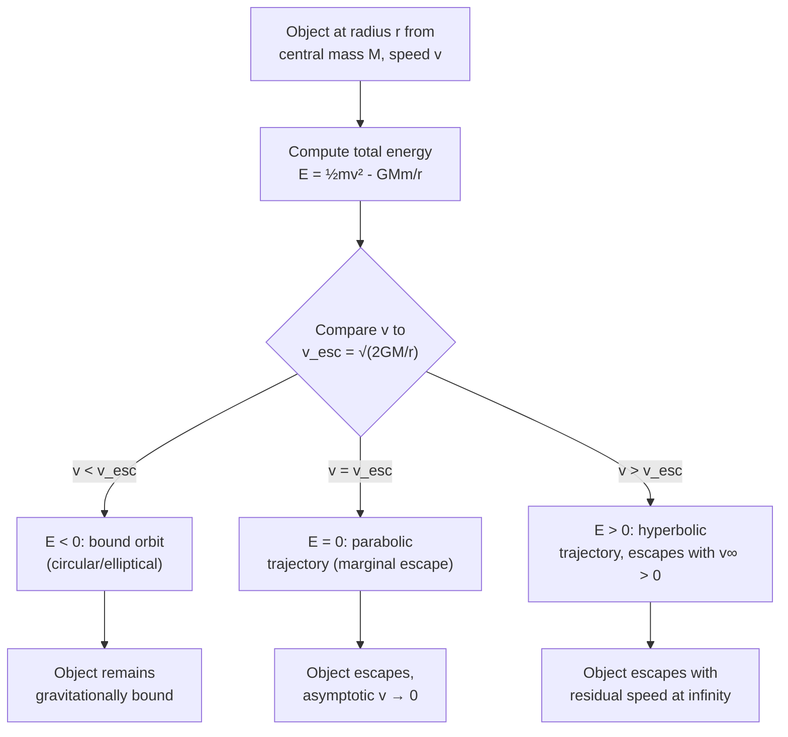

## Escape Velocity

### Overview

Escape velocity is the minimum speed an object must have to break free from a gravitational field and travel to infinite distance without further propulsion, arriving with zero (or, in the limiting case, exactly zero) residual kinetic energy. It represents the boundary between bound and unbound trajectories and is derived directly from the conservation of total mechanical energy under Newtonian gravity.

### Derivation from Energy Conservation

Consider an object of mass $m$ launched from the surface of a spherical body of mass $M$ and radius $R$. For the object to "just barely" escape (reaching infinity with velocity approaching zero), total mechanical energy must equal zero:

$$E = KE + U = \frac{1}{2}mv_{\text{esc}}^2 - \frac{GMm}{R} = 0$$

Solving for $v_{\text{esc}}$:

$$v_{\text{esc}} = \sqrt{\frac{2GM}{R}}$$

**Key Points**

- Escape velocity is **independent of the escaping object's mass** $m$ — it cancels out of the energy equation
- Independent of launch direction, assuming no atmosphere and a non-rotating, spherically symmetric source (in practice, launch direction matters greatly for real rockets due to atmospheric drag and the benefit of Earth's rotational velocity)
- Depends only on the mass $M$ and radius $R$ (or more generally, distance $r$) of the gravitating body
- Exactly $\sqrt{2}$ times the circular orbital speed at the same radius: $v_{\text{esc}} = \sqrt{2}\,v_{\text{circ}}$

### General Form at Any Distance

For an object at distance $r$ from the center of mass $M$ (not necessarily at the surface):

$$v_{\text{esc}}(r) = \sqrt{\frac{2GM}{r}}$$

This decreases with increasing $r$ — it is easier to escape from farther away, since less potential energy must be overcome.

### Relationship to Total Energy and Orbit Type

Escape velocity marks the exact threshold between bound and unbound motion in the total mechanical energy framework:

$$E = \frac{1}{2}mv^2 - \frac{GMm}{r}$$

**Key Points**

- $v < v_{\text{esc}}(r)$: $E < 0$, bound orbit (elliptical or circular) — the object eventually falls back or orbits indefinitely
- $v = v_{\text{esc}}(r)$: $E = 0$, marginal case — parabolic trajectory, reaching infinity with velocity asymptotically approaching zero
- $v > v_{\text{esc}}(r)$: $E > 0$, unbound — hyperbolic trajectory, escaping with residual "excess" velocity at infinity, $v_\infty = \sqrt{v^2 - v_{\text{esc}}^2}$

### Escape Velocity vs Orbital Speed (svg_diagram)

<svg xmlns="http://www.w3.org/2000/svg" viewBox="0 0 700 380">
<text x="350" y="25" text-anchor="middle" font-size="16" font-weight="bold" fill="#222">Trajectory Types by Launch Speed (svg_diagram)</text>
<circle cx="150" cy="200" r="18" fill="#4a90d9" stroke="#2a6099" stroke-width="1.5" />
<text x="150" y="235" text-anchor="middle" font-size="11" fill="#222">Central body</text>

<circle cx="150" cy="200" r="60" fill="none" stroke="#1f77b4" stroke-width="2" />
<text x="220" y="150" font-size="11" fill="#1f77b4">v = v_circ (circular)</text>

<ellipse cx="170" cy="200" rx="100" ry="60" fill="none" stroke="#2ca02c" stroke-width="2" />
<text x="280" y="270" font-size="11" fill="#2ca02c">v_circ &lt; v &lt; v_esc (elliptical)</text>

<path d="M150,140 C280,140 450,180 650,60" fill="none" stroke="#ff7f0e" stroke-width="2.5" />
<text x="450" y="100" font-size="11" fill="#ff7f0e">v = v_esc (parabolic)</text>

<path d="M150,140 C250,160 400,240 650,330" fill="none" stroke="#d62728" stroke-width="2.5" />
<text x="420" y="320" font-size="11" fill="#d62728">v &gt; v_esc (hyperbolic)</text>
</svg>

### Escape Velocity for Solar System Bodies

**Key Points**

- **Earth**: $v_{\text{esc}} \approx 11.2\ \text{km/s}$ at the surface
- **Moon**: $v_{\text{esc}} \approx 2.4\ \text{km/s}$ — significantly lower due to smaller mass and radius, a key reason the Moon cannot retain a substantial atmosphere over geological time
- **Mars**: $v_{\text{esc}} \approx 5.0\ \text{km/s}$
- **Jupiter**: $v_{\text{esc}} \approx 59.5\ \text{km/s}$ — very high due to Jupiter's large mass
- **Sun (surface)**: $v_{\text{esc}} \approx 617.5\ \text{km/s}$
- These figures are approximate and depend on the precise mass/radius values used; treat exact digits as [Unverified] for high-precision applications

### Escape Velocity and Atmospheric Retention

A planet's ability to retain an atmosphere depends on comparing escape velocity to the thermal (Maxwell-Boltzmann) speed distribution of gas molecules at that planet's temperature:

$$v_{\text{rms}} = \sqrt{\frac{3k_BT}{m_{\text{molecule}}}}$$

**Key Points**

- If $v_{\text{esc}} \gg v_{\text{rms}}$ for a given gas species, that gas is retained over long timescales
- Lighter molecules (hydrogen, helium) have higher thermal speeds at a given temperature and escape more readily than heavier molecules (nitrogen, oxygen, carbon dioxide)
- This explains why Earth retains $\text{N}_2$ and $\text{O}_2$ but has lost most of its primordial hydrogen and helium, while the Moon (much lower $v_{\text{esc}}$) retains essentially no atmosphere
- A commonly used rule of thumb is that a gas escapes significantly over billions of years if $v_{\text{esc}} \lesssim 6\,v_{\text{rms}}$, though the precise threshold depends on detailed atmospheric escape modeling [Unverified: exact numerical threshold varies across sources and escape mechanisms]

### Escape Velocity vs Black Holes

Escape velocity provides an intuitive (though not fully rigorous, Newtonian) way to approach the concept of a black hole's event horizon. Setting $v_{\text{esc}} = c$ (the speed of light) and solving for $r$ gives the **Schwarzschild radius**:

$$R_s = \frac{2GM}{c^2}$$

**Key Points**

- This Newtonian derivation coincidentally matches the correct General Relativistic result for the Schwarzschild radius, though the underlying physical interpretation differs substantially between the two theories
- Inside $R_s$, not even light can classically "escape," giving rise to the term "black hole"
- A fully rigorous treatment of black holes requires General Relativity; the Newtonian escape-velocity argument is a useful pedagogical simplification rather than a complete physical derivation [Inference: widely used as an introductory analogy, but should not be treated as a first-principles GR derivation]

### Worked Example

**Example**

Calculate the escape velocity from the surface of Mars ($M = 6.417\times10^{23}\ \text{kg}$, $R = 3.390\times10^6\ \text{m}$).

Step 1 — Apply the formula:

$$v_{\text{esc}} = \sqrt{\frac{2GM}{R}} = \sqrt{\frac{2(6.674\times10^{-11})(6.417\times10^{23})}{3.390\times10^6}}$$

Step 2 — Compute the numerator:

$$2(6.674\times10^{-11})(6.417\times10^{23}) \approx 8.566\times10^{13}$$

Step 3 — Divide by $R$:

$$\frac{8.566\times10^{13}}{3.390\times10^6} \approx 2.527\times10^{7}$$

Step 4 — Take the square root:

$$v_{\text{esc}} \approx \sqrt{2.527\times10^7} \approx 5027\ \text{m/s} \approx 5.03\ \text{km/s}$$

**Output**: The escape velocity from Mars's surface is approximately **5.03 km/s**, closely matching the commonly cited value of about 5.0 km/s.

### System Diagram

### Real-World Applications

- **Spacecraft launch requirements**: mission designers compute escape velocity (adjusted for launch site rotational velocity and desired trajectory) to determine propulsion and fuel requirements for interplanetary missions
- **Planetary atmosphere evolution**: comparative escape velocities explain long-term atmospheric composition differences between planets and moons across the Solar System
- **Exoplanet habitability assessment**: escape velocity (combined with estimated surface temperature) is used to predict whether a candidate exoplanet could retain a life-supporting atmosphere
- **Black hole and neutron star physics**: escape velocity concepts provide an accessible entry point to compact object physics, including the Schwarzschild radius
- **Gravity assist (slingshot) trajectory design**: understanding escape energy from one body while remaining bound to a larger system underlies interplanetary gravity-assist mission planning

### Conclusion

Escape velocity, derived from setting total mechanical energy to zero, defines the precise speed threshold separating bound orbital motion from permanent escape to infinity. Depending only on the mass and radius (or distance) of the gravitating body, it provides both a practical engineering benchmark for spacecraft launch design and a conceptual bridge to deeper topics ranging from planetary atmospheric retention to the Schwarzschild radius of black holes.

**Related Topics**

- Gravitational Potential Energy and Total Mechanical Energy
- Orbital Mechanics and the Vis-Viva Equation
- Atmospheric Escape and Planetary Habitability
- Hyperbolic Trajectories and Interplanetary Transfer
- Schwarzschild Radius and Introduction to Black Holes
- Maxwell-Boltzmann Distribution and Gas Kinetic Theory