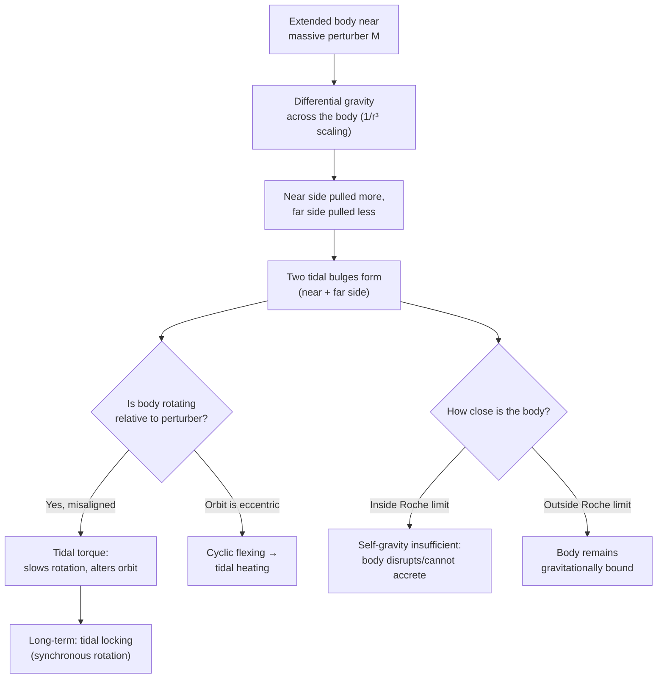

## Tidal Forces

### Overview

Tidal forces arise from the differential gravitational pull exerted by one body on different parts of an extended second body, rather than from gravity's absolute strength. Because gravitational force weakens with distance, the near side of an extended body experiences stronger attraction than its far side, creating a stretching effect along the line connecting the two bodies. This differential force explains ocean tides, tidal locking, tidal heating, and extreme phenomena like tidal disruption near compact objects.

### Origin of Tidal Forces

Consider a body of size $2\delta$ (e.g., a planet of radius $\delta$) at distance $r$ from a mass $M$, with $r \gg \delta$. The gravitational acceleration at the near side, center, and far side differ:

$$g_{\text{near}} = \frac{GM}{(r-\delta)^2}, \quad g_{\text{center}} = \frac{GM}{r^2}, \quad g_{\text{far}} = \frac{GM}{(r+\delta)^2}$$

The **tidal acceleration** relative to the center is the difference between local gravity and the center-of-mass acceleration. Using a first-order Taylor expansion for $\delta \ll r$:

$$\Delta g \approx \frac{2GM\delta}{r^3}$$

**Key Points**

- Tidal force scales as $1/r^3$, not $1/r^2$ — it falls off much faster with distance than ordinary gravitational force
- Tidal force scales linearly with the size of the extended body ($\delta$), so larger bodies experience proportionally stronger internal tidal stretching
- The near side is pulled toward $M$ more strongly than the center; the far side is pulled less strongly than the center — resulting in an apparent "stretching" force along the line connecting the two bodies, and a corresponding "squeezing" perpendicular to that line (to conserve volume in an idealized fluid body)

### The Tidal Bulge Mechanism

In the reference frame of the extended body (e.g., Earth), the net effect is two bulges: one on the side facing the perturbing body ($M$), and — counterintuitively — one on the opposite side as well.

**Key Points**

- **Near-side bulge**: direct excess pull toward $M$ relative to the body's center
- **Far-side bulge**: the center is pulled toward $M$ more strongly than the far side, so in the co-moving (non-inertial) frame, the far side effectively "lags behind," creating an apparent outward bulge
- This produces two tidal bulges roughly aligned with the Earth-Moon (or Earth-Sun) line, explaining the pattern of two high tides and two low tides per day (more precisely, per lunar day of about 24h 50m, due to the Moon's own orbital motion)

### Tidal Bulge Diagram (svg_diagram)

<svg xmlns="http://www.w3.org/2000/svg" viewBox="0 0 700 380">
<text x="350" y="25" text-anchor="middle" font-size="16" font-weight="bold" fill="#222">Tidal Bulges (Exaggerated) (svg_diagram)</text>

<ellipse cx="300" cy="200" rx="130" ry="95" fill="#4a90d9" opacity="0.85" />
<circle cx="300" cy="200" r="95" fill="none" stroke="#2a6099" stroke-width="1" stroke-dasharray="4,3" />
<text x="300" y="205" text-anchor="middle" font-size="11" fill="white" font-weight="bold">Earth</text>

<text x="430" y="200" font-size="11" fill="#222">Near-side bulge</text>

<line x1="430" y1="195" x2="410" y2="195" stroke="#333" stroke-width="1" />

<text x="80" y="200" text-anchor="end" font-size="11" fill="#222">Far-side bulge</text>

<line x1="185" y1="195" x2="165" y2="195" stroke="#333" stroke-width="1" />

<line x1="500" y1="200" x2="440" y2="200" stroke="#d62728" stroke-width="2.5" marker-end="url(#arrowT)" />
<text x="470" y="185" text-anchor="middle" font-size="10" fill="#d62728">stronger pull</text>
<line x1="200" y1="200" x2="140" y2="200" stroke="#2ca02c" stroke-width="2" marker-end="url(#arrowT2)" />
<text x="170" y="185" text-anchor="middle" font-size="10" fill="#2ca02c">weaker pull</text>

<circle cx="640" cy="200" r="25" fill="#999" stroke="#666" stroke-width="1" />
<text x="640" y="205" text-anchor="middle" font-size="10" fill="white">Moon</text>
</svg>

### Earth's Tides: Moon vs Sun

Both the Moon and Sun raise tides on Earth, but their relative contributions differ dramatically because tidal force depends on both mass and distance ($\propto M/r^3$), not just mass:

**Key Points**

- Although the Sun's mass vastly exceeds the Moon's, its much greater distance means its tidal effect is smaller — the Moon's tidal influence on Earth is roughly **2.2 times** that of the Sun
- **Spring tides**: occur at new and full moon, when Sun and Moon are aligned (syzygy), so their tidal effects add constructively, producing the largest tidal range
- **Neap tides**: occur at first and third quarter moon, when Sun and Moon are at right angles relative to Earth, partially canceling each other's tidal effects, producing the smallest tidal range

### Tidal Torque and Tidal Locking

Because Earth is not perfectly rigid, its tidal bulge is dragged slightly ahead of the Earth-Moon line by Earth's faster rotation, creating a small misalignment. This misalignment produces a gravitational torque with two consequences:

$$\tau \propto \frac{GM_{\text{Moon}}^2 R^5}{r^6}\sin(2\epsilon)$$

(where $\epsilon$ is the small lag angle), leading to:

**Key Points**

- **Earth's rotation gradually slows**: angular momentum is transferred from Earth's spin to the Moon's orbit, lengthening Earth's day by roughly 2.3 milliseconds per century [Unverified: precise current rate depends on ongoing measurement and varies slightly by method]
- **The Moon's orbit gradually expands**: the Moon recedes from Earth at approximately 3.8 cm per year, as measured by lunar laser ranging using retroreflectors left by Apollo missions
- **Tidal locking**: over sufficiently long timescales, this torque can synchronize a body's rotation period with its orbital period, as has already happened for the Moon (which always shows the same face to Earth) — a state called synchronous rotation

### Tidal Heating

In systems where tidal forces vary over an orbit (e.g., due to orbital eccentricity), repeated flexing of a body generates internal frictional heating:

$$\dot{E}_{\text{tidal}} \propto \frac{n^5 R^5 e^2}{Q}$$

where $n$ is the orbital mean motion, $R$ is the body's radius, $e$ is orbital eccentricity, and $Q$ is a dimensionless dissipation factor describing internal energy loss efficiency (lower $Q$ means more efficient dissipation/heating).

**Key Points**

- **Io** (moon of Jupiter): intense tidal heating from Jupiter and orbital resonances with Europa and Ganymede drives extreme volcanic activity, making Io the most volcanically active body in the Solar System
- **Europa**: tidal heating is believed to maintain a subsurface liquid water ocean beneath its icy crust, a major target in the search for extraterrestrial habitability [Inference: subsurface ocean existence is well-supported by multiple lines of evidence, though direct confirmation of habitability remains an open scientific question]
- Tidal heating depends sensitively on orbital eccentricity, making orbital resonances (which can maintain non-zero eccentricity over long timescales) important drivers of sustained heating

### The Roche Limit

The **Roche limit** is the minimum distance at which a smaller body held together only by self-gravity can survive tidal forces from a larger body without being torn apart:

$$d_{\text{Roche}} \approx R_M\left(2\frac{\rho_M}{\rho_m}\right)^{1/3}$$

where $R_M$ is the primary body's radius, and $\rho_M$, $\rho_m$ are the densities of the primary and secondary bodies, respectively (the exact numerical coefficient depends on whether the satellite is modeled as rigid or fluid).

**Key Points**

- Inside the Roche limit, tidal forces exceed the smaller body's self-gravity, preventing accretion or causing existing bodies to fragment
- Saturn's ring system lies largely within Saturn's Roche limit, consistent with rings being debris that could not (or did not) accrete into a moon
- Rigid bodies held together by material strength (not just self-gravity) can survive somewhat closer than the idealized fluid Roche limit predicts

### Worked Example

**Example**

Estimate the ratio of the Moon's tidal acceleration on Earth to the Sun's tidal acceleration on Earth, using: $M_{\text{Moon}} = 7.342\times10^{22}\ \text{kg}$, $r_{\text{Moon}} = 3.844\times10^8\ \text{m}$; $M_{\text{Sun}} = 1.989\times10^{30}\ \text{kg}$, $r_{\text{Sun}} = 1.496\times10^{11}\ \text{m}$.

Step 1 — Tidal acceleration scales as $M/r^3$. Compute the Moon's ratio:

$$\frac{M_{\text{Moon}}}{r_{\text{Moon}}^3} = \frac{7.342\times10^{22}}{(3.844\times10^8)^3} = \frac{7.342\times10^{22}}{5.681\times10^{25}} \approx 1.293\times10^{-3}$$

Step 2 — Compute the Sun's ratio:

$$\frac{M_{\text{Sun}}}{r_{\text{Sun}}^3} = \frac{1.989\times10^{30}}{(1.496\times10^{11})^3} = \frac{1.989\times10^{30}}{3.348\times10^{33}} \approx 5.941\times10^{-4}$$

Step 3 — Divide to find the ratio:

$$\frac{\text{Moon tidal effect}}{\text{Sun tidal effect}} = \frac{1.293\times10^{-3}}{5.941\times10^{-4}} \approx 2.18$$

**Output**: The Moon's tidal influence on Earth is approximately **2.2 times** that of the Sun, closely matching the commonly cited ratio despite the Sun's vastly greater mass — a direct consequence of the $1/r^3$ tidal scaling.

### System Diagram

### Real-World Applications

- **Ocean tides**: the primary observable manifestation of tidal forces on Earth, critical for navigation, coastal engineering, and tidal power generation
- **Tidal locking in the Solar System**: nearly all major moons (including Earth's Moon) are tidally locked to their parent planets; many exoplanets in close orbits around their stars are predicted to be tidally locked as well
- **Volcanic and geothermal activity**: tidal heating drives Io's volcanism and is a leading hypothesis for subsurface oceans on Europa and Enceladus
- **Planetary ring systems**: the Roche limit explains why rings persist as debris rather than coalescing into moons within a certain distance of their planet
- **Tidal disruption events**: extreme tidal forces near black holes and neutron stars can completely disrupt stars that stray too close, producing observable astrophysical flares

### Conclusion

Tidal forces, arising from the differential ($1/r^3$-scaling) gravitational pull across an extended body, produce a rich range of phenomena from ocean tides to tidal locking, tidal heating, and the Roche limit governing ring and satellite formation. Though subtler than direct gravitational attraction, tidal effects have shaped the rotational and orbital evolution of the Earth-Moon system and drive some of the most dramatic geological and astrophysical activity observed elsewhere in the Solar System.

**Related Topics**

- Newton's Law of Universal Gravitation and the Shell Theorem
- Tidal Locking and Synchronous Rotation
- The Roche Limit and Planetary Ring Formation
- Orbital Resonances and Tidal Heating (Io, Europa)
- Tidal Disruption Events Near Compact Objects
- Angular Momentum Exchange in the Earth-Moon System