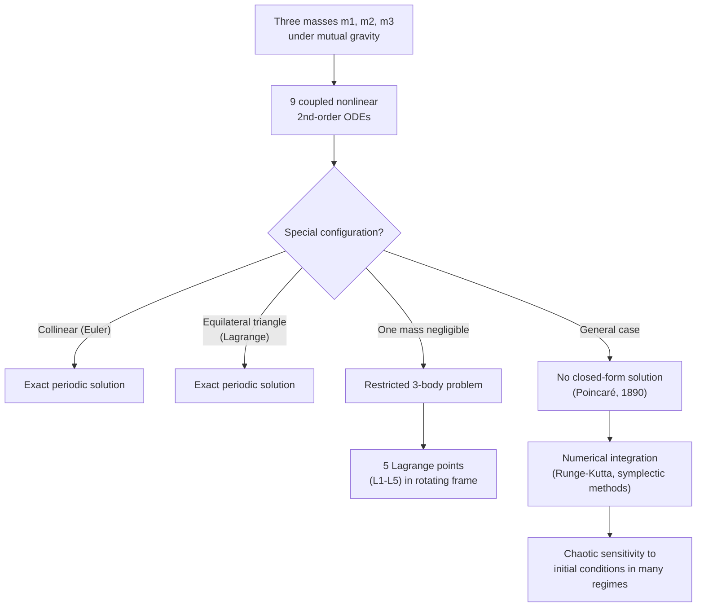

## The Three-Body Problem

### Overview

The three-body problem concerns predicting the motion of three masses interacting solely through mutual Newtonian gravitation. While the two-body problem admits a complete closed-form analytical solution (Keplerian ellipses), the three-body problem has no general closed-form solution in terms of elementary functions — a result rigorously established in the late 19th century. This makes it a foundational example in the study of chaos, nonlinear dynamics, and the limits of analytical mechanics, while remaining central to practical astrodynamics.

### The General Three-Body Problem

For three point masses $m_1, m_2, m_3$ with position vectors $\vec{r}_1, \vec{r}_2, \vec{r}_3$, Newton's law of gravitation gives coupled equations of motion:

$$m_i\ddot{\vec{r}}_i = \sum_{j\neq i} \frac{Gm_im_j(\vec{r}_j - \vec{r}_i)}{|\vec{r}_j-\vec{r}_i|^3}, \quad i = 1,2,3$$

This is a system of 9 coupled second-order nonlinear differential equations (18 first-order equations in phase space), governed by the mutual gravitational interactions between all three pairs of masses.

**Key Points**

- Ten known conserved quantities exist (conservation of total linear momentum: 3 components position + 3 velocity-related via center-of-mass motion, total angular momentum: 3 components, and total energy: 1), but this is insufficient to fully integrate the system, which requires effectively 18 independent constants
- Henri Poincaré proved in 1889–1890 (in his prize-winning work on the stability of the Solar System) that no general analytical solution exists in terms of elementary algebraic and transcendental functions — this result is closely connected to the discovery of deterministic chaos
- The system is deterministic but exhibits extreme sensitivity to initial conditions in many regimes — a hallmark of chaotic dynamical systems

### Why Three Bodies Break Analytical Solvability

**Key Points**

- The two-body problem reduces exactly to an equivalent one-body problem (motion of the reduced mass about the center of mass) via a coordinate transformation, because the two-body gravitational force is always exactly central and the angular momentum and energy integrals fully determine the (Keplerian) orbit
- Adding a third body destroys this reduction: each body now experiences a time-varying, non-central net force from the other two, and the mutual perturbations couple all three trajectories in a way that generally cannot be decoupled
- Small changes in initial positions or velocities can lead to exponentially diverging trajectories over time (chaotic behavior), quantified by a positive Lyapunov exponent in chaotic regions of parameter space

### Special Cases with Known Solutions

While the general problem is unsolved analytically, several special-case exact solutions exist:

**Key Points**

- **Euler's collinear solutions (1767)**: three bodies remain permanently collinear, with specific mass-dependent spacing, all orbiting the common center of mass with the same period
- **Lagrange's equilateral triangle solutions (1772)**: three bodies (of any masses) remain at the vertices of an equilateral triangle that rotates rigidly, again with matched orbital periods
- **Restricted three-body problem**: one body has negligible mass and does not affect the other two's mutual orbit (which remains Keplerian); this special case admits five equilibrium points — the **Lagrange points** — where the negligible-mass body can remain in a fixed configuration relative to the two massive bodies
- **Figure-eight solution (1993, Moore; rigorously proven by Chenciner and Montgomery, 2000)**: three equal masses chase each other along a single figure-eight-shaped orbit — a remarkable, stable periodic solution discovered numerically and later proven analytically to exist

### The Five Lagrange Points (Restricted Three-Body Problem)

In the rotating reference frame of two massive bodies (e.g., Sun-Earth or Earth-Moon), five equilibrium points exist where a small third body experiences zero net force in the co-rotating frame:

**Key Points**

- **L1**: between the two masses, on the line connecting them — used for continuous solar observation (e.g., SOHO, DSCOVR satellites)
- **L2**: beyond the smaller mass, on the line extended outward — provides a stable thermal environment shielded from the Sun, used for space telescopes (e.g., the James Webb Space Telescope orbits near Sun-Earth L2)
- **L3**: on the opposite side of the larger mass from the smaller mass
- **L4 and L5**: form equilateral triangles with the two massive bodies, leading (L4) and trailing (L5) the smaller mass in its orbit
- **L1, L2, L3 are dynamically unstable** (require active station-keeping); **L4 and L5 are stable** for a sufficiently large mass ratio between the two primary bodies (satisfied for Sun-Jupiter, Sun-Earth, and Earth-Moon systems), which is why Jupiter's Trojan asteroids cluster stably at its L4 and L5 points

### Lagrange Points Diagram (svg_diagram)

<svg xmlns="http://www.w3.org/2000/svg" viewBox="0 0 700 420">
<text x="350" y="25" text-anchor="middle" font-size="16" font-weight="bold" fill="#222">Lagrange Points — Restricted Three-Body Problem (svg_diagram)</text>

<circle cx="120" cy="230" r="28" fill="#ffbf00" stroke="#cc8800" stroke-width="1.5" />
<text x="120" y="270" text-anchor="middle" font-size="11" fill="#222">Primary (e.g., Sun)</text>

<circle cx="120" cy="230" r="280" fill="none" stroke="#ccc" stroke-width="1" stroke-dasharray="4,4" />
<circle cx="400" cy="230" r="12" fill="#1f77b4" />
<text x="400" y="260" text-anchor="middle" font-size="11" fill="#1f77b4">Secondary (e.g., Earth)</text>

<circle cx="340" cy="230" r="5" fill="#d62728" />
<text x="340" y="215" text-anchor="middle" font-size="11" fill="#d62728">L1</text>

<circle cx="460" cy="230" r="5" fill="#d62728" />
<text x="460" y="215" text-anchor="middle" font-size="11" fill="#d62728">L2</text>

<circle cx="-160" cy="230" r="5" fill="#d62728" transform="translate(160,0)" />
<circle cx="0" cy="230" r="5" fill="#d62728" />
<text x="0" y="215" text-anchor="middle" font-size="11" fill="#d62728">L3</text>

<circle cx="260" cy="90" r="5" fill="#2ca02c" />
<text x="260" y="75" text-anchor="middle" font-size="11" fill="#2ca02c">L4</text>

<circle cx="260" cy="370" r="5" fill="#2ca02c" />
<text x="260" y="390" text-anchor="middle" font-size="11" fill="#2ca02c">L5</text>

<text x="350" y="30" text-anchor="middle" font-size="11" fill="#666" />

<text x="500" y="120" font-size="10" fill="#666">L4, L5: stable</text>

<text x="500" y="140" font-size="10" fill="#666">L1, L2, L3: unstable</text>

</svg>

### Chaos and Sensitivity to Initial Conditions

**Key Points**

- The general three-body problem exhibits chaotic behavior across large regions of initial-condition parameter space, characterized by exponential divergence of nearby trajectories over time
- This sensitivity fundamentally limits long-term predictability: even with arbitrarily precise (but finite) initial condition measurements, predictions become unreliable beyond a characteristic **Lyapunov timescale**
- For the Solar System as a whole (an $N$-body problem with $N > 3$), numerical studies suggest chaotic behavior on timescales of roughly tens of millions of years, meaning precise long-term planetary trajectories cannot be predicted indefinitely into the future [Unverified: exact Lyapunov timescale estimates vary by study and which bodies/perturbations are included]
- Chaotic outcomes in three-body systems can include close encounters, ejections (one body gaining enough energy to escape to infinity), and temporary or permanent captures

### Numerical Methods for the Three-Body Problem

Since no general closed-form solution exists, practical three-body (and $N$-body) problems are solved numerically:

**Key Points**

- **Numerical integration schemes**: Runge-Kutta methods, symplectic integrators (which better preserve energy and phase-space structure over long simulations), and adaptive step-size methods are standard tools
- **Perturbation theory**: for near-Keplerian systems (e.g., a planet slightly perturbed by another planet), analytical approximation techniques can provide accurate solutions valid over limited timescales without full numerical integration
- **Regularization techniques**: special coordinate transformations (e.g., Kustaanheimo-Stiefel regularization) remove numerical singularities that occur during close encounters between bodies, improving simulation accuracy and stability

### Worked Example

**Example**

For the Sun-Earth system, estimate the approximate distance of the L1 point from Earth, using the approximation (valid when the secondary mass $m \ll M$):

$$r_{L1} \approx r_{SE}\left(\frac{m}{3M}\right)^{1/3}$$

where $r_{SE} = 1.496\times10^{11}\ \text{m}$ (Sun-Earth distance), $m = 5.972\times10^{24}\ \text{kg}$ (Earth's mass), $M = 1.989\times10^{30}\ \text{kg}$ (Sun's mass).

Step 1 — Compute the mass ratio:

$$\frac{m}{3M} = \frac{5.972\times10^{24}}{3(1.989\times10^{30})} = \frac{5.972\times10^{24}}{5.967\times10^{30}} \approx 1.0008\times10^{-6}$$

Step 2 — Take the cube root:

$$\left(1.0008\times10^{-6}\right)^{1/3} \approx 1.0003\times10^{-2} \approx 0.01$$

Step 3 — Multiply by the Sun-Earth distance:

$$r_{L1} \approx (1.496\times10^{11})(0.01) \approx 1.496\times10^{9}\ \text{m} \approx 1.5\ \text{million km}$$

**Output**: The Sun-Earth L1 point lies approximately **1.5 million km** from Earth (toward the Sun) — matching the well-known location used by solar observation missions like SOHO.

### System Diagram

### Real-World Applications

- **Space telescope siting**: the James Webb Space Telescope and other observatories orbit near the Sun-Earth L2 point, exploiting its thermal stability and continuous sky access
- **Solar observation missions**: spacecraft at Sun-Earth L1 (e.g., SOHO, DSCOVR) maintain continuous, uninterrupted views of the Sun for space weather monitoring
- **Trojan asteroids**: thousands of asteroids occupy the stable L4 and L5 points of Jupiter's orbit (and smaller populations at other planets), providing natural confirmation of Lagrange point stability
- **Low-energy interplanetary trajectory design**: mission designers exploit three-body dynamics (invariant manifolds near Lagrange points) to design fuel-efficient trajectories, such as those used for some lunar and asteroid missions
- **Solar System stability studies**: understanding chaotic three- and N-body dynamics informs long-term predictions (and limits) on planetary orbital evolution

### Conclusion

The three-body problem demonstrates a fundamental limit of Newtonian analytical mechanics: while pairwise gravitational interactions are individually simple, three mutually interacting bodies generally produce motion too complex for closed-form solution, giving rise to genuine deterministic chaos. Special exact solutions (Euler, Lagrange, the restricted problem's Lagrange points, and the figure-eight orbit) provide crucial islands of analytical tractability, while numerical methods remain essential for general cases — with direct, practical applications ranging from space telescope orbit design to understanding the long-term dynamical stability of the Solar System itself.

**Related Topics**

- Lagrange Points and Restricted Three-Body Dynamics
- Chaos Theory and Sensitivity to Initial Conditions
- N-Body Simulation Methods and Symplectic Integrators
- Trojan Asteroids and Co-Orbital Configurations
- Invariant Manifolds and Low-Energy Trajectory Design
- Long-Term Stability of the Solar System