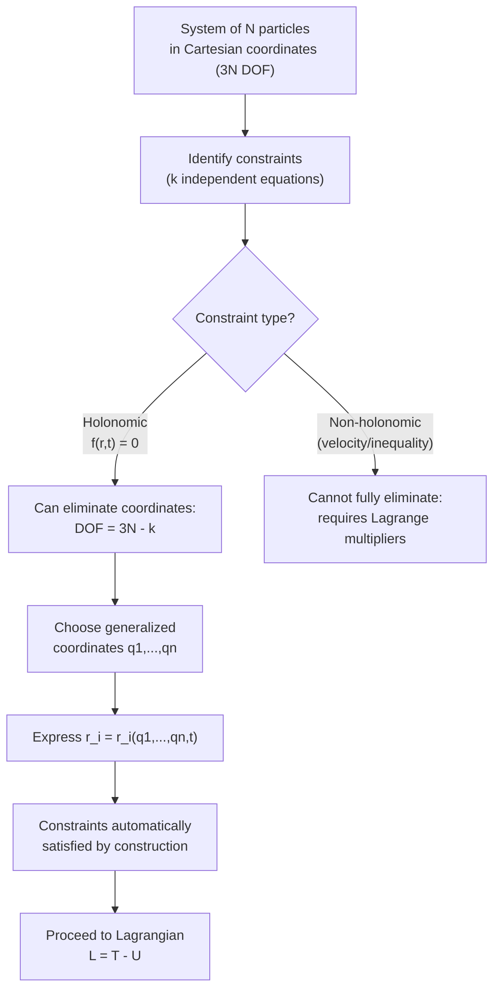

## Generalized Coordinates and Constraints

### Overview

Generalized coordinates are any set of independent parameters that completely specify the configuration of a mechanical system, chosen for convenience rather than restricted to Cartesian coordinates. This framework, foundational to Lagrangian mechanics, allows constraints to be built directly into the choice of coordinates, dramatically simplifying the analysis of systems with restricted motion — pendulums, rigid bodies, linked mechanisms — compared to Newtonian force-based methods.

### Degrees of Freedom

The **degrees of freedom** (DOF) of a system is the minimum number of independent coordinates needed to fully specify its configuration.

**Key Points**

- A single free particle in 3D space has 3 DOF (e.g., $x, y, z$)
- $N$ free particles have $3N$ DOF total
- Constraints reduce the number of independent DOF: if a system of $N$ particles is subject to $k$ independent constraint equations, the number of DOF becomes $3N - k$
- Generalized coordinates $q_1, q_2, \dots, q_n$ (where $n$ = DOF) are chosen so that specifying their values uniquely determines the system's configuration, automatically satisfying any constraints

### Generalized Coordinates

Generalized coordinates $q_i$ need not have units of length — they can be angles, areas, or any convenient parameterization. The Cartesian position of each particle is expressible as a function of the generalized coordinates (and possibly time):

$$\vec{r}_i = \vec{r}_i(q_1, q_2, \dots, q_n, t)$$

**Key Points**

- Choice of generalized coordinates is not unique — different valid choices exist for the same system, chosen based on convenience for the problem's geometry and symmetry
- Common examples: angle $\theta$ for a pendulum (instead of $x,y$), radial distance $r$ and angle $\theta$ for planar orbital motion (instead of $x,y$), joint angles for a robotic arm
- **Generalized velocities** $\dot{q}_i = dq_i/dt$ are the time derivatives of generalized coordinates, playing the role of ordinary velocity components in the Lagrangian framework

### Constraints

A **constraint** is any restriction on the possible configurations or motions of a system. Constraints are classified along several independent axes:

**Holonomic vs Non-Holonomic**

**Key Points**

- **Holonomic constraints** can be expressed as an equation relating the coordinates (and possibly time) to zero: $f(\vec{r}_1, \vec{r}_2, \dots, t) = 0$. Example: a rigid rod of fixed length $L$ between two particles, $|\vec{r}_1-\vec{r}_2| - L = 0$
- **Non-holonomic constraints** cannot be reduced to such an equation — typically they involve inequalities or non-integrable relationships between velocities. Example: a ball rolling without slipping on a surface (the rolling-without-slipping condition constrains velocities but doesn't reduce to a simple position-only equation); a particle confined to the outside of a sphere ($r \geq R$, an inequality constraint)
- Holonomic constraints can be used to eliminate coordinates entirely by direct substitution, reducing the effective number of DOF; non-holonomic constraints generally cannot be eliminated this way and require more advanced treatment (e.g., Lagrange multipliers)

**Scleronomic vs Rheonomic**

**Key Points**

- **Scleronomic constraints**: do not depend explicitly on time, $f(\vec{r}_1,\dots,\vec{r}_N) = 0$. Example: a bead on a fixed rigid wire
- **Rheonomic constraints**: depend explicitly on time, $f(\vec{r}_1,\dots,\vec{r}_N,t) = 0$. Example: a bead on a wire that is itself being moved or rotated according to a prescribed time-dependent motion

### Worked Example: Simple Pendulum

Consider a pendulum of length $L$ swinging in a vertical plane. In Cartesian coordinates, the bob's position is $(x,y)$, giving 2 DOF, but constrained by:

$$x^2 + y^2 = L^2 \quad \text{(holonomic, scleronomic)}$$

This single constraint equation reduces the DOF from 2 to 1. Choosing the generalized coordinate $\theta$ (angle from vertical):

$$x = L\sin\theta, \quad y = -L\cos\theta$$

automatically satisfies the constraint for any value of $\theta$ — the constraint is "built into" the coordinate choice, and $\theta$ alone fully specifies the configuration.

**Key Points**

- Using $\theta$ eliminates the need to explicitly track or enforce the constraint force (string tension) in the equations of motion — a major simplification over Newtonian force analysis
- This illustrates the general strategy: choose generalized coordinates that automatically satisfy holonomic constraints, reducing the problem to the true number of independent DOF

### Generalized Coordinate Choice: Pendulum Example (svg_diagram)

<svg xmlns="http://www.w3.org/2000/svg" viewBox="0 0 700 380">
<text x="350" y="25" text-anchor="middle" font-size="16" font-weight="bold" fill="#222">Cartesian (x,y) vs Generalized Coordinate θ (svg_diagram)</text>

<circle cx="350" cy="60" r="6" fill="#333" />
<text x="350" y="45" text-anchor="middle" font-size="11" fill="#333">Pivot</text>

<line x1="350" y1="60" x2="470" y2="220" stroke="#555" stroke-width="2.5" />

<circle cx="470" cy="220" r="16" fill="#1f77b4" />
<text x="470" y="255" text-anchor="middle" font-size="11" fill="#222">Bob (x, y)</text>

<line x1="350" y1="60" x2="350" y2="260" stroke="#999" stroke-width="1" stroke-dasharray="4,4" />

<path d="M 350 110 A 50 50 0 0 1 388 132" fill="none" stroke="#d62728" stroke-width="2" />
<text x="400" y="105" font-size="13" fill="#d62728" font-weight="bold">θ</text>

<line x1="470" y1="220" x2="470" y2="60" stroke="#2ca02c" stroke-width="1" stroke-dasharray="3,3" />
<line x1="470" y1="60" x2="350" y2="60" stroke="#2ca02c" stroke-width="1" stroke-dasharray="3,3" />
<text x="410" y="55" font-size="10" fill="#2ca02c">x</text>
<text x="480" y="140" font-size="10" fill="#2ca02c">y</text>

<text x="350" y="320" text-anchor="middle" font-size="12" fill="#555">2 Cartesian coords (x,y) + 1 constraint (x²+y²=L²)</text>

<text x="350" y="340" text-anchor="middle" font-size="12" fill="#555">= 1 generalized coordinate θ, constraint automatically satisfied</text>

</svg>

### Configuration Space

The set of all possible values of the generalized coordinates $(q_1, \dots, q_n)$ defines the system's **configuration space**, an $n$-dimensional abstract space (distinct from physical 3D space) in which each point represents one complete configuration of the system.

**Key Points**

- A single-DOF pendulum has a 1-dimensional configuration space (the circle of possible $\theta$ values)
- A double pendulum (2 DOF) has a 2-dimensional configuration space (a torus, since both angles are periodic)
- The system's motion over time traces a trajectory (curve) through configuration space, governed by the equations of motion derived via the Lagrangian formalism
- Configuration space should not be confused with **phase space**, which includes both coordinates and their conjugate momenta ($2n$-dimensional), used in the Hamiltonian formulation

### Virtual Displacements and D'Alembert's Principle

A **virtual displacement** $\delta\vec{r}_i$ is an infinitesimal, instantaneous change in a particle's position consistent with the constraints at a fixed time (i.e., it does not require time to elapse, distinguishing it from an actual displacement).

**Key Points**

- Virtual displacements are used to formulate **D'Alembert's Principle**, which states that the sum of the differences between applied forces and the rate of change of momentum, projected onto virtual displacements, vanishes: $\sum_i(\vec{F}_i - \dot{\vec{p}}_i)\cdot\delta\vec{r}_i = 0$
- Critically, constraint forces (e.g., the tension in a pendulum's string, the normal force from a rigid surface) do **no work** under virtual displacements consistent with the constraint — this is why they can be eliminated from the analysis when properly chosen generalized coordinates are used
- D'Alembert's Principle, combined with generalized coordinates, is the direct route to deriving the Euler-Lagrange equations of motion, bypassing the need to explicitly solve for constraint forces

### Generalized Forces

When external (non-constraint) forces act on a system, their effect is captured through **generalized forces** $Q_j$, defined via the virtual work they perform:

$$\delta W = \sum_i \vec{F}_i \cdot \delta\vec{r}_i = \sum_j Q_j\,\delta q_j, \quad \text{where} \quad Q_j = \sum_i \vec{F}_i \cdot \frac{\partial \vec{r}_i}{\partial q_j}$$

**Key Points**

- Generalized forces need not have units of ordinary force — if $q_j$ is an angle, $Q_j$ has units of torque
- For **conservative forces** derivable from a potential energy function $U$, the generalized force is simply $Q_j = -\partial U/\partial q_j$, which is absorbed directly into the Lagrangian $L = T - U$
- Non-conservative generalized forces (friction, applied external forces not derivable from a potential) must be included explicitly on the right-hand side of the Euler-Lagrange equations

### Worked Example

**Example**

A bead of mass $m$ slides without friction on a rigid, fixed circular wire of radius $R$ in a vertical plane, under gravity. Identify the constraint, choose a generalized coordinate, and express the bead's Cartesian position.

Step 1 — Identify the constraint: the bead's Cartesian coordinates satisfy $x^2 + y^2 = R^2$ — this is holonomic (expressible as $f(x,y) = x^2+y^2-R^2 = 0$) and scleronomic (no explicit time dependence, since the wire is fixed).

Step 2 — DOF count: 2 Cartesian coordinates, 1 constraint $\Rightarrow$ 1 DOF.

Step 3 — Choose generalized coordinate: let $\phi$ be the angle measured from the positive $x$-axis.

Step 4 — Express Cartesian coordinates in terms of $\phi$:

$$x = R\cos\phi, \quad y = R\sin\phi$$

**Output**: A single generalized coordinate $\phi$ fully and automatically satisfies the constraint, reducing the problem from a 2D constrained system to an effectively 1D unconstrained problem in $\phi$ — ready for direct substitution into the Lagrangian $L(\phi,\dot{\phi})$.

### System Diagram

### Real-World Applications

- **Robotics**: joint angles of robotic arms serve as natural generalized coordinates, directly matching the physical actuators and dramatically simplifying kinematic and dynamic modeling
- **Multibody dynamics simulation**: vehicle suspension systems, biomechanical models, and mechanical linkages are analyzed using generalized coordinates to handle complex constraint networks efficiently
- **Molecular dynamics**: internal coordinates (bond lengths, bond angles, dihedral angles) serve as generalized coordinates for molecular conformational analysis, respecting the rigid or semi-rigid constraints of chemical bonds
- **Spacecraft attitude dynamics**: orientation is often parameterized using generalized coordinates like Euler angles or quaternions rather than Cartesian coordinates of every mass element
- **Constraint-based animation and simulation**: computer graphics and game physics engines rely on generalized coordinate formulations for efficient, stable constrained rigid-body simulation

### Conclusion

Generalized coordinates provide a systematic, constraint-respecting parameterization of a mechanical system's configuration, replacing the cumbersome task of tracking constraint forces in Cartesian coordinates with coordinates chosen to automatically satisfy holonomic constraints. Combined with the concept of virtual displacements and D'Alembert's Principle, this framework directly enables the derivation of the Euler-Lagrange equations, forming the essential foundation upon which all of Lagrangian and Hamiltonian mechanics is built.

**Related Topics**

- The Lagrangian and the Principle of Least Action
- Derivation of the Euler-Lagrange Equations
- Lagrange Multipliers for Non-Holonomic Constraints
- Configuration Space and Phase Space
- Conservation Laws and Noether's Theorem
- Hamiltonian Mechanics and Canonical Coordinates