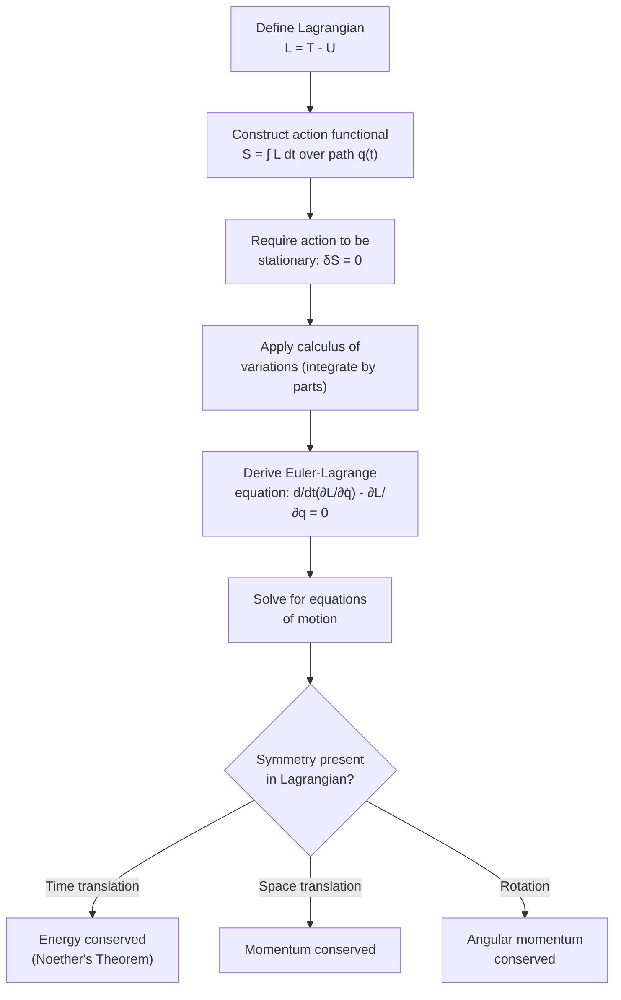

## The Principle of Least Action

### Overview

The Principle of Least Action (more precisely, the Principle of Stationary Action) states that the actual trajectory a physical system follows between two fixed configurations is the one that makes a quantity called the **action** stationary (typically a minimum) with respect to all nearby conceivable paths. This variational formulation reframes classical mechanics not as forces causing motion, but as nature "selecting" the path that extremizes a single scalar functional — a profoundly different and remarkably powerful way of encoding the same physical laws.

### The Action Functional

The **action** $S$ is defined as the time integral of the Lagrangian $L = T - U$ (kinetic minus potential energy) along a path $q(t)$ from a fixed initial configuration at time $t_1$ to a fixed final configuration at time $t_2$:

$$S[q(t)] = \int_{t_1}^{t_2} L(q, \dot{q}, t)\,dt$$

**Key Points**

- $S$ is a **functional** — it takes an entire function (a path $q(t)$) as input and returns a single number, not a function of a single variable
- The endpoints $q(t_1)$ and $q(t_2)$ are held fixed; only the path connecting them is varied
- Different candidate paths generally give different values of $S$; the actual physical trajectory is the one for which $S$ is stationary (unchanged to first order) under small variations of the path

### Statement of the Principle

**Statement**: Among all possible paths connecting fixed endpoints, the actual path taken by the system is the one for which the action is stationary:

$$\delta S = 0$$

This is expressed using the **calculus of variations**, where $\delta$ denotes a small, arbitrary variation in the path (vanishing at the fixed endpoints) rather than an ordinary differential.

**Key Points**

- "Stationary" is more precise than "least" — the action can be a minimum, maximum, or saddle point, though for most simple mechanical systems over short time intervals it is indeed a minimum (hence the traditional, if slightly imprecise, name)
- The variation $\delta q(t)$ must vanish at the endpoints: $\delta q(t_1) = \delta q(t_2) = 0$, since the initial and final configurations are fixed
- This single variational statement is mathematically equivalent to Newton's laws of motion for conservative systems, but expressed in a coordinate-independent, scalar form

### Deriving the Euler-Lagrange Equation

Applying the calculus of variations to $\delta S = 0$ yields the **Euler-Lagrange equation**, the differential equation that any stationary path must satisfy:

$$\frac{d}{dt}\left(\frac{\partial L}{\partial \dot{q}}\right) - \frac{\partial L}{\partial q} = 0$$

**Derivation sketch**: Consider a small variation $q(t) \to q(t) + \epsilon\,\eta(t)$, where $\eta(t)$ is an arbitrary function vanishing at the endpoints and $\epsilon$ is a small parameter. Requiring $dS/d\epsilon = 0$ at $\epsilon = 0$, and integrating by parts (using $\eta(t_1)=\eta(t_2)=0$ to eliminate boundary terms), leads directly to the Euler-Lagrange equation, since $\eta(t)$ is otherwise arbitrary.

**Key Points**

- For each generalized coordinate $q_j$, there is one Euler-Lagrange equation: $\dfrac{d}{dt}\left(\dfrac{\partial L}{\partial \dot{q}_j}\right) - \dfrac{\partial L}{\partial q_j} = 0$
- This equation is entirely equivalent to Newton's second law for the corresponding coordinate, but derived from a scalar energy-based quantity rather than vector force analysis
- The equation naturally incorporates constraints when expressed in properly chosen generalized coordinates, without needing to separately solve for constraint forces

### Stationary Path Visualization (svg_diagram)

<svg xmlns="http://www.w3.org/2000/svg" viewBox="0 0 700 380">
<text x="350" y="25" text-anchor="middle" font-size="16" font-weight="bold" fill="#222">Actual Path vs Varied Paths (svg_diagram)</text>
<line x1="80" y1="330" x2="620" y2="330" stroke="#333" stroke-width="1.5" />
<text x="640" y="335" font-size="12" fill="#333">t</text>
<line x1="80" y1="40" x2="80" y2="330" stroke="#333" stroke-width="1.5" />
<text x="55" y="45" font-size="12" fill="#333">q</text>

<circle cx="120" cy="280" r="6" fill="#333" />
<text x="120" y="305" text-anchor="middle" font-size="11" fill="#222">q(t₁) fixed</text>
<circle cx="580" cy="120" r="6" fill="#333" />
<text x="580" y="105" text-anchor="middle" font-size="11" fill="#222">q(t₂) fixed</text>

<path d="M120,280 C250,230 350,170 580,120" fill="none" stroke="#1f77b4" stroke-width="3" />
<text x="330" y="190" font-size="12" fill="#1f77b4" font-weight="bold">Actual path: δS = 0</text>

<path d="M120,280 C220,180 330,100 580,120" fill="none" stroke="#d62728" stroke-width="1.5" stroke-dasharray="5,4" opacity="0.7" />
<path d="M120,280 C280,290 400,240 580,120" fill="none" stroke="#2ca02c" stroke-width="1.5" stroke-dasharray="5,4" opacity="0.7" />

<text x="330" y="90" font-size="11" fill="`#d62728`">Varied path (S larger)</text>

<text x="330" y="270" font-size="11" fill="`#2ca02c`">Varied path (S larger)</text>

</svg>

### Equivalence to Newtonian Mechanics

For a single particle of mass $m$ in a potential $U(x)$, the Lagrangian is $L = \frac{1}{2}m\dot{x}^2 - U(x)$. Applying the Euler-Lagrange equation:

$$\frac{\partial L}{\partial \dot{x}} = m\dot{x}, \quad \frac{d}{dt}(m\dot{x}) = m\ddot{x}$$

$$\frac{\partial L}{\partial x} = -\frac{\partial U}{\partial x} = F$$

$$\Rightarrow \quad m\ddot{x} - F = 0 \quad \Rightarrow \quad F = m\ddot{x}$$

This directly recovers Newton's Second Law, confirming that the Principle of Least Action, when applied to $L = T - U$, is mathematically equivalent to Newtonian dynamics for this system — while generalizing naturally to arbitrarily complex, constrained systems in any coordinate system.

### Why "Least" Action (Usually a Minimum)

**Key Points**

- For sufficiently short time intervals, the stationary action path is provably a true minimum among nearby paths — this can be shown rigorously using the theory of conjugate points in the calculus of variations
- Over longer time intervals, the stationary path can become a saddle point rather than a strict minimum (though it remains stationary), which is why "stationary action" is the technically correct general statement, with "least action" as a historically entrenched but slightly imprecise common name
- Regardless of minimum vs. saddle point classification, $\delta S = 0$ always holds for the physical trajectory — this stationarity condition, not "minimality" per se, is the operative physical principle

### Hamilton's Principle and Generalization

The Principle of Least Action, when specifically formulated using $L = T-U$ as above, is often called **Hamilton's Principle** in mechanics contexts. Its power extends far beyond classical particle mechanics:

**Key Points**

- **Continuum mechanics and field theory**: the action principle generalizes to fields (e.g., electromagnetic fields, elastic media) by replacing the Lagrangian with a Lagrangian density integrated over both space and time
- **General Relativity**: Einstein's field equations can be derived from the stationarity of the Einstein-Hilbert action
- **Quantum mechanics**: Feynman's path integral formulation reinterprets quantum amplitudes as a sum over all possible paths (not just the stationary one), with the classical stationary-action path emerging as the dominant contribution in the classical (macroscopic action ≫ $\hbar$) limit
- **Optics**: Fermat's Principle of least time for light propagation is a closely related, historically earlier variational principle, sometimes considered a precursor conceptual influence on the mechanical action principle

### Noether's Theorem Connection

The Lagrangian/action formulation reveals a deep structural connection between symmetries and conservation laws, formalized by **Noether's Theorem**: every continuous symmetry of the action corresponds to a conserved quantity.

**Key Points**

- Time-translation symmetry (Lagrangian has no explicit time dependence) $\Rightarrow$ conservation of energy
- Spatial-translation symmetry (Lagrangian unchanged under uniform spatial shift) $\Rightarrow$ conservation of linear momentum
- Rotational symmetry (Lagrangian unchanged under rotation) $\Rightarrow$ conservation of angular momentum
- This connection is not visible in the Newtonian force formulation and represents one of the most significant conceptual advantages of the action-based approach

### Worked Example

**Example**

Using the Principle of Least Action, derive the equation of motion for a simple harmonic oscillator with mass $m$ and spring constant $k$.

Step 1 — Write the Lagrangian:

$$L = T - U = \frac{1}{2}m\dot{x}^2 - \frac{1}{2}kx^2$$

Step 2 — Compute the partial derivatives needed for the Euler-Lagrange equation:

$$\frac{\partial L}{\partial \dot{x}} = m\dot{x}, \quad \frac{\partial L}{\partial x} = -kx$$

Step 3 — Apply the Euler-Lagrange equation:

$$\frac{d}{dt}(m\dot{x}) - (-kx) = 0 \quad \Rightarrow \quad m\ddot{x} + kx = 0$$

**Output**: The result, $m\ddot{x} + kx = 0$, is exactly the standard simple harmonic oscillator equation of motion, confirming $\omega_0 = \sqrt{k/m}$ — derived here purely from extremizing the action, with no explicit force analysis required.

### System Diagram

### Real-World Applications

- **Classical mechanics problem-solving**: the Lagrangian/action approach is often far more tractable than Newtonian force analysis for constrained, multi-body, or curvilinear-coordinate systems (robotics, orbital mechanics, coupled oscillators)
- **General Relativity**: geodesic motion of particles and light in curved spacetime is derived from an action principle, and the field equations themselves follow from the Einstein-Hilbert action
- **Quantum field theory and particle physics**: the Standard Model's dynamics are entirely specified by its Lagrangian density, with the path integral (action-based) formulation providing the standard computational framework
- **Optimal control theory**: engineering fields (e.g., spacecraft trajectory optimization, robotics motion planning) directly use variational/action-based methods to find optimal (least-cost) trajectories subject to physical constraints
- **Feynman path integral formulation of quantum mechanics**: reframes quantum dynamics as a sum over all paths weighted by $e^{iS/\hbar}$, with classical mechanics emerging as the stationary-phase (least-action) limit

### Conclusion

The Principle of Least (Stationary) Action reframes classical mechanics as an extremization problem: nature "chooses" the path between fixed endpoints that makes the action integral $S = \int L\,dt$ stationary. This single, elegant variational statement is mathematically equivalent to Newton's laws for conservative systems, yet generalizes seamlessly to complex constrained systems, continuous fields, General Relativity, and quantum mechanics — while its deep connection to symmetry and conservation laws via Noether's Theorem makes it one of the most conceptually powerful ideas in all of theoretical physics.

**Related Topics**

- The Euler-Lagrange Equations and Generalized Coordinates
- Noether's Theorem and Conservation Laws
- Hamiltonian Mechanics and the Legendre Transform
- The Calculus of Variations
- Feynman's Path Integral Formulation of Quantum Mechanics
- The Einstein-Hilbert Action in General Relativity