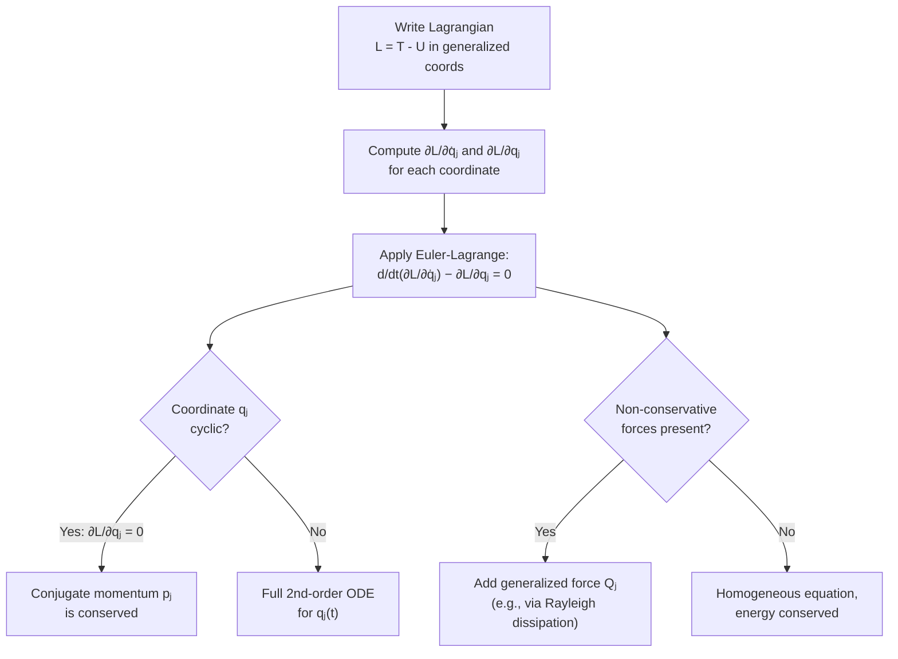

## The Euler-Lagrange Equation

### Overview

The Euler-Lagrange equation is the central differential equation of Lagrangian mechanics, providing the equations of motion for a system directly from its Lagrangian function. Derived from the Principle of Stationary Action via the calculus of variations, it transforms the problem of finding a system's dynamics from vector force analysis into a scalar, coordinate-independent procedure applicable to any valid choice of generalized coordinates.

### Statement of the Equation

For a system described by generalized coordinates $q_1, q_2, \dots, q_n$ with Lagrangian $L(q_j, \dot{q}_j, t) = T - U$, the Euler-Lagrange equation for each coordinate $q_j$ is:

$$\frac{d}{dt}\left(\frac{\partial L}{\partial \dot{q}_j}\right) - \frac{\partial L}{\partial q_j} = 0, \quad j = 1, 2, \dots, n$$

**Key Points**

- One equation exists for each independent generalized coordinate $q_j$ — an $n$-DOF system yields $n$ coupled second-order differential equations
- The equation holds for any valid choice of generalized coordinates, not just Cartesian — this coordinate independence is a major practical advantage
- $\partial L/\partial \dot{q}_j$ is called the **generalized (canonical) momentum** conjugate to $q_j$, often denoted $p_j$

### Derivation from the Action Principle

Starting from the requirement that the action $S = \int_{t_1}^{t_2} L\,dt$ be stationary under small variations $q(t) \to q(t) + \epsilon\,\eta(t)$ with $\eta(t_1) = \eta(t_2) = 0$:

**Step 1** — Compute the first-order change in $S$:

$$\delta S = \int_{t_1}^{t_2}\left(\frac{\partial L}{\partial q}\delta q + \frac{\partial L}{\partial \dot{q}}\delta \dot{q}\right)dt$$

**Step 2** — Integrate the second term by parts, noting $\delta\dot{q} = \dfrac{d}{dt}(\delta q)$:

$$\int_{t_1}^{t_2}\frac{\partial L}{\partial \dot{q}}\delta\dot{q}\,dt = \left[\frac{\partial L}{\partial \dot{q}}\delta q\right]_{t_1}^{t_2} - \int_{t_1}^{t_2}\frac{d}{dt}\left(\frac{\partial L}{\partial \dot{q}}\right)\delta q\,dt$$

**Step 3** — The boundary term vanishes since $\delta q(t_1) = \delta q(t_2) = 0$ (fixed endpoints), leaving:

$$\delta S = \int_{t_1}^{t_2}\left[\frac{\partial L}{\partial q} - \frac{d}{dt}\left(\frac{\partial L}{\partial \dot{q}}\right)\right]\delta q\,dt$$

**Step 4** — Since $\delta q(t)$ is otherwise arbitrary throughout the interval, requiring $\delta S = 0$ for all such variations forces the bracketed term to vanish identically (this is the **fundamental lemma of the calculus of variations**):

$$\frac{d}{dt}\left(\frac{\partial L}{\partial \dot{q}}\right) - \frac{\partial L}{\partial q} = 0$$

### Generalized Momentum and Cyclic Coordinates

The quantity $p_j = \partial L/\partial \dot{q}_j$ is the **generalized (canonical) momentum** conjugate to $q_j$. The Euler-Lagrange equation can be rewritten compactly as:

$$\dot{p}_j = \frac{\partial L}{\partial q_j}$$

**Key Points**

- If the Lagrangian does not explicitly depend on a particular coordinate $q_j$ (i.e., $\partial L/\partial q_j = 0$), that coordinate is called **cyclic** (or ignorable)
- For a cyclic coordinate, the Euler-Lagrange equation immediately gives $\dot{p}_j = 0$, meaning the conjugate momentum $p_j$ is **conserved** — a direct, often effortless route to identifying conservation laws
- This is a special case of the deeper connection formalized by Noether's Theorem between continuous symmetries of the Lagrangian and conserved quantities

### Worked Example: Cartesian Free Particle

For a free particle of mass $m$ with $L = \frac{1}{2}m(\dot{x}^2+\dot{y}^2+\dot{z}^2)$ (no potential energy):

$$\frac{\partial L}{\partial \dot{x}} = m\dot{x}, \quad \frac{\partial L}{\partial x} = 0$$

$$\Rightarrow \quad \frac{d}{dt}(m\dot{x}) = 0 \quad \Rightarrow \quad m\dot{x} = \text{constant}$$

**Output**: Each Cartesian coordinate is cyclic (since $L$ has no explicit $x$, $y$, or $z$ dependence), directly yielding conservation of linear momentum in each direction — recovering Newton's First Law for a free particle with no additional force analysis.

### Worked Example: Planar Motion in a Central Potential

For a particle of mass $m$ moving in a plane under a central potential $U(r)$, using polar coordinates $(r,\theta)$:

$$L = \frac{1}{2}m(\dot{r}^2 + r^2\dot{\theta}^2) - U(r)$$

**Radial equation** ($q_j = r$):

$$\frac{\partial L}{\partial \dot{r}} = m\dot{r}, \quad \frac{\partial L}{\partial r} = mr\dot{\theta}^2 - \frac{dU}{dr}$$

$$\Rightarrow \quad m\ddot{r} - mr\dot{\theta}^2 + \frac{dU}{dr} = 0$$

**Angular equation** ($q_j = \theta$, which is cyclic since $L$ has no explicit $\theta$ dependence):

$$\frac{\partial L}{\partial \dot{\theta}} = mr^2\dot{\theta}, \quad \frac{\partial L}{\partial \theta} = 0$$

$$\Rightarrow \quad \frac{d}{dt}(mr^2\dot{\theta}) = 0 \quad \Rightarrow \quad mr^2\dot{\theta} = L_z = \text{constant}$$

**Key Points**

- The angular equation directly gives conservation of angular momentum $L_z = mr^2\dot{\theta}$ — precisely Kepler's Second Law (equal areas in equal times) for orbital motion, obtained here purely from $\theta$ being cyclic
- The radial equation includes a term $mr\dot{\theta}^2$ that plays the role of centrifugal force, emerging naturally from the coordinate transformation rather than being added by hand as in elementary treatments

### Euler-Lagrange Derivation Flow (svg_diagram)

<svg xmlns="http://www.w3.org/2000/svg" viewBox="0 0 700 340">
<text x="350" y="25" text-anchor="middle" font-size="16" font-weight="bold" fill="#222">From Action to Equation of Motion (svg_diagram)</text>
<rect x="40" y="60" width="160" height="60" rx="8" fill="#e8f0fb" stroke="#1f77b4" stroke-width="1.5" />
<text x="120" y="85" text-anchor="middle" font-size="12" fill="#222">Action</text>
<text x="120" y="103" text-anchor="middle" font-size="12" fill="#222">S = ∫L dt</text>
<line x1="200" y1="90" x2="260" y2="90" stroke="#333" stroke-width="1.5" marker-end="url(#arrE)" />
<text x="230" y="80" text-anchor="middle" font-size="10" fill="#555">δS = 0</text>
<rect x="260" y="60" width="180" height="60" rx="8" fill="#e8f0fb" stroke="#1f77b4" stroke-width="1.5" />
<text x="350" y="85" text-anchor="middle" font-size="12" fill="#222">Vary path, integrate</text>
<text x="350" y="103" text-anchor="middle" font-size="12" fill="#222">by parts</text>
<line x1="440" y1="90" x2="500" y2="90" stroke="#333" stroke-width="1.5" marker-end="url(#arrE)" />
<rect x="500" y="60" width="160" height="60" rx="8" fill="#e8f0fb" stroke="#1f77b4" stroke-width="1.5" />
<text x="580" y="85" text-anchor="middle" font-size="12" fill="#222">Euler-Lagrange</text>
<text x="580" y="103" text-anchor="middle" font-size="12" fill="#222">equation</text>
<line x1="120" y1="120" x2="120" y2="180" stroke="#333" stroke-width="1.5" marker-end="url(#arrE)" />
<line x1="580" y1="120" x2="580" y2="180" stroke="#333" stroke-width="1.5" marker-end="url(#arrE)" />
<rect x="220" y="200" width="260" height="70" rx="8" fill="#fef3e0" stroke="#d68a00" stroke-width="1.5" />
<text x="350" y="225" text-anchor="middle" font-size="12" fill="#222">d/dt(∂L/∂q̇) − ∂L/∂q = 0</text>
<text x="350" y="245" text-anchor="middle" font-size="11" fill="#555">One equation per q_j</text>
<line x1="120" y1="180" x2="280" y2="200" stroke="#333" stroke-width="1.5" marker-end="url(#arrE)" />
<line x1="580" y1="180" x2="420" y2="200" stroke="#333" stroke-width="1.5" marker-end="url(#arrE)" />
</svg>

### Handling Constraints with Lagrange Multipliers

For **non-holonomic constraints** (or when it is inconvenient to eliminate a coordinate via a holonomic constraint), the Euler-Lagrange equation can be extended using **Lagrange multipliers** $\lambda_k$:

$$\frac{d}{dt}\left(\frac{\partial L}{\partial \dot{q}_j}\right) - \frac{\partial L}{\partial q_j} = \sum_k \lambda_k \frac{\partial f_k}{\partial q_j}$$

where $f_k(q,t) = 0$ are the constraint equations.

**Key Points**

- This approach retains "extra" coordinates rather than eliminating them via direct substitution, at the cost of introducing additional unknown multipliers $\lambda_k$ (solved simultaneously with the equations of motion)
- A significant practical benefit: the Lagrange multipliers $\lambda_k$ are directly related to the **constraint forces** (e.g., normal forces, tension) — useful when these forces themselves are of physical interest, not just the motion
- This method is standard in multibody dynamics and robotics simulation software, where constraint forces often must be computed explicitly (e.g., for structural load analysis)

### Non-Conservative and Dissipative Forces

When forces are not derivable from a potential energy function (e.g., friction, air resistance, externally applied forces), they enter the Euler-Lagrange equation as explicit generalized forces $Q_j$ on the right-hand side:

$$\frac{d}{dt}\left(\frac{\partial L}{\partial \dot{q}_j}\right) - \frac{\partial L}{\partial q_j} = Q_j$$

**Key Points**

- For velocity-dependent dissipative forces like linear damping, a **Rayleigh dissipation function** $\mathcal{F} = \frac{1}{2}\sum_j b_j\dot{q}_j^2$ is often introduced, with $Q_j = -\partial \mathcal{F}/\partial \dot{q}_j$, providing a systematic way to incorporate damping into the Lagrangian framework
- This extension allows the Euler-Lagrange formalism to handle the full range of realistic mechanical systems, not just idealized conservative ones

### Worked Example: Damped Oscillator via Rayleigh Dissipation

For a damped harmonic oscillator with $L = \frac{1}{2}m\dot{x}^2 - \frac{1}{2}kx^2$ and Rayleigh dissipation function $\mathcal{F} = \frac{1}{2}b\dot{x}^2$:

Step 1 — Standard Euler-Lagrange terms:

$$\frac{d}{dt}\left(\frac{\partial L}{\partial \dot{x}}\right) - \frac{\partial L}{\partial x} = m\ddot{x} + kx$$

Step 2 — Dissipative generalized force:

$$Q_x = -\frac{\partial \mathcal{F}}{\partial \dot{x}} = -b\dot{x}$$

Step 3 — Combine:

$$m\ddot{x} + kx = -b\dot{x} \quad \Rightarrow \quad m\ddot{x} + b\dot{x} + kx = 0$$

**Output**: This recovers exactly the standard damped harmonic oscillator equation, demonstrating that the Rayleigh dissipation function correctly incorporates linear damping into the Lagrangian formalism.

### System Diagram

### Real-World Applications

- **Robotics and multibody dynamics**: joint-space equations of motion for robotic manipulators are derived systematically via the Euler-Lagrange formalism, forming the basis of most robot dynamics software
- **Orbital mechanics**: deriving conservation of angular momentum (Kepler's Second Law) directly from a cyclic angular coordinate, without separate vector analysis
- **Vehicle and structural dynamics simulation**: constrained multibody systems (suspensions, linkages) use Lagrange multiplier methods to compute both motion and constraint (reaction) forces
- **Electrical circuit analysis**: the Lagrangian formalism extends to electrical circuits (with charge as a generalized coordinate), providing an alternative to Kirchhoff's laws for complex circuit dynamics
- **Molecular dynamics and biomechanics**: internal coordinate representations (bond angles, dihedrals) rely on the Euler-Lagrange equations for efficient constrained simulation

### Conclusion

The Euler-Lagrange equation, $\frac{d}{dt}\left(\frac{\partial L}{\partial \dot{q}}\right) - \frac{\partial L}{\partial q} = 0$, translates the Principle of Stationary Action into a practical, coordinate-independent recipe for deriving equations of motion directly from a system's kinetic and potential energy. Its natural handling of constraints, immediate identification of conserved quantities via cyclic coordinates, and straightforward extension to non-conservative forces make it one of the most powerful and widely applied tools in classical mechanics, robotics, and beyond.

**Related Topics**

- The Principle of Least Action and the Action Functional
- Generalized Coordinates and Constraints
- Cyclic Coordinates and Conservation Laws
- Lagrange Multipliers and Constraint Forces
- The Rayleigh Dissipation Function
- Hamiltonian Mechanics and the Legendre Transform