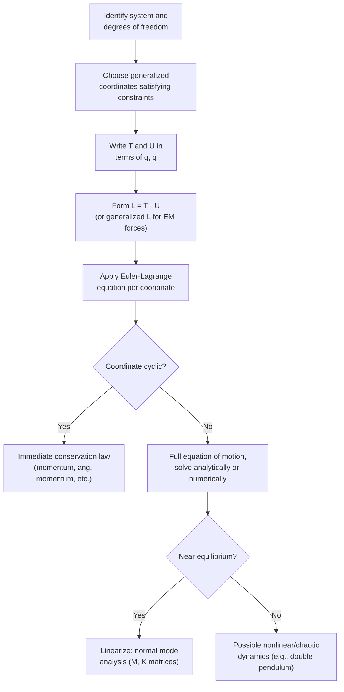

## Applications of Lagrangian Mechanics

### Overview

Lagrangian mechanics provides a systematic, energy-based procedure for deriving equations of motion that is especially powerful for systems with constraints, multiple coupled degrees of freedom, or coordinates ill-suited to direct Newtonian force analysis. This section surveys the standard problem-solving workflow and works through several classic applications, demonstrating how the same procedure — write $T$ and $U$, form $L = T-U$, apply the Euler-Lagrange equation — handles problems that would require substantially more effort using vector force methods.

### General Problem-Solving Procedure

**Key Points**

- **Step 1**: Identify degrees of freedom and choose appropriate generalized coordinates $q_j$ that automatically satisfy any holonomic constraints
- **Step 2**: Express the kinetic energy $T$ and potential energy $U$ in terms of $q_j$ and $\dot{q}_j$
- **Step 3**: Form the Lagrangian $L = T - U$
- **Step 4**: Apply the Euler-Lagrange equation to each $q_j$: $\dfrac{d}{dt}\left(\dfrac{\partial L}{\partial \dot{q}_j}\right) - \dfrac{\partial L}{\partial q_j} = 0$
- **Step 5**: Simplify the resulting equations of motion, identify conserved quantities (from cyclic coordinates), and solve or analyze as needed

### Application 1: Atwood Machine

Two masses $m_1$ and $m_2$ connected by an inextensible string over a frictionless, massless pulley, with $x$ the position of $m_1$ (so $m_2$'s position is determined by the constraint).

**Setup:**

$$T = \frac{1}{2}(m_1+m_2)\dot{x}^2, \quad U = -m_1gx - m_2g(l-x)$$

(using the string's fixed total length $l$ to eliminate $m_2$'s coordinate)

$$L = \frac{1}{2}(m_1+m_2)\dot{x}^2 + m_1gx + m_2g(l-x)$$

**Applying Euler-Lagrange:**

$$\frac{\partial L}{\partial \dot{x}} = (m_1+m_2)\dot{x}, \quad \frac{\partial L}{\partial x} = (m_1-m_2)g$$

$$\Rightarrow \quad (m_1+m_2)\ddot{x} = (m_1-m_2)g \quad \Rightarrow \quad \ddot{x} = \frac{(m_1-m_2)g}{m_1+m_2}$$

**Key Points**

- The single constraint (inextensible string) reduces the system to one DOF, with the string tension eliminated entirely from the analysis
- This matches the well-known Atwood machine result obtainable via Newtonian analysis, but obtained here without needing to separately solve for string tension

### Application 2: Double Pendulum

Two point masses $m_1, m_2$ connected by rigid massless rods of lengths $l_1, l_2$, with generalized coordinates $\theta_1, \theta_2$ (angles from vertical).

**Kinetic and potential energy** (using $x_1=l_1\sin\theta_1$, $y_1=-l_1\cos\theta_1$, and similarly for the second bob relative to the first):

$$T = \frac{1}{2}(m_1+m_2)l_1^2\dot{\theta}_1^2 + \frac{1}{2}m_2l_2^2\dot{\theta}_2^2 + m_2l_1l_2\dot{\theta}_1\dot{\theta}_2\cos(\theta_1-\theta_2)$$

$$U = -(m_1+m_2)gl_1\cos\theta_1 - m_2gl_2\cos\theta_2$$

**Key Points**

- The Euler-Lagrange equations yield two coupled, nonlinear second-order ODEs in $\theta_1,\theta_2$ with no closed-form analytical solution for general initial conditions
- The double pendulum is a canonical example of a simple-looking mechanical system exhibiting **chaotic behavior** for sufficiently large initial displacements
- Deriving this system's equations of motion via Newtonian vector methods (tracking string/rod tension forces at each joint) is considerably more error-prone and tedious than the direct Lagrangian route

### Double Pendulum Configuration (svg_diagram)

<svg xmlns="http://www.w3.org/2000/svg" viewBox="0 0 700 380">
<text x="350" y="25" text-anchor="middle" font-size="16" font-weight="bold" fill="#222">Double Pendulum — Generalized Coordinates (svg_diagram)</text>
<circle cx="300" cy="50" r="5" fill="#333" />
<text x="300" y="35" text-anchor="middle" font-size="11" fill="#333">Pivot</text>

<line x1="300" y1="50" x2="400" y2="180" stroke="#555" stroke-width="2.5" />
<circle cx="400" cy="180" r="14" fill="#1f77b4" />
<text x="415" y="180" font-size="11" fill="#1f77b4">m1</text>

<path d="M 300 90 A 40 40 0 0 1 325 100" fill="none" stroke="#d62728" stroke-width="2" />
<text x="335" y="90" font-size="13" fill="#d62728" font-weight="bold">θ1</text>
<line x1="300" y1="50" x2="300" y2="200" stroke="#999" stroke-width="1" stroke-dasharray="4,4" />

<line x1="400" y1="180" x2="470" y2="320" stroke="#555" stroke-width="2.5" />
<circle cx="470" cy="320" r="14" fill="#2ca02c" />
<text x="485" y="320" font-size="11" fill="#2ca02c">m2</text>

<path d="M 400 220 A 40 40 0 0 1 420 228" fill="none" stroke="#ff7f0e" stroke-width="2" />
<text x="425" y="215" font-size="13" fill="#ff7f0e" font-weight="bold">θ2</text>
<line x1="400" y1="180" x2="400" y2="330" stroke="#999" stroke-width="1" stroke-dasharray="4,4" />

<text x="350" y="360" text-anchor="middle" font-size="11" fill="#555">Two DOF (θ1, θ2) → coupled nonlinear ODEs, chaotic for large amplitudes</text>

</svg>

### Application 3: Bead on a Rotating Wire

A bead of mass $m$ slides frictionlessly on a straight wire that rotates in a horizontal plane at constant angular velocity $\omega$. Using $r$ (radial distance along the wire) as the single generalized coordinate:

$$T = \frac{1}{2}m(\dot{r}^2 + r^2\omega^2), \quad U = 0$$

$$L = \frac{1}{2}m\dot{r}^2 + \frac{1}{2}mr^2\omega^2$$

**Applying Euler-Lagrange:**

$$\frac{\partial L}{\partial \dot{r}} = m\dot{r}, \quad \frac{\partial L}{\partial r} = mr\omega^2$$

$$\Rightarrow \quad m\ddot{r} - mr\omega^2 = 0 \quad \Rightarrow \quad \ddot{r} = r\omega^2$$

**Key Points**

- The term $r\omega^2$ emerges automatically as an outward (centrifugal) acceleration — a **rheonomic** constraint scenario since the wire's orientation depends explicitly on time via $\omega t$
- This illustrates how Lagrangian mechanics in a rotating (non-inertial) reference frame naturally generates the fictitious centrifugal term without needing to introduce it by hand, as required in Newtonian analysis in rotating frames
- The solution $r(t) = Ae^{\omega t} + Be^{-\omega t}$ shows the bead accelerates outward exponentially — an unstable equilibrium at $r=0$

### Application 4: Small Oscillations and Normal Modes

Near a stable equilibrium, any Lagrangian can be Taylor-expanded to quadratic order, yielding a matrix eigenvalue problem for normal mode frequencies — the general method underlying the coupled-oscillator analysis covered in earlier chapters:

$$L \approx \frac{1}{2}\sum_{ij}M_{ij}\dot{q}_i\dot{q}_j - \frac{1}{2}\sum_{ij}K_{ij}q_iq_j$$

leading to the Euler-Lagrange equations in matrix form:

$$\mathbf{M}\ddot{\mathbf{q}} + \mathbf{K}\mathbf{q} = 0$$

**Key Points**

- $M_{ij}$ (mass matrix) and $K_{ij}$ (stiffness matrix) are computed from second derivatives of $T$ and $U$ at the equilibrium configuration
- This systematic small-oscillation procedure generalizes the earlier two-mass coupled oscillator result to arbitrary $N$-DOF systems, including molecules, coupled pendulums, and structural vibration models
- Normal mode frequencies follow from $\det(\mathbf{K}-\omega^2\mathbf{M}) = 0$, exactly as introduced in the normal modes topic — here shown to be a direct, general consequence of the Lagrangian small-oscillation expansion

### Application 5: Charged Particle in an Electromagnetic Field

The Lagrangian formalism extends beyond purely mechanical potentials to velocity-dependent forces, most notably the Lorentz force on a charged particle:

$$L = \frac{1}{2}m\dot{\vec{r}}^2 - q\phi + q\dot{\vec{r}}\cdot\vec{A}$$

where $\phi$ is the scalar electric potential and $\vec{A}$ is the magnetic vector potential.

**Key Points**

- Applying the Euler-Lagrange equations to this Lagrangian recovers the full Lorentz force law, $\vec{F} = q\vec{E} + q\vec{v}\times\vec{B}$, despite the magnetic force being velocity-dependent (a case elementary $L=T-U$ intuition does not directly cover)
- This demonstrates that the Lagrangian framework extends naturally beyond simple conservative mechanical potentials to a broader class of "generalized potentials" $U(q,\dot{q},t)$
- This formulation is the standard starting point for relativistic particle dynamics and classical field theory treatments of electromagnetism

### Worked Example

**Example**

A block of mass $m$ slides without friction on a frictionless wedge of mass $M$ (angle $\alpha$), which itself can slide freely on a horizontal frictionless floor. Using $X$ (wedge position) and $s$ (block's position along the wedge surface) as generalized coordinates, find the equation of motion for $X$.

Step 1 — Block's position relative to ground: $x_{\text{block}} = X + s\cos\alpha$, $y_{\text{block}} = -s\sin\alpha$.

Step 2 — Kinetic energy:

$$T = \frac{1}{2}M\dot{X}^2 + \frac{1}{2}m\left[(\dot{X}+\dot{s}\cos\alpha)^2 + (\dot{s}\sin\alpha)^2\right]$$

Step 3 — Since $L$ has no explicit $X$-dependence (translational symmetry, $\partial U/\partial X = 0$ since $U=-mgs\sin\alpha$ depends only on $s$), $X$ is cyclic:

$$\frac{\partial L}{\partial X} = 0 \quad \Rightarrow \quad \frac{d}{dt}\left(\frac{\partial L}{\partial \dot{X}}\right) = 0$$

Step 4 — Compute the conserved momentum:

$$\frac{\partial L}{\partial \dot{X}} = M\dot{X} + m(\dot{X}+\dot{s}\cos\alpha) = (M+m)\dot{X} + m\dot{s}\cos\alpha = \text{constant}$$

**Output**: This is exactly the statement of **conservation of total horizontal momentum** for the wedge-block system — obtained immediately by recognizing $X$ as cyclic, with no need to separately track the normal force between block and wedge.

### System Diagram

### Real-World Applications

- **Robotics**: joint-space dynamics of serial and parallel manipulators are derived via the Lagrangian method, forming the standard basis for robot control algorithms
- **Vehicle dynamics**: suspension systems, multi-body chassis models, and coupled wheel dynamics are efficiently modeled using generalized coordinates and the Euler-Lagrange framework
- **Molecular and structural vibration analysis**: small-oscillation Lagrangian methods directly compute vibrational normal modes for molecules and mechanical/civil structures
- **Accelerator physics**: charged particle beam dynamics in electric and magnetic fields rely on the electromagnetic Lagrangian formulation
- **Chaotic systems research**: the double pendulum and related multi-DOF mechanical systems serve as canonical, experimentally accessible testbeds for studying deterministic chaos

### Conclusion

The Lagrangian method's true strength lies in its systematic applicability across a remarkably diverse range of problems — constrained pulley systems, coupled and chaotic multi-body pendulums, rotating-frame dynamics, small-oscillation normal modes, and even velocity-dependent electromagnetic forces — all handled by the same five-step procedure. This uniformity, combined with the automatic extraction of conservation laws from cyclic coordinates, makes Lagrangian mechanics the preferred framework for virtually all but the simplest problems in classical mechanics and its engineering applications.

**Related Topics**

- Generalized Coordinates and Constraints
- The Euler-Lagrange Equation and Cyclic Coordinates
- Normal Modes and Small Oscillations
- Chaotic Dynamics in Multi-DOF Systems
- Hamiltonian Mechanics and Canonical Transformations
- Lagrangian Formulation of Electromagnetism