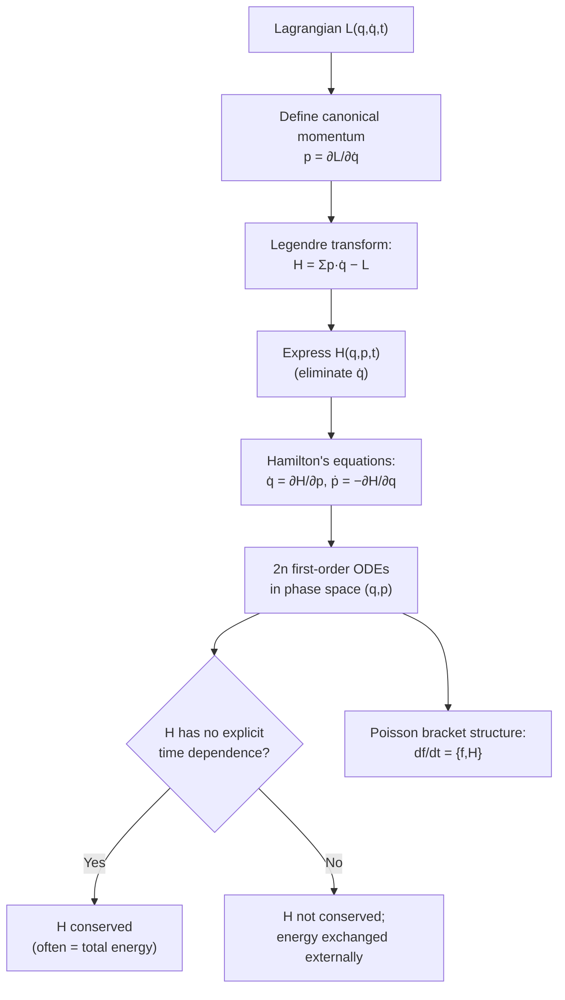

## Hamiltonian Formulation

### Overview

The Hamiltonian formulation reformulates classical mechanics using generalized coordinates and their conjugate momenta as independent variables, rather than coordinates and velocities as in the Lagrangian approach. Constructed via a Legendre transform of the Lagrangian, the Hamiltonian $H$ generates first-order equations of motion in a symmetric phase-space structure that provides deep connections to conservation laws, statistical mechanics, and the transition to quantum mechanics.

### The Legendre Transform

The Hamiltonian is obtained from the Lagrangian via a **Legendre transform**, which switches the independent variable from generalized velocity $\dot{q}_j$ to generalized (canonical) momentum $p_j$:

$$p_j \equiv \frac{\partial L}{\partial \dot{q}_j}$$

$$H(q,p,t) \equiv \sum_j p_j\dot{q}_j - L(q,\dot{q},t)$$

where $\dot{q}_j$ on the right-hand side must be expressed in terms of $p_j$ (by inverting the momentum definition) so that $H$ depends only on $q_j$, $p_j$, and $t$ — not on $\dot{q}_j$.

**Key Points**

- This transform is analogous to the thermodynamic Legendre transforms relating internal energy, enthalpy, and free energies — a shared mathematical structure across physics
- The transform is well-defined (invertible) provided the Lagrangian is a convex function of $\dot{q}_j$, which holds for essentially all standard mechanical systems with positive-definite kinetic energy
- For most mechanical systems where $T$ is a quadratic function of $\dot{q}_j$ and $U$ depends only on $q_j$ (not $\dot{q}_j$), the Hamiltonian reduces to the total energy: $H = T + U$

### Hamilton's Equations of Motion

The Hamiltonian generates the equations of motion through **Hamilton's canonical equations**:

$$\dot{q}_j = \frac{\partial H}{\partial p_j}, \qquad \dot{p}_j = -\frac{\partial H}{\partial q_j}$$

**Key Points**

- These are **first-order** differential equations (unlike the Lagrangian's second-order Euler-Lagrange equations), but there are twice as many of them — $2n$ first-order equations for $n$ generalized coordinates, versus $n$ second-order equations in the Lagrangian formulation
- $(q_j, p_j)$ together define a point in **phase space**, a $2n$-dimensional space in which the system's complete state (not just configuration) at any instant is represented by a single point
- The symmetric, elegant structure of Hamilton's equations (with the characteristic sign difference between the two equations) is central to advanced topics like canonical transformations and the transition to quantum mechanics

### Derivation of Hamilton's Equations

Taking the total differential of $H = \sum_j p_j\dot{q}_j - L$:

$$dH = \sum_j\left(\dot{q}_j\,dp_j + p_j\,d\dot{q}_j\right) - dL$$

Using $dL = \sum_j\left(\dfrac{\partial L}{\partial q_j}dq_j + \dfrac{\partial L}{\partial \dot{q}_j}d\dot{q}_j\right) + \dfrac{\partial L}{\partial t}dt$ and the definition $p_j = \partial L/\partial \dot{q}_j$, the $d\dot{q}_j$ terms cancel exactly:

$$dH = \sum_j\left(\dot{q}_j\,dp_j - \frac{\partial L}{\partial q_j}dq_j\right) - \frac{\partial L}{\partial t}dt$$

Comparing to $dH = \sum_j\left(\dfrac{\partial H}{\partial q_j}dq_j + \dfrac{\partial H}{\partial p_j}dp_j\right) + \dfrac{\partial H}{\partial t}dt$ and matching coefficients (using the Euler-Lagrange equation $\dot{p}_j = \partial L/\partial q_j$) gives Hamilton's equations directly.

### Phase Space Trajectories (svg_diagram)

<svg xmlns="http://www.w3.org/2000/svg" viewBox="0 0 700 380">
<text x="350" y="25" text-anchor="middle" font-size="16" font-weight="bold" fill="#222">Phase Space: Simple Harmonic Oscillator (svg_diagram)</text>
<line x1="350" y1="60" x2="350" y2="340" stroke="#333" stroke-width="1.5" />
<line x1="80" y1="200" x2="620" y2="200" stroke="#333" stroke-width="1.5" />
<text x="630" y="205" font-size="12" fill="#333">q</text>
<text x="360" y="55" font-size="12" fill="#333">p</text>

<ellipse cx="350" cy="200" rx="60" ry="40" fill="none" stroke="#1f77b4" stroke-width="2" />
<ellipse cx="350" cy="200" rx="120" ry="80" fill="none" stroke="#2ca02c" stroke-width="2" />
<ellipse cx="350" cy="200" rx="180" ry="120" fill="none" stroke="#d62728" stroke-width="2" />

<path d="M350,80 l8,10 l-16,0 Z" fill="#d62728" />
<path d="M530,200 l-10,8 l0,-16 Z" fill="#d62728" />

<text x="470" y="90" font-size="11" fill="`#d62728`">Higher energy</text>

<text x="410" y="150" font-size="11" fill="`#2ca02c`">Medium energy</text>

<text x="365" y="185" font-size="11" fill="`#1f77b4`">Low energy</text>

<text x="350" y="365" text-anchor="middle" font-size="11" fill="#555">Each closed orbit: constant H = E; motion flows clockwise in (q,p) phase space</text>

</svg>

### Cyclic Coordinates and the Hamiltonian

If a coordinate $q_j$ is cyclic ($\partial L/\partial q_j = 0$, equivalently $\partial H/\partial q_j = 0$), Hamilton's second equation gives immediately:

$$\dot{p}_j = -\frac{\partial H}{\partial q_j} = 0 \quad \Rightarrow \quad p_j = \text{constant}$$

**Key Points**

- This mirrors the Lagrangian result exactly, but the Hamiltonian formulation makes the reduction in effective dimensionality of the problem especially transparent: a cyclic coordinate's conjugate momentum becomes a fixed parameter, and the remaining dynamics can often be solved as a reduced-dimension problem
- This property underlies the **Hamilton-Jacobi method**, an advanced technique for solving mechanics problems by seeking canonical transformations to coordinates that are entirely cyclic

### Conservation of the Hamiltonian

If $H$ has no explicit time dependence ($\partial H/\partial t = 0$), then:

$$\frac{dH}{dt} = \sum_j\left(\frac{\partial H}{\partial q_j}\dot{q}_j + \frac{\partial H}{\partial p_j}\dot{p}_j\right) = \sum_j\left(\frac{\partial H}{\partial q_j}\frac{\partial H}{\partial p_j} - \frac{\partial H}{\partial p_j}\frac{\partial H}{\partial q_j}\right) = 0$$

**Key Points**

- The two terms cancel exactly due to the structure of Hamilton's equations themselves — $H$ is automatically conserved whenever it has no explicit time dependence, without needing a separate proof
- When $H = T+U$ (the usual case), this recovers conservation of total mechanical energy, consistent with the Noether's Theorem time-translation result derived in the Lagrangian framework
- This cancellation is a special case of a more general result: **any** function $f(q,p)$ evolves according to $df/dt = \{f,H\}$ (the Poisson bracket with $H$), and $\{H,H\}=0$ identically

### Poisson Brackets

The **Poisson bracket** of two phase-space functions $f(q,p)$ and $g(q,p)$ is defined as:

$$\{f,g\} = \sum_j\left(\frac{\partial f}{\partial q_j}\frac{\partial g}{\partial p_j} - \frac{\partial f}{\partial p_j}\frac{\partial g}{\partial q_j}\right)$$

**Key Points**

- Hamilton's equations can be rewritten compactly as $\dot{q}_j = \{q_j,H\}$ and $\dot{p}_j = \{p_j,H\}$
- The fundamental (canonical) Poisson brackets are $\{q_i,p_j\} = \delta_{ij}$, $\{q_i,q_j\}=0$, $\{p_i,p_j\}=0$
- Poisson brackets share deep algebraic structural similarities with the commutators of quantum mechanics; the historical correspondence $\{,\} \to \frac{1}{i\hbar}[\,,\,]$ was a key conceptual bridge in the development of canonical quantization

### Worked Example

**Example**

Derive the Hamiltonian and Hamilton's equations for a simple harmonic oscillator with $L = \frac{1}{2}m\dot{x}^2 - \frac{1}{2}kx^2$.

Step 1 — Compute the canonical momentum:

$$p = \frac{\partial L}{\partial \dot{x}} = m\dot{x} \quad \Rightarrow \quad \dot{x} = \frac{p}{m}$$

Step 2 — Apply the Legendre transform:

$$H = p\dot{x} - L = p\left(\frac{p}{m}\right) - \left[\frac{1}{2}m\left(\frac{p}{m}\right)^2 - \frac{1}{2}kx^2\right]$$

Step 3 — Simplify:

$$H = \frac{p^2}{m} - \frac{p^2}{2m} + \frac{1}{2}kx^2 = \frac{p^2}{2m} + \frac{1}{2}kx^2$$

Step 4 — Apply Hamilton's equations:

$$\dot{x} = \frac{\partial H}{\partial p} = \frac{p}{m}, \qquad \dot{p} = -\frac{\partial H}{\partial x} = -kx$$

**Output**: Combining these two first-order equations ($\dot{x}=p/m$, so $\ddot{x} = \dot{p}/m = -kx/m$) recovers the familiar $m\ddot{x} + kx = 0$, confirming consistency with the Lagrangian and Newtonian results, while $H = p^2/(2m) + \frac{1}{2}kx^2$ correctly identifies as the total energy $T+U$.

### System Diagram

### Real-World Applications

- **Celestial mechanics and orbital dynamics**: Hamiltonian perturbation theory (e.g., for analyzing slow orbital changes due to planetary interactions) is a standard tool in astrodynamics
- **Statistical mechanics**: the Hamiltonian formulation, with its natural phase-space structure, is foundational to classical statistical mechanics (e.g., Liouville's theorem on phase-space volume conservation) and the Boltzmann distribution
- **Quantum mechanics**: canonical quantization directly promotes classical Hamiltonians and Poisson brackets to quantum operators and commutators, making the Hamiltonian formulation the essential bridge between classical and quantum theory
- **Chaos theory and dynamical systems**: phase-space analysis, Poincaré sections, and Lyapunov exponent calculations for chaotic systems are naturally formulated in Hamiltonian terms
- **Accelerator physics and plasma physics**: Hamiltonian methods (including symplectic numerical integrators that preserve phase-space structure) are standard for long-term simulation of particle beam and plasma dynamics

### Conclusion

The Hamiltonian formulation, obtained from the Lagrangian via a Legendre transform to coordinates and momenta, recasts classical mechanics as a symmetric system of first-order equations evolving in phase space. Beyond its practical utility for certain classes of problems (particularly those with cyclic coordinates or requiring perturbative/statistical treatment), the Hamiltonian's Poisson bracket structure provides the direct conceptual and mathematical bridge to quantum mechanics, statistical mechanics, and modern dynamical systems theory — making it, alongside the Lagrangian, one of the two pillars of theoretical classical mechanics.

**Related Topics**

- The Legendre Transform and Canonical Momenta
- Phase Space and Liouville's Theorem
- Poisson Brackets and Canonical Transformations
- The Hamilton-Jacobi Equation
- Canonical Quantization and the Correspondence Principle
- Symplectic Integrators for Long-Term Numerical Simulation