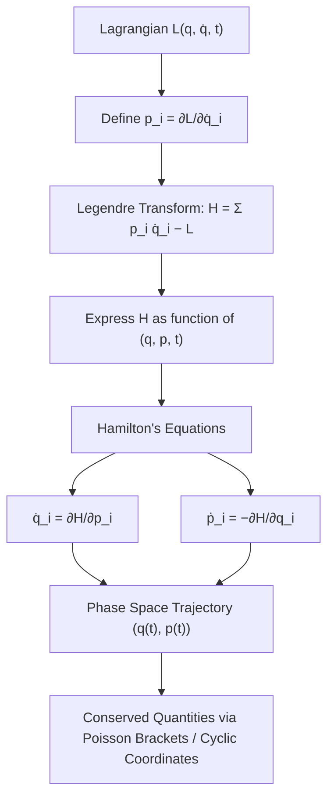

## Hamilton's Equations of Motion

### Overview

Hamilton's equations of motion form a reformulation of classical mechanics that reframes dynamics in terms of generalized coordinates and generalized momenta, rather than coordinates and velocities as in the Lagrangian formulation. They convert the second-order Euler-Lagrange equations into a set of first-order differential equations, doubling the number of equations but halving their order. This formulation provides deep geometric insight into phase space, forms the bridge to statistical mechanics and quantum mechanics, and underlies powerful methods such as canonical transformations and Hamilton-Jacobi theory.

### Historical Context

Sir William Rowan Hamilton introduced this formulation in the 1830s, building on Lagrange's earlier work. His goal was to unify mechanics and optics through a common variational principle, which he achieved by introducing the concept of a "characteristic function." The resulting formalism proved far more than a mathematical curiosity — it became the natural language for phase space, statistical mechanics, and eventually quantum mechanics via the correspondence between Poisson brackets and commutators.

### From Lagrangian to Hamiltonian Mechanics

#### Generalized Momentum

For a system described by generalized coordinates $q_i$ and the Lagrangian $L(q_i, \dot{q}_i, t)$, the generalized (canonical) momentum conjugate to $q_i$ is defined as:

$$p_i = \frac{\partial L}{\partial \dot{q}_i}$$

This quantity need not correspond to linear momentum $mv$; its physical meaning depends on the nature of $q_i$. For example, if $q_i$ is an angle, $p_i$ is an angular momentum.

#### The Legendre Transformation

The Hamiltonian is obtained from the Lagrangian via a Legendre transformation, which changes the independent variables from $(q_i, \dot{q}_i)$ to $(q_i, p_i)$:

$$H(q_i, p_i, t) = \sum_i p_i \dot{q}_i - L(q_i, \dot{q}_i, t)$$

Here, all velocities $\dot{q}_i$ on the right-hand side must be expressed in terms of $q_i$ and $p_i$ by inverting the momentum definitions. This inversion is possible whenever the Hessian matrix $\partial^2 L / \partial \dot{q}_i \partial \dot{q}_j$ is non-singular (a standard regularity condition for non-degenerate Lagrangians).

For many mechanical systems (kinetic energy quadratic in velocities, potential energy velocity-independent), the Hamiltonian equals the total mechanical energy:

$$H = T + V$$

This equivalence is a specific consequence and not a universal definition — it fails, for instance, when constraints are time-dependent or when velocity-dependent potentials (such as the magnetic Lorentz force term) are present.

### Derivation of Hamilton's Equations

#### From the Legendre Transform

Taking the total differential of $H = \sum_i p_i \dot{q}_i - L$:

$$dH = \sum_i \left( \dot{q}_i \, dp_i + p_i \, d\dot{q}_i \right) - \sum_i \left( \frac{\partial L}{\partial q_i} dq_i + \frac{\partial L}{\partial \dot{q}_i} d\dot{q}_i \right) - \frac{\partial L}{\partial t} dt$$

Since $p_i = \partial L / \partial \dot{q}_i$, the $d\dot{q}_i$ terms cancel:

$$dH = \sum_i \dot{q}_i \, dp_i - \sum_i \frac{\partial L}{\partial q_i} dq_i - \frac{\partial L}{\partial t} dt$$

This shows $H$ is naturally a function of $(q_i, p_i, t)$, confirming the Legendre transform's role. Comparing coefficients with the general differential:

$$dH = \sum_i \frac{\partial H}{\partial q_i} dq_i + \sum_i \frac{\partial H}{\partial p_i} dp_i + \frac{\partial H}{\partial t} dt$$

gives:

$$\frac{\partial H}{\partial p_i} = \dot{q}_i, \qquad \frac{\partial H}{\partial q_i} = -\frac{\partial L}{\partial q_i}$$

Using the Euler-Lagrange equation $\frac{d}{dt}\left(\frac{\partial L}{\partial \dot{q}_i}\right) = \frac{\partial L}{\partial q_i}$, i.e., $\dot{p}_i = \frac{\partial L}{\partial q_i}$, yields the second equation.

#### The Canonical Equations

$$\dot{q}_i = \frac{\partial H}{\partial p_i}, \qquad \dot{p}_i = -\frac{\partial H}{\partial q_i}$$

along with:

$$\frac{\partial H}{\partial t} = -\frac{\partial L}{\partial t}$$

These $2n$ first-order equations (for $n$ degrees of freedom) are Hamilton's canonical equations of motion. They replace the $n$ second-order Euler-Lagrange equations.

#### Derivation via Modified Hamilton's Principle

An alternative derivation treats $q_i$ and $p_i$ as independent variables in an action functional:

$$S = \int_{t_1}^{t_2} \left[ \sum_i p_i \dot{q}_i - H(q_i, p_i, t) \right] dt$$

Applying the calculus of variations independently to $q_i$ and $p_i$ (with fixed endpoints for $q_i$) directly produces both canonical equations, confirming that Hamilton's equations arise from their own variational principle rather than merely being a rewriting of Lagrange's equations.

### Phase Space

#### Definition

The $2n$-dimensional space with coordinates $(q_1, \dots, q_n, p_1, \dots, p_n)$ is called phase space. A system's instantaneous state corresponds to a single point in this space, and its time evolution traces a **phase space trajectory**.

#### Key Properties

- **Determinism**: Since Hamilton's equations are first-order, a single point in phase space uniquely determines the entire future (and past) trajectory — trajectories in phase space never cross.
- **Liouville's Theorem**: The phase space volume occupied by an ensemble of systems is conserved under Hamiltonian evolution:

$$\frac{d\rho}{dt} = 0$$

where $\rho$ is the phase space density. Equivalently, Hamiltonian flow is volume-preserving (incompressible), a property foundational to statistical mechanics.

#### Phase Space Diagram: Simple Harmonic Oscillator (svg_diagram)

<svg xmlns="http://www.w3.org/2000/svg" viewBox="0 0 420 420">
<rect width="420" height="420" fill="#ffffff" />
<text x="210" y="25" font-size="15" text-anchor="middle" font-family="sans-serif" font-weight="bold">Phase Space Trajectory: SHM (svg_diagram)</text>
<line x1="40" y1="210" x2="380" y2="210" stroke="#333" stroke-width="1.5" />
<line x1="210" y1="40" x2="210" y2="380" stroke="#333" stroke-width="1.5" />
<text x="385" y="215" font-size="14" font-family="sans-serif">q</text>
<text x="215" y="35" font-size="14" font-family="sans-serif">p</text>
<ellipse cx="210" cy="210" rx="120" ry="80" fill="none" stroke="#1a5fb4" stroke-width="2.5" />
<ellipse cx="210" cy="210" rx="80" ry="53" fill="none" stroke="#2ec27e" stroke-width="2" />
<ellipse cx="210" cy="210" rx="40" ry="27" fill="none" stroke="#e5a50a" stroke-width="2" />
<circle cx="330" cy="210" r="4" fill="#1a5fb4" />
<text x="335" y="200" font-size="11" font-family="sans-serif">E1</text>
<circle cx="290" cy="210" r="4" fill="#2ec27e" />
<text x="295" y="230" font-size="11" font-family="sans-serif">E2</text>
<circle cx="250" cy="210" r="4" fill="#e5a50a" />
<text x="255" y="200" font-size="11" font-family="sans-serif">E3</text>
<text x="140" y="400" font-size="12" font-family="sans-serif" fill="#555">Each ellipse = constant-energy orbit; nested loops never intersect</text>
</svg>

For the harmonic oscillator, $H = \frac{p^2}{2m} + \frac{1}{2}kq^2$, and each trajectory is an ellipse of constant energy — a direct visualization of energy conservation and the non-crossing property.

### Conservation Laws and Cyclic Coordinates

#### Energy Conservation

If $H$ has no explicit time dependence ($\partial H / \partial t = 0$), then:

$$\frac{dH}{dt} = \sum_i \left( \frac{\partial H}{\partial q_i}\dot{q}_i + \frac{\partial H}{\partial p_i}\dot{p}_i \right) = \sum_i \left( -\dot{p}_i \dot{q}_i + \dot{q}_i \dot{p}_i \right) = 0$$

so $H$ is conserved along the motion.

#### Cyclic (Ignorable) Coordinates

If $H$ does not explicitly depend on a coordinate $q_k$ (i.e., $\partial H / \partial q_k = 0$), then:

$$\dot{p}_k = -\frac{\partial H}{\partial q_k} = 0 \implies p_k = \text{constant}$$

This is Hamiltonian mechanics' direct statement of Noether's theorem for translational/rotational symmetries: each cyclic coordinate yields a conserved conjugate momentum.

### Hamilton's Equations from Poisson Brackets

#### Definition

For two phase-space functions $f(q,p,t)$ and $g(q,p,t)$, the Poisson bracket is:

$$\{f, g\} = \sum_i \left( \frac{\partial f}{\partial q_i}\frac{\partial g}{\partial p_i} - \frac{\partial f}{\partial p_i}\frac{\partial g}{\partial q_i} \right)$$

#### Equations of Motion in Bracket Form

Hamilton's equations can be rewritten compactly as:

$$\dot{q}_i = \{q_i, H\}, \qquad \dot{p}_i = \{p_i, H\}$$

More generally, for any observable $f(q,p,t)$:

$$\frac{df}{dt} = \{f, H\} + \frac{\partial f}{\partial t}$$

This structure is the classical precursor to the Heisenberg picture in quantum mechanics, where Poisson brackets are replaced by commutators divided by $i\hbar$: $\{f,g\} \to \frac{1}{i\hbar}[\hat{f}, \hat{g}]$.

Canonical coordinates satisfy the fundamental Poisson bracket relations:

$$\{q_i, q_j\} = 0, \qquad \{p_i, p_j\} = 0, \qquad \{q_i, p_j\} = \delta_{ij}$$

### Worked Examples

#### Example 1: Simple Harmonic Oscillator

**Setup**: A mass $m$ on a spring of constant $k$, with $L = \frac{1}{2}m\dot{q}^2 - \frac{1}{2}kq^2$.

**Momentum**: $p = \partial L/\partial \dot{q} = m\dot{q} \implies \dot{q} = p/m$

**Hamiltonian**:

$$H = p\dot{q} - L = \frac{p^2}{m} - \left(\frac{p^2}{2m} - \frac{1}{2}kq^2\right) = \frac{p^2}{2m} + \frac{1}{2}kq^2$$

**Hamilton's equations**:

$$\dot{q} = \frac{\partial H}{\partial p} = \frac{p}{m}, \qquad \dot{p} = -\frac{\partial H}{\partial q} = -kq$$

Differentiating the first and substituting the second recovers $m\ddot{q} = -kq$, the familiar SHM equation.

#### Example 2: Particle in a Central Potential (Planar Motion)

**Setup**: Polar coordinates $(r, \theta)$, Lagrangian:

$$L = \frac{1}{2}m(\dot{r}^2 + r^2\dot{\theta}^2) - V(r)$$

**Momenta**:

$$p_r = m\dot{r}, \qquad p_\theta = mr^2\dot{\theta}$$

**Hamiltonian**:

$$H = \frac{p_r^2}{2m} + \frac{p_\theta^2}{2mr^2} + V(r)$$

**Equations of motion**:

$$\dot{r} = \frac{p_r}{m}, \qquad \dot{p}_r = \frac{p_\theta^2}{mr^3} - \frac{dV}{dr}$$

$$\dot{\theta} = \frac{p_\theta}{mr^2}, \qquad \dot{p}_\theta = 0$$

Since $\theta$ is cyclic, $p_\theta$ (angular momentum) is conserved — Kepler's second law emerges directly from this structure.

#### Example 3: Charged Particle in an Electromagnetic Field

**Setup**: With scalar potential $\phi$ and vector potential $\mathbf{A}$, the Lagrangian is:

$$L = \frac{1}{2}m\dot{\mathbf{r}}^2 - q\phi + q\dot{\mathbf{r}}\cdot\mathbf{A}$$

**Canonical momentum** (notably not equal to mechanical momentum):

$$\mathbf{p} = m\dot{\mathbf{r}} + q\mathbf{A}$$

**Hamiltonian**:

$$H = \frac{(\mathbf{p} - q\mathbf{A})^2}{2m} + q\phi$$

This example illustrates why $H \ne T + V$ in the naive sense when written in terms of $\mathbf{p}$ directly — the coupling between canonical and mechanical momentum is essential in electrodynamics and carries directly into the quantum Hamiltonian via minimal coupling ($\mathbf{p} \to \mathbf{p} - q\mathbf{A}$).

### Hamilton's Equations and Phase Flow Diagram

### Relation to Other Formulations

#### Comparison Table

| Feature | Newtonian | Lagrangian | Hamiltonian |
| --- | --- | --- | --- |
| Primary variables | Position, force | $q_i, \dot{q}_i$ | $q_i, p_i$ |
| Equation order | 2nd order | 2nd order | 1st order |
| Number of equations | $n$ (vector) | $n$ | $2n$ |
| Core quantity | Force | $L = T - V$ | $H$ (often $T+V$) |
| Natural setting | Physical space | Configuration space | Phase space |
| Symmetry/conservation | Manual (e.g., Newton's 3rd law) | Noether's theorem | Cyclic coordinates, Poisson brackets |
| Extension to QM | Limited | Path integral formulation | Canonical quantization |

#### Canonical Transformations

Hamiltonian mechanics permits a broader class of coordinate transformations — canonical transformations — that preserve the form of Hamilton's equations, beyond the point transformations allowed in Lagrangian mechanics. These transformations, along with generating functions, are essential to Hamilton-Jacobi theory and action-angle variables (topics that extend naturally from this one).

### Applications

- **Celestial mechanics**: perturbation theory for planetary orbits relies on Hamiltonian formulations to isolate small deviations from integrable systems.
- **Statistical mechanics**: the microcanonical and canonical ensembles are built on phase space and Liouville's theorem.
- **Quantum mechanics**: canonical quantization directly promotes $q_i, p_i$ to operators, and the Poisson bracket structure maps to commutators.
- **Optics**: Hamilton's original unification of mechanics and optics underlies eikonal approximations and geometric optics.
- **Chaos theory and dynamical systems**: phase space volume conservation and Poincaré sections rely on the Hamiltonian structure to characterize integrability versus chaos (e.g., KAM theory).

### Common Pitfalls

- **Confusing canonical and mechanical momentum**: as shown in the electromagnetic example, $p_i \ne mv_i$ in general.
- **Assuming $H = T + V$ universally**: this holds only when the kinetic energy is a homogeneous quadratic function of velocities and the potential is velocity-independent, and coordinates are time-independent (scleronomic constraints).
- **Sign errors in the second canonical equation**: $\dot{p}_i = -\partial H/\partial q_i$ carries a negative sign that is frequently dropped by mistake.
- **Treating $q_i$ and $p_i$ as dependent**: within the Hamiltonian formalism, they are treated as independent phase space coordinates; their dynamical relationship emerges only through the equations of motion.

[Inference] Numerical integration schemes for Hamilton's equations (e.g., symplectic integrators such as the leapfrog method) are generally preferred over standard Runge-Kutta methods for long-time simulations because they preserve the phase space volume and approximately conserve energy over long integration times, though the specific accuracy and stability depend on the chosen integrator, step size, and system.

### Related Topics

- Legendre transformations in thermodynamics and mechanics
- Poisson brackets and canonical commutation relations
- Canonical transformations and generating functions
- Hamilton-Jacobi equation
- Action-angle variables and adiabatic invariants
- Liouville's theorem and statistical mechanics
- Symplectic geometry and symplectic integrators
- Noether's theorem and conservation laws
- Routhian mechanics (hybrid Lagrangian-Hamiltonian approach)
- Canonical quantization and the correspondence principle