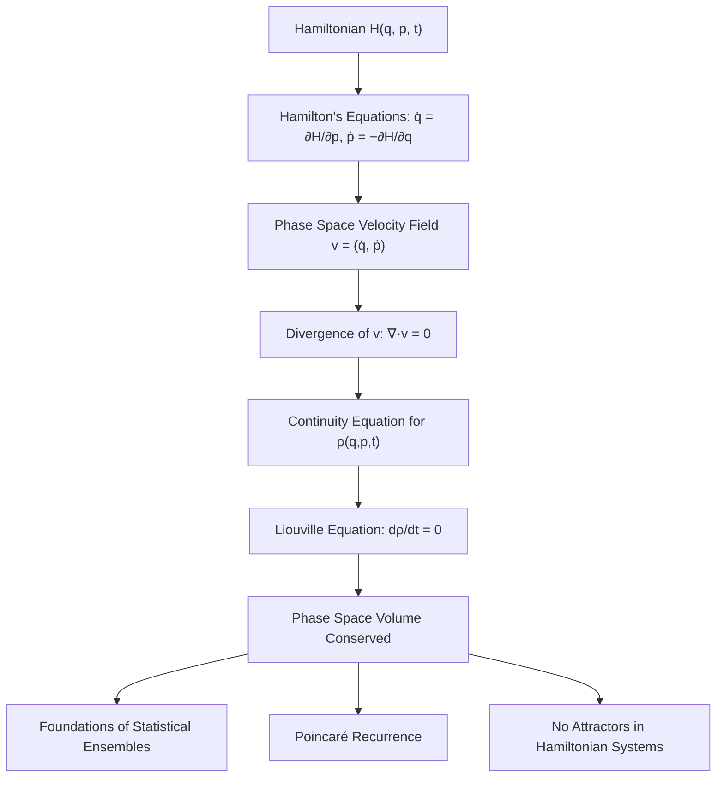

## Phase Space and Liouville's Theorem

### Overview

Phase space is the $2n$-dimensional space whose coordinates are the generalized positions and momenta $(q_1, \dots, q_n, p_1, \dots, p_n)$ of a mechanical system with $n$ degrees of freedom. Every possible instantaneous state of the system corresponds to exactly one point in this space, and the system's time evolution traces a unique trajectory through it. Liouville's theorem states that the density of an ensemble of such systems, when evolved under Hamiltonian dynamics, behaves like an incompressible fluid — the phase space volume occupied by the ensemble is conserved in time. This result is one of the deepest structural properties of classical mechanics and forms the mathematical foundation of statistical mechanics.

### Phase Space: Formal Definition

#### Configuration Space vs. Phase Space

Configuration space is the $n$-dimensional space of generalized coordinates $q_i$ alone; a point there specifies only positions, not velocities or momenta. Phase space extends this to $2n$ dimensions by including the conjugate momenta $p_i = \partial L/\partial \dot{q}_i$. This distinction matters because a single configuration-space point is consistent with infinitely many states of motion (different velocities), whereas a phase space point fully specifies the state.

#### State Determinism

Because Hamilton's equations,

$$\dot{q}_i = \frac{\partial H}{\partial p_i}, \qquad \dot{p}_i = -\frac{\partial H}{\partial q_i}$$

are first-order in time, specifying $(q_i(t_0), p_i(t_0))$ uniquely determines the entire trajectory for all $t$ (forward and backward), given sufficient regularity of $H$. A direct consequence is that **phase space trajectories never intersect**: if two trajectories crossed, the crossing point would have two different future evolutions, violating uniqueness.

#### Phase Space Volume Element

An infinitesimal volume element in phase space is:

$$d\Gamma = \prod_{i=1}^{n} dq_i \, dp_i$$

An ensemble of systems — e.g., many copies of the same physical system prepared under slightly different initial conditions — is represented by a "cloud" or "swarm" of points in phase space, characterized by a **phase space density** $\rho(q, p, t)$, such that $\rho \, d\Gamma$ gives the number (or probability) of systems in the volume element $d\Gamma$ around $(q,p)$ at time $t$.

### Phase Space Flow

#### The Phase Space Velocity Field

Each phase space point moves according to a velocity vector:

$$\mathbf{v} = (\dot{q}_1, \dots, \dot{q}_n, \dot{p}_1, \dots, \dot{p}_n)$$

with components given by Hamilton's equations. This defines a flow — analogous to a fluid velocity field — sweeping every point of phase space along its Hamiltonian trajectory.

#### Divergence of the Phase Space Flow

A central structural fact is that this velocity field is divergence-free:

$$\nabla \cdot \mathbf{v} = \sum_{i=1}^n \left( \frac{\partial \dot{q}_i}{\partial q_i} + \frac{\partial \dot{p}_i}{\partial p_i} \right) = \sum_{i=1}^n \left( \frac{\partial^2 H}{\partial q_i \partial p_i} - \frac{\partial^2 H}{\partial p_i \partial q_i} \right) = 0$$

This cancellation occurs because mixed partial derivatives commute (assuming $H$ is sufficiently smooth). The vanishing divergence is the direct mathematical signature of the incompressibility captured in Liouville's theorem.

### Liouville's Theorem

#### Statement

The phase space density $\rho(q, p, t)$, when evaluated along the trajectory of a moving phase point (i.e., using the total/convective derivative), remains constant:

$$\frac{d\rho}{dt} = 0$$

Equivalently, in local (Eulerian) form:

$$\frac{\partial \rho}{\partial t} + \sum_{i=1}^n \left( \dot{q}_i \frac{\partial \rho}{\partial q_i} + \dot{p}_i \frac{\partial \rho}{\partial p_i} \right) = 0$$

This is the **Liouville equation**, structurally identical to the continuity equation for an incompressible fluid.

#### Derivation

Starting from the continuity equation for any conserved quantity in a flow field:

$$\frac{\partial \rho}{\partial t} + \nabla \cdot (\rho \mathbf{v}) = 0$$

Expanding the divergence term:

$$\nabla \cdot (\rho \mathbf{v}) = \rho (\nabla \cdot \mathbf{v}) + \mathbf{v} \cdot \nabla \rho$$

Since $\nabla \cdot \mathbf{v} = 0$ (shown above), this reduces to:

$$\frac{\partial \rho}{\partial t} + \mathbf{v} \cdot \nabla \rho = 0 \implies \frac{d\rho}{dt} = 0$$

where $d/dt$ denotes the total derivative following the flow (the "material" or "convective" derivative).

#### Poisson Bracket Form

Using the Poisson bracket $\{f, g\} = \sum_i \left( \frac{\partial f}{\partial q_i}\frac{\partial g}{\partial p_i} - \frac{\partial f}{\partial p_i}\frac{\partial g}{\partial q_i} \right)$, the Liouville equation is written compactly as:

$$\frac{\partial \rho}{\partial t} = -\{\rho, H\}$$

This is the classical analog of the quantum Liouville-von Neumann equation for the density matrix, $i\hbar \, \partial \hat{\rho}/\partial t = [\hat{H}, \hat{\rho}]$, reinforcing the deep structural correspondence between classical and quantum statistical mechanics.

#### Volume Conservation Interpretation

An equivalent and more geometric statement: if $\Omega(t)$ is any region of phase space, and each point in $\Omega(0)$ is evolved forward in time under Hamilton's equations to form $\Omega(t)$, then the volume is preserved:

$$\text{Vol}(\Omega(t)) = \text{Vol}(\Omega(0)) \quad \text{for all } t$$

The region may stretch, twist, and distort into elaborate filamentary shapes, but its total $2n$-dimensional volume never changes. This is often summarized as: **Hamiltonian phase flow is volume-preserving (an incompressible flow in phase space)**.

### Illustrative Diagram: Volume-Preserving Distortion (svg_diagram)

<svg xmlns="http://www.w3.org/2000/svg" viewBox="0 0 460 300">
<rect width="460" height="300" fill="#ffffff" />
<text x="230" y="22" font-size="14" text-anchor="middle" font-family="sans-serif" font-weight="bold">Liouville's Theorem: Volume Preserved Under Flow (svg_diagram)</text>
<text x="90" y="45" font-size="12" text-anchor="middle" font-family="sans-serif">t = 0</text>
<rect x="50" y="60" width="80" height="80" fill="#a5d8ff" stroke="#1a5fb4" stroke-width="2" />
<text x="90" y="105" font-size="11" text-anchor="middle" font-family="sans-serif">Ω(0)</text>
<line x1="140" y1="100" x2="200" y2="100" stroke="#333" stroke-width="1.5" marker-end="url(#arrow)" />
<text x="170" y="90" font-size="11" text-anchor="middle" font-family="sans-serif">flow</text>
<text x="320" y="45" font-size="12" text-anchor="middle" font-family="sans-serif">t &gt; 0 (same area)</text>
<path d="M 260 60 C 300 50, 400 70, 410 110 C 415 140, 380 160, 340 155 C 300 150, 250 130, 255 95 Z" fill="#ffc9a5" stroke="#c64600" stroke-width="2" />
<text x="320" y="110" font-size="11" text-anchor="middle" font-family="sans-serif">Ω(t)</text>
<line x1="40" y1="220" x2="420" y2="220" stroke="#333" stroke-width="1" />
<text x="230" y="245" font-size="12" text-anchor="middle" font-family="sans-serif" fill="#555">Shape distorts (stretches/filaments), Area(Ω(0)) = Area(Ω(t))</text>
</svg>

### Consequences and Related Results

#### No Attractors in Hamiltonian Systems

Because volume is preserved, phase space regions cannot contract to points, surfaces, or lower-dimensional attractors under Hamiltonian flow. This distinguishes conservative Hamiltonian systems fundamentally from dissipative systems (e.g., damped oscillators), where phase space volumes shrink toward attractors as energy is lost.

#### Poincaré Recurrence Theorem

A direct consequence [Inference: this is a well-established theorem, but its practical relevance depends on system size and timescale] of volume conservation combined with a bounded, finite-measure phase space (e.g., bounded energy surface) is Poincaré recurrence: almost every trajectory eventually returns arbitrarily close to its initial state, given sufficient time. For macroscopic systems, this recurrence time is astronomically large and has no practical observable consequence, but it is conceptually important in the foundations of statistical mechanics (e.g., resolving Zermelo's paradox regarding irreversibility).

#### Connection to Statistical Mechanics

Liouville's theorem underlies the equilibrium ensembles of statistical mechanics:

- **Microcanonical ensemble**: uniform density $\rho$ on a constant-energy hypersurface is a stationary solution of the Liouville equation ($\partial \rho/\partial t = 0$ since $\{\rho, H\} = 0$ when $\rho$ depends only on $H$).
- **Canonical and grand canonical ensembles**: similarly built from stationary phase space densities that are functions of conserved quantities.

More generally, any density $\rho$ that is a function solely of conserved quantities (functions that Poisson-commute with $H$) is a stationary (equilibrium) solution of the Liouville equation.

#### Ergodicity

[Inference] Whether a system's trajectory eventually samples the entire accessible phase space region uniformly (ergodicity) is a separate and generally much harder property to establish than volume conservation itself; Liouville's theorem is necessary groundwork for ergodic theory but does not by itself imply ergodic behavior for a given Hamiltonian system.

### Worked Example: Free Particle in One Dimension

**Setup**: $H = p^2/(2m)$, no potential.

**Equations of motion**: $\dot{q} = p/m$, $\dot{p} = 0$

**Initial ensemble**: Consider a square region in phase space, $q_0 \in [0, a]$, $p_0 \in [0, b]$, at $t=0$, with uniform density.

**Evolution**: Since $p$ is constant for each trajectory and $q(t) = q_0 + (p_0/m)t$, the square shears into a parallelogram as time progresses (points with larger $p_0$ move further in $q$).

**Area check**: The parallelogram has base $a$ and the same perpendicular height $b$ (since shear preserves area), so:

$$\text{Area}(t) = a \times b = \text{Area}(0)$$

confirming volume (area, in this 2D phase space) conservation despite the shape distortion.

### Worked Example: Harmonic Oscillator Ensemble

**Setup**: $H = \frac{p^2}{2m} + \frac{1}{2}m\omega^2 q^2$

**Phase space trajectories**: Ellipses of constant energy, parametrized as:

$$q(t) = q_0 \cos(\omega t) + \frac{p_0}{m\omega}\sin(\omega t), \qquad p(t) = p_0\cos(\omega t) - m\omega q_0 \sin(\omega t)$$

This evolution is a **rotation** (in suitably scaled phase space coordinates $\tilde{q} = \sqrt{m\omega}\,q$, $\tilde{p} = p/\sqrt{m\omega}$), and rotations are trivially area-preserving. An initial circular or elliptical patch of phase space points rotates rigidly without distortion, offering one of the cleanest visual confirmations of Liouville's theorem: unlike the free-particle shear, the shape itself is preserved here, not merely the area.

### Liouville's Theorem vs. Entropy and Irreversibility

A frequently discussed subtlety: Liouville's theorem implies the **fine-grained** phase space density's entropy (a functional of $\rho$, such as the Gibbs entropy $-k_B\int \rho \ln \rho \, d\Gamma$) remains exactly constant in time. Yet macroscopic systems demonstrably increase in entropy (irreversibility, the second law of thermodynamics).

The resolution lies in **coarse-graining**: as the phase space region stretches into thin filaments (as in the earlier diagram), the fine-grained volume is conserved, but the region becomes so finely interleaved with its complement that any coarse-grained (finite-resolution) measurement sees an apparent increase in the occupied volume, and hence an apparent increase in entropy. [Inference] This coarse-graining argument is the standard resolution presented in most statistical mechanics texts, though the deeper foundations of irreversibility (e.g., the role of chaotic mixing, ergodicity, and the arrow of time) remain an active area of discussion in the foundations of statistical physics.

### Liouville's Theorem and Symplectic Geometry

#### Formal Restatement

In the language of symplectic geometry, phase space is a **symplectic manifold** equipped with a closed, non-degenerate 2-form:

$$\omega = \sum_i dq_i \wedge dp_i$$

Liouville's theorem is equivalent to the statement that Hamiltonian flow preserves this symplectic form, and consequently preserves the associated volume form (the $n$-fold wedge product $\omega^n$, up to a constant). This is the starting point for the broader theory of **symplectic transformations** and canonical transformations, which are precisely those phase space transformations preserving $\omega$.

#### Symplectic Integrators

[Inference] Numerical integration schemes designed to exactly preserve the symplectic structure (and hence phase space volume) — such as the leapfrog/Störmer-Verlet method or symplectic Runge-Kutta variants — are generally favored for long-time simulations of Hamiltonian systems (e.g., planetary orbit integration, molecular dynamics) because they avoid the spurious energy drift that standard (non-symplectic) integrators can exhibit over long integration times; the degree of improvement depends on the specific system, integrator, and step size chosen.

### Flow Summary Diagram

### Common Pitfalls

- **Confusing shape preservation with volume preservation**: Liouville's theorem guarantees volume (measure) is conserved, not that the shape of the phase space region stays the same — the free-particle shear example makes this distinction explicit.
- **Applying Liouville's theorem to dissipative systems**: friction, drag, and other non-Hamiltonian dissipative forces break the theorem's premises; such systems generically have phase space volume contraction and genuine attractors.
- **Equating volume conservation with ergodicity**: a divergence-free flow does not automatically imply the trajectory explores all of phase space uniformly; ergodicity is a distinct and stronger property.
- **Misapplying the theorem to non-canonical coordinates**: the divergence-free property specifically relies on $(q_i, p_i)$ being canonically conjugate pairs satisfying Hamilton's equations; arbitrary coordinate changes do not automatically preserve this property unless the transformation is canonical (symplectic).

### Related Topics

- Hamilton's equations of motion
- Canonical transformations and generating functions
- Symplectic geometry and the structure of phase space
- Poisson brackets and their algebraic properties
- Microcanonical, canonical, and grand canonical ensembles
- Ergodic theory and the ergodic hypothesis
- Poincaré recurrence theorem
- Hamilton-Jacobi theory and action-angle variables
- Symplectic numerical integrators (leapfrog, Störmer-Verlet)
- Entropy, coarse-graining, and the arrow of time in statistical mechanics