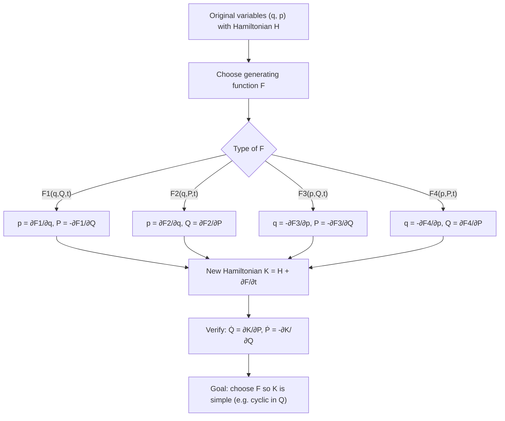

## Canonical Transformations

### Overview

Canonical transformations are changes of phase space variables $(q_i, p_i) \to (Q_i, P_i)$ that preserve the fundamental structure of Hamilton's equations. Unlike the point transformations of Lagrangian mechanics, which are restricted to transforming coordinates alone ($Q_i = Q_i(q,t)$), canonical transformations allow coordinates and momenta to mix freely, provided the new variables continue to satisfy Hamilton's canonical equations under some new Hamiltonian $K(Q,P,t)$. This flexibility makes canonical transformations one of the most powerful tools in classical mechanics, enabling the simplification of complex problems, the discovery of conserved quantities, and the transition to Hamilton-Jacobi theory.

### Definition and Motivation

#### Formal Requirement

A transformation $(q_i, p_i, t) \to (Q_i, P_i, t)$ is canonical if there exists a function $K(Q, P, t)$ such that the new variables obey Hamilton's equations:

$$\dot{Q}_i = \frac{\partial K}{\partial P_i}, \qquad \dot{P}_i = -\frac{\partial K}{\partial Q_i}$$

The function $K$ is often called the **Kamiltonian** (a conventional pun) to distinguish it from the original Hamiltonian $H$; in general $K \ne H$ expressed in new variables, though they coincide for many important cases (e.g., time-independent transformations).

#### Why Restrict to Canonical Transformations

Since Hamilton's equations encode all the dynamical content of a mechanical system, a transformation that preserves their form guarantees the new variables are equally valid dynamical variables. The goal in practice is to choose a canonical transformation cleverly so that the new Hamiltonian $K$ becomes trivial or nearly trivial (e.g., cyclic in all coordinates, or identically zero), rendering the equations of motion immediately solvable.

### The Variational Foundation

#### Modified Hamilton's Principle Requirement

Both the old and new variables must independently satisfy a modified Hamilton's principle:

$$\delta \int_{t_1}^{t_2} \left[ \sum_i p_i \dot{q}_i - H \right] dt = 0, \qquad \delta \int_{t_1}^{t_2} \left[ \sum_i P_i \dot{Q}_i - K \right] dt = 0$$

These two variational statements are compatible if the integrands differ only by a total time derivative of some function $F$ (since adding $dF/dt$ to a Lagrangian-like integrand does not affect the variational principle, as its variation vanishes at fixed endpoints):

$$\sum_i p_i \dot{q}_i - H = \sum_i P_i \dot{Q}_i - K + \frac{dF}{dt}$$

The function $F$ is called the **generating function** of the canonical transformation, and it is this single scalar function that encodes the entire transformation.

### Generating Functions: The Four Types

Since $F$ can depend on a mix of old and new variables, four standard types are conventionally distinguished, related to each other by Legendre transformations.

#### Type 1: $F_1(q, Q, t)$

$$dF_1 = \sum_i p_i \, dq_i - \sum_i P_i \, dQ_i + (K - H)\,dt$$

giving:

$$p_i = \frac{\partial F_1}{\partial q_i}, \qquad P_i = -\frac{\partial F_1}{\partial Q_i}, \qquad K = H + \frac{\partial F_1}{\partial t}$$

#### Type 2: $F_2(q, P, t)$

Obtained via Legendre transform $F_2 = F_1 + \sum_i Q_i P_i$:

$$dF_2 = \sum_i p_i \, dq_i + \sum_i Q_i \, dP_i + (K-H)\, dt$$

giving:

$$p_i = \frac{\partial F_2}{\partial q_i}, \qquad Q_i = \frac{\partial F_2}{\partial P_i}, \qquad K = H + \frac{\partial F_2}{\partial t}$$

This type is especially important since the **identity transformation** and the setup for the **Hamilton-Jacobi equation** both use $F_2$-type generating functions.

#### Type 3: $F_3(p, Q, t)$

$$dF_3 = -\sum_i q_i \, dp_i - \sum_i P_i \, dQ_i + (K-H)\, dt$$

giving:

$$q_i = -\frac{\partial F_3}{\partial p_i}, \qquad P_i = -\frac{\partial F_3}{\partial Q_i}, \qquad K = H + \frac{\partial F_3}{\partial t}$$

#### Type 4: $F_4(p, P, t)$

$$dF_4 = -\sum_i q_i \, dp_i + \sum_i Q_i \, dP_i + (K-H)\, dt$$

giving:

$$q_i = -\frac{\partial F_4}{\partial p_i}, \qquad Q_i = \frac{\partial F_4}{\partial P_i}, \qquad K = H + \frac{\partial F_4}{\partial t}$$

#### Summary Table

| Type | Function | Old momentum | New momentum/coordinate | Common use |
| --- | --- | --- | --- | --- |
| $F_1$ | $F_1(q,Q,t)$ | $p_i = \partial F_1/\partial q_i$ | $P_i = -\partial F_1/\partial Q_i$ | Coordinate-coordinate mixing |
| $F_2$ | $F_2(q,P,t)$ | $p_i = \partial F_2/\partial q_i$ | $Q_i = \partial F_2/\partial P_i$ | Identity transform, Hamilton-Jacobi |
| $F_3$ | $F_3(p,Q,t)$ | $q_i = -\partial F_3/\partial p_i$ | $P_i = -\partial F_3/\partial Q_i$ | Momentum-coordinate mixing |
| $F_4$ | $F_4(p,P,t)$ | $q_i = -\partial F_4/\partial p_i$ | $Q_i = \partial F_4/\partial P_i$ | Momentum-momentum mixing |

### Worked Example: The Identity and Coordinate-Momentum Swap

#### Identity Transformation

Take $F_2 = \sum_i q_i P_i$. Then:

$$p_i = \frac{\partial F_2}{\partial q_i} = P_i, \qquad Q_i = \frac{\partial F_2}{\partial P_i} = q_i$$

confirming $Q_i = q_i$, $P_i = p_i$ — the identity, as expected.

#### The Coordinate-Momentum Interchange

Take $F_1 = \sum_i q_i Q_i$. Then:

$$p_i = \frac{\partial F_1}{\partial q_i} = Q_i, \qquad P_i = -\frac{\partial F_1}{\partial Q_i} = -q_i$$

So $Q_i = p_i$ and $P_i = -q_i$. This remarkable result shows that **coordinates and momenta play a symmetric, interchangeable role** in Hamiltonian mechanics — there is no intrinsic distinction between "position-like" and "momentum-like" variables, only convention. This symmetry is a hallmark feature absent from Lagrangian mechanics.

### Worked Example: Harmonic Oscillator via Canonical Transformation

**Setup**: $H = \dfrac{p^2}{2m} + \dfrac{1}{2}m\omega^2 q^2$

**Goal**: Find a canonical transformation that makes $H$ cyclic in the new coordinate (so the new momentum is conserved and the new coordinate evolves linearly in time).

**Generating function** (Type 1):

$$F_1(q, Q) = \frac{1}{2}m\omega q^2 \cot Q$$

**Derived relations**:

$$p = \frac{\partial F_1}{\partial q} = m\omega q \cot Q, \qquad P = -\frac{\partial F_1}{\partial Q} = \frac{m\omega q^2}{2\sin^2 Q}$$

Solving for $q$ and $p$ in terms of $Q, P$:

$$q = \sqrt{\frac{2P}{m\omega}}\sin Q, \qquad p = \sqrt{2m\omega P}\cos Q$$

**New Hamiltonian**:

$$K = H = \frac{p^2}{2m} + \frac{1}{2}m\omega^2 q^2 = \omega P \cos^2 Q + \omega P \sin^2 Q = \omega P$$

Since $K = \omega P$ is cyclic in $Q$:

$$\dot{P} = -\frac{\partial K}{\partial Q} = 0 \implies P = \text{constant} = \frac{E}{\omega}$$

$$\dot{Q} = \frac{\partial K}{\partial P} = \omega \implies Q(t) = \omega t + Q_0$$

This directly yields the oscillator's solution $q(t) = \sqrt{2E/(m\omega^2)}\sin(\omega t + Q_0)$ without integrating a differential equation directly — the new variable $P$ is (up to a constant) the **action variable**, and $Q$ the corresponding **angle variable**, foreshadowing action-angle methods.

### Conditions for a Transformation to Be Canonical

#### Direct (Poisson Bracket) Condition

A transformation is canonical if and only if it preserves the fundamental Poisson bracket relations:

$$\{Q_i, Q_j\}_{q,p} = 0, \qquad \{P_i, P_j\}_{q,p} = 0, \qquad \{Q_i, P_j\}_{q,p} = \delta_{ij}$$

where the brackets are evaluated with respect to the original variables $(q,p)$.

#### Symplectic Condition

Writing $\eta = (q_1, \dots, q_n, p_1, \dots, p_n)^T$ and $\zeta = (Q_1, \dots, Q_n, P_1, \dots, P_n)^T$, define the Jacobian matrix $M_{ij} = \partial \zeta_i / \partial \eta_j$. The transformation is canonical if and only if:

$$M^T J M = J, \qquad J = \begin{pmatrix} 0 & I \\ -I & 0 \end{pmatrix}$$

where $J$ is the standard symplectic matrix. This is precisely the condition for $M$ to be a **symplectic matrix**, linking canonical transformations directly to symplectic geometry.

#### Invariance of Poisson Brackets (General)

More generally, canonical transformations preserve *all* Poisson brackets, not just the fundamental ones:

$$\{f, g\}_{q,p} = \{f, g\}_{Q,P}$$

for any two phase-space functions $f, g$. This invariance is the deeper reason canonical transformations preserve the form of Hamilton's equations, since the equations of motion can themselves be written entirely in Poisson bracket form.

### Infinitesimal Canonical Transformations

#### Construction

Consider $F_2 = \sum_i q_i P_i + \epsilon G(q, P, t)$ for infinitesimal parameter $\epsilon$, where $G$ is called the **generator** of the transformation:

$$Q_i = q_i + \epsilon \frac{\partial G}{\partial p_i}, \qquad P_i = p_i - \epsilon \frac{\partial G}{\partial q_i}$$

(to first order in $\epsilon$, using $P \approx p$ inside the small correction terms).

#### Connection to Conservation Laws

If $G$ is taken to be the Hamiltonian itself and $\epsilon = dt$, the infinitesimal canonical transformation becomes:

$$Q_i = q_i + \dot{q}_i \, dt, \qquad P_i = p_i + \dot{p}_i \, dt$$

which is simply the actual time evolution of the system over $dt$. This reveals a profound insight: **the dynamical time evolution of a Hamiltonian system is itself a continuous sequence of canonical transformations, generated by $H$**. Momentum is the generator of spatial translations, angular momentum the generator of rotations, and the Hamiltonian is the generator of time translations — establishing the direct link between symmetries, generating functions, and Noether's theorem.

#### Change in a Function Under an Infinitesimal Canonical Transformation

For any phase space function $u(q,p)$:

$$\delta u = \epsilon \{u, G\}$$

Setting $G = H$ and $\epsilon = dt$ recovers $du/dt = \{u, H\}$, consistent with the Poisson bracket form of Hamilton's equations.

### Diagram: Canonical Transformation Workflow

### Applications and Significance

#### Hamilton-Jacobi Theory

The canonical transformation framework reaches its most powerful application in Hamilton-Jacobi theory, where a Type 2 generating function $S(q, P, t)$ (the **Hamilton's principal function**) is sought such that the new Hamiltonian $K$ is identically zero. This reduces solving the equations of motion to solving a single first-order partial differential equation (the Hamilton-Jacobi equation), with the new coordinates and momenta becoming constants of the motion by construction.

#### Action-Angle Variables

As demonstrated in the harmonic oscillator example, canonical transformations to action-angle variables $(Q, P) \to (\theta, J)$ are central to perturbation theory in celestial mechanics and to the old quantum theory (Bohr-Sommerfeld quantization), where the action variable $J = \oint p \, dq$ plays a privileged role.

#### Perturbation Theory

Canonical transformations underlie classical perturbation theory (e.g., von Zeipel and Lie-series methods), where a nearly-integrable Hamiltonian is transformed order-by-order to eliminate unwanted coupling terms, essential in celestial mechanics for computing planetary orbit corrections.

#### Bridge to Quantum Mechanics

The Poisson bracket relations $\{q_i, p_j\} = \delta_{ij}$ preserved under canonical transformations map directly onto the canonical commutation relations $[\hat{q}_i, \hat{p}_j] = i\hbar\,\delta_{ij}$ of quantum mechanics, and canonical transformations correspond to unitary transformations (changes of basis/representation) in the quantum theory.

### Common Pitfalls

- **Assuming any coordinate change is canonical**: only point transformations that preserve the specific Poisson bracket/symplectic structure qualify; an arbitrary mixing of $q$ and $p$ is generally not canonical.
- **Forgetting the time-dependence correction**: when the generating function $F$ has explicit time dependence, $K \ne H$ in general — the relation $K = H + \partial F/\partial t$ must be applied.
- **Mismatching generating function type and given variables**: attempting to compute $\partial F_1/\partial P_i$ (a Type-2 relation) using a Type-1 function is inconsistent; each $F$ type has independent variables and the correct partial derivatives must be used.
- **Overlooking that the transformation must be invertible**: for $F_2(q,P,t)$ to properly define $Q_i(q,p,t)$, the Hessian $\partial^2 F_2/\partial q_i \partial P_j$ must be non-singular (an implicit regularity condition, analogous to that required for the Legendre transform from $L$ to $H$).

### Related Topics

- Hamilton-Jacobi equation and Hamilton's principal/characteristic function
- Action-angle variables and adiabatic invariants
- Symplectic geometry and symplectic matrices
- Poisson brackets and their invariance properties
- Generators of symmetry transformations and Noether's theorem
- Classical perturbation theory (von Zeipel, Lie-series methods)
- Liouville's theorem and phase space volume
- Canonical quantization and unitary transformations in quantum mechanics
- Integrable systems and the Arnold-Liouville theorem