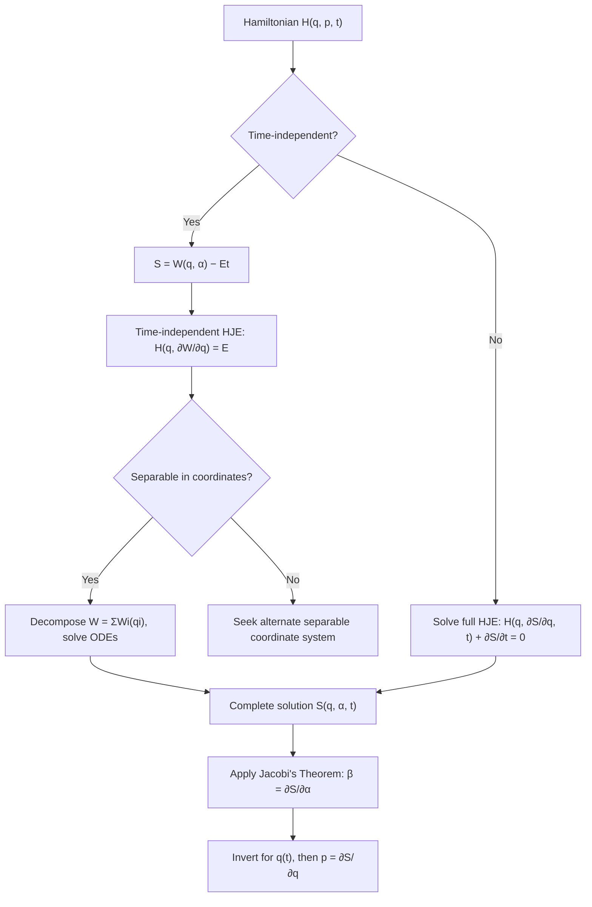

## Hamilton-Jacobi Theory

### Overview

Hamilton-Jacobi theory reformulates classical mechanics as a single first-order, generally nonlinear partial differential equation for a scalar function called Hamilton's principal function. Rather than solving $2n$ coupled ordinary differential equations (Hamilton's equations), the problem is reduced to finding a complete solution of one partial differential equation in $n+1$ variables. This approach represents the most complete unification of classical mechanics achieved before quantum mechanics, and it directly inspired Schrödinger's development of wave mechanics.

### Conceptual Foundation

#### Goal: A Canonical Transformation to Trivial Dynamics

Building on canonical transformation theory, the central idea is to seek a canonical transformation $(q_i, p_i) \to (Q_i, P_i)$ generated by a function $S(q, P, t)$ (a Type-2 generating function) such that the new Hamiltonian $K$ vanishes identically:

$$K(Q, P, t) = 0$$

If $K \equiv 0$, Hamilton's equations in the new variables become trivial:

$$\dot{Q}_i = \frac{\partial K}{\partial P_i} = 0, \qquad \dot{P}_i = -\frac{\partial K}{\partial Q_i} = 0$$

so both $Q_i$ and $P_i$ are constants of the motion. All the dynamical content of the problem is absorbed into the transformation itself, encoded in the generating function $S$.

### Derivation of the Hamilton-Jacobi Equation

#### Setting Up the Generating Function

Using the Type-2 relation $K = H + \partial F_2/\partial t$ with $F_2 \equiv S(q, P, t)$, the requirement $K = 0$ gives:

$$H\left(q_1, \dots, q_n, \frac{\partial S}{\partial q_1}, \dots, \frac{\partial S}{\partial q_n}, t\right) + \frac{\partial S}{\partial t} = 0$$

using the Type-2 relation $p_i = \partial S/\partial q_i$ to substitute for the momenta. This is the **Hamilton-Jacobi equation (HJE)**:

$$H\left(q_i, \frac{\partial S}{\partial q_i}, t\right) + \frac{\partial S}{\partial t} = 0$$

$S$ is called **Hamilton's principal function**. It is a first-order PDE in $n+1$ independent variables ($q_1, \dots, q_n, t$), generally nonlinear because $H$ typically depends quadratically (or otherwise nonlinearly) on the momenta.

#### Complete Solution

A **complete solution** (or complete integral) of the HJE is one containing $n$ independent, non-additive constants of integration $\alpha_1, \dots, \alpha_n$:

$$S = S(q_1, \dots, q_n, \alpha_1, \dots, \alpha_n, t)$$

By construction, the new momenta $P_i$ are naturally identified with these constants: $P_i = \alpha_i$. Note that a complete solution is far more restrictive than the general solution of the PDE — it is precisely what is needed to fully determine the dynamics, per Jacobi's theorem below.

### Jacobi's Theorem

#### Statement

Given a complete solution $S(q_i, \alpha_i, t)$ of the Hamilton-Jacobi equation, the equations of motion of the original system are obtained implicitly from:

$$\beta_i = \frac{\partial S}{\partial \alpha_i}, \qquad p_i = \frac{\partial S}{\partial q_i}$$

where $\beta_i$ are new constants (identified with $Q_i$). The first set of $n$ equations can, in principle, be inverted to give $q_i(t; \alpha, \beta)$, and substituting into the second set gives $p_i(t; \alpha, \beta)$.

#### Why This Works

Because $S$ generates a canonical transformation to variables in which $Q_i = \beta_i$ and $P_i = \alpha_i$ are both constant, and because $\dot{Q}_i = \partial K/\partial P_i = 0$ trivially, the relations $\beta_i = \partial S/\partial \alpha_i$ hold at all times — they are the constants of integration of the original dynamical problem, expressed implicitly in terms of $q_i(t)$.

### The Time-Independent Case: Hamilton's Characteristic Function

#### Separating Out the Time Dependence

When $H$ has no explicit time dependence ($\partial H/\partial t = 0$), $H$ itself is conserved and equals a constant, conventionally $\alpha_1 = E$ (the energy). In this case, $S$ separates as:

$$S(q_i, \alpha_i, t) = W(q_i, \alpha_i) - Et$$

where $W$ is **Hamilton's characteristic function**, satisfying the **time-independent Hamilton-Jacobi equation**:

$$H\left(q_i, \frac{\partial W}{\partial q_i}\right) = E$$

This is now a PDE in the $n$ spatial variables $q_i$ only (no explicit time), typically far more tractable.

#### Physical Interpretation of W

$W$ satisfies $p_i = \partial W/\partial q_i$, and geometrically, surfaces of constant $W$ in configuration space are analogous to wavefronts, with $p_i$ playing the role of a "wave normal" direction scaled by "wave momentum" — this is precisely the mechanical analog Hamilton originally exploited from geometric optics (surfaces of constant phase, rays as trajectories orthogonal to those surfaces).

### Separation of Variables

#### General Strategy

The Hamilton-Jacobi equation becomes tractable when it admits **separation of variables**: assuming

$$S = \sum_i S_i(q_i, \alpha_1, \dots, \alpha_n, t)$$

(a sum of functions each depending on only one coordinate) reduces the PDE to a set of $n$ decoupled ordinary differential equations. A coordinate system in which this separation is possible is called a system of **separable coordinates** for the given problem — not every coordinate choice works, and finding a separable set is often the crux of solving a problem via this method.

#### Condition for Separability (Cyclic Coordinates)

If $q_k$ is cyclic (absent from $H$), then $S_k = \alpha_k q_k$ trivially, since $\partial S_k/\partial q_k = \alpha_k$ = constant momentum. More generally, separability can occur even for non-cyclic coordinates if the Hamiltonian has a suitable additive or multiplicative structure in that variable (e.g., the radial equation in central-force problems, which separates due to the specific $1/r^2$ structure of the angular momentum term).

### Worked Example: Free Particle

**Hamiltonian**: $H = \dfrac{p^2}{2m}$ (one dimension)

**Time-independent HJE**:

$$\frac{1}{2m}\left(\frac{dW}{dq}\right)^2 = E \implies \frac{dW}{dq} = \sqrt{2mE}$$

**Integrating**:

$$W(q, E) = \sqrt{2mE}\, q$$

$$S(q, E, t) = \sqrt{2mE}\, q - Et$$

**Applying Jacobi's theorem** ($\beta = \partial S/\partial E$):

$$\beta = \sqrt{\frac{m}{2E}}\, q - t \implies q(t) = \sqrt{\frac{2E}{m}}(t + \beta)$$

Identifying $\sqrt{2E/m} = v$ (the constant velocity) recovers the expected uniform motion $q(t) = v(t+\beta)$, with $p = \partial S/\partial q = \sqrt{2mE} = mv$, as expected.

### Worked Example: Simple Harmonic Oscillator

**Hamiltonian**: $H = \dfrac{p^2}{2m} + \dfrac{1}{2}m\omega^2 q^2$

**Time-independent HJE**:

$$\frac{1}{2m}\left(\frac{dW}{dq}\right)^2 + \frac{1}{2}m\omega^2 q^2 = E$$

**Solving for $dW/dq$**:

$$\frac{dW}{dq} = \sqrt{2mE - m^2\omega^2 q^2}$$

**Integrating**:

$$W = \int \sqrt{2mE - m^2\omega^2 q^2}\, dq$$

**Applying Jacobi's theorem**:

$$\beta = \frac{\partial S}{\partial E} = \frac{\partial W}{\partial E} - t = \int \frac{m \, dq}{\sqrt{2mE - m^2\omega^2 q^2}} - t$$

Evaluating the integral (a standard form):

$$\beta + t = \frac{1}{\omega}\arcsin\left(q\sqrt{\frac{m\omega^2}{2E}}\right)$$

Solving for $q(t)$:

$$q(t) = \sqrt{\frac{2E}{m\omega^2}}\sin\big(\omega(t + \beta)\big)$$

This recovers the standard SHM solution directly from the Hamilton-Jacobi equation, with amplitude $\sqrt{2E/(m\omega^2)}$ set by the energy, consistent with the earlier action-angle treatment via canonical transformations.

### Worked Example: The Kepler Problem (Central Force)

**Hamiltonian** (polar coordinates, planar motion):

$$H = \frac{1}{2m}\left(p_r^2 + \frac{p_\theta^2}{r^2}\right) - \frac{k}{r} = E$$

**Separation ansatz**: $W(r,\theta) = W_r(r) + W_\theta(\theta)$

**Time-independent HJE**:

$$\frac{1}{2m}\left(\frac{dW_r}{dr}\right)^2 + \frac{1}{2mr^2}\left(\frac{dW_\theta}{d\theta}\right)^2 - \frac{k}{r} = E$$

Since $\theta$ is cyclic, $dW_\theta/d\theta = \alpha_\theta$ (a constant, the angular momentum $\ell$), giving:

$$\frac{1}{2m}\left(\frac{dW_r}{dr}\right)^2 + \frac{\ell^2}{2mr^2} - \frac{k}{r} = E$$

**Solving for the radial derivative**:

$$\frac{dW_r}{dr} = \sqrt{2mE + \frac{2mk}{r} - \frac{\ell^2}{r^2}}$$

This separates the two-dimensional problem into two independent one-dimensional integrals, ultimately yielding the standard Kepler orbit equations (ellipses, parabolas, or hyperbolas depending on the sign of $E$) after evaluating the resulting integrals and applying Jacobi's theorem — a calculation central to classical orbital mechanics.

### Diagram: Hamilton-Jacobi Solution Workflow

### Relation to Other Formulations

#### Comparison of Solution Methods

| Method | Type of equations | Order | Number of equations | Typical difficulty |
| --- | --- | --- | --- | --- |
| Newtonian | ODEs | 2nd | $n$ | Direct but often coupled |
| Lagrangian | ODEs | 2nd | $n$ | Systematic via $L$ |
| Hamiltonian (canonical) | ODEs | 1st | $2n$ | Systematic via $H$, phase space insight |
| Hamilton-Jacobi | PDE | 1st | 1 (in $n+1$ variables) | Hard in general; powerful when separable |

#### Connection to Action-Angle Variables

When the HJE is fully separable and the motion is periodic (bounded, e.g., for bound Kepler orbits or the harmonic oscillator), Hamilton's characteristic function directly provides the basis for constructing **action-angle variables**, with the action defined as:

$$J_i = \oint p_i \, dq_i = \oint \frac{\partial W}{\partial q_i}\, dq_i$$

integrated over one full period of the corresponding degree of freedom. This connects Hamilton-Jacobi theory directly to adiabatic invariants and perturbation theory.

### Optical-Mechanical Analogy

Hamilton originally developed this theory by drawing an analogy between mechanics and geometrical optics: Hamilton's characteristic function $W$ plays the role of the optical path length, and trajectories of particles correspond to light rays, which are always orthogonal to surfaces of constant $W$ (wavefronts). This analogy is not merely heuristic — it is mathematically precise in the eikonal (short-wavelength) limit of wave optics, and it was this exact correspondence that Schrödinger exploited when constructing wave mechanics: replacing the mechanical "wavefront" picture with an actual wave equation, using the substitution suggested by the eikonal approximation to the Hamilton-Jacobi equation, led directly to the time-independent Schrödinger equation in the classical limit.

### Significance for Quantum Mechanics

[Inference] The historical and structural connection between the Hamilton-Jacobi equation and the Schrödinger equation is well documented in standard references on the foundations of quantum mechanics, though the precise philosophical interpretation of this correspondence (e.g., as a "derivation" versus a "suggestive analogy") varies somewhat across textbook treatments. Formally, writing the quantum wavefunction as $\psi = e^{iS/\hbar}$ and substituting into the Schrödinger equation, then taking the formal limit $\hbar \to 0$, reproduces the classical Hamilton-Jacobi equation — establishing $S$ as the classical limit of the quantum phase.

### Common Pitfalls

- **Confusing a complete solution with the general solution**: Jacobi's theorem specifically requires a complete solution (with $n$ independent constants $\alpha_i$), not just any solution of the PDE.
- **Forgetting the sign/definition convention for $W$ vs. $S$**: different textbooks use varying sign conventions for the separation $S = W - Et$; care must be taken when cross-referencing sources.
- **Assuming separability always exists**: many systems (especially those exhibiting chaotic dynamics) do not admit any separable coordinate system, making the Hamilton-Jacobi method inapplicable in closed form for those problems.
- **Treating HJE solving as easier than solving Hamilton's equations directly**: for many practical problems, the nonlinear PDE is harder to solve than the corresponding ODEs; the HJE's power lies in structural insight, exact solubility for separable/integrable systems, and its bridge to quantum mechanics, not universal computational ease.

### Related Topics

- Canonical transformations and generating functions
- Action-angle variables and adiabatic invariants
- Separation of variables in classical mechanics
- Integrable systems and the Liouville-Arnold theorem
- Classical perturbation theory
- Geometric/eikonal optics and the optical-mechanical analogy
- The correspondence between the Hamilton-Jacobi equation and the Schrödinger equation
- Kepler problem and central force motion
- WKB approximation in quantum mechanics