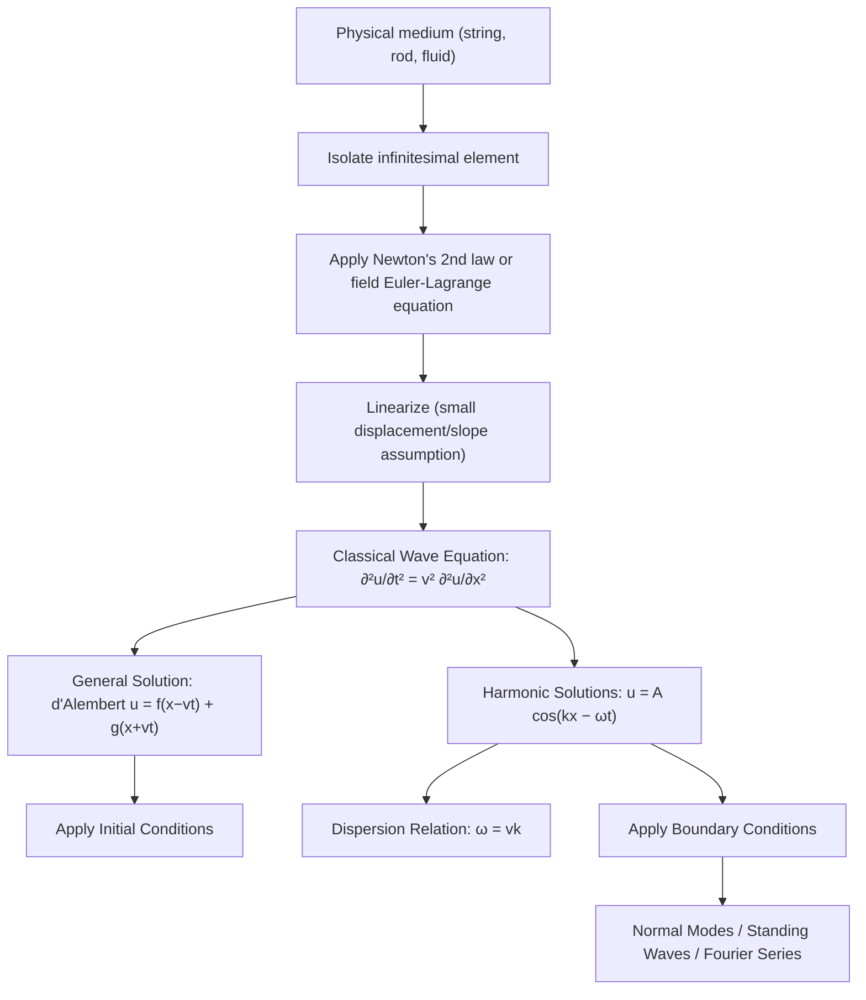

## The Mechanical Wave Equation

### Overview

The mechanical wave equation is a second-order linear partial differential equation that describes the propagation of disturbances through a deformable medium, such as a stretched string, an elastic solid, or a fluid. It emerges directly from applying Newton's second law (or an equivalent variational principle) to an infinitesimal element of the medium, and its solutions describe how displacement, pressure, or other physical quantities propagate as waves with a characteristic speed determined by the medium's material properties.

### The Classical Wave Equation

#### General Form

In one spatial dimension, the wave equation for a displacement field $u(x,t)$ is:

$$\frac{\partial^2 u}{\partial t^2} = v^2 \frac{\partial^2 u}{\partial x^2}$$

where $v$ is the wave propagation speed, determined by the medium's properties (not the speed of any individual particle in the medium). In three dimensions, this generalizes to:

$$\frac{\partial^2 u}{\partial t^2} = v^2 \nabla^2 u$$

where $\nabla^2$ is the Laplacian operator.

### Derivation: The Vibrating String

#### Physical Setup

Consider a string of linear mass density $\mu$ (mass per unit length) under uniform tension $T$, stretched along the $x$-axis, with small transverse displacements $u(x,t)$ from equilibrium. The derivation assumes:

- The displacement $u$ and its slope $\partial u/\partial x$ are small (linearization, allowing $\sin\theta \approx \tan\theta \approx \theta$)
- Tension $T$ is uniform along the string and constant in time
- Gravity and damping are neglected (idealized case)

#### Force Balance on an Element

Consider a small string element between $x$ and $x + dx$, with mass $dm = \mu\, dx$. The net transverse force arises from the difference in the vertical components of tension at the two ends:

$$F_{\text{net}} = T\sin\theta(x+dx) - T\sin\theta(x)$$

Using the small-angle approximation, $\sin\theta \approx \tan\theta = \partial u/\partial x$:

$$F_{\text{net}} \approx T\left[\frac{\partial u}{\partial x}\bigg|_{x+dx} - \frac{\partial u}{\partial x}\bigg|_{x}\right] = T\frac{\partial^2 u}{\partial x^2}\, dx$$

#### Applying Newton's Second Law

Setting $F_{\text{net}} = dm \cdot a = \mu\, dx \cdot \dfrac{\partial^2 u}{\partial t^2}$:

$$\mu \, dx \, \frac{\partial^2 u}{\partial t^2} = T \frac{\partial^2 u}{\partial x^2}\, dx$$

Dividing through by $dx$:

$$\frac{\partial^2 u}{\partial t^2} = \frac{T}{\mu}\frac{\partial^2 u}{\partial x^2}$$

Comparing to the standard wave equation form identifies the wave speed:

$$v = \sqrt{\frac{T}{\mu}}$$

This result shows explicitly how wave speed depends on the medium: higher tension increases speed, while higher linear density decreases it — consistent with physical intuition (a taut, light string transmits disturbances faster than a slack, heavy one).

### Derivation via Lagrangian Density (Field-Theoretic Approach)

#### The Continuous Lagrangian

For the vibrating string, the kinetic and potential energy densities are:

$$\mathcal{T} = \frac{1}{2}\mu\left(\frac{\partial u}{\partial t}\right)^2, \qquad \mathcal{V} = \frac{1}{2}T\left(\frac{\partial u}{\partial x}\right)^2$$

giving the Lagrangian density:

$$\mathcal{L} = \mathcal{T} - \mathcal{V} = \frac{1}{2}\mu\left(\frac{\partial u}{\partial t}\right)^2 - \frac{1}{2}T\left(\frac{\partial u}{\partial x}\right)^2$$

#### Euler-Lagrange Equation for Fields

For a field $u(x,t)$ described by a Lagrangian density $\mathcal{L}(u, \partial u/\partial t, \partial u/\partial x)$, the field-theoretic Euler-Lagrange equation is:

$$\frac{\partial}{\partial t}\left(\frac{\partial \mathcal{L}}{\partial (\partial u/\partial t)}\right) + \frac{\partial}{\partial x}\left(\frac{\partial \mathcal{L}}{\partial (\partial u/\partial x)}\right) - \frac{\partial \mathcal{L}}{\partial u} = 0$$

Substituting $\mathcal{L}$:

$$\frac{\partial}{\partial t}(\mu \dot{u}) + \frac{\partial}{\partial x}(-Tu') = 0 \implies \mu \ddot{u} - Tu'' = 0$$

which reproduces $\ddot{u} = (T/\mu)u''$, confirming the field-theoretic and Newtonian derivations agree. This approach generalizes naturally to more complex media and to relativistic field theory.

### General Solution: d'Alembert's Method

#### The d'Alembert Solution

The general solution to the one-dimensional wave equation is:

$$u(x,t) = f(x - vt) + g(x + vt)$$

where $f$ and $g$ are arbitrary (twice-differentiable) functions determined by initial/boundary conditions. Physically, $f(x-vt)$ represents a disturbance of fixed shape traveling in the $+x$ direction with speed $v$, and $g(x+vt)$ represents one traveling in the $-x$ direction, with **no change of shape** (a consequence of linearity and non-dispersive propagation).

#### Verification

Direct substitution confirms this satisfies the wave equation: letting $\xi = x - vt$,

$$\frac{\partial^2 f}{\partial t^2} = v^2 f''(\xi), \qquad \frac{\partial^2 f}{\partial x^2} = f''(\xi)$$

so $\partial^2 f/\partial t^2 = v^2\, \partial^2 f/\partial x^2$ automatically, and identically for $g(x+vt)$.

#### Initial Value Problem

Given initial conditions $u(x,0) = \phi(x)$ and $\partial u/\partial t(x,0) = \psi(x)$, d'Alembert's formula gives the explicit solution:

$$u(x,t) = \frac{1}{2}\left[\phi(x-vt) + \phi(x+vt)\right] + \frac{1}{2v}\int_{x-vt}^{x+vt} \psi(s)\, ds$$

### Illustrative Diagram: Traveling Wave Decomposition (svg_diagram)

<svg xmlns="http://www.w3.org/2000/svg" viewBox="0 0 460 260">
<rect width="460" height="260" fill="#ffffff" />
<text x="230" y="20" font-size="14" text-anchor="middle" font-family="sans-serif" font-weight="bold">d'Alembert Decomposition (svg_diagram)</text>
<line x1="30" y1="130" x2="430" y2="130" stroke="#333" stroke-width="1" />
<path d="M 60 130 Q 90 90, 120 130 T 180 130" fill="none" stroke="#1a5fb4" stroke-width="2.5" />
<text x="120" y="150" font-size="11" text-anchor="middle" font-family="sans-serif" fill="#1a5fb4">f(x − vt) →</text>
<path d="M 280 130 Q 310 170, 340 130 T 400 130" fill="none" stroke="#c64600" stroke-width="2.5" />
<text x="340" y="195" font-size="11" text-anchor="middle" font-family="sans-serif" fill="#c64600">← g(x + vt)</text>
<line x1="150" y1="105" x2="185" y2="105" stroke="#1a5fb4" stroke-width="2" marker-end="url(#arr1)" />
<line x1="330" y1="155" x2="295" y2="155" stroke="#c64600" stroke-width="2" marker-end="url(#arr2)" />
<text x="230" y="235" font-size="12" text-anchor="middle" font-family="sans-serif" fill="#555">u(x,t) = f(x−vt) + g(x+vt): superposition of counter-propagating shapes</text>
</svg>

### Harmonic (Sinusoidal) Solutions

#### Traveling Harmonic Wave

A particularly important special case is the sinusoidal traveling wave:

$$u(x,t) = A\cos(kx - \omega t + \phi)$$

where $A$ is amplitude, $k = 2\pi/\lambda$ is the wavenumber, $\omega = 2\pi f$ is the angular frequency, and $\phi$ is a phase constant. Substituting into the wave equation requires:

$$\omega^2 = v^2 k^2 \implies v = \frac{\omega}{k} = \lambda f$$

This is the **dispersion relation** for the non-dispersive wave equation: it is linear in $k$, meaning all frequencies travel at the same speed $v$ (no dispersion). This property is what allows d'Alembert's shape-preserving traveling wave solutions to exist.

#### Standing Waves

A superposition of two counter-propagating harmonic waves of equal amplitude produces a standing wave:

$$u(x,t) = A\cos(kx-\omega t) + A\cos(kx + \omega t) = 2A\cos(kx)\cos(\omega t)$$

This solution has fixed spatial nodes (points where $\cos(kx) = 0$, hence $u=0$ for all $t$) and antinodes, characteristic of resonance phenomena in bounded systems (e.g., a string fixed at both ends).

### Boundary Conditions and Normal Modes

#### Fixed-Fixed String (e.g., Guitar/Violin String)

For a string of length $L$ fixed at both ends ($u(0,t) = u(L,t) = 0$), separable solutions of the form $u(x,t) = X(x)T(t)$ lead to quantized spatial modes:

$$X_n(x) = \sin\left(\frac{n\pi x}{L}\right), \qquad n = 1, 2, 3, \dots$$

with corresponding discrete frequencies:

$$f_n = \frac{n v}{2L} = \frac{n}{2L}\sqrt{\frac{T}{\mu}}$$

The $n=1$ mode is the **fundamental**, and $n \ge 2$ modes are **overtones** (harmonics), forming the physical basis of musical pitch and timbre for stringed instruments.

#### General Solution as a Sum of Normal Modes

The complete solution satisfying the boundary conditions is a Fourier series:

$$u(x,t) = \sum_{n=1}^{\infty} \left[a_n \cos(\omega_n t) + b_n \sin(\omega_n t)\right]\sin\left(\frac{n\pi x}{L}\right)$$

with $\omega_n = n\pi v/L$, and coefficients $a_n, b_n$ determined by the specific initial displacement and velocity profiles via standard Fourier analysis.

### Energy in a Mechanical Wave

#### Energy Density

For a wave on a string, the total mechanical energy per unit length combines kinetic and elastic potential contributions:

$$\varepsilon = \frac{1}{2}\mu\left(\frac{\partial u}{\partial t}\right)^2 + \frac{1}{2}T\left(\frac{\partial u}{\partial x}\right)^2$$

For a traveling harmonic wave, both terms are equal on time-average, giving average energy density $\langle \varepsilon \rangle = \frac{1}{2}\mu\omega^2 A^2$.

#### Power Transmitted

The average power carried by a traveling wave is:

$$\langle P \rangle = \frac{1}{2}\mu\omega^2 A^2 v = \frac{1}{2}\sqrt{\mu T}\,\omega^2 A^2$$

showing that wave power scales with the square of both amplitude and frequency — a general feature of oscillatory wave transport of energy.

### Extension to Other Mechanical Waves

#### Longitudinal Waves in a Solid Rod

For longitudinal (compressional) displacement $u(x,t)$ in an elastic rod of Young's modulus $Y$ and density $\rho$, an analogous derivation (using Hooke's law, $F = YA\, \partial u/\partial x$, applied to a rod element) gives the same wave equation form with:

$$v = \sqrt{\frac{Y}{\rho}}$$

#### Sound Waves in a Fluid (Longitudinal Pressure Waves)

For pressure/density perturbations in a fluid of bulk modulus $B$ and equilibrium density $\rho_0$, the acoustic wave equation for pressure perturbation $p'(x,t)$ has the same form, with:

$$v = \sqrt{\frac{B}{\rho_0}}$$

For an ideal gas undergoing adiabatic compressions (the standard assumption for sound propagation), $B = \gamma P_0$ (with $\gamma$ the adiabatic index and $P_0$ equilibrium pressure), giving the familiar result $v = \sqrt{\gamma P_0/\rho_0} = \sqrt{\gamma R T/M}$ for an ideal gas of molar mass $M$ at temperature $T$.

#### Transverse Waves on a Membrane (2D Generalization)

For a stretched membrane (2D analog of a string) with surface tension $\sigma$ and areal mass density $\sigma_m$, the wave equation generalizes to:

$$\frac{\partial^2 u}{\partial t^2} = v^2\left(\frac{\partial^2 u}{\partial x^2} + \frac{\partial^2 u}{\partial y^2}\right), \qquad v = \sqrt{\frac{\sigma}{\sigma_m}}$$

relevant to drumheads and other 2D vibrating systems, where normal modes are characterized by two mode numbers rather than one.

### Comparison Table: Wave Speed by Medium

| Medium/Wave type | Restoring mechanism | Wave speed formula | Governing quantities |
| --- | --- | --- | --- |
| String (transverse) | Tension | $v = \sqrt{T/\mu}$ | Tension $T$, linear density $\mu$ |
| Solid rod (longitudinal) | Elastic (Young's modulus) | $v = \sqrt{Y/\rho}$ | Young's modulus $Y$, density $\rho$ |
| Fluid (sound, longitudinal) | Bulk elasticity | $v = \sqrt{B/\rho_0}$ | Bulk modulus $B$, density $\rho_0$ |
| Ideal gas (sound) | Adiabatic compression | $v = \sqrt{\gamma R T/M}$ | Adiabatic index $\gamma$, temperature $T$, molar mass $M$ |
| Membrane (transverse, 2D) | Surface tension | $v = \sqrt{\sigma/\sigma_m}$ | Surface tension $\sigma$, areal density $\sigma_m$ |

### Diagram: Derivation and Solution Pathway

### Common Pitfalls

- **Confusing wave speed with particle speed**: $v = \sqrt{T/\mu}$ is the speed of the disturbance's propagation, not the transverse velocity $\partial u/\partial t$ of individual string particles, which is generally much smaller for small-amplitude waves.
- **Assuming the wave equation applies beyond the linear (small-amplitude) regime**: the derivation relies on linearization; large-amplitude waves on a string introduce nonlinear corrections not captured by this equation.
- **Forgetting that the classical wave equation is non-dispersive**: this specific equation admits shape-preserving traveling wave solutions only because $\omega \propto k$ exactly; many physical systems (e.g., waves on the surface of deep water, or waves in dispersive media) obey modified equations with different dispersion relations, where pulses spread out over time.
- **Mixing up boundary condition types**: fixed ends (Dirichlet, $u=0$) produce sine-mode expansions, while free ends (Neumann, $\partial u/\partial x = 0$) produce cosine-mode expansions; using the wrong basis leads to incorrect mode shapes.

### Related Topics

- d'Alembert's solution and characteristics of PDEs
- Standing waves, resonance, and normal modes
- Fourier series and the decomposition of periodic waveforms
- Superposition principle and wave interference
- Sound waves and the acoustic wave equation
- Energy and power transport in mechanical waves
- Dispersion relations and dispersive vs. non-dispersive media
- Boundary value problems (Dirichlet vs. Neumann conditions)
- Wave equation in electromagnetism (Maxwell's equations)
- The Doppler effect for mechanical waves