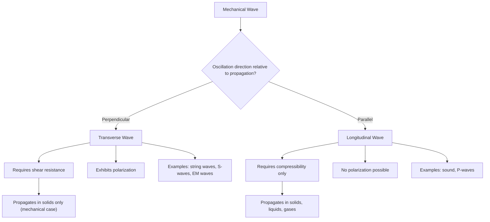

## Transverse and Longitudinal Waves

### Overview

Transverse and longitudinal waves are the two fundamental classifications of mechanical waves, distinguished by the relationship between the direction of particle oscillation and the direction of wave propagation. In a transverse wave, particle displacement is perpendicular to propagation; in a longitudinal wave, displacement is parallel to propagation. This distinction governs which types of media can support each wave type, how polarization arises, and how these waves are mathematically and physically analyzed.

### Defining Characteristics

#### Transverse Waves

In a transverse wave, the medium's particles oscillate **perpendicular** to the direction of energy/wave propagation. Classic examples include waves on a stretched string, electromagnetic waves, and secondary (S) seismic waves in solids.

$$u(x,t) = A\cos(kx - \omega t), \quad \text{displacement } u \perp \text{propagation direction } \hat{x}$$

#### Longitudinal Waves

In a longitudinal wave, particles oscillate **parallel** to the direction of propagation, producing alternating regions of compression (particles closer together) and rarefaction (particles further apart). Sound waves in air and primary (P) seismic waves are the canonical examples.

$$s(x,t) = A\cos(kx - \omega t), \quad \text{displacement } s \parallel \text{propagation direction } \hat{x}$$

Although both are described by mathematically identical wave equations and harmonic forms, the physical meaning of the displacement variable differs fundamentally.

### Illustrative Diagram: Transverse vs. Longitudinal Motion (svg_diagram)

<svg xmlns="http://www.w3.org/2000/svg" viewBox="0 0 480 320">
<rect width="480" height="320" fill="#ffffff" />
<text x="240" y="20" font-size="14" text-anchor="middle" font-family="sans-serif" font-weight="bold">Transverse vs. Longitudinal Wave Motion (svg_diagram)</text>

<text x="80" y="45" font-size="12" font-family="sans-serif" font-weight="bold">Transverse</text>

<line x1="30" y1="100" x2="450" y2="100" stroke="#ccc" stroke-width="1" stroke-dasharray="3,3" />

<path d="M 30 100 Q 65 60, 100 100 T 170 100 T 240 100 T 310 100 T 380 100 T 450 100" fill="none" stroke="`#1a5fb4`" stroke-width="2.5" />

<line x1="100" y1="100" x2="100" y2="60" stroke="`#c64600`" stroke-width="2" marker-end="url(#a1)" />

<text x="108" y="75" font-size="10" font-family="sans-serif" fill="`#c64600`">particle motion</text>

<line x1="380" y1="115" x2="440" y2="115" stroke="#333" stroke-width="1.5" marker-end="url(#a2)" />

<text x="400" y="130" font-size="10" font-family="sans-serif">propagation →</text>

<text x="80" y="180" font-size="12" font-family="sans-serif" font-weight="bold">Longitudinal</text>

<g font-family="sans-serif">

<circle cx="45" cy="230" r="4" fill="`#2ec27e`" />

<circle cx="65" cy="230" r="4" fill="`#2ec27e`" />

<circle cx="80" cy="230" r="4" fill="`#2ec27e`" />

<circle cx="130" cy="230" r="4" fill="`#2ec27e`" />

<circle cx="180" cy="230" r="4" fill="`#2ec27e`" />

<circle cx="200" cy="230" r="4" fill="`#2ec27e`" />

<circle cx="215" cy="230" r="4" fill="`#2ec27e`" />

<circle cx="265" cy="230" r="4" fill="`#2ec27e`" />

<circle cx="315" cy="230" r="4" fill="`#2ec27e`" />

<circle cx="335" cy="230" r="4" fill="`#2ec27e`" />

<circle cx="350" cy="230" r="4" fill="`#2ec27e`" />

<circle cx="400" cy="230" r="4" fill="`#2ec27e`" />

<circle cx="450" cy="230" r="4" fill="`#2ec27e`" />

</g>

<text x="60" y="255" font-size="10" font-family="sans-serif">compression</text>

<text x="150" y="255" font-size="10" font-family="sans-serif">rarefaction</text>

<line x1="380" y1="270" x2="440" y2="270" stroke="#333" stroke-width="1.5" marker-end="url(#a2)" />

<text x="400" y="285" font-size="10" font-family="sans-serif">propagation →</text>

</svg>

### Mathematical Description

#### Transverse Wave on a String

For displacement $u(x,t)$ perpendicular to the string's axis $x$, the governing wave equation (derived from tension-driven restoring forces) is:

$$\frac{\partial^2 u}{\partial t^2} = v^2 \frac{\partial^2 u}{\partial x^2}, \qquad v = \sqrt{\frac{T}{\mu}}$$

A traveling harmonic solution:

$$u(x,t) = A\cos(kx - \omega t)$$

with particle velocity $\partial u/\partial t$ and particle acceleration $\partial^2 u/\partial t^2$ both directed along $u$ (perpendicular to $x$), while the wave itself propagates along $x$.

#### Longitudinal Wave in a Medium

For longitudinal displacement $s(x,t)$ along the propagation axis, the same functional wave equation applies:

$$\frac{\partial^2 s}{\partial t^2} = v^2 \frac{\partial^2 s}{\partial x^2}$$

but $s$ now represents displacement **along** $x$. For sound in a gas, this is often reformulated in terms of pressure perturbation $p'(x,t) = -\rho_0 v^2 \, \partial s/\partial x$ or density perturbation, since these are typically the directly measurable quantities.

#### Relating Displacement and Pressure in Longitudinal (Sound) Waves

Given $s(x,t) = s_0 \sin(kx - \omega t)$, the pressure variation is:

$$p'(x,t) = -B\frac{\partial s}{\partial x} = -Bk s_0 \cos(kx - \omega t)$$

where $B$ is the bulk modulus. Note that pressure and displacement are $90°$ out of phase: pressure extrema (maximum compression/rarefaction) occur where displacement is zero, and vice versa — a frequently tested conceptual point in acoustics.

### Restoring Forces and Media Requirements

#### Transverse Waves Require Shear Resistance

Transverse waves require a medium capable of supporting **shear stress** — a force that resists sliding of adjacent layers relative to one another. This is why transverse mechanical waves propagate readily through solids (which resist shear) but **cannot propagate through the bulk of ideal fluids** (liquids and gases), which have no static shear resistance.

#### Longitudinal Waves Require Compressibility/Elasticity

Longitudinal waves require only a restoring force against **compression** (volume change), a property possessed by solids, liquids, and gases alike. This is why sound (a longitudinal wave) propagates through air and water as well as through solids, while transverse mechanical waves (e.g., S-waves) do not propagate through liquid or gaseous regions.

#### Table: Medium Compatibility

| Wave type | Solids | Liquids | Gases | Vacuum |
| --- | --- | --- | --- | --- |
| Transverse (mechanical) | Yes | No (bulk) | No | No |
| Longitudinal (mechanical) | Yes | Yes | Yes | No |
| Electromagnetic (transverse) | Yes | Yes | Yes | Yes |

Electromagnetic waves are a notable exception: though transverse, they require no material medium at all, since their "oscillating quantities" are electric and magnetic fields rather than mechanical displacement of matter — this is a fundamentally different physical mechanism from mechanically transverse waves like those on a string.

### Seismic Waves: A Key Physical Application

#### P-Waves (Primary, Longitudinal)

Seismic P-waves are longitudinal compressional waves that travel through both solid and liquid regions of the Earth (crust, mantle, and outer core), and are the fastest seismic waves, arriving first at a detection station (hence "primary").

#### S-Waves (Secondary, Transverse)

Seismic S-waves are transverse shear waves that travel only through solid material, since they require shear rigidity. Their inability to propagate through the Earth's liquid outer core created a "shadow zone" in seismographic detection, which was [Fact, well-established in seismology] historically one of the key pieces of evidence used to establish that the Earth's outer core is liquid.

#### Comparison Table: Seismic Wave Properties

| Property | P-wave | S-wave |
| --- | --- | --- |
| Wave type | Longitudinal | Transverse |
| Relative speed | Faster (arrives first) | Slower (arrives second) |
| Solid propagation | Yes | Yes |
| Liquid/gas propagation | Yes | No |
| Typical speed in crust | ~6–8 km/s | ~3.5–4.5 km/s |

### Polarization: A Transverse-Wave-Exclusive Phenomenon

#### Definition

Polarization describes the specific orientation of the oscillation direction within the plane perpendicular to propagation, and it is a phenomenon that **can only occur for transverse waves**, since longitudinal waves have only one possible oscillation direction (along the propagation axis) and thus no distinguishable polarization states.

#### Types of Polarization

- **Linear polarization**: oscillation confined to a single fixed direction (e.g., $u(x,t) = A\cos(kx-\omega t)\,\hat{y}$)
- **Circular/elliptical polarization**: the oscillation direction rotates in the transverse plane over time, traced out by superposing two perpendicular linear oscillations with a phase difference (most commonly encountered in the electromagnetic context, but the same mathematical description applies to any transverse wave with two independent transverse degrees of freedom, such as waves on a membrane or in an elastic solid)

Polarization is why, for instance, polarizing filters affect light (a transverse EM wave) by selectively transmitting one oscillation orientation, while there is no analogous filtering concept for sound (a purely longitudinal wave in fluids).

### Waves in Elastic Solids: Both Types Coexist

#### General Elastic Wave Equation

Unlike a string or a fluid, a bulk isotropic elastic solid supports **both** transverse and longitudinal waves simultaneously, because the medium resists both compression and shear. The Navier-Cauchy elastodynamic equation for displacement field $\mathbf{u}(\mathbf{r},t)$ is:

$$\rho \frac{\partial^2 \mathbf{u}}{\partial t^2} = (\lambda + \mu)\nabla(\nabla \cdot \mathbf{u}) + \mu \nabla^2 \mathbf{u}$$

where $\lambda$ and $\mu$ are the Lamé parameters (with $\mu$ here the shear modulus, not to be confused with linear mass density used elsewhere) and $\rho$ is density.

#### Helmholtz Decomposition

Using the Helmholtz decomposition $\mathbf{u} = \nabla\phi + \nabla \times \boldsymbol{\Psi}$ (a scalar potential $\phi$ for the curl-free part, and a vector potential $\boldsymbol{\Psi}$ for the divergence-free part), the elastodynamic equation separates into two independent wave equations:

$$\frac{\partial^2 \phi}{\partial t^2} = v_L^2 \nabla^2 \phi, \qquad v_L = \sqrt{\frac{\lambda + 2\mu}{\rho}} \quad \text{(longitudinal/P-wave speed)}$$

$$\frac{\partial^2 \boldsymbol{\Psi}}{\partial t^2} = v_T^2 \nabla^2 \boldsymbol{\Psi}, \qquad v_T = \sqrt{\frac{\mu}{\rho}} \quad \text{(transverse/S-wave speed)}$$

This confirms rigorously (rather than just by analogy) that $v_L > v_T$ always, since $\lambda + 2\mu > \mu$ for physically stable materials (positive Lamé parameters), matching the observed ordering of P- and S-wave arrival times.

### Worked Example: Wave Speed Comparison in Steel

**Given**: For steel, approximate values are $\lambda \approx 111$ GPa, $\mu \approx 82$ GPa (shear modulus), $\rho \approx 7850\ \text{kg/m}^3$.

**Longitudinal wave speed**:

$$v_L = \sqrt{\frac{\lambda + 2\mu}{\rho}} = \sqrt{\frac{111\times10^9 + 2(82\times10^9)}{7850}} = \sqrt{\frac{275\times10^9}{7850}} \approx 5920\ \text{m/s}$$

**Transverse wave speed**:

$$v_T = \sqrt{\frac{\mu}{\rho}} = \sqrt{\frac{82\times10^9}{7850}} \approx 3230\ \text{m/s}$$

[Unverified] These numerical values depend on the specific alloy composition and temperature; standard reference tables should be consulted for engineering-precision figures, but the calculation methodology and the qualitative result ($v_L > v_T$ by roughly a factor of 1.8, consistent with typical metals) are representative and standard.

### Energy Transport: Common Features

#### Energy Density (General Form)

For both wave types, the average energy density of a traveling harmonic wave takes the same general form:

$$\langle \varepsilon \rangle = \frac{1}{2}\rho \omega^2 A^2$$

(with $\rho$ representing the relevant density — linear, areal, or volumetric depending on the medium's dimensionality), and average power transported is $\langle P \rangle = \langle \varepsilon \rangle \, v \, S$ for a wave of speed $v$ through cross-sectional area $S$. The mathematical structure of energy transport does not distinguish between transverse and longitudinal waves; the distinction lies entirely in the direction of oscillation relative to propagation, not in the energy-transport formalism itself.

### Diagram: Classification Overview

### Common Pitfalls

- **Assuming sound can be polarized**: sound in a fluid is purely longitudinal and has no polarization states; polarization is a transverse-wave-specific concept.
- **Assuming transverse mechanical waves can travel through liquids/gases**: bulk fluids lack static shear resistance, so mechanical transverse waves cannot propagate through their interior (surface waves on water are a distinct, more complex phenomenon involving gravity and surface tension, not a simple bulk transverse wave).
- **Conflating electromagnetic transverse waves with mechanical transverse waves**: EM waves are transverse but require no medium and no shear resistance, since the oscillating quantities are fields, not material displacement — the mechanical medium-based reasoning does not apply to EM waves.
- **Assuming P-waves are always faster due to their type alone rather than the underlying elastic moduli**: the $v_L > v_T$ ordering is a specific mathematical consequence of $\lambda + 2\mu > \mu$ for stable isotropic materials, not an arbitrary labeling convention.

### Related Topics

- The mechanical wave equation and its derivation
- Sound waves and acoustic wave propagation
- Seismic wave analysis and Earth's interior structure
- Polarization phenomena and Malus's law
- Elastic moduli (Young's modulus, shear modulus, bulk modulus, Lamé parameters)
- Electromagnetic wave propagation and Maxwell's equations
- Superposition and interference of waves
- Surface waves (Rayleigh waves, Love waves, water waves)
- Doppler effect for longitudinal and transverse sources