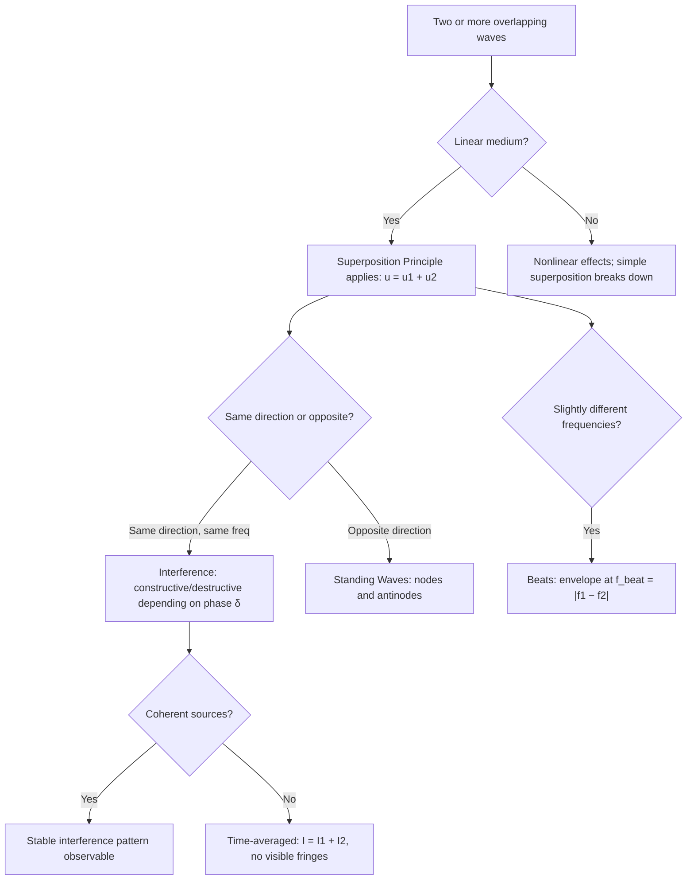

## Superposition and Interference of Waves

### Overview

The superposition principle states that when two or more waves overlap in the same region of a medium, the resultant displacement is the algebraic sum of the individual displacements each wave would produce alone. This principle, valid whenever the governing wave equation is linear, underlies the phenomenon of interference — the reinforcement or cancellation of waves depending on their relative phase — and provides the theoretical basis for standing waves, beats, diffraction patterns, and a vast range of acoustic and optical phenomena.

### The Superposition Principle

#### Mathematical Statement

If $u_1(x,t)$ and $u_2(x,t)$ are each individually solutions of a linear wave equation, then their sum is also a solution:

$$u(x,t) = u_1(x,t) + u_2(x,t)$$

This follows directly from the linearity of the wave equation $\partial^2 u/\partial t^2 = v^2\, \partial^2 u/\partial x^2$: since differentiation is a linear operator, if $u_1$ and $u_2$ individually satisfy the equation, their sum does too, term by term.

#### Condition for Validity

Superposition holds exactly for **linear media**, where the restoring force is proportional to displacement (small-amplitude regime). For sufficiently large amplitudes, most real media exhibit nonlinear effects (e.g., amplitude-dependent wave speed, harmonic generation), and simple superposition breaks down. [Inference] The amplitude threshold at which nonlinear effects become significant is highly medium- and context-dependent, so the linear approximation's validity must be assessed case by case.

### Interference of Two Harmonic Waves

#### Same Frequency, Same Direction

Consider two waves of identical frequency and amplitude, differing only in phase, traveling in the same direction:

$$u_1(x,t) = A\cos(kx - \omega t), \qquad u_2(x,t) = A\cos(kx - \omega t + \delta)$$

Using the trigonometric sum-to-product identity, the superposition is:

$$u(x,t) = u_1 + u_2 = 2A\cos\left(\frac{\delta}{2}\right)\cos\left(kx - \omega t + \frac{\delta}{2}\right)$$

This is again a traveling wave of the same frequency, with a new amplitude $A' = 2A\cos(\delta/2)$ that depends entirely on the phase difference $\delta$.

#### Constructive and Destructive Interference

- **Constructive interference** ($\delta = 0, 2\pi, 4\pi, \dots$, i.e., $\delta = 2m\pi$): $\cos(\delta/2) = \pm 1$, giving maximum amplitude $A' = 2A$
- **Destructive interference** ($\delta = \pi, 3\pi, \dots$, i.e., $\delta = (2m+1)\pi$): $\cos(\delta/2) = 0$, giving $A' = 0$ (complete cancellation)
- **Partial interference**: any intermediate $\delta$ gives amplitude between these extremes

#### Path Difference and Phase Difference

When interference arises from two sources with a path length difference $\Delta = r_2 - r_1$, the phase difference is:

$$\delta = k\Delta = \frac{2\pi \Delta}{\lambda}$$

Constructive interference occurs when $\Delta = m\lambda$ (integer number of wavelengths), and destructive interference when $\Delta = (m + \tfrac{1}{2})\lambda$ (half-integer number of wavelengths), for integer $m$.

### Illustrative Diagram: Constructive vs. Destructive Interference (svg_diagram)

<svg xmlns="http://www.w3.org/2000/svg" viewBox="0 0 480 300">
<rect width="480" height="300" fill="#ffffff" />
<text x="240" y="20" font-size="14" text-anchor="middle" font-family="sans-serif" font-weight="bold">Interference of Two Waves (svg_diagram)</text>

<text x="90" y="45" font-size="12" font-family="sans-serif" font-weight="bold">Constructive (δ = 0)</text>

<path d="M 30 80 Q 55 60, 80 80 T 130 80 T 180 80 T 230 80" fill="none" stroke="`#1a5fb4`" stroke-width="1.5" opacity="0.6" />

<path d="M 30 80 Q 55 60, 80 80 T 130 80 T 180 80 T 230 80" fill="none" stroke="`#c64600`" stroke-width="1.5" opacity="0.6" transform="translate(0,0)" />

<path d="M 30 110 Q 55 65, 80 110 T 130 110 T 180 110 T 230 110" fill="none" stroke="`#2ec27e`" stroke-width="2.5" />

<text x="130" y="135" font-size="10" text-anchor="middle" font-family="sans-serif">sum: amplitude 2A</text>

<text x="340" y="45" font-size="12" font-family="sans-serif" font-weight="bold">Destructive (δ = π)</text>

<path d="M 260 80 Q 285 60, 310 80 T 360 80 T 410 80 T 460 80" fill="none" stroke="`#1a5fb4`" stroke-width="1.5" opacity="0.6" />

<path d="M 260 80 Q 285 100, 310 80 T 360 80 T 410 80 T 460 80" fill="none" stroke="`#c64600`" stroke-width="1.5" opacity="0.6" />

<line x1="260" y1="110" x2="460" y2="110" stroke="`#2ec27e`" stroke-width="2.5" />

<text x="360" y="135" font-size="10" text-anchor="middle" font-family="sans-serif">sum: amplitude 0</text>

<text x="240" y="190" font-size="11" text-anchor="middle" font-family="sans-serif" fill="#555">Blue and orange: individual waves. Green: resultant superposition.</text>

<text x="240" y="215" font-size="11" text-anchor="middle" font-family="sans-serif" fill="#555">Same frequency and amplitude, differing only in relative phase δ.</text>

</svg>

### Standing Waves as an Interference Phenomenon

#### Counter-Propagating Wave Superposition

Standing waves arise from the interference of two waves of equal amplitude and frequency traveling in opposite directions:

$$u(x,t) = A\cos(kx-\omega t) + A\cos(kx+\omega t) = 2A\cos(kx)\cos(\omega t)$$

Unlike a traveling wave, this solution factorizes into a purely spatial envelope $2A\cos(kx)$ and a purely temporal oscillation $\cos(\omega t)$ — every point oscillates in place with an amplitude fixed by its position, rather than the pattern translating through space.

#### Nodes and Antinodes

- **Nodes**: positions where $\cos(kx) = 0$, i.e., $x = (2m+1)\lambda/4$, where displacement is always zero — permanent destructive interference at that point
- **Antinodes**: positions where $|\cos(kx)| = 1$, i.e., $x = m\lambda/2$, where oscillation amplitude is maximal ($2A$) — permanent constructive interference

The spacing between adjacent nodes (or adjacent antinodes) is $\lambda/2$.

### Beats: Interference in the Time Domain

#### Superposition of Nearby Frequencies

Consider two waves of slightly different frequencies $\omega_1$ and $\omega_2$ (with $\omega_1 \approx \omega_2$), observed at fixed position (setting $x=0$ for simplicity):

$$u(t) = A\cos(\omega_1 t) + A\cos(\omega_2 t)$$

Using the sum-to-product identity:

$$u(t) = 2A\cos\left(\frac{\omega_1-\omega_2}{2}t\right)\cos\left(\frac{\omega_1+\omega_2}{2}t\right)$$

This describes a rapid oscillation at the average frequency $\bar{\omega} = (\omega_1+\omega_2)/2$, with a slowly varying amplitude envelope oscillating at the **beat frequency**.

#### Beat Frequency

The envelope $\cos\left(\frac{\omega_1-\omega_2}{2}t\right)$ has angular frequency $|\omega_1-\omega_2|/2$, but since intensity/loudness depends on $|\cos(\cdot)|$ (which has twice the frequency of $\cos(\cdot)$ itself, as it reaches its peak magnitude twice per cycle), the perceived beat frequency is:

$$f_{\text{beat}} = |f_1 - f_2|$$

This phenomenon is the standard method musicians use to tune instruments: two notes played simultaneously produce audible beats whose frequency vanishes as the pitches converge to unison.

### Diagram: Beat Pattern (svg_diagram)

<svg xmlns="http://www.w3.org/2000/svg" viewBox="0 0 460 200">
<rect width="460" height="200" fill="#ffffff" />
<text x="230" y="20" font-size="14" text-anchor="middle" font-family="sans-serif" font-weight="bold">Beat Pattern: Envelope × Carrier (svg_diagram)</text>
<line x1="30" y1="110" x2="430" y2="110" stroke="#ccc" stroke-width="1" />
<path d="M 30 110 Q 40 60,50 110 T 70 110 T 90 110 Q 100 40,110 110 T 130 110 T 150 110 Q 160 80,170 110 T 190 110 Q 200 95,210 110 T 230 110 Q 240 100,250 110 T 270 110 Q 280 95,290 110 T 310 110 Q 320 80,330 110 T 350 110 T 370 110 Q 380 40,390 110 T 410 110 T 430 110" fill="none" stroke="#1a5fb4" stroke-width="1.5" />
<path d="M 30 45 Q 130 20, 230 110 T 430 45" fill="none" stroke="#c64600" stroke-width="1.5" stroke-dasharray="4,3" />
<path d="M 30 175 Q 130 200, 230 110 T 430 175" fill="none" stroke="#c64600" stroke-width="1.5" stroke-dasharray="4,3" />
<text x="230" y="190" font-size="11" text-anchor="middle" font-family="sans-serif" fill="#555">Fast oscillation (blue) modulated by slow envelope (orange, dashed)</text>
</svg>

### Two-Source Interference (Spatial Pattern)

#### Setup

For two coherent point sources separated by distance $d$, emitting in phase, the interference pattern observed at a distant point depends on the path difference from each source. This is the acoustic/mechanical analog of the classic double-slit interference setup.

#### Path Difference for Distant Observation

For an observation angle $\theta$ measured from the perpendicular bisector of the source separation, and assuming the observation distance is much larger than $d$ (far-field approximation):

$$\Delta = d\sin\theta$$

**Constructive interference** (maxima) occurs at:

$$d\sin\theta = m\lambda, \qquad m = 0, \pm1, \pm2, \dots$$

**Destructive interference** (minima) occurs at:

$$d\sin\theta = \left(m + \frac{1}{2}\right)\lambda$$

This produces an angular pattern of alternating loud/quiet regions (for sound) or bright/dark regions (for light), with the central maximum ($m=0$) directly between the two sources.

### Superposition of Waves with Different Amplitudes

#### General Phasor Approach

For two waves of possibly different amplitudes $A_1, A_2$ and phase difference $\delta$, representing each as a phasor (rotating vector) and using vector addition:

$$A_{\text{result}}^2 = A_1^2 + A_2^2 + 2A_1A_2\cos\delta$$

This is structurally identical to the law of cosines, and it reduces to $A_{\text{result}} = A_1 + A_2$ for $\delta = 0$ (fully constructive) and $A_{\text{result}} = |A_1 - A_2|$ for $\delta = \pi$ (fully destructive but not necessarily zero, unless $A_1 = A_2$).

### Intensity and Interference

#### Intensity Relation

Since wave intensity (power per unit area) is generally proportional to the square of amplitude, $I \propto A^2$, the resultant intensity of two interfering waves is:

$$I = I_1 + I_2 + 2\sqrt{I_1 I_2}\cos\delta$$

For equal individual intensities $I_1 = I_2 = I_0$:

$$I = 2I_0(1 + \cos\delta) = 4I_0\cos^2\left(\frac{\delta}{2}\right)$$

This shows the maximum resultant intensity ($4I_0$ at constructive interference) is **four times**, not twice, the individual intensity — a frequently surprising but direct consequence of amplitude (not intensity) superposition: amplitudes add, but intensity depends on the square of the summed amplitude, so constructive interference of two equal sources yields $I=4I_0$ while destructive interference yields $I=0$, and the spatial/angular average intensity over many interference fringes correctly recovers $2I_0$, consistent with energy conservation.

### Coherence: A Prerequisite for Sustained Interference

#### Definition

Sustained, observable interference patterns require the interfering waves to be **coherent** — maintaining a constant (or slowly varying in a controlled way) phase relationship over the observation time. If the relative phase $\delta$ fluctuates randomly and rapidly compared to the observation/detector response time, the time-averaged interference term $\langle\cos\delta\rangle \to 0$, and the observed intensity simply becomes the incoherent sum $I = I_1 + I_2$, with no observable fringes.

#### Coherent vs. Incoherent Sources

Two independent, unrelated wave sources (e.g., two separate light bulbs, or two unrelated sound sources) are generally **incoherent** because their phase relationship fluctuates randomly on very short timescales, whereas two sources derived from a single original source (e.g., by splitting a wavefront, as in a double-slit setup, or two speakers driven by the same amplifier signal) maintain a fixed, sustained phase relationship and are coherent.

### Diagram: Interference Concepts Overview

### Worked Example: Two Speakers and a Listener

**Setup**: Two speakers, separated by $d = 2.00\ \text{m}$, emit identical in-phase tones of frequency $f = 686\ \text{Hz}$ in air ($v_{\text{sound}} \approx 343\ \text{m/s}$). A listener stands far away at angle $\theta$ from the perpendicular bisector.

**Wavelength**:

$$\lambda = \frac{v}{f} = \frac{343}{686} = 0.500\ \text{m}$$

**First-order destructive interference angle** ($m=0$ minimum, $\Delta = \lambda/2$):

$$d\sin\theta = \frac{\lambda}{2} \implies \sin\theta = \frac{0.500}{2 \times 2.00} = 0.125 \implies \theta \approx 7.18°$$

This means the listener would experience a distinct quiet spot at approximately $7.18°$ off the central axis, illustrating how interference geometry translates directly into a physically measurable, locatable acoustic effect.

### Common Pitfalls

- **Assuming intensities simply add for coherent sources**: for coherent interference, amplitudes add first, and intensity is computed from the resultant amplitude — direct summation of individual intensities ($I_1+I_2$) is only valid for incoherent superposition.
- **Confusing beat frequency with the individual wave frequencies**: the beat frequency is the *difference* $|f_1-f_2|$, not the average or sum, and is typically far lower than either original frequency when the sources are nearly matched in pitch.
- **Forgetting the coherence requirement**: interference patterns require a sustained, well-defined phase relationship; two independent sources of the same nominal frequency will generally not produce a stable, observable interference pattern over time due to random phase drift.
- **Applying superposition outside the linear regime**: at sufficiently high amplitudes, most real media introduce nonlinear terms into the governing equation, and the clean additive superposition result no longer holds exactly.

### Related Topics

- The mechanical wave equation and traveling wave solutions
- Standing waves and normal modes
- Double-slit interference and diffraction (optical analog)
- Coherence and correlation functions
- Beats and frequency modulation
- Acoustic intensity, decibels, and sound level
- Huygens' principle and wavefront construction
- Fourier analysis of composite waveforms
- Phasor representation of oscillatory quantities