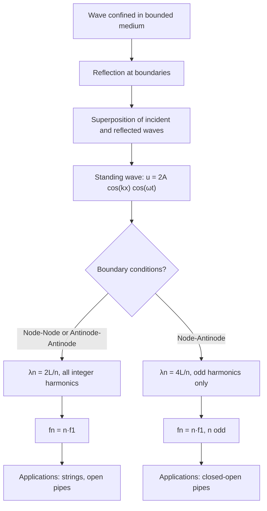

## Standing Waves and Harmonics

### Overview

Standing waves arise when waves are confined within a bounded medium and interfere with their own reflections, producing a stationary pattern of fixed nodes and antinodes rather than a traveling disturbance. When boundary conditions restrict the system to a discrete set of allowed wavelengths, these resonant patterns are called normal modes or harmonics. This framework underlies the physics of musical instruments, resonant cavities, and quantized vibrational systems generally.

### Formation of Standing Waves

#### Reflection and Superposition

A standing wave forms when a traveling wave reflects off a boundary and superposes with the incident wave. For a wave confined between two boundaries (e.g., a string fixed at both ends), continuous reflection back and forth produces sustained interference, and only certain wavelengths produce a self-consistent, stable pattern — these are the **resonant** or **normal mode** wavelengths.

#### Mathematical Origin

As derived from the interference of two counter-propagating waves of equal amplitude and frequency:

$$u(x,t) = A\cos(kx-\omega t) + A\cos(kx+\omega t) = 2A\cos(kx)\cos(\omega t)$$

This factorized form — a fixed spatial shape $\cos(kx)$ modulated by a time-oscillating amplitude $\cos(\omega t)$ — is the defining mathematical signature of a standing wave: every point in the medium oscillates in place, with an amplitude determined by its fixed position, rather than a pattern translating through space.

### Nodes and Antinodes

#### Definitions

- **Nodes**: fixed points where displacement is always zero ($\cos(kx) = 0$), representing permanent destructive interference
- **Antinodes**: fixed points of maximum oscillation amplitude ($|\cos(kx)|=1$), representing permanent constructive interference

Adjacent nodes (or adjacent antinodes) are separated by $\lambda/2$, and a node-antinode pair is separated by $\lambda/4$.

### Boundary Conditions Determine the Mode Structure

#### Fixed-Fixed Boundaries (Both Ends Nodes)

For a string of length $L$ fixed at both ends, $u(0,t) = u(L,t) = 0$ for all $t$. This forces an integer number of half-wavelengths to fit within $L$:

$$L = \frac{n\lambda_n}{2} \implies \lambda_n = \frac{2L}{n}, \qquad n = 1, 2, 3, \dots$$

with corresponding frequencies:

$$f_n = \frac{v}{\lambda_n} = \frac{nv}{2L} = n f_1$$

where $f_1 = v/(2L)$ is the **fundamental frequency**. This is the standard configuration for stringed instruments (guitar, violin, piano) and produces a full harmonic series: all integer multiples of $f_1$ are allowed.

#### Free-Free Boundaries (Both Ends Antinodes)

For a system free at both ends (e.g., a rod free to vibrate longitudinally at both ends, or an open-open air column approximation), both endpoints are antinodes rather than nodes. This produces the identical mode spacing as the fixed-fixed case:

$$\lambda_n = \frac{2L}{n}, \qquad f_n = n f_1, \qquad n = 1, 2, 3, \dots$$

since the geometric constraint (integer number of half-wavelengths fitting in $L$) is the same, just with the roles of nodes and antinodes at the boundaries swapped.

#### Fixed-Free Boundaries (One Node, One Antinode)

For a system fixed at one end (node) and free at the other (antinode) — such as a string fixed at one end only, or a closed-open air column (e.g., many wind instruments, or a tube closed at one end) — only an **odd** number of quarter-wavelengths fits within $L$:

$$L = \frac{n\lambda_n}{4} \implies \lambda_n = \frac{4L}{n}, \qquad n = 1, 3, 5, \dots \text{(odd only)}$$

with:

$$f_n = \frac{nv}{4L} = n f_1, \qquad n = 1, 3, 5, \dots$$

Critically, **even harmonics are absent** in this configuration — only odd multiples of the fundamental are supported, a distinguishing physical signature of asymmetric (node-antinode) boundary conditions.

### Comparison Table: Boundary Conditions and Harmonic Series

| Configuration | Boundary type | Allowed $\lambda_n$ | Allowed $f_n$ | Harmonics present |
| --- | --- | --- | --- | --- |
| Fixed-Fixed | Node-Node | $2L/n$ | $nf_1$ | All integers ($n=1,2,3,\dots$) |
| Free-Free | Antinode-Antinode | $2L/n$ | $nf_1$ | All integers ($n=1,2,3,\dots$) |
| Fixed-Free | Node-Antinode | $4L/n$ | $nf_1$ | Odd only ($n=1,3,5,\dots$) |

### Illustrative Diagram: First Three Harmonics, Fixed-Fixed String (svg_diagram)

<svg xmlns="http://www.w3.org/2000/svg" viewBox="0 0 460 330">
<rect width="460" height="330" fill="#ffffff" />
<text x="230" y="20" font-size="14" text-anchor="middle" font-family="sans-serif" font-weight="bold">Harmonics of a Fixed-Fixed String (svg_diagram)</text>

<text x="40" y="55" font-size="11" font-family="sans-serif">n=1</text>

<line x1="60" y1="70" x2="420" y2="70" stroke="#ccc" stroke-width="1" />

<path d="M 60 70 Q 240 20, 420 70" fill="none" stroke="`#1a5fb4`" stroke-width="2.5" />

<circle cx="60" cy="70" r="3" fill="`#c64600`" /><circle cx="420" cy="70" r="3" fill="`#c64600`" />

<text x="240" y="45" font-size="10" text-anchor="middle" font-family="sans-serif">fundamental (f₁)</text>

<text x="40" y="140" font-size="11" font-family="sans-serif">n=2</text>

<line x1="60" y1="155" x2="420" y2="155" stroke="#ccc" stroke-width="1" />

<path d="M 60 155 Q 150 105, 240 155 T 420 155" fill="none" stroke="`#2ec27e`" stroke-width="2.5" />

<circle cx="60" cy="155" r="3" fill="`#c64600`" /><circle cx="240" cy="155" r="3" fill="`#c64600`" /><circle cx="420" cy="155" r="3" fill="`#c64600`" />

<text x="240" y="130" font-size="10" text-anchor="middle" font-family="sans-serif">2nd harmonic (2f₁)</text>

<text x="40" y="225" font-size="11" font-family="sans-serif">n=3</text>

<line x1="60" y1="240" x2="420" y2="240" stroke="#ccc" stroke-width="1" />

<path d="M 60 240 Q 120 195, 180 240 T 300 240 T 420 240" fill="none" stroke="`#c64600`" stroke-width="2.5" />

<circle cx="60" cy="240" r="3" fill="`#1a5fb4`" /><circle cx="180" cy="240" r="3" fill="`#1a5fb4`" /><circle cx="300" cy="240" r="3" fill="`#1a5fb4`" /><circle cx="420" cy="240" r="3" fill="`#1a5fb4`" />

<text x="240" y="215" font-size="10" text-anchor="middle" font-family="sans-serif">3rd harmonic (3f₁)</text>

<text x="230" y="300" font-size="11" text-anchor="middle" font-family="sans-serif" fill="#555">Orange dots: nodes (fixed endpoints always nodes here)</text>

</svg>

### Two-Dimensional and Three-Dimensional Standing Waves

#### Vibrating Membrane (2D)

For a rectangular membrane of dimensions $L_x \times L_y$ fixed at all edges, normal modes are characterized by two mode numbers $(n_x, n_y)$:

$$u_{n_x,n_y}(x,y,t) = A\sin\left(\frac{n_x\pi x}{L_x}\right)\sin\left(\frac{n_y \pi y}{L_y}\right)\cos(\omega_{n_x,n_y} t)$$

with frequency:

$$f_{n_x,n_y} = \frac{v}{2}\sqrt{\left(\frac{n_x}{L_x}\right)^2 + \left(\frac{n_y}{L_y}\right)^2}$$

Unlike the 1D string, the frequency spectrum is generally **not** a simple integer multiple series of a single fundamental — this is why drums (2D membranes) produce a less tonally "pure" sound than strings, with a more complex and generally inharmonic overtone structure. This is a well-documented physical explanation for the characteristically different timbre of percussion versus string instruments.

#### Circular Membrane (Drumhead)

For a circular membrane of radius $a$, the mode shapes involve Bessel functions $J_m(k_{mn}r)$, with frequencies determined by the zeros of the Bessel functions rather than a simple integer sequence, reinforcing the inharmonic character of drum overtones. [Inference] The specific inharmonicity ratios depend on the particular mode indices and the membrane's boundary/tension uniformity, so exact overtone frequencies require consulting tabulated Bessel zero values for precise calculation.

### Acoustic Resonance in Air Columns

#### Open-Open Pipe (Both Ends Antinodes)

An open-open pipe (open at both ends) behaves like the free-free boundary case for the pressure/displacement standing wave, supporting the full harmonic series:

$$f_n = \frac{nv}{2L}, \qquad n = 1,2,3,\dots$$

This describes instruments such as open organ pipes and (approximately) the flute.

#### Closed-Open Pipe (One Node, One Antinode)

A pipe closed at one end (displacement node, pressure antinode at the closed end) and open at the other (displacement antinode, pressure node at the open end) follows the fixed-free case, supporting only odd harmonics:

$$f_n = \frac{nv}{4L}, \qquad n = 1,3,5,\dots$$

This describes instruments such as the clarinet (approximately) and closed organ pipes, and explains why these instruments have a characteristically different tonal color (missing even harmonics) compared to open-pipe instruments of comparable length.

#### End Correction

[Inference] In practice, the effective length of an open pipe end is slightly longer than its physical length due to the antinode actually forming a small distance beyond the physical opening (the "end correction"); this is a standard refinement in acoustic pipe analysis, though the precise correction factor depends on the pipe's radius and geometry, and is typically approximated as $0.6r$ per open end for a simple cylindrical pipe of radius $r$ in introductory treatments.

### Worked Example: Guitar String Tuning

**Setup**: A guitar string of length $L = 0.65\ \text{m}$ is tuned so its fundamental frequency is $f_1 = 82.4\ \text{Hz}$ (low E string).

**Required wave speed**:

$$f_1 = \frac{v}{2L} \implies v = 2Lf_1 = 2(0.65)(82.4) = 107.1\ \text{m/s}$$

**Required tension** (given linear density $\mu = 5.28\times10^{-3}\ \text{kg/m}$, a typical value for a wound low-E string):

$$v = \sqrt{\frac{T}{\mu}} \implies T = \mu v^2 = (5.28\times10^{-3})(107.1)^2 \approx 60.6\ \text{N}$$

**Frequency of the 5th harmonic**:

$$f_5 = 5f_1 = 5(82.4) = 412\ \text{Hz}$$

This calculation illustrates the direct, practical link between the mode structure (harmonic series), material properties ($\mu$, $T$), and musically relevant frequencies — the physical basis for how string instruments are constructed and tuned.

### Worked Example: Closed-Open Air Column

**Setup**: A tube closed at one end, open at the other, has length $L = 0.30\ \text{m}$, filled with air at $v_{\text{sound}} = 343\ \text{m/s}$.

**Fundamental frequency**:

$$f_1 = \frac{v}{4L} = \frac{343}{4(0.30)} = 285.8\ \text{Hz}$$

**Next allowed harmonic** (3rd, since even harmonics are absent):

$$f_3 = 3f_1 = 857.5\ \text{Hz}$$

Note there is no mode at $2f_1 \approx 571.7\ \text{Hz}$ for this configuration — a direct, testable consequence of the asymmetric boundary condition.

### Resonance and Driven Standing Waves

#### Forced Oscillation at Resonant Frequencies

When a medium is driven by an external periodic force (e.g., a tuning fork near a pipe, or an oscillator at one end of a string), the amplitude of the resulting standing wave becomes very large specifically when the driving frequency matches one of the system's natural mode frequencies $f_n$ — this is **resonance**. Away from these frequencies, driven oscillation amplitude remains comparatively small (in the idealized undamped/lightly damped case).

#### Role of Damping

[Inference] Real physical systems always possess some damping (energy loss due to internal friction, air resistance, or radiation), which limits the resonant amplitude to a finite (rather than divergent) value and broadens the resonance peak in frequency; the specific sharpness of resonance (quantified by the quality factor $Q$) depends on the damping mechanism and magnitude for each particular physical system.

### Diagram: Standing Wave Formation and Mode Determination

### Common Pitfalls

- **Confusing standing waves with traveling waves**: a standing wave does not transport net energy in a particular direction over a full cycle (energy sloshes between kinetic and potential locally); in contrast, a traveling wave carries energy continuously in its propagation direction.
- **Assuming all systems support the full integer harmonic series**: only symmetric boundary conditions (node-node or antinode-antinode) support all integer harmonics; asymmetric (node-antinode) boundaries support odd harmonics only.
- **Forgetting end corrections in real pipe calculations**: treating the physical pipe length as exactly equal to the effective acoustic length introduces small but systematic errors in predicted resonant frequencies for open pipe ends.
- **Assuming 2D/3D systems have simple integer-multiple overtone series**: unlike 1D strings, membranes and other higher-dimensional resonators generally have inharmonic overtone spectra, which is why their perceived timbre differs qualitatively from string or simple pipe instruments.

### Related Topics

- The mechanical wave equation and traveling wave solutions
- Superposition and interference of waves
- Resonance, damping, and quality factor ($Q$)
- Fourier series and harmonic decomposition
- Acoustic resonance in musical instruments
- Bessel functions and vibration of circular membranes
- Beats and frequency-domain analysis
- Eigenvalue problems and boundary value problems in PDEs