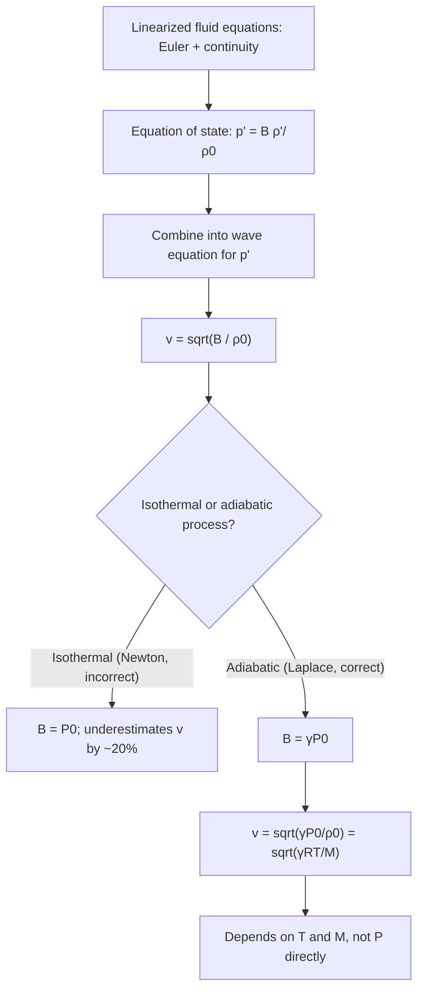

## Sound Waves and the Speed of Sound

### Overview

Sound waves are longitudinal mechanical pressure waves that propagate through a compressible medium — gas, liquid, or solid — via alternating regions of compression and rarefaction. The speed at which these disturbances travel depends fundamentally on the medium's elastic (compressibility) properties and its density, and is derivable rigorously from the mechanical wave equation applied to a compressible fluid or solid.

### Physical Description of Sound

#### Sound as Longitudinal Pressure Oscillation

As particles in a medium oscillate back and forth parallel to the direction of propagation, they create local regions of higher pressure/density (compressions) and lower pressure/density (rarefactions). Sound can be equivalently described by three interrelated field variables: particle displacement $s(x,t)$, pressure perturbation $p'(x,t)$, and density perturbation $\rho'(x,t)$, all satisfying the same wave equation with the same propagation speed, but $90°$ out of phase with one another as discussed under longitudinal wave descriptions.

#### Audible Range

Human hearing typically spans approximately 20 Hz to 20,000 Hz, though this range narrows with age (particularly at the high-frequency end) and varies between individuals. Frequencies below 20 Hz are termed **infrasound**, and above 20,000 Hz, **ultrasound** — both are physically identical wave phenomena to audible sound, differing only in frequency and hence perceptibility to human ears.

### Derivation of the Speed of Sound in a Fluid

#### Starting from the Fluid Equations

Consider a fluid element of equilibrium density $\rho_0$ and pressure $P_0$. For small perturbations, the linearized continuity equation and Euler's equation (momentum conservation) for one-dimensional motion give:

$$\rho_0 \frac{\partial v}{\partial t} = -\frac{\partial p'}{\partial x} \quad \text{(linearized Euler equation)}$$

$$\frac{\partial \rho'}{\partial t} = -\rho_0 \frac{\partial v}{\partial x} \quad \text{(linearized continuity equation)}$$

where $v = \partial s/\partial t$ is particle velocity and $p', \rho'$ are pressure and density perturbations from equilibrium.

#### Equation of State (Closing the System)

The system is closed using the relationship between pressure and density perturbations, characterized by the (adiabatic) bulk modulus:

$$B = \rho_0 \left(\frac{\partial P}{\partial \rho}\right)_{S} \implies p' = B\frac{\rho'}{\rho_0}$$

Combining the three equations by differentiating and substituting (standard derivation for linear acoustics) yields the wave equation for pressure perturbation:

$$\frac{\partial^2 p'}{\partial t^2} = \frac{B}{\rho_0}\frac{\partial^2 p'}{\partial x^2}$$

Comparing to the standard form $\partial^2 u/\partial t^2 = v^2\, \partial^2 u/\partial x^2$ identifies the speed of sound:

$$v_{\text{sound}} = \sqrt{\frac{B}{\rho_0}}$$

### Why the Adiabatic (Not Isothermal) Bulk Modulus

#### Newton's Original Error and Laplace's Correction

Isaac Newton originally derived the speed of sound using the **isothermal** bulk modulus, obtaining a value that [Fact, well-documented historically] underestimated the measured speed of sound in air by roughly 20%. Pierre-Simon Laplace later corrected this by recognizing that sound compressions and rarefactions occur too rapidly for significant heat exchange with surroundings — the process is **adiabatic**, not isothermal, since the compressed and rarefied regions do not have time to thermally equilibrate with neighboring regions within one oscillation period.

#### Adiabatic Bulk Modulus for an Ideal Gas

For an ideal gas undergoing adiabatic (reversible, no heat exchange) compression, $PV^\gamma = \text{constant}$, where $\gamma = c_P/c_V$ is the adiabatic index (ratio of specific heats). Differentiating gives:

$$B_{\text{adiabatic}} = \gamma P_0$$

This is larger than the isothermal bulk modulus $B_{\text{isothermal}} = P_0$ by the factor $\gamma$ (which is $\approx 1.4$ for diatomic gases like air), directly accounting for Laplace's correction and matching experimental measurements.

### Speed of Sound in an Ideal Gas

#### Derived Formula

Combining $v_{\text{sound}} = \sqrt{B/\rho_0}$ with $B = \gamma P_0$ and the ideal gas law $P_0 = \rho_0 R_{\text{specific}} T$ (where $R_{\text{specific}} = R/M$ is the specific gas constant, $R$ the universal gas constant, and $M$ the molar mass):

$$v_{\text{sound}} = \sqrt{\frac{\gamma P_0}{\rho_0}} = \sqrt{\gamma R_{\text{specific}} T} = \sqrt{\frac{\gamma R T}{M}}$$

This form makes explicit that the speed of sound in an ideal gas depends on **absolute temperature $T$** and molar mass $M$, but notably **not** on pressure directly (since $P_0/\rho_0$ is itself proportional to $T$ for an ideal gas at fixed composition, the pressure-dependence cancels).

#### Temperature Dependence in Air

For dry air near room temperature, a commonly used approximate linear relation is:

$$v_{\text{sound}} \approx 331.3 + 0.606\, T_C \quad \text{(m/s, with $T_C$ in °C)}$$

This linear approximation, [Inference] derived from a Taylor expansion of the full square-root temperature dependence around typical atmospheric temperatures, is standard in introductory physics texts, though the exact numerical coefficients can vary slightly (e.g., 0.6 vs 0.606) depending on the specific reference and the humidity/composition assumptions used.

### Worked Example: Speed of Sound at Various Temperatures

**Given**: Dry air, $\gamma = 1.40$, $M = 0.02897\ \text{kg/mol}$, $R = 8.314\ \text{J/(mol·K)}$

**At $T = 0°\text{C} = 273.15\ \text{K}$**:

$$v = \sqrt{\frac{(1.40)(8.314)(273.15)}{0.02897}} = \sqrt{\frac{3178.6}{0.02897}} \approx \sqrt{109,720} \approx 331.2\ \text{m/s}$$

**At $T = 20°\text{C} = 293.15\ \text{K}$**:

$$v = \sqrt{\frac{(1.40)(8.314)(293.15)}{0.02897}} \approx \sqrt{117,690} \approx 343.1\ \text{m/s}$$

**At $T = 37°\text{C} = 310.15\ \text{K}$ (approximate body temperature)**:

$$v = \sqrt{\frac{(1.40)(8.314)(310.15)}{0.02897}} \approx \sqrt{124,510} \approx 352.9\ \text{m/s}$$

These values match the commonly cited reference figure of $\approx 343\ \text{m/s}$ at room temperature and demonstrate the clear, monotonic increase of sound speed with temperature.

### Speed of Sound in Liquids and Solids

#### Liquids

For liquids, the same relation $v = \sqrt{B/\rho_0}$ applies, using the liquid's (typically much larger) bulk modulus. Water, for instance, has $B \approx 2.2\ \text{GPa}$ and $\rho_0 \approx 1000\ \text{kg/m}^3$:

$$v_{\text{water}} = \sqrt{\frac{2.2\times10^9}{1000}} \approx 1483\ \text{m/s}$$

consistent with the commonly cited value of approximately 1480–1500 m/s for sound in water, varying with temperature, salinity, and depth (pressure).

#### Solids

For longitudinal sound waves in an extended solid, the relevant elastic modulus is $\lambda + 2\mu$ (from the Lamé parameters, as derived under elastic wave theory), giving speeds typically in the range of several thousand m/s (e.g., $\approx 5900\ \text{m/s}$ for longitudinal waves in steel, matching the earlier elastic-wave calculation).

#### Table: Approximate Sound Speeds by Medium

| Medium | Approximate speed (m/s) | Governing modulus |
| --- | --- | --- |
| Air (0°C) | 331 | $\gamma P_0$ (adiabatic) |
| Air (20°C) | 343 | $\gamma P_0$ (adiabatic) |
| Helium (20°C) | ~1000 | $\gamma P_0$, lower $M$ |
| Water (20°C) | ~1480 | Bulk modulus $B$ |
| Steel (longitudinal) | ~5900 | $\lambda + 2\mu$ |

[Unverified] The helium and steel values are representative figures commonly cited in reference tables; precise values depend on exact composition, purity, and measurement conditions, and standard reference sources should be consulted for engineering-precision figures.

### Why Sound Travels Faster in Solids Than Gases

#### Physical Reasoning

Solids possess much higher bulk (and shear) moduli than gases, because their constituent particles are held together by strong intermolecular/interatomic bonds that resist compression far more effectively than the weak, widely-spaced interactions in a gas. Since $v \propto \sqrt{B/\rho}$, and the increase in $B$ from gas to solid (many orders of magnitude) vastly outweighs the accompanying increase in $\rho$, solids exhibit substantially faster sound propagation than gases, despite their much higher density (which alone would tend to decrease speed).

### Molar Mass Dependence: Sound Speed in Different Gases

#### Helium vs. Air

Since $v \propto 1/\sqrt{M}$ at fixed temperature and $\gamma$, lighter gases transmit sound faster. Helium ($M \approx 4\ \text{g/mol}$) versus air ($M \approx 29\ \text{g/mol}$, dominated by $\text{N}_2$ and $\text{O}_2$) gives:

$$\frac{v_{\text{He}}}{v_{\text{air}}} \approx \sqrt{\frac{\gamma_{\text{He}} M_{\text{air}}}{\gamma_{\text{air}} M_{\text{He}}}} = \sqrt{\frac{(1.67)(29)}{(1.40)(4)}} \approx \sqrt{8.65} \approx 2.94$$

This roughly threefold increase in sound speed is the physical basis for the well-known "helium voice" effect: since the resonant frequencies of the vocal tract (an air column resonator) scale directly with sound speed ($f_n \propto v$), breathing helium raises the resonant/formant frequencies of speech, producing a characteristic high-pitched timbre, even though the vocal fold vibration frequency itself (which determines pitch, strictly speaking) is largely unchanged.

### Diagram: Speed of Sound Derivation Pathway

### Factors Affecting Speed of Sound in Air

#### Temperature (Primary Factor)

As derived above, $v \propto \sqrt{T}$ (absolute temperature); this is the dominant and most commonly tested dependence.

#### Humidity

[Inference] Humid air has a slightly lower average molar mass than dry air (since water vapor, $M \approx 18\ \text{g/mol}$, is lighter than the $\text{N}_2$/$\text{O}_2$ mixture it partially displaces), which very slightly *increases* the speed of sound in humid air compared to dry air at the same temperature — a modest effect, generally much smaller than the temperature dependence, and its precise magnitude depends on the exact humidity level and temperature.

#### Pressure (At Fixed Temperature)

As shown in the derivation, sound speed in an ideal gas does not depend directly on pressure at fixed temperature and composition, since the pressure and density dependencies in $B/\rho_0 = \gamma P_0/\rho_0$ cancel exactly for an ideal gas — a frequently counterintuitive but well-established result.

### Common Pitfalls

- **Assuming higher air pressure always means faster sound**: for an ideal gas at fixed temperature, pressure and density changes cancel in the $v = \sqrt{\gamma P/\rho}$ formula; temperature, not pressure, is the primary driver of sound speed variation in the atmosphere.
- **Using the isothermal bulk modulus for gases**: this is Newton's historical error; the correct treatment for sound (a rapid, adiabatic process) requires the adiabatic bulk modulus $B = \gamma P_0$.
- **Assuming sound speed depends on frequency (dispersion)**: for the idealized linear acoustic wave equation in air under normal conditions, sound speed is independent of frequency (non-dispersive), so all audible frequencies travel at essentially the same speed — this is why a complex sound (e.g., a musical chord or spoken word) does not "smear" or separate into its frequency components over typical listening distances.
- **Confusing sound speed with particle (oscillation) speed**: as with all wave phenomena, $v_{\text{sound}}$ describes how fast the disturbance pattern propagates, not the (typically much smaller) oscillation speed of individual air molecules about their equilibrium positions.

### Related Topics

- The mechanical wave equation and its derivation
- Transverse and longitudinal waves
- Adiabatic and isothermal processes in thermodynamics
- Doppler effect for sound sources and observers
- Acoustic intensity, decibels, and the inverse-square law
- Standing waves and resonance in air columns
- Mach number and supersonic/shock wave phenomena
- Ultrasound and infrasound applications