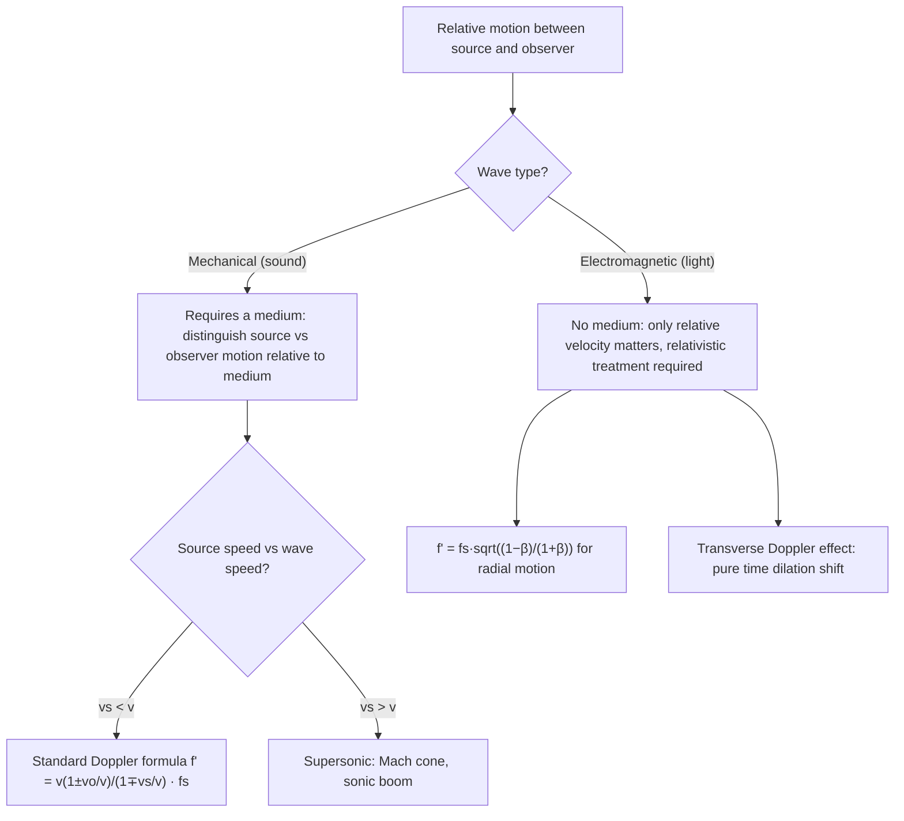

## The Doppler Effect

### Overview

The Doppler effect is the change in observed frequency (and wavelength) of a wave when there is relative motion between the source and the observer. First described by Christian Doppler in 1842, this phenomenon applies to all wave types — sound, light, and other electromagnetic radiation — and has become an essential tool across physics and astronomy, from traffic radar and medical ultrasound to measuring the recession velocities of distant galaxies.

### Physical Origin of the Effect

#### Qualitative Explanation

When a source of waves moves toward an observer, successive wave crests are emitted from positions progressively closer to the observer, effectively compressing the wavelength and raising the observed frequency. Conversely, when the source moves away, successive crests are emitted from increasingly distant positions, stretching the wavelength and lowering the observed frequency. An analogous effect occurs when the observer moves relative to a stationary source, though the underlying mechanism differs slightly (as detailed below), which is why the sound-wave Doppler formulas distinguish source motion from observer motion.

#### Key Distinction: Sound Waves Have a Medium

For sound (and other mechanical waves), the Doppler formulas depend on the velocities of the source and observer **relative to the medium** (e.g., still air), not merely their relative velocity to each other. This is a crucial physical distinction from the electromagnetic/relativistic Doppler effect, where there is no medium and only the relative velocity between source and observer matters.

### Doppler Effect for Sound: Moving Source, Stationary Observer

#### Derivation

Let the source emit sound of frequency $f_s$ and period $T_s = 1/f_s$, moving with speed $v_s$ toward a stationary observer, with sound speed $v$ in the medium. Between successive wavefront emissions, the source travels a distance $v_s T_s$ toward the observer, so each successive wavefront is emitted closer to the observer by this amount. The effective wavelength observed is compressed:

$$\lambda' = \lambda - v_s T_s = vT_s - v_s T_s = (v - v_s)T_s$$

Since the observed frequency is $f' = v/\lambda'$:

$$f' = \frac{v}{(v-v_s)T_s} = \frac{v}{v - v_s} f_s \quad \text{(source approaching)}$$

For a source receding, the sign of $v_s$ flips:

$$f' = \frac{v}{v + v_s} f_s \quad \text{(source receding)}$$

#### General Form (Source Motion)

$$f' = \frac{v}{v \mp v_s} f_s$$

using the upper sign (minus) when the source approaches the observer, and the lower sign (plus) when it recedes.

### Doppler Effect for Sound: Stationary Source, Moving Observer

#### Derivation

Now consider a stationary source and an observer moving with speed $v_o$ toward the source. The wavelength in the medium is unchanged ($\lambda = v/f_s$), but the observer encounters wavefronts at an effectively increased relative speed $v + v_o$ (since the observer is moving into the oncoming wave pattern). The observed frequency is:

$$f' = \frac{v + v_o}{\lambda} = \frac{v+v_o}{v}f_s \quad \text{(observer approaching)}$$

For an observer moving away from the source:

$$f' = \frac{v - v_o}{v}f_s \quad \text{(observer receding)}$$

#### General Form (Observer Motion)

$$f' = \frac{v \pm v_o}{v} f_s$$

using the upper sign (plus) when the observer approaches the source, and the lower sign (minus) when receding.

### General Doppler Formula (Both Source and Observer Moving)

#### Combined Expression

Combining both effects, when both source and observer move (along the line connecting them, in the same reference frame as the medium):

$$f' = \left(\frac{v \pm v_o}{v \mp v_s}\right) f_s$$

**Sign convention**: take the observer term as $+v_o$ if the observer moves toward the source (increases $f'$) and $-v_o$ if away; take the source term as $-v_s$ in the denominator if the source moves toward the observer (increases $f'$) and $+v_s$ if away. A useful mnemonic: motion that brings source and observer closer together always increases the observed frequency, and motion that separates them always decreases it, regardless of which one is actually moving.

### Illustrative Diagram: Compressed and Stretched Wavefronts (svg_diagram)

<svg xmlns="http://www.w3.org/2000/svg" viewBox="0 0 460 260">
<rect width="460" height="260" fill="#ffffff" />
<text x="230" y="20" font-size="14" text-anchor="middle" font-family="sans-serif" font-weight="bold">Doppler Effect: Moving Source (svg_diagram)</text>
<circle cx="150" cy="140" r="30" fill="none" stroke="#1a5fb4" stroke-width="1.5" />
<circle cx="150" cy="140" r="60" fill="none" stroke="#1a5fb4" stroke-width="1.5" />
<circle cx="150" cy="140" r="90" fill="none" stroke="#1a5fb4" stroke-width="1.5" />
<circle cx="175" cy="140" r="4" fill="#c64600" />
<text x="175" y="165" font-size="10" text-anchor="middle" font-family="sans-serif">source (moving right)</text>
<line x1="175" y1="140" x2="220" y2="140" stroke="#c64600" stroke-width="2" marker-end="url(#dp)" />
<text x="70" y="110" font-size="10" text-anchor="middle" font-family="sans-serif" fill="#1a5fb4">compressed</text>
<text x="330" y="110" font-size="10" text-anchor="middle" font-family="sans-serif" fill="#1a5fb4">stretched</text>
<text x="230" y="235" font-size="11" text-anchor="middle" font-family="sans-serif" fill="#555">Wavefronts bunch ahead of the source, spread out behind it</text>
</svg>

### Worked Example: Ambulance Siren

**Setup**: An ambulance siren emits $f_s = 700\ \text{Hz}$, traveling at $v_s = 30\ \text{m/s}$ toward a stationary pedestrian, with $v_{\text{sound}} = 343\ \text{m/s}$.

**As the ambulance approaches**:

$$f'_{\text{approach}} = \frac{v}{v-v_s}f_s = \frac{343}{343-30}(700) = \frac{343}{313}(700) \approx 767\ \text{Hz}$$

**As the ambulance recedes** (after passing):

$$f'_{\text{recede}} = \frac{v}{v+v_s}f_s = \frac{343}{343+30}(700) = \frac{343}{373}(700) \approx 644\ \text{Hz}$$

**The characteristic pitch drop** experienced as an ambulance passes is thus from approximately 767 Hz down to 644 Hz — a shift of roughly 123 Hz, easily perceptible and the everyday auditory signature of the Doppler effect.

### The Sonic Boom: Source Speed Exceeding Wave Speed

#### Physical Picture

When the source speed $v_s$ exceeds the wave speed $v$ (i.e., $v_s > v$, the supersonic regime for sound), the source outruns its own wavefronts. The individual spherical wavefronts overlap to form a conical shock front (a **Mach cone**) trailing the source, with half-angle $\theta_M$ given by:

$$\sin\theta_M = \frac{v}{v_s} = \frac{1}{M}$$

where $M = v_s/v$ is the **Mach number**. As this cone sweeps past a stationary observer, the highly compressed, superposed wavefronts arrive nearly simultaneously, producing the sharp, percussive **sonic boom**.

#### Doppler Formula Breakdown at $v_s = v$

Note that the source-approaching formula $f' = \dfrac{v}{v-v_s}f_s$ diverges as $v_s \to v$ (the denominator approaches zero), formally predicting infinite frequency — physically, this divergence signals the breakdown of the simple linear-superposition Doppler picture and the onset of shock-wave (nonlinear) behavior rather than a literal infinite pitch.

### The Relativistic Doppler Effect (Electromagnetic Waves)

#### Why the Classical Formula Fails for Light

For electromagnetic waves, there is no material medium, so the classical sound-wave Doppler formulas (which explicitly distinguish source motion from observer motion relative to a medium) do not directly apply. Instead, only the **relative velocity** between source and observer matters, and the correct treatment must incorporate special relativity, including time dilation.

#### Relativistic Longitudinal Doppler Formula

For a source and observer moving directly along the line connecting them with relative speed $u$ (positive for recession), the relativistic Doppler shift is:

$$f' = f_s\sqrt{\frac{1 - \beta}{1+\beta}}, \qquad \beta = \frac{u}{c}$$

for recession (redshift), with the reciprocal expression (swap the sign of $\beta$) for approach (blueshift). This reduces to the familiar classical approximation $f' \approx f_s(1 - u/c)$ for $u \ll c$, but includes relativistic corrections (time dilation) that become significant as $u$ approaches $c$.

#### Transverse Doppler Effect

[Inference] A purely relativistic phenomenon with no classical (sound-wave) analog is the transverse Doppler effect: even when the source moves exactly perpendicular to the line of sight at the moment of observation (zero classical radial velocity component), a frequency shift is still observed due to time dilation alone, given by $f' = f_s\sqrt{1-\beta^2} = f_s/\gamma$ (a redshift); this effect has been experimentally confirmed and serves as a well-known test of special relativity, though its magnitude is second-order in $\beta$ and thus typically much smaller than the longitudinal effect at non-relativistic speeds.

### Redshift and Cosmological Applications

#### Astronomical Redshift Notation

Astronomers typically express Doppler shifts using the dimensionless redshift parameter:

$$z = \frac{\lambda_{\text{observed}} - \lambda_{\text{emitted}}}{\lambda_{\text{emitted}}} = \frac{\Delta\lambda}{\lambda_{\text{emitted}}}$$

For non-relativistic recession speeds, $z \approx u/c$, providing a direct (approximate) measure of a receding object's velocity via spectral line shifts.

#### Distinguishing Doppler Redshift from Cosmological Redshift

[Inference] A subtlety frequently addressed in cosmology courses: the redshift observed from distant galaxies is dominantly due to the **expansion of space itself** (cosmological redshift) rather than a simple relative-velocity Doppler shift through static space; while the two effects produce mathematically similar-looking redshift formulas at low $z$, they represent physically distinct mechanisms, and the distinction becomes significant at cosmological distances where general-relativistic treatment is required rather than the special-relativistic Doppler formula presented above.

### Applications

#### Radar and Speed Detection

Police radar and weather Doppler radar measure frequency shifts of reflected radio waves off moving objects (vehicles, precipitation) to determine radial velocity, exploiting the same relativistic Doppler principle (though at radar frequencies and typical vehicle speeds, the classical non-relativistic approximation is entirely adequate).

#### Medical Doppler Ultrasound

Doppler ultrasound imaging measures blood flow velocity by detecting the frequency shift of ultrasound waves reflected off moving red blood cells, providing a non-invasive diagnostic tool for cardiovascular assessment.

#### Astronomical Spectroscopy

Doppler shift measurements of stellar and galactic spectral lines underpin the discovery of exoplanets (via the radial velocity/"wobble" method, detecting the periodic Doppler shift induced by an orbiting planet's gravitational pull on its host star) and the measurement of the universe's large-scale expansion (Hubble's law).

### Diagram: Doppler Effect Decision Framework

### Common Pitfalls

- **Using the sound Doppler formula for light**: the classical sound formulas explicitly reference a medium and distinguish source/observer motion separately; for electromagnetic waves, the relativistic formula (dependent only on relative velocity) must be used instead.
- **Sign errors in the combined formula**: forgetting that "motion toward" always increases frequency and "motion away" always decreases it (regardless of whether it's the source or observer moving) is a common source of error; using the mnemonic explicitly avoids this.
- **Assuming the sonic boom occurs only at the instant of breaking the sound barrier**: the sonic boom is continuously generated by the trailing Mach cone for the entire duration an object travels supersonically, not just at the single moment $v_s = v$ is reached; an observer hears it as the cone sweeps past their location.
- **Confusing Doppler redshift with cosmological redshift**: at low speeds/redshifts the two are numerically similar, but they represent physically distinct mechanisms (relative motion through space vs. expansion of space itself), a distinction that matters for correctly interpreting cosmological-scale observations.

### Related Topics

- Sound waves and the speed of sound
- Special relativity and time dilation
- Mach number and shock wave physics
- Redshift, blueshift, and Hubble's law
- Radar and Doppler-based velocity measurement
- Spectroscopy and the radial velocity method for exoplanet detection
- Wave interference and beats
- Electromagnetic wave propagation