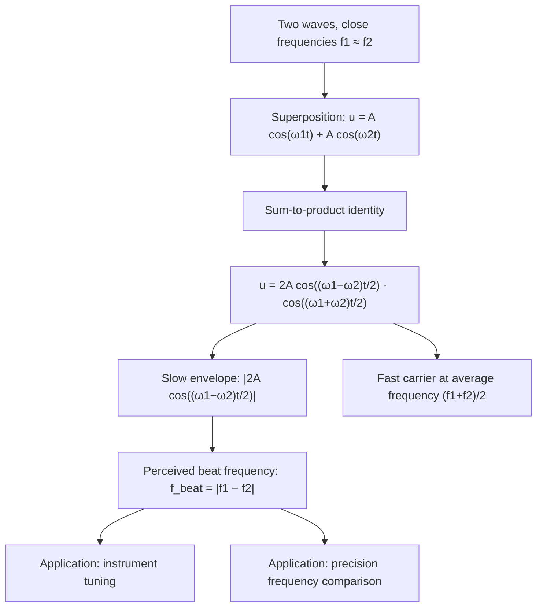

## Beats

### Overview

Beats are a periodic variation in amplitude (perceived as periodic loudness fluctuation for sound) that occurs when two waves of slightly different frequencies superpose. Rather than producing a single steady tone, the interference between the two close frequencies creates a slow, regular pulsing pattern known as beating, with practical applications ranging from musical instrument tuning to precision frequency measurement.

### Physical Origin

#### Superposition of Two Close Frequencies

Consider two sound waves of equal amplitude $A$ but slightly different angular frequencies $\omega_1$ and $\omega_2$ (with $\omega_1 \approx \omega_2$), observed at a fixed point:

$$u(t) = A\cos(\omega_1 t) + A\cos(\omega_2 t)$$

Since the two frequencies are close, the waves alternate between reinforcing each other (when nearly in phase) and canceling each other (when nearly out of phase) as time progresses, because the phase difference between them grows slowly and steadily.

### Mathematical Derivation

#### Sum-to-Product Identity

Applying the trigonometric identity $\cos A + \cos B = 2\cos\left(\dfrac{A-B}{2}\right)\cos\left(\dfrac{A+B}{2}\right)$:

$$u(t) = 2A\cos\left(\frac{\omega_1-\omega_2}{2}t\right)\cos\left(\frac{\omega_1+\omega_2}{2}t\right)$$

This expression factors into two distinct oscillatory components:

- A **slowly varying envelope**: $2A\cos\left(\dfrac{\omega_1-\omega_2}{2}t\right)$, oscillating at the small difference frequency
- A **rapidly oscillating carrier**: $\cos\left(\dfrac{\omega_1+\omega_2}{2}t\right)$, oscillating at the average frequency

#### Beat Frequency

The envelope term, $\left|2A\cos\left(\dfrac{\omega_1-\omega_2}{2}t\right)\right|$, represents the time-varying amplitude that a listener perceives as loudness. Since the amplitude reaches its maximum magnitude (constructive interference) twice per cycle of the underlying $\cos\left(\dfrac{\omega_1-\omega_2}{2}t\right)$ oscillation (once when the cosine is $+1$ and again when it is $-1$, both giving maximum $|amplitude|$), the physically perceived beat frequency is **twice** the envelope's mathematical frequency:

$$f_{\text{beat}} = |f_1 - f_2|$$

This is one of the most direct and important results in elementary wave interference: the beat frequency equals the absolute difference of the two component frequencies.

### Illustrative Diagram: Beat Envelope Formation (svg_diagram)

<svg xmlns="http://www.w3.org/2000/svg" viewBox="0 0 460 220">
<rect width="460" height="220" fill="#ffffff" />
<text x="230" y="20" font-size="14" text-anchor="middle" font-family="sans-serif" font-weight="bold">Beats: Two Close Frequencies Superposed (svg_diagram)</text>
<line x1="30" y1="130" x2="430" y2="130" stroke="#ccc" stroke-width="1" />
<path d="M 30 130 Q 40 100,50 130 T 70 130 Q 80 105,90 130 T 110 130 Q 120 118,130 130 T 150 130 Q 160 122,170 130 T 190 130 Q 200 125,210 130 T 230 130 Q 240 128,250 130 T 270 130 Q 280 122,290 130 T 310 130 Q 320 108,330 130 T 350 130 Q 360 100,370 130 T 390 130 Q 400 100,410 130 T 430 130" fill="none" stroke="#1a5fb4" stroke-width="1.8" />
<path d="M 30 55 Q 130 30, 230 130 T 430 55" fill="none" stroke="#c64600" stroke-width="1.5" stroke-dasharray="5,3" />
<path d="M 30 205 Q 130 230, 230 130 T 430 205" fill="none" stroke="#c64600" stroke-width="1.5" stroke-dasharray="5,3" />
<text x="230" y="195" font-size="11" text-anchor="middle" font-family="sans-serif" fill="#555">Loud - quiet - loud pattern repeats at f_beat = |f1 − f2|</text>
</svg>

### Worked Example: Tuning a Guitar String

**Setup**: A guitarist plays an open string alongside a reference tuning fork of $f_{\text{ref}} = 440.0\ \text{Hz}$ (concert A). The guitarist hears 3 beats per second.

**Interpretation**: The string frequency $f_s$ satisfies:

$$f_{\text{beat}} = |f_s - f_{\text{ref}}| = 3\ \text{Hz} \implies f_s = 437.0\ \text{Hz or } f_s = 443.0\ \text{Hz}$$

**Resolving the ambiguity**: Beat frequency alone cannot distinguish whether the string is sharp or flat relative to the reference. A standard technique is to slightly increase the string's tension (raising $f_s$) and observe whether the beat frequency increases or decreases:

- If beats **increase**, the string was originally *below* 440 Hz and moving further from it is wrong — actually the string was sharp is ruled out, meaning $f_s = 437.0\ \text{Hz}$ was correct, and tension should be *decreased* instead. [Clarification of standard method]
- If beats **decrease** as tension increases, the string was flat ($f_s = 437.0\ \text{Hz}$) and is approaching 440 Hz correctly, so tension should continue increasing until beats vanish.

This "raise tension and listen" procedure is the standard practical method musicians use to resolve the sign ambiguity inherent in a simple beat-frequency measurement, since beats alone only reveal the *magnitude* of the frequency difference, not its sign.

### Worked Example: Two Tuning Forks

**Setup**: Two tuning forks, $f_1 = 256\ \text{Hz}$ and $f_2 = 262\ \text{Hz}$, are struck simultaneously.

**Beat frequency**:

$$f_{\text{beat}} = |262 - 256| = 6\ \text{Hz}$$

**Physical experience**: A listener hears a tone at approximately the average frequency, $\bar{f} = (256+262)/2 = 259\ \text{Hz}$, with the loudness pulsing (getting louder and softer) 6 times per second — a clearly perceptible "wah-wah-wah" throbbing quality distinct from either pure tone alone.

### Beat Period

#### Relationship to Beat Frequency

The time between successive maxima (or successive minima) of the beat envelope is the beat period:

$$T_{\text{beat}} = \frac{1}{f_{\text{beat}}} = \frac{1}{|f_1-f_2|}$$

For the tuning fork example above, $T_{\text{beat}} = 1/6 \approx 0.167\ \text{s}$ between successive loudness peaks.

### Beats with Unequal Amplitudes

#### General Case

When the two interfering waves have different amplitudes $A_1 \ne A_2$, the resultant amplitude no longer reaches exactly zero at the destructive interference points, but instead oscillates between a maximum of $A_1+A_2$ and a minimum of $|A_1-A_2|$:

$$A_{\min} = |A_1 - A_2| \le A_{\text{resultant}}(t) \le A_1 + A_2 = A_{\max}$$

The beat frequency itself, $f_{\text{beat}} = |f_1-f_2|$, remains unchanged regardless of the amplitude ratio — only the *depth* of the loudness modulation (how quiet the "quiet" points become) is affected by unequal amplitudes, with perfectly equal amplitudes producing complete silence at the minima and unequal amplitudes producing only partial fading.

### Distinguishing Beats from Other Interference Phenomena

#### Beats vs. Spatial Interference Patterns

Beats are fundamentally a **temporal** interference phenomenon, observed at a single fixed point in space as a function of time, arising from two different *frequencies*. This contrasts with the spatial interference patterns (e.g., two-source interference fringes, or standing waves) discussed elsewhere, which arise from two waves of the *same* frequency observed across different *positions* in space, with the resulting pattern being static in time (for standing waves) or a fixed spatial fringe pattern (for two-source interference). Both phenomena arise from the same underlying superposition principle but manifest along different physical dimensions — beats along time, standing waves and interference fringes along space.

#### Table: Beats vs. Standing Waves

| Feature | Beats | Standing Waves |
| --- | --- | --- |
| Frequency of component waves | Slightly different ($\omega_1 \ne \omega_2$) | Identical ($\omega_1 = \omega_2$) |
| Direction of component waves | Same direction (or observed at one point) | Opposite directions |
| Observed pattern | Amplitude modulation in time | Fixed spatial pattern (nodes/antinodes) |
| Modulation/pattern frequency | $f_{\text{beat}} = | f_1-f_2 |

### Musical and Perceptual Aspects

#### Beats and Consonance/Dissonance

[Inference] The perception of musical consonance and dissonance is partly attributed by some music-acoustics researchers to the presence and rate of beating between the fundamental and overtone frequencies of simultaneously sounded notes: very slow beats (a few Hz) are generally perceived as a pleasant "shimmer" or are used deliberately for tuning purposes, while beats in the range of roughly 15–35 Hz are often described as producing a sensation of roughness or dissonance, though the precise psychoacoustic thresholds and their relative contribution to perceived consonance (versus other factors like frequency ratio simplicity) are subjects of ongoing research and are not fully settled by a single universally agreed model.

#### Beats Above the Beat-Perception Threshold

When the frequency difference $|f_1-f_2|$ becomes large enough (typically above roughly 15–20 Hz, though this varies by listener and context), the ear generally stops perceiving a "pulsing" beat and instead begins to hear the two frequencies as separate tones or, at sufficiently large differences, perceives combination/difference tones through nonlinear auditory processing — an effect distinct from the simple linear-superposition beat phenomenon and outside the scope of the linear wave analysis presented here.

### Diagram: Beats Formation Pathway

### Applications

#### Instrument Tuning

As demonstrated in the worked example, beats provide an extremely sensitive method for matching two frequencies: as $f_1 \to f_2$, $f_{\text{beat}} \to 0$, and the human ear can detect beat frequencies as low as a fraction of a Hertz, making this method far more precise than attempting to judge absolute pitch matching by ear alone.

#### Precision Frequency Metrology

Beat-frequency techniques (heterodyning) are used in electronics and precision measurement to compare an unknown frequency against a known reference by mixing the two signals and measuring the resulting low-frequency beat note — the underlying principle of the superheterodyne radio receiver and many precision oscillator calibration techniques.

#### Detecting Small Frequency Differences in Physics

[Inference] Beat-based methods are commonly employed wherever extremely small frequency shifts need to be measured with high sensitivity, such as in certain laser interferometry and precision spectroscopy setups, because the beat frequency directly and linearly encodes a frequency difference that might otherwise be too small to resolve by direct measurement of either frequency independently.

### Common Pitfalls

- **Confusing the beat frequency with the envelope's mathematical frequency**: the term $\cos\left(\dfrac{\omega_1-\omega_2}{2}t\right)$ has half the perceived beat frequency; the physically perceived beat rate is $|f_1-f_2|$, not $|f_1-f_2|/2$, because loudness depends on the magnitude of the envelope, which peaks twice per envelope cycle.
- **Assuming beats require exactly equal amplitudes**: while equal amplitudes produce complete silence at the minima (a clean, easily audible beat), beats still occur with unequal amplitudes, just with a less pronounced (non-zero minimum) loudness modulation.
- **Treating beats and standing waves as the same phenomenon**: both arise from superposition, but beats involve two different frequencies observed over time at one location, while standing waves involve two identical frequencies traveling in opposite directions observed across space.
- **Assuming beat frequency reveals which source has the higher pitch**: a raw beat frequency measurement only gives $|f_1-f_2|$, not the sign; determining which frequency is higher requires an additional step, such as deliberately varying one frequency and observing whether the beat rate increases or decreases.

### Related Topics

- Superposition and interference of waves
- Standing waves and harmonics
- Musical consonance, dissonance, and psychoacoustics
- Heterodyning and the superheterodyne receiver
- Fourier analysis and frequency-domain representations
- Sound waves and the speed of sound
- Resonance and instrument tuning techniques
- Amplitude modulation in signal processing